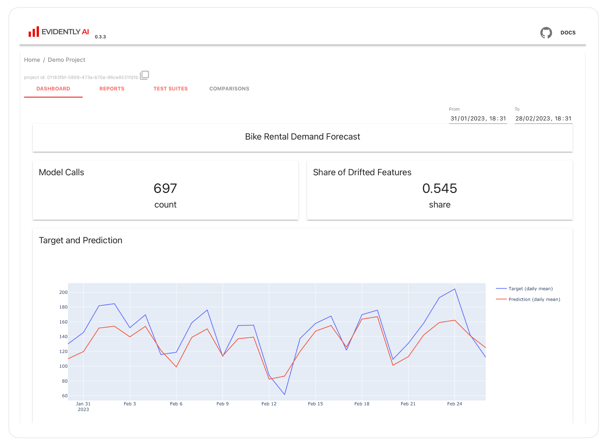

<h1 align="center">Evidently</h1>
 
<p align="center"><b>An open-source framework to evaluate, test and monitor ML models in production.</b></p>

<p align="center">
  <a href="https://docs.evidentlyai.com">Docs</a>
  |
  <a href="https://discord.gg/xZjKRaNp8b">Discord Community</a>
  |
  <a href="https://www.evidentlyai.com/user-newsletter">User Newsletter</a>
  | 
  <a href="https://evidentlyai.com/blog">Blog</a>
  | 
  <a href="https://twitter.com/EvidentlyAI">Twitter</a>
</p>


# :bar_chart: What is Evidently?

Evidently is an open-source Python library for data scientists and ML engineers. It helps evaluate, test, and monitor ML models from validation to production. It works with tabular, text data and embeddings. 

Evidently has a modular approach with 3 components on top of the shared `metrics` functionality. 

## 1. Tests: batch model checks


Tests perform structured data and ML model quality checks. They verify a condition and return an explicit **pass** or **fail** result. 

You can create a custom Test Suite from 50+ tests or run a preset (for example, **Data Drift** or **Regression Performance**). You can get results as a **JSON**, Python dictionary, exportable HTML, as a **visual report** inside Jupyter notebook, or as Evidently JSON `snapshot`. 

Tests are best for automated checks. You can integrate them as a pipeline step using tools like Airlfow. 

## 2. Reports: interactive visualizations

> Old dashboards API was deprecated in v0.1.59. Here is the [migration guide](docs/book/support/migration.md).


Reports calculate various data and ML **metrics** and render rich **visualizations**. You can create a custom Report or run a preset to evaluate a specific aspect of the model or data performance. For example, a [**Data Quality**](https://docs.evidentlyai.com/presets/data-quality) or [**Classification Performance**](https://docs.evidentlyai.com/presets/class-performance) report.

You can get an **HTML report** (best for exploratory analysis and debugging), **JSON** or Python dictionary output (best for logging, documention or to integrate with BI tools), or as Evidently JSON `snapshot`.

## 3. ML monitoring dashboard

> This functionality is available from v0.4.0. 



You can self-host an ML monitoring dashboard to visualize metrics and test results over time. This functionality sits on top of Reports and Test Suites. You must store their outputs as Evidently JSON `snapshots` that serve as a data source for the Evidently Monitoring UI.  

You can track 100+ metrics available in Evidently, from number nulls to text sentiment and embbedding drift.

# :woman_technologist: Install Evidently

### MAC OS and Linux
Evidently is available as a PyPI package. To install it using pip package manager, run:
```sh
pip install evidently
```
Evidently is also available in Anaconda distribution platform. To install Evidently using conda installer, run:
```sh
conda install -c conda-forge evidently
```
If you want visualize the Reports or Test Suites inside Jupyter notebook, you need `jupyter nbextension`. After installing `evidently`, run the two following commands in the terminal from the evidently directory. This is not required if you want to use Evidently Monitoring UI.

To install `jupyter nbextension`, run:
```sh
jupyter nbextension install --sys-prefix --symlink --overwrite --py evidently
```
To enable it, run:
```sh
jupyter nbextension enable evidently --py --sys-prefix
```
That's it! A single run after the installation is enough. 

### Windows
Evidently is available as a PyPI package. To install it using pip package manager, run:
```sh
pip install evidently
```
To install Evidently using conda installer, run:
```sh
conda install -c conda-forge evidently
```

**Note**: If you run Jupyter notebook on Windows, you will use a different method to display Reports and Test Suites. You must add the argument ```inline``` when calling the Report: ```report.show(mode='inline')```.  Read more about different environments in the [docs](https://docs.evidentlyai.com/integrations/notebook-environments).

# :arrow_forward: Getting started

### Option 1: Test Suites
> This is a simple Hello World example. You can find a complete [Getting Started Tutorial](https://docs.evidentlyai.com/get-started/tutorial) in the docs.

## Jupyter Notebook
Prepare your data as two pandas `DataFrames`. The first should include your reference data, the second - current production data. The structure of both datasets should be identical. To run some of the evaluations (e.g. Data Drift), you need input features only. In other cases (e.g. Target Drift, Classification Performance), you need Target and/or Prediction. 

After installing the tool, import the Evidently **Test Suite** and required presets. We'll use a simple toy dataset:

```python
import pandas as pd

from sklearn import datasets

from evidently.test_suite import TestSuite
from evidently.test_preset import DataStabilityTestPreset
from evidently.test_preset import DataQualityTestPreset

iris_data = datasets.load_iris(as_frame='auto')
iris_frame = iris_data.frame
```

To run the **Data Stability** Test Suite and display the output in the notebook:
```python
data_stability= TestSuite(tests=[
    DataStabilityTestPreset(),
])
data_stability.run(current_data=iris_frame.iloc[:60], reference_data=iris_frame.iloc[60:], column_mapping=None)
data_stability 
```

You can also save an HTML file. You'll need to open it from the destination folder.

```python
data_stability.save_html("file.html")
```

To get the output as JSON:
```python
data_stability.json()
```

### Option 2: Reports

After installing the tool, import the Evidently **Report** and required presets:

```python
import pandas as pd

from sklearn import datasets

from evidently.report import Report
from evidently.metric_preset import DataDriftPreset

iris_data = datasets.load_iris(as_frame='auto')
iris_frame = iris_data.frame
```

To generate the **Data Drift** report, run:
```python
data_drift_report = Report(metrics=[
    DataDriftPreset(),
])

data_drift_report.run(current_data=iris_frame.iloc[:60], reference_data=iris_frame.iloc[60:], column_mapping=None)
data_drift_report

```
Save the report as HTML. You'll later need to open it from the destination folder.
```python
data_drift_report.save_html("file.html")
```

To get the output as JSON:
```python
data_drift_report.json()
```
### Option 3: ML monitoring dashboard
> This will launch a demo example. You can find a complete [Get Started with Monitoring Tutorial](https://docs.evidentlyai.com/get-started/tutorial-monitoring) in the docs.

To run the demo project with Evidently UI service follow steps below.

Optional, but highly recommended. Create a virtual environment and activate it.
```
pip install virtualenv
virtualenv venv
source venv/bin/activate
```

After installing Evidently (`pip install evidently`), run the Evidently UI with demo project:
```
evidently ui --demo-project
```
 
Access Evidently UI service in your browser. Go to the **localhost:8000**.

# :computer: Contributions
We welcome contributions! Read the [Guide](CONTRIBUTING.md) to learn more. 

# :books: Documentation
For more information, refer to a complete <a href="https://docs.evidentlyai.com">Documentation</a>. You can start with the tutorials:
* [Get Started with Reports and Test Suitesl](https://docs.evidentlyai.com/get-started/tutorial)
* [Get Started with ML monitoringl](https://docs.evidentlyai.com/get-started/tutorial-monitoring)

# :card_index_dividers: Examples
Here you can find simple examples on toy datasets to quickly explore what Evidently can do right out of the box.

Report | Jupyter notebook | Colab notebook | Contents
--- | --- | --- | ---
Getting Started Tutorial| [link](https://github.com/evidentlyai/evidently/blob/main/examples/sample_notebooks/getting_started_tutorial.ipynb)|[link](https://colab.research.google.com/drive/1j0Wh4LM0mgMuDY7LQciLaUV4G1khB-zb)|Data Stability and custom Test Suites, Data Drift and Target Drift Reports
Evidently Metric Presets| [link](https://github.com/evidentlyai/evidently/blob/main/examples/sample_notebooks/evidently_metric_presets.ipynb) | [link](https://colab.research.google.com/drive/1wmHWipPd6iEy9Ce8NWBcxs_BSa9hgKgk) | Data Drift, Target Drift, Data Quality, Regression, Classification Reports
Evidently Metrics| [link](https://github.com/evidentlyai/evidently/blob/main/examples/sample_notebooks/evidently_metrics.ipynb) | [link](https://colab.research.google.com/drive/1IpfQsq5dmjuG_Qbn6BNtghq6aubZBP5A) | All individual Metrics
Evidently Test Presets| [link](https://github.com/evidentlyai/evidently/blob/main/examples/sample_notebooks/evidently_test_presets.ipynb) | [link](https://colab.research.google.com/drive/1CBAFY1qmHHV_72SC7YBeaD4c6LLpPQan) | NoTargetPerformance, Data Stability, Data Quality, Data Drift Regression, Multi-class Classification, Binary Classification, Binary Classification top-K test suites
Evidently Tests| [link](https://github.com/evidentlyai/evidently/blob/main/examples/sample_notebooks/evidently_tests.ipynb) | [link](https://colab.research.google.com/drive/1nQhfXft4VZ3G7agvXgH_LqVHdCh-WaMl)| All individual Tests

There are more example in the [Community Examples](https://github.com/evidentlyai/community-examples) repository.

## Integrations
Explore the [Integrations](https://github.com/evidentlyai/evidently/tree/main/examples/integrations) folder to see how to integrate Evidently in your prediction pipelines and use it with other tools. 

## How to
Explore the [How To](https://github.com/evidentlyai/evidently/tree/main/examples/how_to_questions) folder to see how use specific features in Evidently, such as run Reports for text data and NLP models.

# :phone: User Newsletter 
To get updates on new features, integrations and code tutorials, sign up for the [Evidently User Newsletter](https://www.evidentlyai.com/user-newsletter). 

# :white_check_mark: Discord Community
If you want to chat and connect, join our [Discord community](https://discord.gg/xZjKRaNp8b)!
