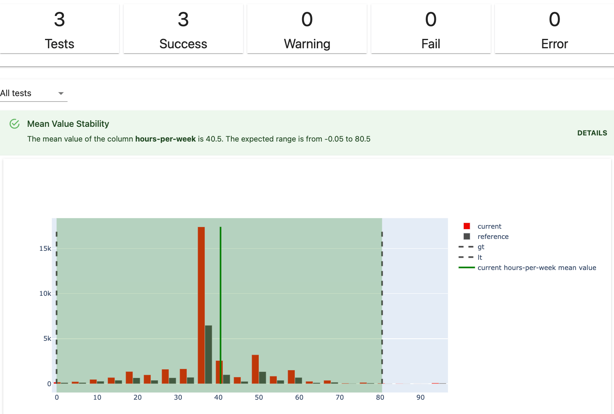
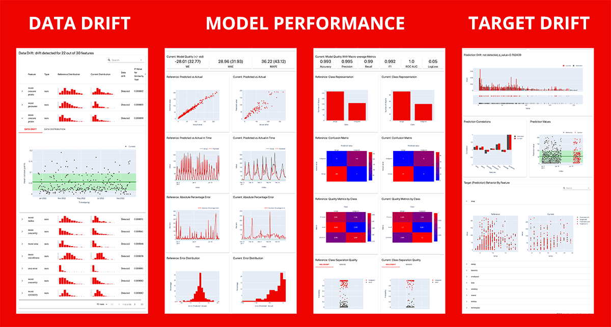

<h1 align="center">Evidently</h1>

<p align="center"><b>An open-source framework to evaluate, test and monitor ML models in production.</b></p>

<p align="center">
  <a href="https://docs.evidentlyai.com">Docs</a>
  |
  <a href="https://discord.gg/xZjKRaNp8b">Discord</a>
  |
  <a href="https://www.evidentlyai.com/user-newsletter">User Newsletter</a>
  |
  <a href="https://evidentlyai.com/blog">Blog</a>
  |
  <a href="https://twitter.com/EvidentlyAI">Twitter</a>
  |
  <a href="https://www.evidentlyai.com/product/cloud">Evidently Cloud</a>
</p>

# :new: New release

**Evidently 0.4.0**. Self-host an ML Monitoring interface -> [QuickStart](https://docs.evidentlyai.com/get-started/tutorial-monitoring)

# :bar_chart: What is Evidently?

Evidently is an open-source Python library for data scientists and ML engineers. It helps evaluate, test, and monitor ML models from validation to production. It works with tabular, text data and embeddings.

Evidently has a modular approach with 3 components on top of the shared `metrics` functionality.

## 1. Tests: batch model checks



Tests perform structured data and ML model checks. They verify a condition and return an explicit **pass** or **fail**.

You can create a custom Test Suite from 50+ tests or run a preset (for example, **Data Drift** or **Regression Performance**). You can get results as a **JSON**, Python dictionary, exportable HTML, **visual report** inside Jupyter notebook, or as Evidently JSON `snapshot`.

Tests are best for automated checks. You can integrate them as a pipeline step using tools like Airflow.

## 2. Reports: interactive visualizations

> Old dashboards API was deprecated in v0.1.59. Here is the [migration guide](docs/book/support/migration.md).



Reports calculate various data and ML **metrics** and render rich **visualizations**. You can create a custom Report or run a preset to evaluate a specific aspect of the model or data performance. For example, a [**Data Quality**](https://docs.evidentlyai.com/presets/data-quality) or [**Classification Performance**](https://docs.evidentlyai.com/presets/class-performance) report.

You can get an **HTML report** (best for exploratory analysis and debugging), **JSON** or Python dictionary output (best for logging, documentation or to integrate with BI tools), or as Evidently JSON `snapshot`.

## 3. ML monitoring dashboard

> This functionality is available from v0.4.0.


You can self-host an ML monitoring dashboard to visualize metrics and test results over time. This functionality sits on top of Reports and Test Suites. You must store their outputs as Evidently JSON `snapshots` that serve as a data source for the Evidently Monitoring UI.

You can track 100+ metrics available in Evidently, from the number of nulls to text sentiment and embedding drift.

# :woman_technologist: Install Evidently

### MAC OS and Linux
Evidently is available as a PyPI package. To install it using pip package manager, run:
```sh
pip install evidently
```
Evidently is also available on Anaconda distribution platform. To install Evidently using conda installer, run:
```sh
conda install -c conda-forge evidently
```

### Windows
Evidently is available as a PyPI package. To install it using pip package manager, run:
```sh
pip install evidently
```
To install Evidently using conda installer, run:
```sh
conda install -c conda-forge evidently
```

# :arrow_forward: Getting started

### Option 1: Test Suites
> This is a simple Hello World example. Head to docs for a complete [Quickstart for Reports and Test Suites](https://docs.evidentlyai.com/get-started/tutorial).

Prepare your data as two pandas `DataFrames`. The first is your reference data, and the second is current production data. The structure of both datasets should be identical. You need input features only to run some evaluations (e.g., Data Drift). In other cases (e.g., Target Drift, Classification Performance), you need Target and/or Prediction.

After installing the tool, import the Evidently **Test Suite** and required presets. We'll use a simple toy dataset:

```python
import pandas as pd

from sklearn import datasets

from evidently.test_suite import TestSuite
from evidently.test_preset import DataStabilityTestPreset
from evidently.test_preset import DataQualityTestPreset

iris_data = datasets.load_iris(as_frame='auto')
iris_frame = iris_data.frame
```

To run the **Data Stability** Test Suite and display the output in the notebook:
```python
data_stability= TestSuite(tests=[
    DataStabilityTestPreset(),
])
data_stability.run(current_data=iris_frame.iloc[:60], reference_data=iris_frame.iloc[60:], column_mapping=None)
data_stability
```

You can also save an HTML file. You'll need to open it from the destination folder.

```python
data_stability.save_html("file.html")
```

To get the output as JSON:
```python
data_stability.json()
```

### Option 2: Reports

After installing the tool, import the Evidently **Report** and required presets:

```python
import pandas as pd

from sklearn import datasets

from evidently.report import Report
from evidently.metric_preset import DataDriftPreset

iris_data = datasets.load_iris(as_frame='auto')
iris_frame = iris_data.frame
```

To generate the **Data Drift** report, run:
```python
data_drift_report = Report(metrics=[
    DataDriftPreset(),
])

data_drift_report.run(current_data=iris_frame.iloc[:60], reference_data=iris_frame.iloc[60:], column_mapping=None)
data_drift_report

```
Save the report as HTML. You'll later need to open it from the destination folder.
```python
data_drift_report.save_html("file.html")
```

To get the output as JSON:
```python
data_drift_report.json()
```
### Option 3: ML monitoring dashboard
> This will launch a demo project in the Evidently UI. Head to docs for a complete [ML Monitoring Quickstart](https://docs.evidentlyai.com/get-started/tutorial-monitoring).

Recommended step: create a virtual environment and activate it.
```
pip install virtualenv
virtualenv venv
source venv/bin/activate
```

After installing Evidently (`pip install evidently`), run the Evidently UI with the demo projects:
```
evidently ui --demo-projects all
```

Access Evidently UI service in your browser. Go to the **localhost:8000**.

# :computer: Contributions
We welcome contributions! Read the [Guide](CONTRIBUTING.md) to learn more.

# :books: Documentation
For more information, refer to a complete <a href="https://docs.evidentlyai.com">Documentation</a>. You can start with the tutorials:
* [Get Started with Reports and Test Suites](https://docs.evidentlyai.com/get-started/tutorial)
* [Get Started with ML monitoring](https://docs.evidentlyai.com/get-started/tutorial-monitoring)

# :card_index_dividers: Examples

Simple examples on toy datasets to quickly explore what Evidently can do out of the box.

Title | Code example | Tutorial | Contents
--- | --- | --- | ---
QuickStart Tutorial: ML Monitoring| [Example](https://github.com/evidentlyai/evidently/blob/main/examples/sample_notebooks/get_started_monitoring.py)| [Tutorial](https://docs.evidentlyai.com/get-started/tutorial-monitoring) | Pre-built ML monitoring dashboard.
QuickStart Tutorial: Tests and Reports| [Jupyter notebook](https://github.com/evidentlyai/evidently/blob/main/examples/sample_notebooks/getting_started_tutorial.ipynb)<br>[Colab](https://colab.research.google.com/drive/1j0Wh4LM0mgMuDY7LQciLaUV4G1khB-zb)| [Tutorial](https://docs.evidentlyai.com/get-started/tutorial) | Data Stability and custom Test Suites, Data Drift and Target Drift Reports
Evidently Metric Presets| [Jupyter notebook](https://github.com/evidentlyai/evidently/blob/main/examples/sample_notebooks/evidently_metric_presets.ipynb) <br>[Colab](https://colab.research.google.com/drive/1wmHWipPd6iEy9Ce8NWBcxs_BSa9hgKgk) | - | Data Drift, Target Drift, Data Quality, Regression, Classification Reports
Evidently Metrics| [Jupyter notebook](https://github.com/evidentlyai/evidently/blob/main/examples/sample_notebooks/evidently_metrics.ipynb) <br>[Colab](https://colab.research.google.com/drive/1IpfQsq5dmjuG_Qbn6BNtghq6aubZBP5A) | - | All individual Metrics
Evidently Test Presets| [Jupyter notebook](https://github.com/evidentlyai/evidently/blob/main/examples/sample_notebooks/evidently_test_presets.ipynb) <br>[Colab](https://colab.research.google.com/drive/1CBAFY1qmHHV_72SC7YBeaD4c6LLpPQan) | - |NoTargetPerformance, Data Stability, Data Quality, Data Drift Regression, Multi-class Classification, Binary Classification, Binary Classification top-K test suites
Evidently Tests| [Jupyter notebook](https://github.com/evidentlyai/evidently/blob/main/examples/sample_notebooks/evidently_tests.ipynb) <br>[Colab](https://colab.research.google.com/drive/1nQhfXft4VZ3G7agvXgH_LqVHdCh-WaMl)| - |All individual Tests

There are more example in the [Community Examples](https://github.com/evidentlyai/community-examples) repository.

## Integrations
Explore [Integrations](https://github.com/evidentlyai/evidently/tree/main/examples/integrations) to see how to integrate Evidently in the prediction pipelines and with other tools.

## How-to guides
Explore the [How-to guides](https://github.com/evidentlyai/evidently/tree/main/examples/how_to_questions) to understand specific features in Evidently, such as working with text data.

# :phone: User Newsletter
To get updates on new features, integrations and code tutorials, sign up for the [Evidently User Newsletter](https://www.evidentlyai.com/user-newsletter).

# :white_check_mark: Discord Community
If you want to chat and connect, join our [Discord community](https://discord.gg/xZjKRaNp8b)!
