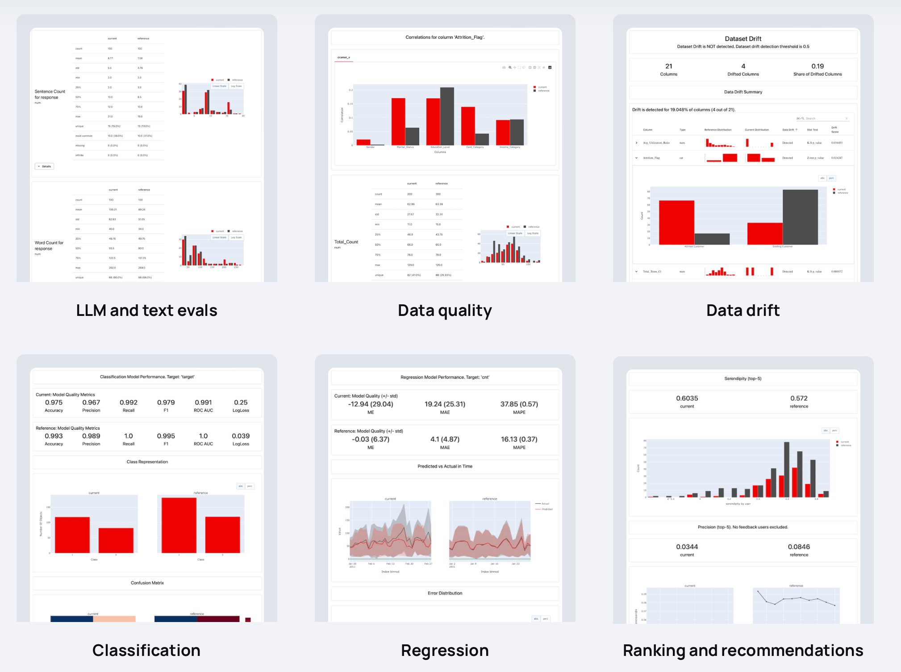
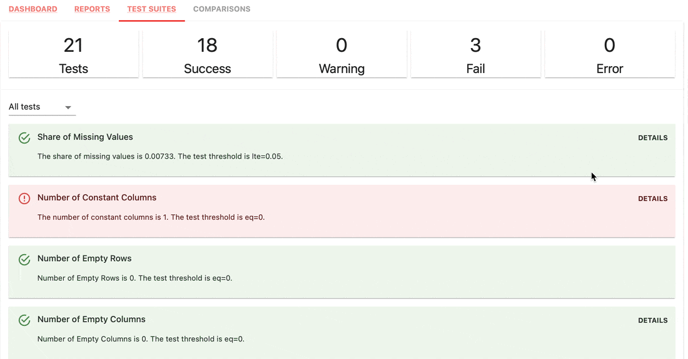
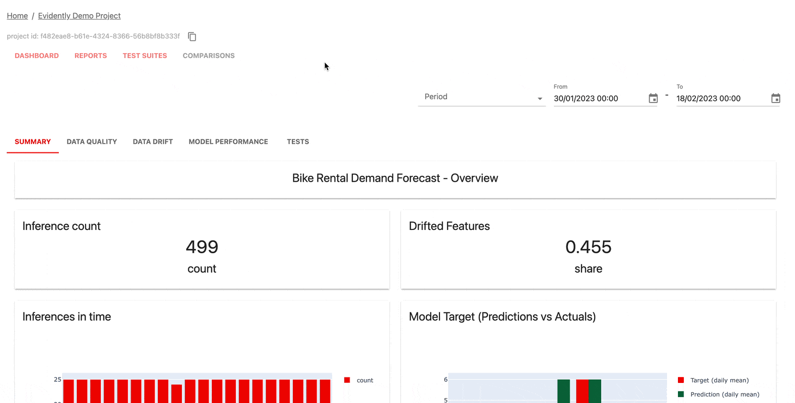

<h1 align="center">Evidently</h1>

<p align="center"><b>An open-source framework to evaluate, test and monitor ML and LLM-powered systems.</b></p>

<p align="center">
<a href="https://pepy.tech/project/evidently" target="_blank"></a>
<a href="https://github.com/evidentlyai/evidently/blob/main/LICENSE" target="_blank"></a>
<a href="https://pypi.org/project/evidently/" target="_blank"></a>


</p>
<p align="center">
  <a href="https://docs.evidentlyai.com">Documentation</a>
  |
  <a href="https://discord.gg/xZjKRaNp8b">Discord Community</a>
  |
  <a href="https://evidentlyai.com/blog">Blog</a>
  |
  <a href="https://twitter.com/EvidentlyAI">Twitter</a>
  |
  <a href="https://www.evidentlyai.com/register">Evidently Cloud</a>
</p>

# :new: New release

**Evidently 0.4.25**. LLM evaluation -> [Tutorial](https://docs.evidentlyai.com/get-started/tutorial-llm)

# :bar_chart: What is Evidently?

Evidently is an open-source Python library for ML and LLM evaluation and observability. It helps evaluate, test, and monitor AI-powered systems and data pipelines from experimentation to production. 

* 🔡 Works with tabular, text data, and embeddings.
* ✨ Supports predictive and generative systems, from classification to RAG.
* 📚 100+ built-in metrics from data drift detection to LLM judges.
* 🛠️ Python interface for custom metrics and tests. 
* 🚦 Both offline evals and live monitoring.
* 💻 Open architecture: easily export data and integrate with existing tools. 

Evidently is very modular. You can start with one-off evaluations using `Reports` or `Test Suites` in Python or get a real-time monitoring `Dashboard` service.

## 1. Reports

**Reports** compute various data, ML and LLM quality metrics. You can start with Presets or customize.
* Out-of-the-box interactive visuals.
* Best for exploratory analysis and debugging.
* Get results in Python, export as JSON, Python dictionary, HTML, DataFrame, or view in monitoring UI.

| Reports |
|--|
||

## 2. Test Suites

**Test Suites** check for defined conditions on metric values and return a pass or fail result.
* Best for regression testing, CI/CD checks, or data validation pipelines.
* Zero setup option: auto-generate test conditions from the reference dataset.
* Simple syntax to set custom test conditions as `gt` (greater than), `lt` (less than), etc.
* Get results in Python, export as JSON, Python dictionary, HTML, DataFrame, or view in monitoring UI.

| Test Suite |
|--|
||

## 3. Monitoring Dashboard

**Monitoring UI** service helps visualize metrics and test results over time.

You can choose:
* Self-host the open-source version. [Live demo](https://demo.evidentlyai.com).
* Sign up for [Evidently Cloud](https://www.evidentlyai.com/register) (Recommended).

Evidently Cloud offers a generous free tier and extra features like user management, alerting, and no-code evals.

| Dashboard |
|--|
||

# :woman_technologist: Install Evidently

Evidently is available as a PyPI package. To install it using pip package manager, run:

```sh
pip install evidently
```
To install Evidently using conda installer, run:

```sh
conda install -c conda-forge evidently
```

# :arrow_forward: Getting started

### Option 1: Test Suites
> This is a simple Hello World. Check the Tutorials for more: [Tabular data](https://docs.evidentlyai.com/get-started/tutorial) or [LLM evaluation](https://docs.evidentlyai.com/get-started/tutorial-llm).

Import the **Test Suite**, evaluation Preset and toy tabular dataset.

```python
import pandas as pd

from sklearn import datasets

from evidently.test_suite import TestSuite
from evidently.test_preset import DataStabilityTestPreset

iris_data = datasets.load_iris(as_frame='auto')
iris_frame = iris_data.frame
```

Split the `DataFrame` into reference and current. Run the **Data Stability** Test Suite that will automatically generate checks on column value ranges, missing values, etc. from the reference. Get the output in Jupyter notebook:

```python
data_stability= TestSuite(tests=[
    DataStabilityTestPreset(),
])
data_stability.run(current_data=iris_frame.iloc[:60], reference_data=iris_frame.iloc[60:], column_mapping=None)
data_stability
```

You can also save an HTML file. You'll need to open it from the destination folder.

```python
data_stability.save_html("file.html")
```

To get the output as JSON:
```python
data_stability.json()
```
You can choose other Presets, individual Tests and set conditions.

### Option 2: Reports

Import the **Report**, evaluation Preset and toy tabular dataset.

```python
import pandas as pd

from sklearn import datasets

from evidently.report import Report
from evidently.metric_preset import DataDriftPreset

iris_data = datasets.load_iris(as_frame='auto')
iris_frame = iris_data.frame
```

Run the **Data Drift** Report that will compare column distributions between `current` and `reference`:
```python
data_drift_report = Report(metrics=[
    DataDriftPreset(),
])

data_drift_report.run(current_data=iris_frame.iloc[:60], reference_data=iris_frame.iloc[60:], column_mapping=None)
data_drift_report

```
Save the report as HTML. You'll later need to open it from the destination folder.
```python
data_drift_report.save_html("file.html")
```

To get the output as JSON:
```python
data_drift_report.json()
```

You can choose other Presets and individual Metrics, including LLM evaluations for text data.

### Option 3: ML monitoring dashboard
> This launches a demo project in the Evidently UI. Check complete tutorials for [Self-hosting](https://docs.evidentlyai.com/get-started/tutorial-monitoring) or [Evidently Cloud](https://docs.evidentlyai.com/get-started/tutorial-cloud).

Recommended step: create a virtual environment and activate it.
```
pip install virtualenv
virtualenv venv
source venv/bin/activate
```

After installing Evidently (`pip install evidently`), run the Evidently UI with the demo projects:
```
evidently ui --demo-projects all
```

Access Evidently UI service in your browser. Go to the **localhost:8000**.

# 🚦 What can you evaluate?

Evidently has 100+ built-in evals. You can also add custom ones. Each metric has an optional visualization: you can use it in `Reports`, `Test Suites`, or plot on a `Dashboard`.

Here are examples of things you can check:

|                           |                          |
|:-------------------------:|:------------------------:|
| **🔡 Text descriptors**   | **📝 LLM outputs**       |
| Length, sentiment, toxicity, language, special symbols, regular expression matches, etc. | Semantic similarity, retrieval relevance, summarization quality, etc. with model- and LLM-based evals. |
| **🛢 Data quality**       | **📊 Data distribution drift** |
| Missing values, duplicates, min-max ranges, new categorical values, correlations, etc. | 20+ statistical tests and distance metrics to compare shifts in data distribution. |
| **🎯 Classification**     | **📈 Regression**        |
| Accuracy, precision, recall, ROC AUC, confusion matrix, bias, etc. | MAE, ME, RMSE, error distribution, error normality, error bias, etc. |
| **🗂 Ranking (inc. RAG)** | **🛒 Recommendations**   |
| NDCG, MAP, MRR, Hit Rate, etc. | Serendipity, novelty, diversity, popularity bias, etc. |


# :computer: Contributions
We welcome contributions! Read the [Guide](CONTRIBUTING.md) to learn more.

# :books: Documentation
For more information, refer to a complete <a href="https://docs.evidentlyai.com">Documentation</a>. You can start with the tutorials:
* [Get Started with Tabular and ML Evaluation](https://docs.evidentlyai.com/get-started/tutorial)
* [Get Started with LLM Evaluation](https://docs.evidentlyai.com/get-started/tutorial-llm)
* [Self-hosting ML monitoring Dashboard](https://docs.evidentlyai.com/get-started/tutorial-monitoring)
* [Cloud ML monitoring Dashboard](https://docs.evidentlyai.com/get-started/tutorial-cloud)

See more examples in the [Docs](https://docs.evidentlyai.com/examples).

## How-to guides
Explore the [How-to guides](https://github.com/evidentlyai/evidently/tree/main/examples/how_to_questions) to understand specific features in Evidently.

# :white_check_mark: Discord Community
If you want to chat and connect, join our [Discord community](https://discord.gg/xZjKRaNp8b)!
