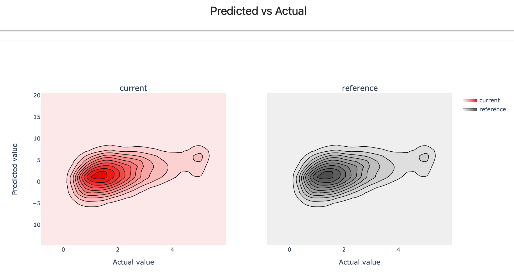
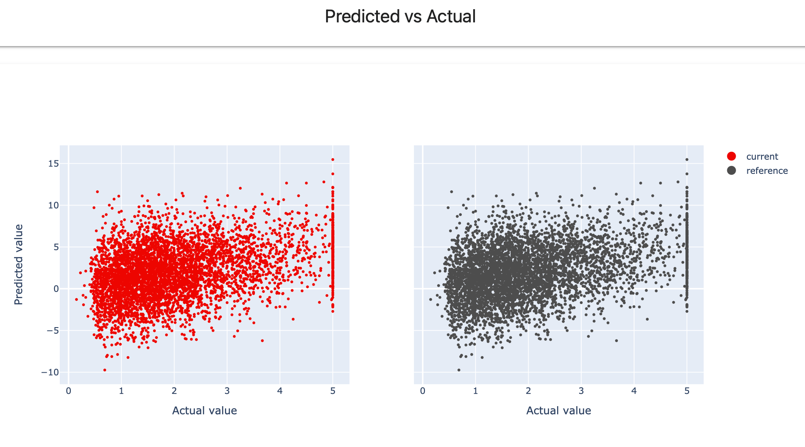

**Pre-requisites**:
* You know how to generate Reports with default parameters.
* You know how to pass custom parameters for Reports or Metrics.

# Code example

You can refer to an example How-to-notebook:



# Default

Starting from version 0.3.2, all visualizations in Reports are aggregated by default. This helps reduce the size of the resulting HTML.

For example, you can create a custom Report:

```python
report = Report(metrics=[
    RegressionPredictedVsActualScatter(),
    RegressionPredictedVsActualPlot()
])
report.run(reference_data=housing_ref, current_data=housing_cur)
report
```

Here is how the Scatter Plot in this Report will look:




**This does not affect Test Suites.** All visualizations in Test Suites are already aggregated.


# Non-aggregated plots for Reports 

If you want to see non-aggregated plots, you can set the `raw_data` parameter as `True` in the render options.

You can set it on the Report level: 

```python
report = Report(
    metrics=[
      RegressionPredictedVsActualScatter(),
      RegressionPredictedVsActualPlot()
    ],
    options={"render": {"raw_data": True}}
  )
report.run(reference_data=housing_ref, current_data=housing_cur)
report
```

All plots in the Report will be non-aggregated. Here is how the Scatter Plot in this Report will look:




**Consider the data size.** We recommend setting this option for smaller datasets or when you apply sampling. With non-aggregated plots, the HTML will contain all the data on individual data points. They may take significant time to load and be large in size. 



**Raw data is not available on Spark.** If you run the computations using Spark, the raw data option is not available.


# Non-aggregated plots for Metrics

If you want to generate non-aggregated plots only for some visualizations, you can pass the option to the chosen Metrics:

```python
report = Report(
    metrics=[
      RegressionPredictedVsActualScatter(options={"render": {"raw_data": True}}),
      RegressionPredictedVsActualPlot()
    ],
  )
report.run(reference_data=housing_ref, current_data=housing_cur)
report
```
