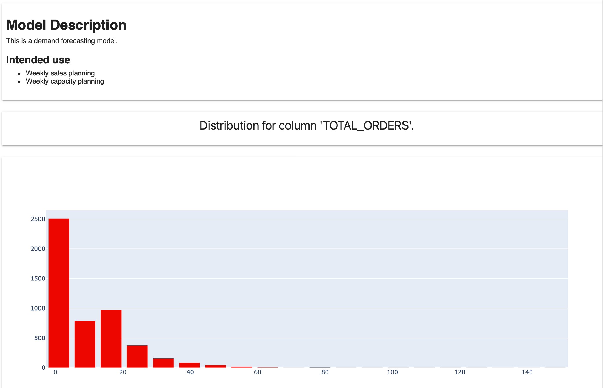

**Pre-requisites**:
* You know how to generate custom Reports using individual Metrics.

# Code example

How-to notebook:


# What you can do

You can add a widget that contains any custom text to the Evidently Report. Here is how this can look:



 You can include multiple text widgets in a single Report. 

# Using “Comment” Metric

To add a text widget, you must first define the contents of the comment. You can use markdown to format the text.

An example of adding "model_description" comment:

```python
model_description = """
 # Model Description
 This is a demand forecasting model.


 ## Intended use
 * Weekly sales planning
 * Weekly capacity planning
"""
```

When creating the Report, include the “Comment” Metric and reference the earlier defined text.

Example:

```python
report = Report(metrics=[
   Comment(model_description),
   ColumnDistributionMetric('TOTAL_ORDERS')
])


report.run(current_data=raw_data, reference_data=None)
report
```


