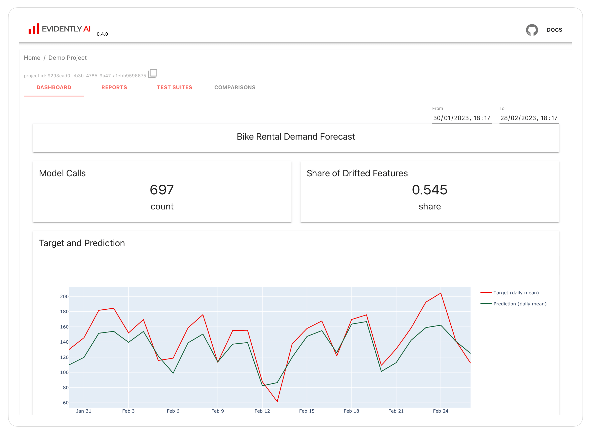

---
description: Get a pre-built monitoring Dashboard using templates.
---   

# What is a Dashboard? 

Each Project has a monitoring Dashboard to visualize metrics and test results over time. A Dashboard can have multiple monitoring Panels, such as counters, line or bar plots, etc.

The Dashboard lets you monitor live data or track ad hoc experiments and tests. Use the "Show in order" toggle to switch between two views:
* Time series view: Displays data points with their actual time intervals (great for live monitoring).
* Sequential view: Shows results in order with equal spacing (ideal for experiments). 


**Data source**. To populate the Dashboard, you must send the evaluation results from Python, or create Reports or Test Suites directly in the UI. The Panels will be empty otherwise.  


Initially, the Dashboard for a new Project is empty. You can organize it and select values to plot. 

For both Evidently Cloud and open-source, you can define monitoring Panels via API. This is great for version control.

In Evidently Cloud, you can also:
* Get pre-built Dashboards.
* Add Panels directly in the user interface.
* Add multiple Tabs on the Dashboard to logically group the Panels.

# Pre-built Dashboards

Dashboard templates is a Pro feature available in the Evidently Cloud. 


Template Tabs include a pre-set combination of monitoring Panels, so you don't have to add them one by one.

To use a template:
* Enter the “Edit” mode clicking on the top right corner of the Dashboard. 
* Click on the “Add tab” button.
* Choose a template Tab in the dropdown.

Optionally, give a custom name to the Tab.

You have the following options:

| Tab Template | Description | Data source |
|---|---|---|
| Columns | Plots column distributions over time for categorical and numerical columns. | `DataQualityPreset()` or `ColumnSummaryMetric()` for individual columns. |
| Data Quality | Shows dataset quality metrics (e.g., missing values, duplicates) over time and results of Data Quality Tests. | For the Metric Panels: `DataQualityPreset()` or `DatasetSummaryMetric()`. For the Test Panel: any individual Tests from Data Quality or Data Integrity groups.|
| Data Drift | Shows the share of drifting features over time, and the results of Column Drift Tests. | For the Metric Panel: `DataDriftPreset()` or `DataDriftTestPreset()`. For the Test Panel: `DataDriftTestPreset()` or individual `TestColumnDrift()` Tests. |
| Descriptors | Shows the results of text evaluations over time. | `TextEvalPreset()`, or individual `ColumnSummaryMetric()` metrics or tests that use descriptors. |

# What’s next?

* See available [monitoring Panels types](design_dashboard.md).
* How to add [custom monitoring Panels and Tabs to your dashboard](design_dashboard_api.md).
