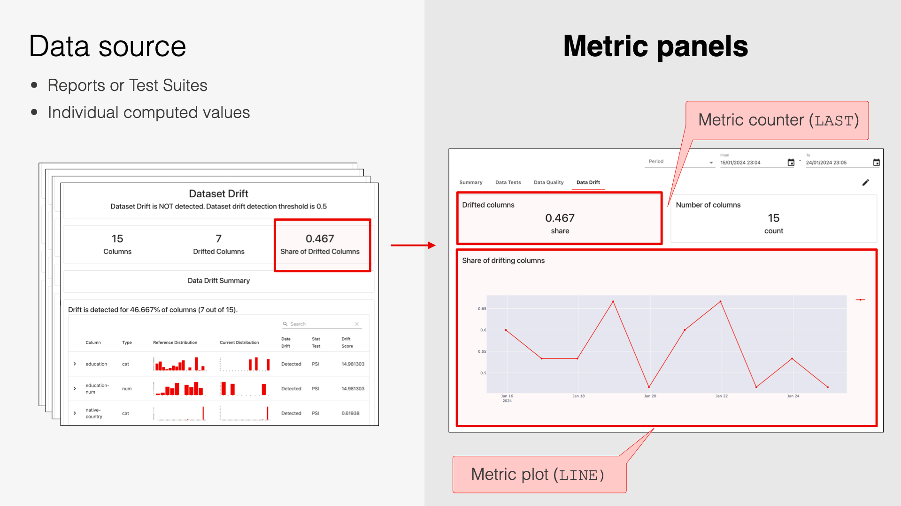
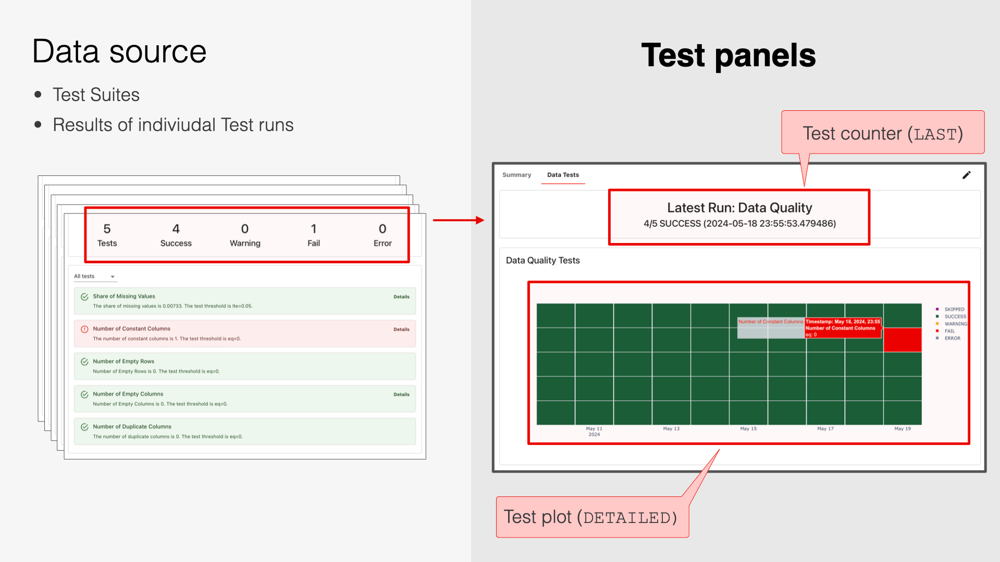
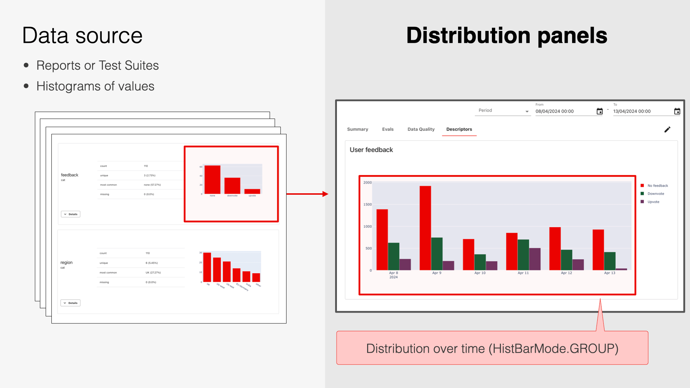
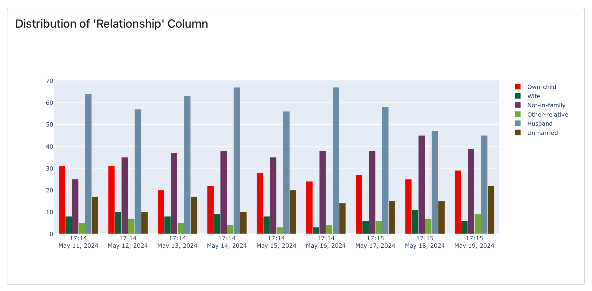
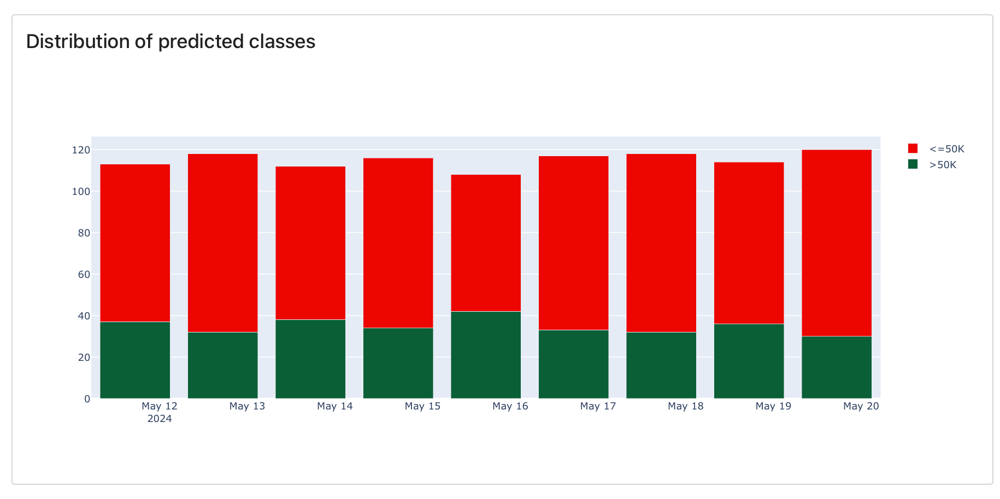

---
description: Overview of the available monitoring Panel types.
---   

# What is a monitoring Panel? 

A monitoring Panel is an individual plot or counter on the Monitoring Dashboard. 

You can add multiple Panels and organize them by **Tabs**. You can choose from Metric, Distribution, and Test Panels, and customize titles and legends.

When adding a Panel, you point to the **source Metric or Test** and the value (`field_path`) inside it. Evidently will pull selected value(s) from all snapshots in the Projects and add them to the Panel. 

You can use **Tags** to filter data from specific snapshots. For example, you can plot the accuracy of Model A and Model B next to each other. To achieve this, add relevant Tags when creating a snapshot.


**How to add Panels**. This page explains the Panel types. Check the next section on [adding Panels](design_dashboard_api.md).  


# Metric Panels

Metric Panels (`DashboardPanel`) show individual values from inside the snapshots. 

For example, if you capture Data Quality Reports (include mean, max, min, etc., for each column) or Data Drift Reports (include the share of drifting columns), you can plot any of these values over time.

Panel time resolution depends on snapshot frequency. For instance, if you log Data Drift Reports daily, you can plot the `share_of_drifting_features` with daily granularity. You can also open the source Report to see feature distributions on a specific day.

You can create metric Panels from either Reports or Test Suites. 

## Counter

Class `DashboardPanelCounter`.

| Panel Type| Example  |
|---|---|
|Shows a value with supporting text or text alone (perfect for dashboard titles).||

## Plot

Class `DashboardPanelPlot`. Shows individual values as bar, line, scatter plot, or histogram.

| Panel Type| Example  |
|---|---|
|Line plot: `PlotType.LINE`. Shows values over time.||
|Scatter plot: `PlotType.SCATTER`. Shows values over time.| |
|Bar plot: `PlotType.BAR`. Shows values over time.|  |
|Histogram: `PlotType.HISTOGRAM`. Shows the frequency of individual values across snapshots.|  |

# Test Panels

Test Panels show the Test results. 

For example, if you run the same Test Suite repeatedly, you can visualize the pass/fail outcomes or result counts. You choose which Test results to include.

To improve the readability of Test plots in case of frequent runs (e.g., multiple runs per day), you can additionally aggregate Test results on a plot (e.g., inside 1 Day).

Test Panels only work with Test Suites. You cannot create it from Reports. 

## Test counter 
Class `DashboardPanelTestSuiteCounter`

| Panel Type| Example  |
|---|---|
|Shows a counter of Tests with selected status. ||

## Test plot
Class `DashboardPanelTestSuite`.

| Panel Type| Example  |
|---|---|
|Detailed plot: `TestSuitePanelType.DETAILED`. Individual Test results are visible. ||
|Aggregated plot: `TestSuitePanelType.AGGREGATE`. Only the total number of Tests by status is visible. ||

# Distribution Panel
Class `DashboardPanelDistribution`. Shows a distribution of values over time. For example, if you capture Data Quality or Data Drift Reports that include histograms for categorical values, you can plot how the frequency of categories changes.

You can create distribution plots from either Reports or Test Suites.  

| Panel Type| Example  |
|---|---|
|Stacked bar chart: `HistBarMode.STACK`. Shows absolute counts.||
|Grouped bar chart: `HistBarMode.GROUP`. Shows absolute counts.||
|Overlay bar chart: `HistBarMode.OVERLAY`. Shows absolute counts. Values overlay each other.||
|Stacked bar chart: `HistBarMode.RELATIVE`. Shows relative frequency (percentage).||


**What is the difference between a Distribution Panel and a Histogram Plot?** A Histogram shows the distribution of the selected values from all snapshots. Each source snapshot contains a **single value** (e.g., a "number of drifting features"). A Distribution Panel shows how a distribution changes over time. Each source snapshot contains a **histogram** (e.g. frequency of different categories).


# What's next?
How to add [monitoring Panels and Tabs](design_dashboard_api.md).

