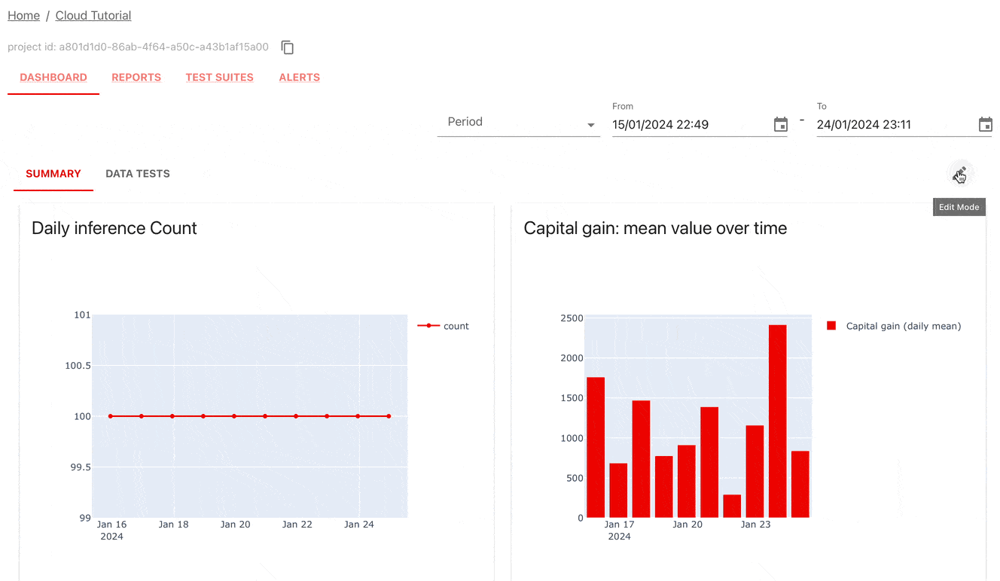
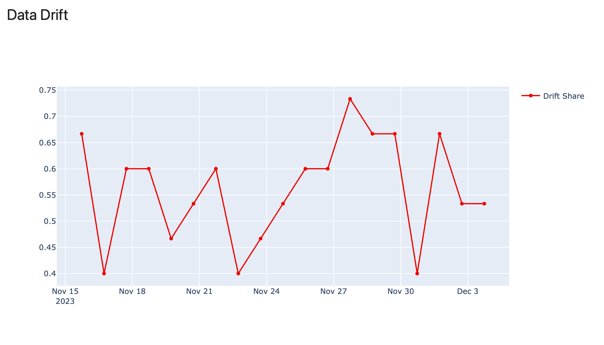
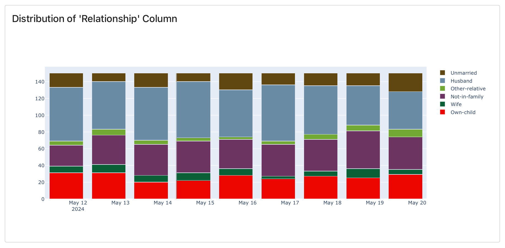
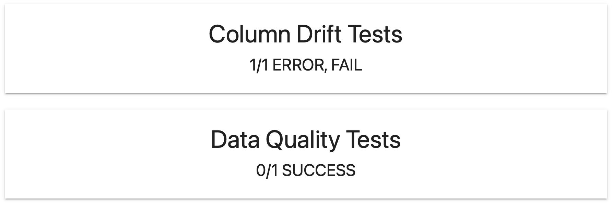
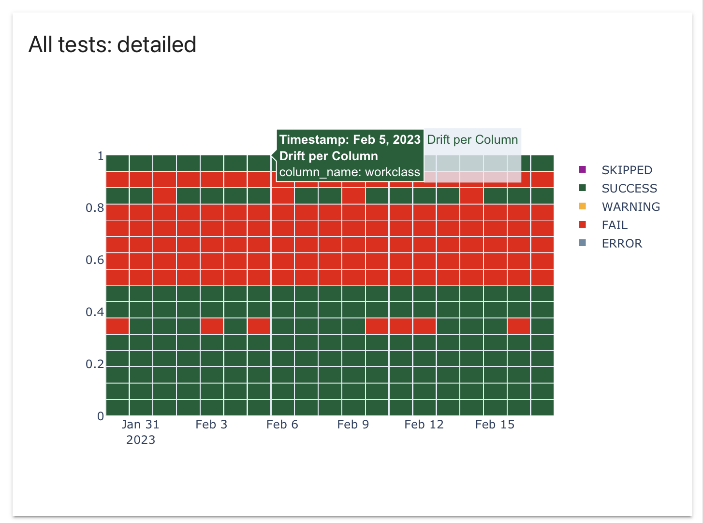
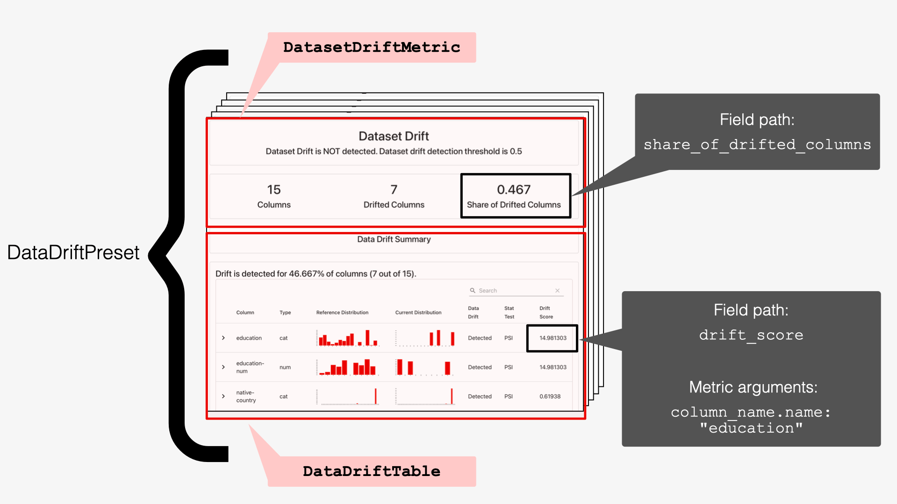
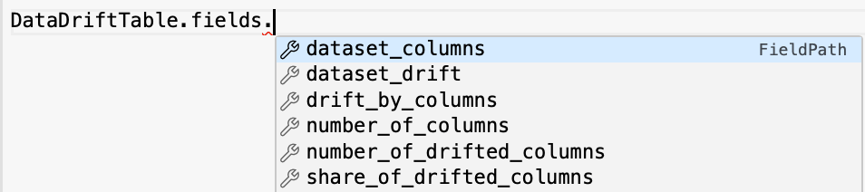

---
description: Design your Dashboard with custom Panels.
---   

We recommend starting with [pre-built Tabs](add_dashboard_tabs.md) for a quick start. 

# Code example

To see end-to-end code examples with custom Panels, check:
* [Evidently Cloud Tutorial](../examples/tutorial-cloud.md)
* [Self-hosting ML Monitoring](../examples/tutorial-monitoring.md). 

You can also explore the [source code](https://github.com/evidentlyai/evidently/tree/d43d33017a0fc4a69f9ff72581fe3f34b4abd45e/src/evidently/ui/demo_projects) for the open-source [live demo dashboards](https://demo.evidentlyai.com/). 

# Adding Panels

You can add monitoring Panels using the Python API or the Evidently Cloud user interface.

Here is the general flow:
* Define the **Panel type**: Counter, Plot, Distribution, Test Counter, or Test Plot. (See [Panel types](design_dashboard.md)).
* Specify panel **title** and **size**.
* Add optional **Tags** to filter data. Without Tags, the Panel will use data from all Project snapshots.
* Select Panel **parameters**, e.g., aggregation level. 
* Define the **Panel value(s)** to show: 
  * For Test Panels, specify `test_id`. 
  * For Metric and Distribution Panels, specify `metric_id` and `field_path`.
* If applicable, pass `test_args` or `metric_args` to identify the exact value when they repeat in a snapshot. For instance, to plot the mean value of a given column, pass the column name as an argument. 

This page explains each step in detail.

## Add a new Panel

You can add monitoring Panels using the Python API, or directly in the user interface (Evidently Cloud or Enterprise). 



 

Enter "edit" mode on the Dashboard (top right corner) and click "add Panel." Follow the steps to create a Panel. You can Preview the Panel before publishing.



Some tips:
* Use the "Show description" toggle to get help on specific steps. 
* You can identify the `field_path` in two ways. Use the "Manual mode" toggle to switch.
  * Default mode displays popular values from existing Project snapshots.
  * Manual mode mirrors the Python API. You can select any value, even if it's not yet in the Project. Note that the Panel may be empty until you add the snapshot.
  


 

**Connect to a Project**. Load the latest dashboard configuration into your Python environment.

```python
project = ws.get_project("YOUR PROJECT ID HERE")
```

**Add a new Panel**. Use the `add_panel` method and pass the parameters. You can add multiple Panels: they will appear in the listed order. Save the configuration with `project.save()`. 

```python
project.dashboard.add_panel(
        DashboardPanelPlot(
            title="Share of drifting features",
            filter=ReportFilter(metadata_values={}, tag_values=[]),
            values=[
                PanelValue(
                	metric_id="DatasetDriftMetric",
                	field_path="share_of_drifted_columns",
                	legend="share",
                ),
            ],
            plot_type=PlotType.LINE,
            size=WidgetSize.FULL,
        ),
        tab="Summary"
)
project.save()
```

Go back to the web app to see the Dashboard. Refresh the page if needed.



 

**Connect to a Project**. Load the latest dashboard configuration into your Python environment.

```python
project = ws.get_project("YOUR PROJECT ID HERE")
```
**Add a new Test Panel**. Use the `add_panel` method, set `include_test_suites=True` and pass the parameters. You can add multiple Panels: they will appear in the listed order. Save the configuration with `project.save()`. 

```python
project.dashboard.add_panel(
        DashboardPanelTestSuite(
            title="Data quality tests",
            test_filters=[
                TestFilter(test_id="TestNumberOfConstantColumns", test_args={}),
                TestFilter(test_id="TestShareOfMissingValues", test_args={}),
                TestFilter(test_id="TestNumberOfEmptyRows", test_args={}),
            ],
            filter=ReportFilter(metadata_values={}, tag_values=[], include_test_suites=True),
            size=WidgetSize.FULL,
            panel_type=TestSuitePanelType.DETAILED,
            time_agg="1D",
        ),
        tab="Data Tests"
)
project.save()
```
Go back to the web app to see the Dashboard. Refresh the page if needed.





## Add a new Tab

 
Multiple tabs is a Pro feature available in the Evidently Cloud.


By default, you add all Panels to a single Dashboard view. You can create multiple Tabs to organize them. 



 

Enter the "edit" mode on the Dashboard (top right corner) and click "add Tab". To create a custom Tab, choose an “empty” tab and give it a name.

Proceed with adding Panels to this Tab as usual.





**Connect to a Project**. Load the latest Dashboard configuration into your Python environment.

```python
project = ws.get_project("YOUR PROJECT ID HERE")
```

**Create a new Tab**. Add a Tab, give it a name and save the configuration. You can later reference this Tab when adding Panels to the Project.

```python
project.dashboard.create_tab("My tab")
project.save()
```

**Add a new Panel to a Tab**. Alternatively, use the `add_panel` method as usual and specify the name of the destination Tab (e.g., "Summary"). 

```python
project.dashboard.add_panel(
        DashboardPanelPlot(
            title="Share of drifting features",
            filter=ReportFilter(metadata_values={}, tag_values=[]),
            values=[
                PanelValue(
                	metric_id="DatasetDriftMetric",
                	field_path="share_of_drifted_columns",
                	legend="share",
                ),
            ],
            plot_type=PlotType.LINE,
            size=WidgetSize.FULL,
        ),
        tab="Summary"
)
project.save()
```
If no "Summary" Tab exists, you will create both a new Tab and Panel. If it already exists, a new Panel will appear below others in this Tab.





## Delete Tabs or Panels

To delete all the existing monitoring Panels using the Python API:

```
project.dashboard.panels = []

project.save()
```

**Note**: This does not delete the snapshots; it only deletes the Panel configuration.

To delete the Tabs or Panels in the UI, use the “Edit” mode and click the “Delete” sign on the corresponding Panel or Tab.  

# Panel parameters

 
**Panel types**. To preview all Panel types, check the previous [docs section](design_dashboard.md). This page details the parameters and API.


Class `DashboardPanel` is a base class. Its parameters apply to all Panel types. 

| Parameter | Description  |
|---|---|
| `title: str`| Panel name visible at the header. |
| `filter: ReportFilter`<br><br>`metadata_values: Dict[str, str]`<br>`tag_values: List[str]`<br>`include_test_suites=False`| Filters define a subset of snapshots from which to display the values.<ul><li>To select a group of snapshots as a data source, pass `metadata_values` or `tag_values`. You must add these Tags when logging Reports or Test Suites. (See [docs](snapshots.md#add-tags)).</li><li>To include Test Suites data, set `include_test_suites` as `True` (default: `False`).</li></ul>|
| `size: WidgetSize = WidgetSize.FULL`<br><br>**Available**: `WidgetSize.FULL`, `WidgetSize.HALF`| Sets the Panel size to half-width or full-sized (Default).|

See usage examples below together with panel-specific parameters.  

## Counter
`DashboardPanelCounter` shows a value count or works as a text-only Panel. 


| Parameter | Description |
|---|---|
| `value: Optional[PanelValue] = None` | Specifies the value to display. If empty, you get a text-only panel. <br><br>*Refer to the Panel Value section below for examples.* |
| `text: Optional[str] = None` | Supporting text to display on the Counter. |
| `agg: CounterAgg`<br><br>**Available:**<br> `SUM`, `LAST`, `NONE` | Data aggregation options:<br>`SUM`: Calculates the value sum (from all snapshots or filtered by Tag).<br>`LAST`: Displays the last available value.<br>`NONE`: Reserved for text panels. |

See examples:



  

**Text Panel**. To create a Panel with the Dashboard title only:

```python
project.dashboard.add_panel(
    DashboardPanelCounter(
        filter=ReportFilter(metadata_values={}, tag_values=[]),
        agg=CounterAgg.NONE,
        title="Bike Rental Demand Forecast",
        )
    )
```



  

**Panel with a sum of values**. To create a Panel that sums up the number of rows over time:

```python
project.dashboard.add_panel(
    DashboardPanelCounter(
        title="Number of Rows",
        filter=ReportFilter(metadata_values={}, tag_values=[]),
        value=PanelValue(
            metric_id="DatasetSummaryMetric",
            field_path=DatasetSummaryMetric.fields.current.number_of_rows,
            legend="count",
        ),
        text="count",
        agg=CounterAgg.SUM,
        size=WidgetSize.HALF,
    )
)
```






## Plot
`DashboardPanelPlot` shows individual values over time.

Line Plot example:


| Parameter | Description |
|---|---|
| `values: List[PanelValue]` | Specifies the value(s) to display in the Plot. <br><br> The field path must point to the individual **MetricResult** (e.g., not a dictionary or a histogram).<br><br> If you pass multiple values, they will appear together, e.g., as separate lines on a Line plot, bars on a Bar Chart, or points on a Scatter Plot.<br><br>*Refer to the Panel Value section below for examples.* |
| `plot_type: PlotType`<br><br>**Available:** `SCATTER`, `BAR`, `LINE`, `HISTOGRAM` | Specifies the plot type: scatter, bar, line, or histogram. |

See examples:



 

**Single value on a Plot**. To plot MAPE over time in a line plot:

```python
project.dashboard.add_panel(
    DashboardPanelPlot(
        title="MAPE",
        filter=ReportFilter(metadata_values={}, tag_values=[]),
        values=[
        PanelValue(
            metric_id="RegressionQualityMetric",
            field_path=metrics.RegressionQualityMetric.fields.current.mean_abs_perc_error,
            legend="MAPE",
        ),
    ],
    plot_type=PlotType.LINE,
    size=WidgetSize.HALF,
    )
)
```





**Multiple values on a Plot**. To plot MAPE and reference MAPE on the same plot: 

```python
project.dashboard.add_panel(
   DashboardPanelPlot(
       title="MAPE",
       filter=ReportFilter(metadata_values={}, tag_values=[]),
       values=[
       PanelValue(
           metric_id="RegressionQualityMetric",
           field_path=metrics.RegressionQualityMetric.fields.current.mean_abs_perc_error,
           legend="MAPE",
       ),
       PanelValue(
           metric_id="RegressionQualityMetric",
           field_path=metrics.RegressionQualityMetric.fields.reference.mean_abs_perc_error,
           legend="Reference MAPE",
       ),
   ],
   plot_type=PlotType.LINE,
   size=WidgetSize.HALF,
   )
)
```





## Distribution
`DashboardPanelDistribution` shows changes in the distribution over time.

Stack distribution Panel example:


| Parameter | Description |
|---|---|
| `value: PanelValue` | Specifies the distribution to display on the Panel. <br><br> The `field_path` must point to a histogram.<br><br>*Refer to the Panel Value section below for examples.* |
| `barmode: HistBarMode`<br><br>**Available:** `STACK`, `GROUP`, `OVERLAY`, `RELATIVE` | Specifies the distribution plot type: stacked, grouped, overlay or relative. |

**Example**. To plot the distribution of the "education" column over time using STACK plot:

```python
p.dashboard.add_panel(
        DashboardPanelDistribution(
            title="Column Distribution: current",
            filter=ReportFilter(metadata_values={}, tag_values=[]),
            value=PanelValue(
                field_path=ColumnDistributionMetric.fields.current,
                metric_id="ColumnDistributionMetric",
                metric_args={"column_name.name": "education"},
            ),
            barmode = HistBarMode.STACK
        )
    )
```

## Test Counter

`DashboardPanelTestSuiteCounter` shows a counter with Test results.



| Parameter | Description |
|---|---|
| `test_filters: List[TestFilter]=[]`<br>`test_id: test_id`<br>`test_arg: List[str]`|Test filters select specific Test(s). Without a filter, the Panel considers the results of all Tests. <br><br>You must reference a `test_id` even if you used a Preset. You can check the Tests included in each Preset [here](https://docs.evidentlyai.com/reference/all-tests).|
| `statuses: List[statuses]`<br><br>**Available**:<br>`TestStatus.ERROR`, `TestStatus.FAIL`, `TestStatus.SUCCESS`, `TestStatus.WARNING`, `TestStatus.SKIPPED`| Status filters select Tests with specific outcomes. (E.g., choose the FAIL status to display a counter for failed Tests). Without a filter, the Panel considers Tests with any status.|
| <br>`agg: CounterAgg`<br><br>**Available**:<br>`SUM`, `LAST`  | Data aggregation options:<br>`SUM`: Calculates the sum of Test results from all snapshots (or filtered by Tags). <br>`LAST`: Displays the last available Test result. |

See examples.



 

**Last Test**. To display the result of the latest Test in the Project.

```python
project.dashboard.add_panel(
    DashboardPanelTestSuiteCounter(
        title="Success of last",
        agg=CounterAgg.LAST
    )
)
```





**Filter by Test ID and Status**. To display the number of failed Tests and errors for a specific Test (Number of unique values in the column "age").

```python
project.dashboard.add_panel(
    DashboardPanelTestSuiteCounter(
        title="Success of 1",
        test_filters=[TestFilter(test_id="TestNumberOfUniqueValues", test_args={"column_name.name": "1"})],
        statuses=[TestStatus.ERROR, TestStatus.FAIL]
    )
)
```





## Test Plot

`DashboardPanelTestSuite` shows Test results over time. 

Detailed Test panel example:


| Parameter | Description |
|---|---|
| `test_filters: List[TestFilter]=[]`<br>`test_id: test_id`<br>`test_arg: List[str]`|Test filters select specific Test(s). Without a filter, the Panel shows the results of all Tests. <br><br>You must reference a `test_id` even if you used a Preset. Check the [Preset composition](https://docs.evidentlyai.com/reference/all-tests).|
| `statuses: List[statuses]`<br><br>**Available**:<br>`TestStatus.ERROR`, `TestStatus.FAIL`, `TestStatus.SUCCESS`, `TestStatus.WARNING`, `TestStatus.SKIPPED`| Status filters select Tests with specific outcomes. Without a filter, the Panel shows all Test statuses.|
| `panel_type=TestSuitePanelType`<br><br>**Available**:<br>`TestSuitePanelType.DETAILED`<br>`TestSuitePanelType.AGGREGATE`| Defines the Panel type. **Detailed** shows individual Test results. **Aggregate** (default) shows the total number of Tests by status.|
| <br>`time_agg: Optional[str] = None`<br><br>**Available**:<br>`1H`, `1D`, `1W`, `1M` (see [period aliases](https://pandas.pydata.org/docs/user_guide/timeseries.html#timeseries-period-aliases))| Groups all Test results in a period (e.g., 1 DAY).|



 

**Detailed Tests**. To show the results of all individual Tests, with daily level aggregation.

```python
project.dashboard.add_panel(
    DashboardPanelTestSuite(
        title="All tests: detailed",
        filter=ReportFilter(metadata_values={}, tag_values=[], include_test_suites=True),
        size=WidgetSize.HALF,
        panel_type=TestSuitePanelType.DETAILED,
        time_agg="1D",
    )
)
```





**Aggregated by Status**. To show the total number of failed Tests (status filter), with daily level aggregation.

```python
project.dashboard.add_panel(
    DashboardPanelTestSuite(
        title="All tests: aggregated",
        filter=ReportFilter(metadata_values={}, tag_values=[], include_test_suites=True),
        size=WidgetSize.HALF,
        time_agg="1D",
        statuses=[TestStatus.ERROR, TestStatus.FAIL],
    )
)
```





**Filtered by Test ID**. To show all results for a specified list of Tests (on constant columns, missing values, empty rows) with daily-level aggregation.

```python
project.dashboard.add_panel(
        DashboardPanelTestSuite(
            title="Data quality tests",
            test_filters=[
                TestFilter(test_id="TestNumberOfConstantColumns", test_args={}),
                TestFilter(test_id="TestShareOfMissingValues", test_args={}),
                TestFilter(test_id="TestNumberOfEmptyRows", test_args={}),
            ],
            filter=ReportFilter(metadata_values={}, tag_values=[], include_test_suites=True),
            size=WidgetSize.FULL,
            panel_type=TestSuitePanelType.DETAILED,
            time_agg="1D",
        ),
        tab="Data Tests"
)
```





**Filtered by Test ID and Test Args**. To show the results of individual column-level Tests with daily aggregation, you must use both `test_id` and `test_arg` (column name):

```python
project.dashboard.add_panel(
    DashboardPanelTestSuite(
        title="Column Drift tests for key features: detailed",
        test_filters=[
            TestFilter(test_id="TestColumnDrift", test_args={"column_name.name": "hours-per-week"}),
            TestFilter(test_id="TestColumnDrift", test_args={"column_name.name": "capital-gain"}),
        ],
        filter=ReportFilter(metadata_values={}, tag_values=[], include_test_suites=True),
        size=WidgetSize.HALF,
        panel_type=TestSuitePanelType.DETAILED,
        time_agg="1D",
    )
)
```





# Panel Value 

To define the value to show on a Metric Panel (Counter, Distribution, or Plot), you must pass the `PanelValue`. This includes source `metric_id`, `field_path` and `metric_args`.

| Parameter | Description |
|---|---|
| `metric_id` | The ID corresponds to the Evidently `metric` in a snapshot.<br><br> Note that if you used a Metric Preset, you must still reference a `metric_id`. Check the Metric [Preset composition](https://docs.evidentlyai.com/reference/all-metrics).<br><br> If you used a Test Suite but want to plot individual values from it on a Metric Panel, you must also reference the `metric_id` that the Test relies on.|
| `field_path` | The path to the computed Result inside the Metric. You can provide a complete field path or a `field_name`. For Counter and Plot, the `field_path` must point to a single value. For the Distribution Panel, the `field_path` must point to a histogram.|
| `metric_args` (optional) | Use additional arguments (e.g., column name, text descriptor, drift detection method) to identify the exact value when it repeats inside the same snapshot.|
| `legend` (optional) | Value legend to show on the Plot.|

See examples to specify the `field_path`:



 

**Exact field name**. To include the `share_of_drifted_columns` available inside the `DatasetDriftMetric()`: 

```python
value=PanelValue(
    metric_id="DatasetDriftMetric",
    field_path="share_of_drifted_columns",
    legend="share",
)
```
    
In this example, you pass the exact name of the field.





**Complete field path**. To include the `current.share_of_missing_values` available inside the `DatasetMissingValueMetric()`:  

```python
value=PanelValue(
    metric_id="DatasetMissingValuesMetric",
    field_path=DatasetMissingValuesMetric.fields.current.share_of_missing_values,
    legend="Missing Values Share",
)
```
In this example, you pass the complete field path inside the source Metric.





See examples using different `metric_args`:



 

**Column names as arguments**. To show the mean values of target and prediction on a line plot.  

```python
values=[
    PanelValue(
        metric_id="ColumnSummaryMetric",
        field_path="current_characteristics.mean",
        metric_args={"column_name.name": "cnt"},
        legend="Target (daily mean)",
    ),
    PanelValue(
        metric_id="ColumnSummaryMetric",
        field_path="current_characteristics.mean",
        metric_args={"column_name.name": "prediction"},
        legend="Prediction (daily mean)",
    ),
]
```





**Descriptors as arguments**. To specify the text descriptor (share of out-of-vocabulary words) using `metric_args`:

```python
values=[
    PanelValue(
        metric_id="ColumnSummaryMetric",
        metric_args={"column_name": descriptors.OOV(display_name="OOV").for_column("Review_Text")},
        field_path="current_characteristics.mean",
        legend="OOV % (mean)",
    ),
]
```





**Metric parameters as arguments**. To specify the `euclidean` drift detection method (when results from multiple methods are logged inside a snapshot) using `metric_args`:

```python
values=[
    PanelValue(
        metric_id="EmbeddingsDriftMetric", 
        metric_args={"drift_method.dist": "euclidean"}
    )
}
```





### How to find the field path?

Let's take an example of `DataDriftPreset()`. It contains two Metrics: `DatasetDriftMetric()` and `DataDriftTable()`. (Check the [Preset ccomposition](https://docs.evidentlyai.com/reference/all-metrics). 

You can point to any of them as a `metric_id`, depending on what you’d like to plot. 



Most Metrics contain multiple measurements inside (MetricResults) and some render data. To point to the specific value, use the `field path`. 

To find available fields in the chosen Metric, you can explore the contents of the individual snapshot or use automated suggestions in UI or Python.



 

Each snapshot is a JSON file. You can download or open it in Python to see the available fields.  

Alternatively, you can [generate a Report](../tests-and-reports/get-reports.md) with the selected Metrics on any test data. Get the output as a Python dictionary using `as_dict()` and explore the keys with field names.

Here is a partial example of the contents of `DatasetDriftMetric()`:

```python
'number_of_columns': 15,
'number_of_drifted_columns': 5,
'share_of_drifted_columns': 0.3333333333333333,
'dataset_drift': False,
```

Once you identify the value you’d like to plot (e.g., `number_of_drifted_columns`), pass it as the `field_path` to the `PanelValue` parameter. Include the `DatasetDriftMetric` as the `metric_id`. 

Other Metrics and Tests follow the same logic.





You can use autocomplete in interactive Python environments (like Jupyter notebook or Colab) to see available fields inside a specific Metric. They appear as you start typing the `.fields.` path for a specific Metric.



**Note**: some types of values (e.g. mean, sum, max, min) will not be visible using this method. This is because they match the names of the standard Python fields.





When working in the Evidently Cloud, you can see available fields in the drop-down menu as you add a new Panel.





Note that some data inside the snapshots cannot currently be plotted on a monitoring Dashboard (for example, render data or dictionaries). You can only plot values that exist as individual data points or histograms. 
