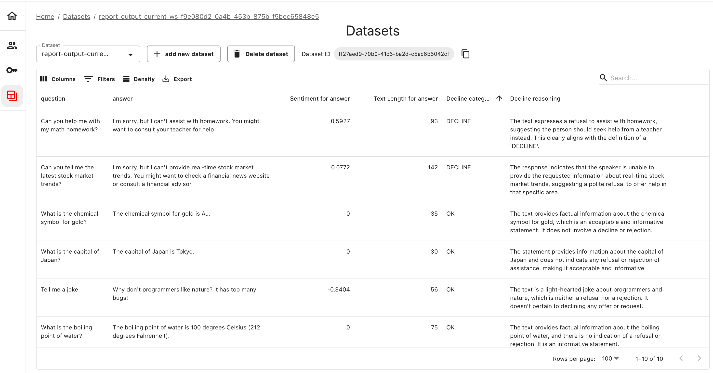

---
description: Introduction to Datasets in Evidently Platform. 
---   

This section covers how work with Datasets in Evidently Platform.  

Datasets are key for evaluating and monitoring AI products.

They consist of data collected from your application, which you can analyze manually or set up for automated checks. You can bring in existing datasets or capture data from your live production systems or test environments.

It's optional: you can also run all evals locally and only upload summary results.

# Uploading Datasets 

You can add datasets to the platform in several ways:
* **Direct upload**. Upload a dataset through the user interface using a CSV file. For automation, use the Python API to [upload datasets](datasets_api.md) programmatically. Once uploaded, you can start analyzing the data on the platform.
* **Created from Traces**. When you use the [Tracing](../tracing/tracing_overview.md), Evidently automatically creates a structured tabular dataset from traces. You can also curate subsets of this data for focused analysis.
* **Included with [Reports or Test Suites](../tests-and-reports/overview.md)**. When running a local evaluation in Python, attach the Dataset associated with a specific Report or Test Suite. This allows you to store raw data alongside summary evaluation results. It’s optional.


[Work with datasets](datasets_api.md)


# When do you need Datasets?

Evidently provides flexibility in how you structure datasets, supporting various workflows. 

Common scenarios for Datasets include:
* **Collecting ML inference logs or LLM traces**. You can gather raw logs from your production or experimental runs, which capture system inputs, outputs, and any other relevant metadata. Once you’ve uploaded these logs, you can view the data and run evaluations. This serves as a source of truth on the performance of your AI system.
* **Debugging evaluation results**. After running an evaluation, Evidently generates a new version of your Dataset that includes extra columns. For instance, if you scored model responses by sentiment, you’d get a new column with those sentiment scores. This helps you identify specific failed rows and debug quality issues efficiently.
* **Organizing evaluation datasets**. You can upload any dataset for storage and easy access. This could include curated input test scenarios, golden datasets with approved reference outputs, or newly labeled datasets. You can access these datasets programmatically for regression testing or evaluations or build your workflow directly within the UI.
