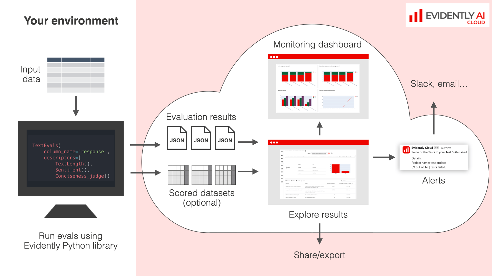
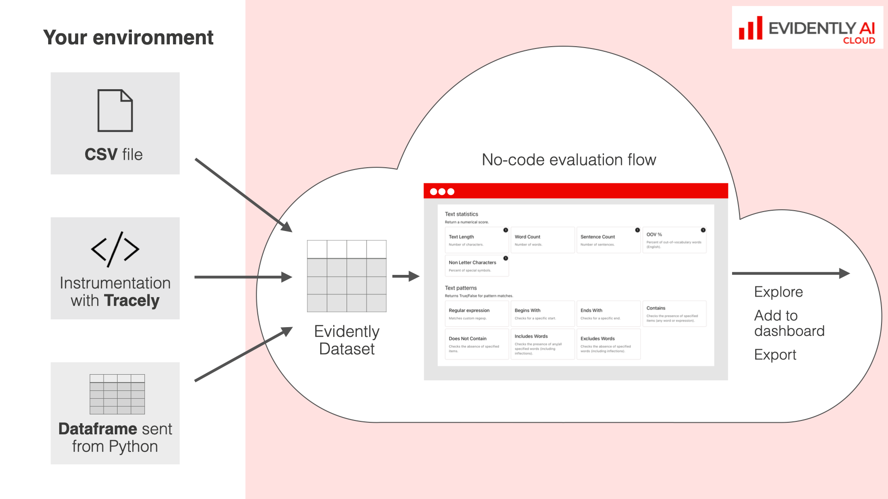
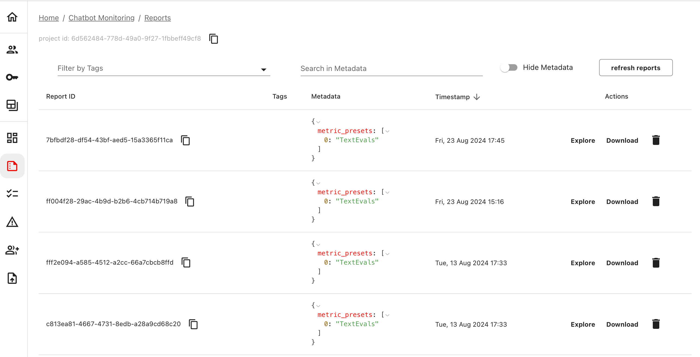
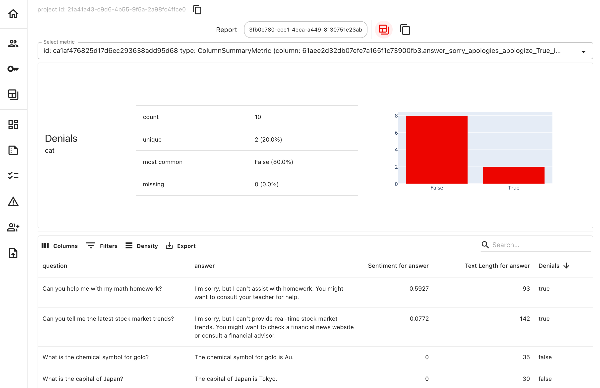
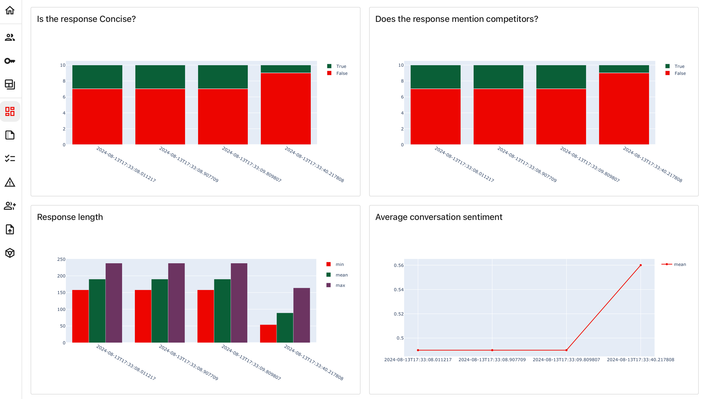

---
description: How to run evaluation workflows in Evidently Platform.
---   

This documentation section covers how to run evals, whether you're using code or a no-code interface. It also shows you how to explore, compare, and track evaluation results in the Evidently Platform UI.

 
**Looking for something else?**  For details on the Python evaluation workflow, check the [Reports and Test Suites](../tests-and-reports/introduction.md). For online evaluations, check [Monitoring](../monitoring/monitoring_overview.md). To check **what** you can evaluate, browse [Presets](../presets/all-presets.md), [Metrics](../reference/all-metrics.md) and [Tests](../reference/all-tests.md).


# When you need evals

You need evals at different stages of your AI product development:

**Ad-hoc analysis**. You may run evaluations on the fly whenever you need to troubleshoot an issue or understand a specific trend. Example questions to answer:
* What are the predictions with the highest error?
* How often do particular topics come up?
* How does my system perform on adversarial inputs?

**Experimenting**. During development, you may test different parameters, models, or prompts. Evaluations help you compare outcomes and iterate with confidence. Example questions: 
* Does the classification precision and recall improve with iterations? 
* Which prompt delivers more accurate answers?
* Does switching from GPT to Claude enhance the quality of retrieval?

**Regression Testing**. When you update a model or make a fix, you need to evaluate its quality on new or previous inputs, often as part of CI/CD pipelines. Example questions:
* Does changing the prompt lead to different answers to previous user queries?
* What is the quality of my ML model after retraining in on new data?

**Online evaluations and monitoring**. Once in production, you can automatically assess the live quality of your AI system using incoming data. Example questions:
* Is the environment (input features) changing? Are predictions shifting?
* How professional and concise were the chatbot’s answers today?
* Is version A or B performing better in production?
  
Evidently supports all these workflows. [Monitoring](../monitoring/monitoring_overview.md) is covered separately. Let's start with standalone evaluations.

# Evaluation workflow

Here is how it works:
* **Create a [Project](../projects/projects_overview.md)**. This will organize all your evaluations in one place.
* **Prepare your Dataset**. You can prep your [input data](../input-data/data-requirements.md) locally or [upload it](../datasets/datasets_overview.md) to the Evidently Platform and call it from there.
* **Run evaluations**. You perform evaluations by generating [Reports or Test Suites](../tests-and-reports/introduction.md) using one of these methods:
  * Local evaluations using the Python library
  * No-code evaluations directly in the UI

## Evals in Python 

This is perfect for development, CI/CD workflows, or custom evaluation pipelines. Once you run an eval in Python, you upload the results to the Evidently Platform.

You get to choose what you upload:
* **Results only (Default)**. You can upload just the evaluation outcomes as JSON snapshots. They include column summaries, metric distributions, and test results. For tabular data, this typically provides the necessary insights while keeping data private.
* **Results and Dataset**. Alternatively, you can include the dataset along with the evaluation results. This is useful for text data evaluations or whenever you want detailed row-level analysis, like investigating specific completions with low scores.

 
**What’s a snapshot?** This is a rich JSON version of the Report or a Test Suite with the results of an individual evaluation run that you upload to the platform.


See how to run local evals in detail:


[Run local evals](snapshots.md)


## No-code evals

With no-code evaluations, you work directly in the user interface. This is great for non-technical users or when you prefer to run evaluations on Evidently infrastructure.

Here's what you can do:
* **Evaluate uploaded datasets**. Run evaluations on collected [traces](../tracing/tracing_overview.md) (if you've instrumented your LLM application) or on [Datasets](../datasets/datasets_overview.md) you previously uploaded.
* **Upload CSV data**. Use a drag-and-drop interface to upload CSV files and run evaluations entirely on the Platform. 

Once you run the evaluation using a no-code flow, you create the same Report or Test Suite that you would generate using Python.

How to run No-code evals:


[No code evals](no_code_evals.md)


The rest of the workflow is the same. After you run your evals with any method, you can access the results in the UI, and go to the Explore view for further analysis. 

# Evaluation results 

The result of each evaluation is either a Report (when it's just a summary of metrics) or a Test Suite (when it also includes pass/fail results on set conditions).

**Browse the results**. To access them, enter your Project and navigate to the "Reports" or "Test Suites" section in the left menu. Here, you can view all your evaluation artifacts and browse them by tags, time, or metadata. You can also download them as HTML or JSON.

To see and compare the results of individual evaluations, click on "Explore" next to the individual Report or Test Suite. 

**Explore view**. In the Explore view, you get the generated Report or Test Suite and, if available, the dataset linked to the evaluation.

* To view the full Report, click on the "dataset" sign at the top to hide the dataset.
* To see results from a specific evaluation within the Report, use the dropdown menu to select the Metric.
* To compare Reports side by side, click on "duplicate snapshot" (this will keep the current Metric in view), and then select a different Report for comparison.

**Dashboard**. As you run multiple evaluations, you can build a Dashboard to visualize results over time. The Dashboard aggregates data from various Reports or Test Suites within a Project, allowing you to track progress, see performance improvements, and monitor how tests perform over time.

How to create a Dashboard:


[Dashboard](../dashboard/dashboard_overview.md)


