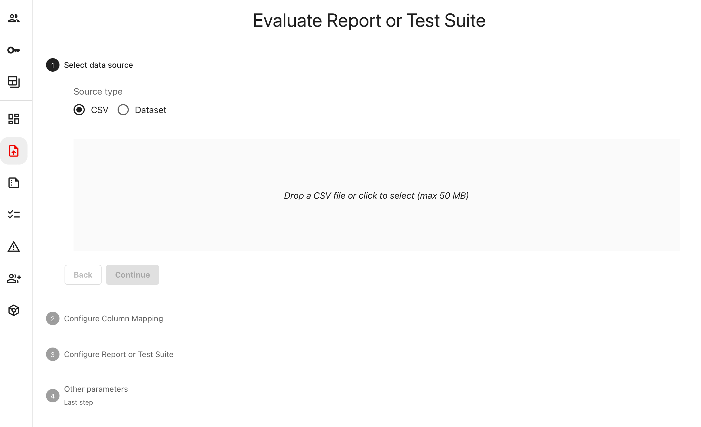
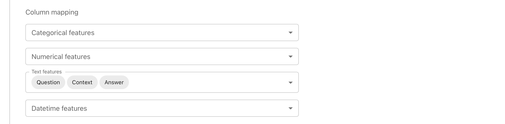
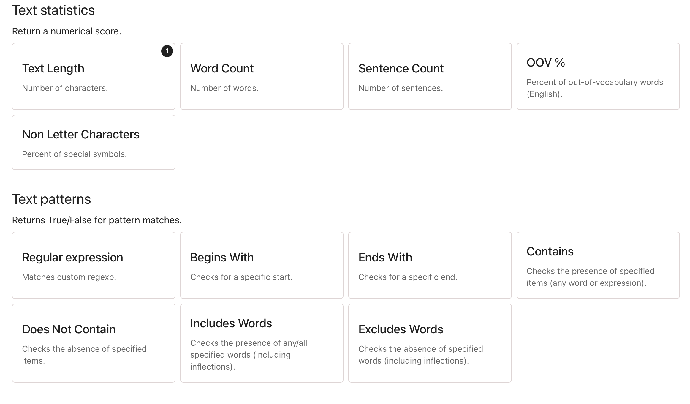
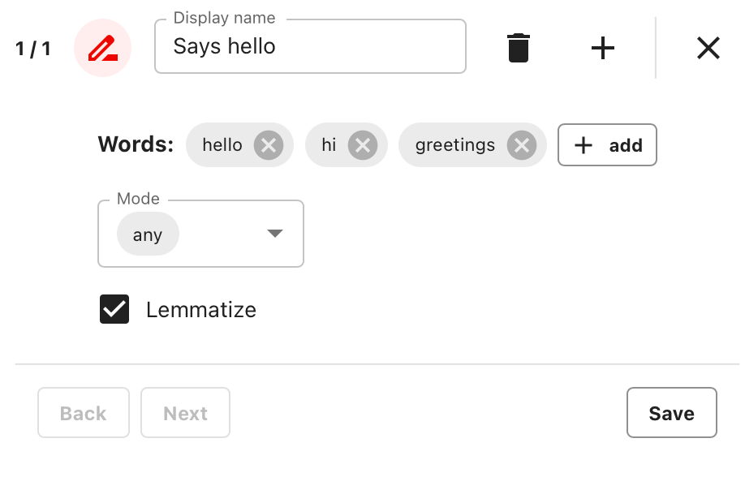
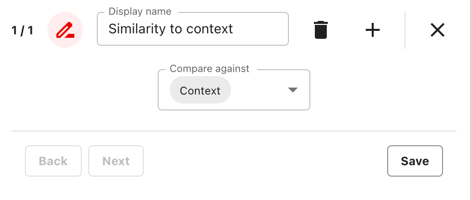
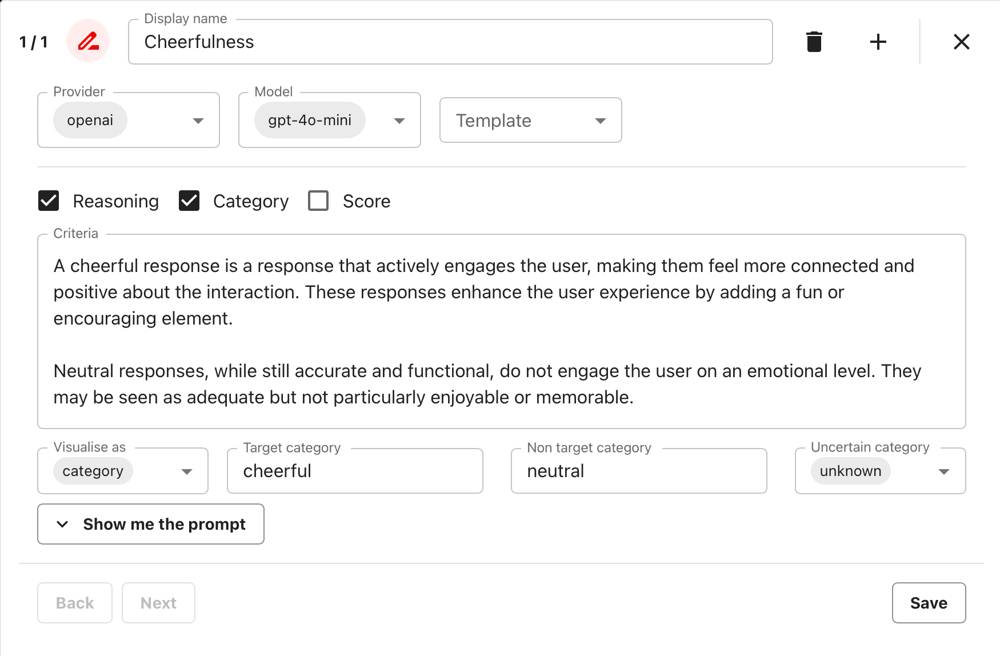
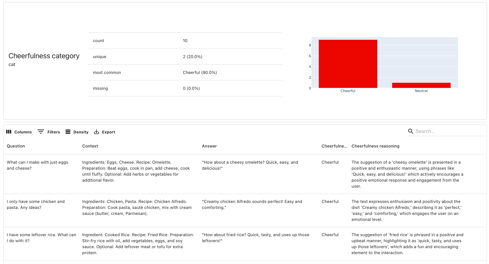

---
description: How to evaluate your data in a no-code interface.
---   

The platform supports several evaluations directly from the user interface.

| Name                    | Type       | Description                                                                                                                              |
|-------------------------|------------|------------------------------------------------------------------------------------------------------------------------------------------|
| Text Evals              | Report     | Analyze text data using methods from regular expressions to LLM judges.                                                     |
| Data Quality            | Report     | Get descriptive statistics and distribution overviews for all columns in your dataset, including text, categorical, and numerical data.  |
| Classification Quality  | Report     | Evaluate the quality of a classification model. (Your dataset must have predictions and true labels.)                                    |
| Regression Quality      | Report     | Evaluate the quality of a regression model. (Your dataset must have predictions and actuals.)                                            |
| Data Quality Tests      | Test Suite | Automatically check your dataset for issues like missing values, duplicates, etc.                                                        |

Before you start, pick a dataset to evaluate. For example, this could be a CSV file containing inputs and outputs of your AI system, like chatbot logs.

# 1. Create a Project

On the main page of Evidently Platform, click “Create new Project.” Give your Project a title and description to help organize your evaluations.


**What is a Project?** It's a way to organize your evals and datasets together. Check the [Project](../projects/add_project.md) docs.


# 2. Start an evaluation

Inside the Project, go to the “Evaluate” menu item on the left. Let's start!

**(Optional) Add Open AI key.** Add a token in the “Secrets” menu section if you plan to use an LLM for evaluations. You can proceed without it, using other types of evals.

# 3. Pass the Dataset

There are two options: 
* **Upload a CSV**. Drag and drop your Dataset.
* **Use an existing Dataset**. Select a Dataset you previously uploaded to the platform or one collected through [Tracing](../tracing/tracing_overview.md).
  
Your dataset can have any structure, but certain evaluations require specific columns:
* **Text evaluations**: make sure there’s at least one text column.
* **Regression and classification**: include columns with predictions and ground truth.
* **Data quality**: any dataset with categorical, numerical or text columns.


**What are Datasets?** Learn how to manage and upload [Datasets](../datasets/datasets_overview.md) to the platform.


# 4. Column Mapping

Map your data schema. You don't have to fill in all the options: choose what applies. For example, for text evals, point to the columns containing text.

If you have a timestamp, map it as a "DateTime." You will get additional plots with score changes in time. 


**What is Column mapping?** Understand how to map your dataset schema in the [Column Mapping](../input-data/column-mapping.md) docs section.


# 5. Configure the evaluation

Some evaluations (Classification, Regression, and Data Quality) run as is. Once you passed the data, hit "Run" to get your Report.


**What is the Raw Data option?** It keeps raw data points in plots like error time series. This is relevant for small datasets: generally leave it off.


Text Evals require a bit more setup. You must choose which column to evaluate and how. You can choose from the following methods:
* **Model-based**: use built-in machine learning models, like sentiment analysis.
* **Regular expressions**: check for specific words or patterns.
* **Text stats**: measure stats like the number of symbols or sentences.
* **LLM-based**: use external LLMs to evaluate your text data.

Select specific checks one by one:

Each evaluation result is called a **Descriptor**. No matter the method, you’ll get a label or score for every evaluated text. Some, like “Sentiment,” work instantly, while others may need setup.

## Examples

**Include Words**. This Descriptor checks for listed words and returns "True" or "False." Set up these parameters:
* Add a list of words.
* Choose whether to check for “any” or “all” of the words present.
* Set the **lemmatize** parameter to check for inflected and variant words automatically.
* Give your check a name so you can easily find it in your results.

Example setup:

**Semantic Similarity**. This descriptor converts texts to embeddings and calculates Cosine Similarity between your evaluated column and another column. It scores from 0 to 1 (0: completely different, 0.5: unrelated, 1: identical). It's useful for checking if responses are semantically similar to a question or reference.

Select the column to compare against: 

**Custom LLM evaluator**. If you've added your token, use LLM-based evals (built-in or custom) to send your texts to LLMs for grading or scoring. You can choose a specific LLM model from the provider. 

For example, you can create a custom evaluator to classify texts as “cheerful” or “neutral.” Fill in the parameters, and Evidently will generate the evaluation prompt: 

For a binary classification template, you can configure these parameters:
* **Reasoning**: choose to include reasoning for the decision (Recommended).
* **Category** and/or **Score**: have the LLM respond with the category (Recommended) or also return a score.
* **Criteria**: define custom criteria in free text to clarify the classification task.
* **Visualize as**: when both Category and Score are computed, choose which to display in the report.
* **Target/Non-target Category**: labels you want to use. 
* **Uncertain Category**: how the model should respond when it can’t decide.


**What other evaluators are there?** Check the list of Descriptors on the [All Metrics](../reference/all-metrics.md) page.


To add evaluations for another column in the same Report, click “Add Preset,” select “Text Evals,” and follow the same steps for the new column. You can include evals for multiple columns at once.

# 6. Run the evaluation

Before generating the Report, you can add a Tag to identify or reference the Report later. It's optional.

Click “Run”, and the calculation will start! It may take some time to process, especially on a large dataset. 

# 7. View the results

Once your evaluation is complete, you can view the results. You can either
* view the Dataset with the added scores, or 
* use the **Explore** view to see the Dataset with a summary Report (recommended).

If you have many Metrics, the Explore page will initially show the long Report. Use the selector at the top to focus on a specific Metric.

Here’s what the Explore page might look like with the results from the Cheerfulness evaluator for the “Answer” column:

