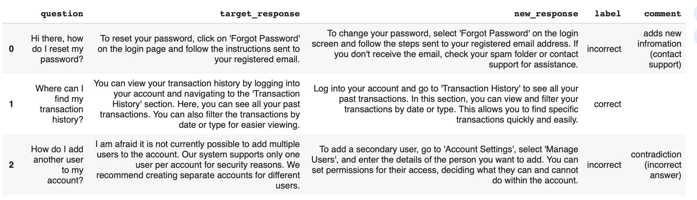
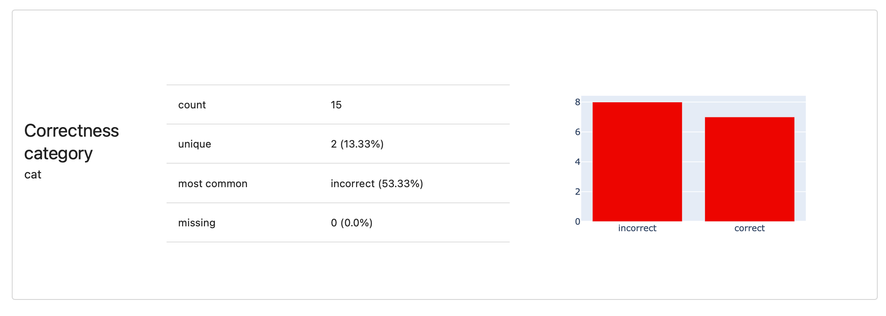
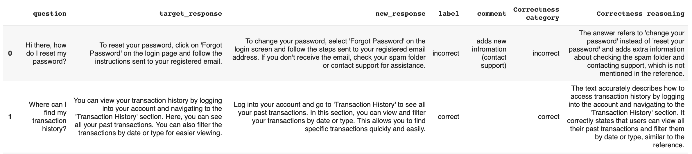
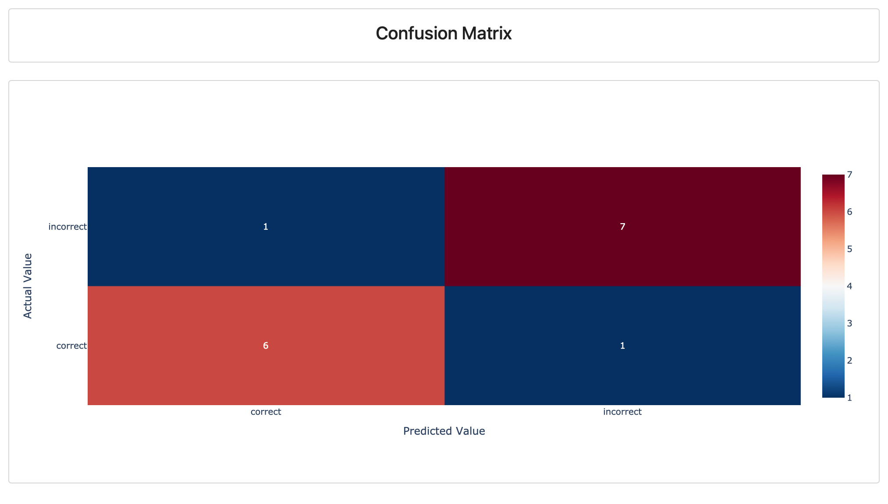
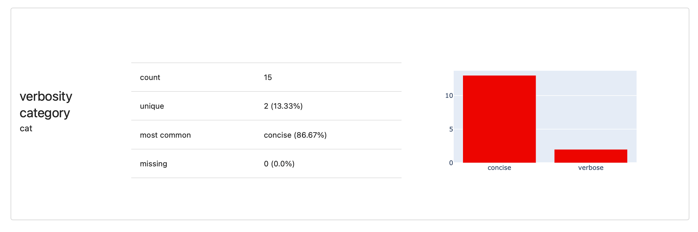
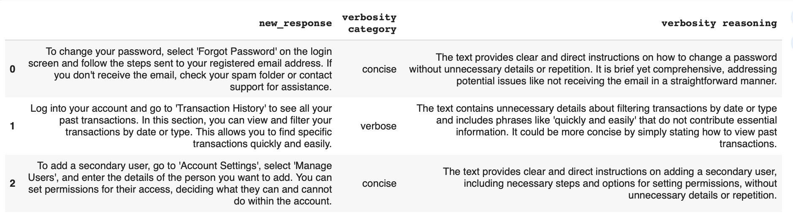

In this tutorial, we'll show you how to build an evaluator for text outputs using another LLM as the judge. This lets you automatically assess the quality of your system's responses based on your custom criteria.


**You can also create LLM judges using no code**. This tutorial shows an open-source workflow that you can run locally using the Evidently Python library. You can also create and run LLM judges on the platform using [no-code interface](../evaluations/no_code_evals.md).


We'll explore two ways to use an LLM as a judge:
* **Reference-based**. Compare new responses against a reference. This is for regression testing workflows or whenever you have a "ground truth" or approved responses to compare against.
* **Open-ended**. Evaluate responses based on custom criteria, which helps evaluate new outputs when there's no reference available.
  
By the end, you'll know how to create custom LLM judges and apply them to your data. Our primary focus will be showing how to develop and tune the evaluator, which you can then apply in different contexts, like regression testing or prompt comparison.

# Tutorial scope

Here's what we'll do:
* **Create an evaluation dataset**. Ceate a toy Q&A dataset with two responses to each question, and add manual labels based on the criteria we want the LLM evaluator to follow later.
* **Create and run an LLM as a judge**. Design an LLM evaluator prompt to determine whether the new response is correct compared to the reference. 
* **Evaluate the judge**. Compare the LLM judge's evaluations with manual labels to see if they meet the expectations or need tweaking.
  
We'll start with the reference-based evaluator, which is more complex because it requires passing two columns to the prompt. Then, we'll create a simpler judge focused on verbosity.

To complete the tutorial, you will need:
* Basic Python knowledge. 
* An OpenAI API key to use for LLM evaluator.

Use the provided code snippets or run a sample notebook.

Jupyter notebook:


Or click to [open in Colab](https://colab.research.google.com/github/evidentlyai/community-examples/blob/main/tutorials/LLM_as_a_judge_tutorial.ipynb).

We recommend running this tutorial in Jupyter Notebook or Google Colab to render rich HTML objects with summary results directly in a notebook cell.

We will work with a toy dataset, which you can replace with your production data.

# Installation and Imports

Install Evidently:

```python 
!pip install evidently[llm]
```

Import the required modules:

```python 
from evidently import ColumnMapping
from evidently.report import Report
from evidently.metric_preset import TextEvals
from evidently.descriptors import *
from evidently.metrics import *
from evidently.features.llm_judge import BinaryClassificationPromptTemplate
```

Pass your OpenAI key:

```python 
import os
os.environ["OPENAI_API_KEY"] = "YOUR_KEY"
```

# 1. Create the Dataset

First, we'll create a toy Q&A dataset that includes:
* **Questions**. The inputs our LLM system got.
* **Target responses**. The "approved" responses. You can curate these from previous outputs that you consider accurate.
* **New responses**. These are the responses generated by your system that we want to evaluate.
  
To make it more interesting, we created a synthetic dataset with 15 answers to customer support questions. We also manually labeled each new response as correct or incorrect, with brief comments explaining the decision.

Here's how you can create this dataset in one go:

<details>

<summary>Create the DataFrame</summary>

```python
data = [
    ["Hi there, how do I reset my password?",
     "To reset your password, click on 'Forgot Password' on the login page and follow the instructions sent to your registered email.",
     "To change your password, select 'Forgot Password' on the login screen and follow the steps sent to your registered email address. If you don't receive the email, check your spam folder or contact support for assistance.",
     "incorrect", "adds new infromation (contact support)"],

    ["Where can I find my transaction history?",
     "You can view your transaction history by logging into your account and navigating to the 'Transaction History' section. Here, you can see all your past transactions. You can also filter the transactions by date or type for easier viewing.",
     "Log into your account and go to 'Transaction History' to see all your past transactions. In this section, you can view and filter your transactions by date or type. This allows you to find specific transactions quickly and easily.",
     "correct", ""],

    ["How do I add another user to my account?",
     "I am afraid it is not currently possible to add multiple users to the account. Our system supports only one user per account for security reasons. We recommend creating separate accounts for different users.",
     "To add a secondary user, go to 'Account Settings', select 'Manage Users', and enter the details of the person you want to add. You can set permissions for their access, deciding what they can and cannot do within the account.",
     "incorrect", "contradiction (incorrect answer)"],

    ["Is it possible to link multiple bank accounts?",
     "Yes, you can link multiple bank accounts by going to 'Account Settings' in the menu and selecting 'Add Bank Account'. Follow the prompts to add your bank account details. Make sure to verify each bank account by following the verification process.",
     "You can add multiple bank accounts by visiting 'Accounts' in the menu and choosing 'Add Bank Account'. Enter your bank details as prompted and complete the verification process for each account to link them successfully.",
     "incorrect", "contradiction (incorrect menu item)"],

    ["Can I use your service for cryptocurrency transactions?",
     "Currently, our service does not support cryptocurrency transactions. Please check our website for updates regarding this feature. We are continuously working to expand our services and may include this in the future.",
     "Currently, our service does not support cryptocurrency transactions. Please check our website for updates regarding this feature. We are continuously working to expand our services and may include this in the future.",
     "correct", ""],

    ["Hi, can I get a detailed report of my monthly transactions?",
     "Yes, you can generate a detailed monthly report of your transactions by logging into your account, going to 'Transaction History', and selecting 'Generate Report'. You can customize the report by selecting specific dates or transaction types.",
     "You can get a detailed monthly report by logging into your account, navigating to 'Transaction History', and clicking on 'Generate Report'. Customize your report by choosing the date range and types of transactions you want to include.",
     "correct", ""],

    ["I am traveling to the US. Can I use the app there?",
     "Yes, you can use the app in the US just like you do at home. Ensure you have an internet connection. You may also want to update your app to the latest version before traveling for optimal performance.",
     "The app will work in the US without any issues. Just make sure you have access to the internet. For the best experience, update your app to the latest version before you travel.",
     "correct", ""],

    ["How do I link my payment account to a new mobile number?",
     "To link a new mobile number, log in to your account, go to 'Account Settings', select 'Mobile Number', and follow the instructions to verify your new number. You will need to enter the new number and verify it via a code sent to your phone.",
     "To add a new number, navigate to the 'Account Settings' section, select 'Mobile Number' and proceed with the steps to add and confirm the new number. Enter the new mobile number and verify it using the code sent to your phone.",
     "correct", ""],

    ["Can I receive notifications for transactions in real-time?",
     "Yes, you can enable real-time notifications for transactions by going to 'Account Settings', then 'Notifications', and turning on 'Transaction Alerts'. You can choose to receive alerts via SMS, email, or push notifications on your mobile device.",
     "To receive real-time notifications for transactions, log into your account, go to 'Account Settings', select 'Notifications', and enable 'Transaction Alerts'. Choose your preferred notification method between email or push notifications.",
     "incorrect", "omits information (sms notification)"],

    ["Hey, can I set up automatic transfers to my savings account?",
     "Yes, you can set up automatic transfers by going to 'Account Settings', selecting 'Automatic Transfers', and specifying the amount and frequency. You can choose to transfer weekly, bi-weekly, or monthly. Make sure to save the settings to activate the transfers.",
     "You can arrange automatic transfers by going to 'Account Settings', choosing 'Automatic Transfers', and setting the desired amount and frequency. Don't forget to save the changes to enable the automatic transfers.",
     "incorrect", "omits information (limited frequency of transfers available)"],

    ["Hi there, how do I reset my password?",
     "To reset your password, click on 'Forgot Password' on the login page and follow the instructions sent to your registered email.",
     "To change your password, select 'Forgot Password' on the login screen and follow the steps sent to your registered email address. If you don't receive the email, check your spam folder.",
     "correct", ""],

    ["How can I update my billing address?",
     "To update your billing address, log into your account, go to 'Account Settings', select 'Billing Information', and enter your new address. Make sure to save the changes once you are done.",
     "To update your billing address, log into your account, navigate to 'Account Settings', and select 'Billing Information'. Enter your new address and ensure all fields are filled out correctly. Save the changes, and you will receive a confirmation email with the updated address details.",
     "incorrect", "adds new information (confirmation email)"],

    ["How do I contact customer support?",
     "You can contact customer support by logging into your account, going to the 'Help' section, and selecting 'Contact Us'. You can choose to reach us via email, phone, or live chat for immediate assistance.",
     "To contact customer support, log into your account and go to the 'Help' section. Select 'Contact Us' and choose your preferred method: email, phone, or live chat. Our support team is available 24/7 to assist you with any issues. Additionally, you can find a FAQ section that may answer your questions without needing to contact support.",
     "incorrect", "adds new information (24/7 availability, FAQ section)"],

    ["What should I do if my card is lost or stolen?",
     "If your card is lost or stolen, immediately log into your account, go to 'Card Management', and select 'Report Lost/Stolen'. Follow the instructions to block your card and request a replacement. You can also contact our support team for assistance.",
     "If your card is lost or stolen, navigate to 'Card Management' in your account, and select 'Report Lost/Stolen'. Follow the prompts to block your card and request a replacement. Additionally, you can contact our support team for help.",
     "correct", ""],

    ["How do I enable two-factor authentication (2FA)?",
     "To enable two-factor authentication, log into your account, go to 'Security Settings', and select 'Enable 2FA'. Follow the instructions to link your account with a 2FA app like Google Authenticator. Once set up, you will need to enter a code from the app each time you log in.",
     "To enable two-factor authentication, log into your account, navigate to 'Security Settings', and choose 'Enable 2FA'. Follow the on-screen instructions to link your account with a 2FA app such as Google Authenticator. After setup, each login will require a code from the app. Additionally, you can set up backup codes in case you lose access to the 2FA app.",
     "incorrect", "adds new information (backup codes)"]
]

columns = ["question", "target_response", "new_response", "label", "comment"]

golden_dataset = pd.DataFrame(data, columns=columns)
``` 

</details>

To preview it:

```python
pd.set_option('display.max_colwidth', None)
golden_dataset.head(5)
```





**How do you get the data in practice?**  You can pick examples from your experiments or production data, focusing on scenarios you want to evaluate. For instance, if you plan to use the LLM evaluator for regression testing, select texts that show different ways a question has been answered, both correctly and incorrectly. You can also use synthetic data.


Why start with manual labels? This process helps you:
* **Refine your criteria**. Manually labeling data helps you clarify what you want the LLM judge to detect. It also reveals edge cases so that you can craft more effective evaluator prompts.
* **Evaluate the judge's quality**. Manual labels serve as the ground truth. You can then compare the LLM's judgments with these labels to assess its accuracy.
  
Ultimately, an LLM judge is a small ML system, and it needs its own evals!

Here's the distribution of examples in our small dataset: we have both correct and incorrect responses.


# 2. Correctness evaluator 

Now that we have our labeled dataset, it's time to set up an LLM judge. We'll start with an evaluator that checks if responses are correct compared to the reference. The goal is to match the quality of our manual labels.

We'll use the `LLMEval` [Descriptor](../tests-and-reports/text-descriptors.md) to create a custom binary evaluator. Here's how to define the prompt template for correctness:

```python
correctness_eval= LLMEval(
    subcolumn="category",
    additional_columns={"target_response": "target_response"},
    template = BinaryClassificationPromptTemplate(
        criteria = """
An ANSWER is correct when it is the same as the REFERENCE in all facts and details, even if worded differently.
The ANSWER is incorrect if it contradicts the REFERENCE, adds additional claims, omits or changes details.

REFERENCE:

=====
{target_response}
=====
        """,
        target_category="incorrect",
        non_target_category="correct",
        uncertainty="unknown",
        include_reasoning=True,
        pre_messages=[("system", "You are an expert evaluator. will be given an ANSWER and REFERENCE.")],
        ),
    provider = "openai",
    model = "gpt-4o-mini",
    display_name = "Correctness",
)
``` 

Explanation:
* `BinaryClassificationPromptTemplate`: This template instructs the LLM to classify the input into two classes, explain its reasoning, and format everything neatly. You don't have to worry about asking for these details—they're built into the template.
* `target_category` and `non-target category`: The labels we're aiming for - "correct" and "incorrect" in our case.
* `criteria`: This is where you describe what the LLM should look for when grading the responses.
* `include_reasoning`: This asks the LLM to explain its choice.
* `additional_columns`: This allows you to include not just the primary column (the "new_response") but also the "reference_response" for comparison. You then add this column name placeholder to the grading criteria.
  
In this example, we've set up the prompt to be strict, erring on the side of labeling a correct answer as incorrect is preferable. You can write it differently. This flexibility is one of the key benefits of creating a custom judge.


**What else is there?** Check the docs on [LLM judge feature](../customization/llm_as_a_judge.md).


# 3. Run the evaluation

Now, let's run the evaluation. We'll apply it to the "new_response" column in our dataset and create a report that summarizes how the LLM judged the responses.

```python
correctness_report = Report(metrics=[
    TextEvals(column_name="new_response", descriptors=[
        correctness_eval
    ])
])

correctness_report.run(reference_data=None,
           current_data=golden_dataset)
correctness_report
```

This will render an HTML report in the notebook cell. Or, use `as_dict()` for a Python dictionary output. 



But since we're refining our LLM evaluator, we don't want just the label distribution: we want to see what the LLM got right and wrong!


**Tracking the evals.** When running evaluations in production, [upload your results](../get-started/cloud_quickstart_llm.md) to the Evidently Platform to store them and track them over time.


# 4. Evaluate the LLM Eval quality

This part is a bit meta: we're going to evaluate the quality of our LLM evaluator itself.

To take a look at the raw outputs:

```python
correctness_report.datasets().current
```

This will show a DataFrame with newly added scores and explanations.



**Note**: your results and explanations will vary since LLMs are non-deterministic.

We can also quantify it! We'll treat this like a classification task to measure how accurately the LLM identifies incorrect responses. We'll look at metrics like precision and recall.

Let's create a DataFrame and map our data for classification: the original manual label is the target, and the LLM-provided response is the prediction. 

```python
df = pd.DataFrame(correctness_report.datasets().current)

column_mapping = ColumnMapping()
column_mapping.target = 'label'
column_mapping.prediction = 'Correctness category'
column_mapping.pos_label = 'incorrect'

classification_report = Report(metrics=[
    ClassificationQualityMetric(),
    ClassificationClassBalance(),
    ClassificationConfusionMatrix(),
])

classification_report.run(reference_data=None, current_data=df, column_mapping=column_mapping)

classification_report
```

Or use `classification_report.as_dict()`.

Explanation:
* `ClassificationQualityMetric` displays precision, recall, accuracy, etc.
* `ClassificationClassBalance` shows the distribution of classes (correct vs. incorrect) in the dataset.
* `ClassificationConfusionMatrix` illustrates the types of errors.
  
We have one type of error each, but overall, the results are pretty good! If you want to refine the judge, you can iterate on the prompt and continue improving it. 



# 5. Verbosity evaluator 

Next, let’s create a simpler LLM judge that evaluates the verbosity of the responses. This judge will check whether the responses are concise and to the point. This only requires evaluating one column with the output.

This is perfect for production evaluations where you don’t have a reference answer to compare against.

Here's how to set up the prompt template for verbosity:

```python
verbosity_eval = LLMEval(
    subcolumn="category",
    template = BinaryClassificationPromptTemplate(
        criteria = """Conciseness refers to the quality of being brief and to the point, while still providing all necessary information.
            A concise response should:
            - Provide the necessary information without unnecessary details or repetition.
            - Be brief yet comprehensive enough to address the query.
            - Use simple and direct language to convey the message effectively.
        """,
        target_category="concise",
        non_target_category="verbose",
        uncertainty="unknown",
        include_reasoning=True,
        pre_messages=[("system", "You are a judge which evaluates text.")],
        ),
    provider = "openai",
    model = "gpt-4o-mini",
    display_name = "verbosity",
)
```

Run the Report and view the summary results: 

```python
verbosity_report = Report(metrics=[
    TextEvals(column_name="new_response", descriptors=[
        verbosity_eval
    ])
])

verbosity_report.run(reference_data=None,
           current_data=golden_dataset)
verbosity_report
```



Or use `as_dict()` for a Python dictionary output. 

To access the raw results:

```python
verbosity_report.datasets().current
```

Preview:



Don't fully agree with the results? Use these labels as a starting point, and correct the decision where you see fit - now you've got your golden dataset! Next, iterate on your judge prompt.

The LLM judge itself is just one part of your overall evaluation framework. You can now integrate this evaluator into workflows, such as testing your LLM outputs after changing a prompt.
