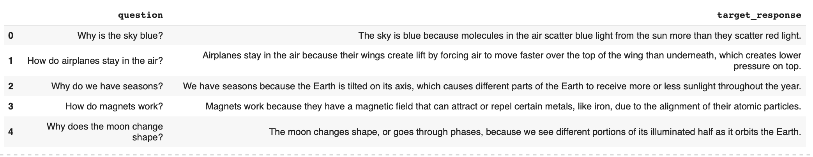
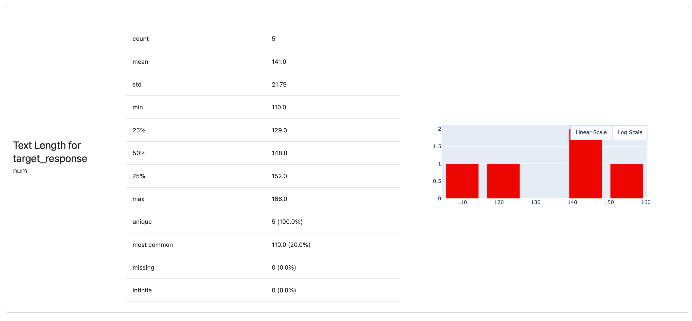
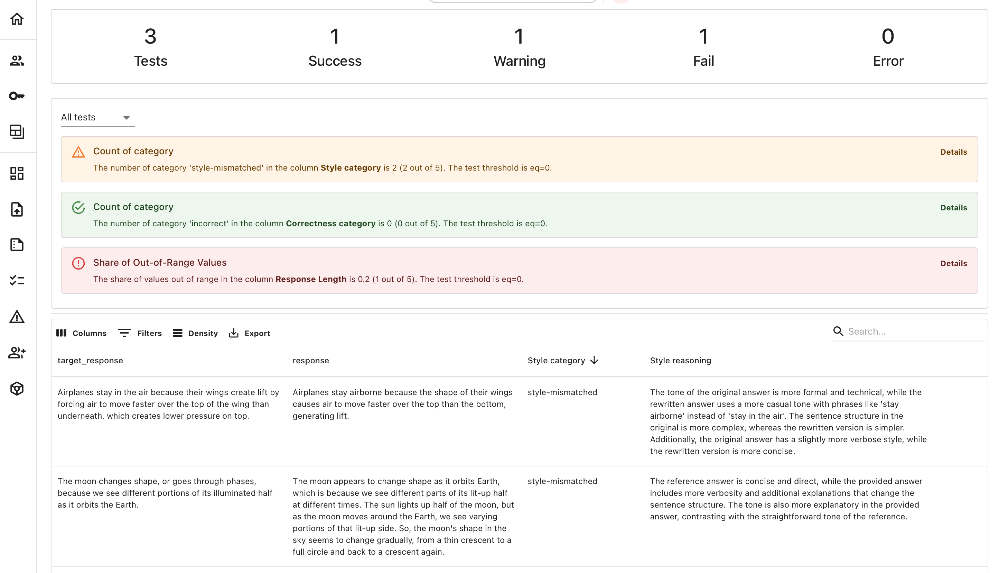
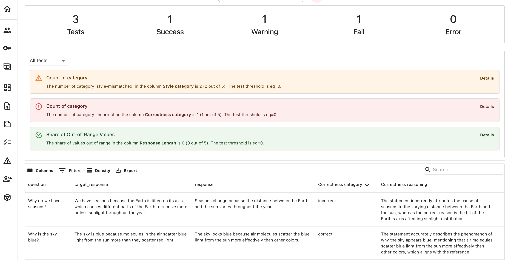
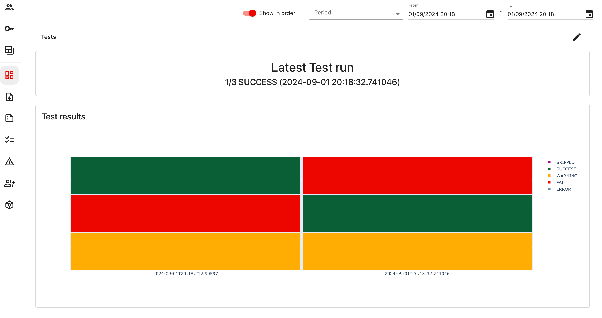

In this tutorial, we’ll show you how to do regression testing for LLM outputs. You’ll learn how to compare new and old responses after changing a prompt, model, or anything else in your system. By re-running the same inputs, you can spot any significant changes. This helps you push updates with confidence or identify issues to fix.

# Tutorial scope

Here's what we'll do:
* **Create a toy dataset**. Build a small Q&A dataset with answers and reference responses.
* **Get new answers**. Imitate generating new answers to the same question we want to compare.
* **Create and run a Test Suite**. Compare the answers using LLM-as-a-judge to evaluate length, correctness and style match.
* **Build a monitoring Dashboard**. Get plots to track the results of Tests over time.

To complete the tutorial, you will need:
* Basic Python knowledge. 
* An OpenAI API key to use for the LLM evaluator.
* An Evidently Cloud account to track test results. If not yet, [sign up](https://www.evidentlyai.com/register) for a free account.

Use the provided code snippets or run a sample notebook.

Jupyter notebook:


Or click to [open in Colab](https://colab.research.google.com/github/evidentlyai/community-examples/blob/main/tutorials/Regression_testing_with_debugging.ipynb).

# 1. Installation and Imports

Install Evidently:

```python 
!pip install evidently[llm]
```

Import the required modules:

```python 
import pandas as pd

from evidently.report import Report
from evidently.test_suite import TestSuite
from evidently.metric_preset import TextEvals
from evidently.descriptors import *
from evidently.tests import *
from evidently.metrics import *

from evidently.features.llm_judge import BinaryClassificationPromptTemplate
```

To connect to Evidently Cloud:

```python 
from evidently.ui.workspace.cloud import CloudWorkspace
```

To create monitoring panels as code:

```python 
from evidently.ui.dashboards import DashboardPanelPlot
from evidently.ui.dashboards import DashboardPanelTestSuite
from evidently.ui.dashboards import DashboardPanelTestSuiteCounter
from evidently.ui.dashboards import TestSuitePanelType
from evidently.ui.dashboards import ReportFilter
from evidently.ui.dashboards import PanelValue
from evidently.ui.dashboards import PlotType
from evidently.ui.dashboards import CounterAgg
from evidently.tests.base_test import TestStatus
from evidently.renderers.html_widgets import WidgetSize
```

Pass your OpenAI key:

```python 
import os
os.environ["OPENAI_API_KEY"] = "YOUR KEY"
```

# 2. Create a Project

Connect to Evidently Cloud. Replace with your actual token:

```python 
ws = CloudWorkspace(token="YOUR_API_TOKEN", url="https://app.evidently.cloud")
```

Create a Project:

```python 
project = ws.create_project("Regression testing example", org_id="YOUR_ORG_ID")
project.description = "My project description"
project.save()
```


**Need help?** Check how to find [API key](../installation/cloud_account.md).


# 3. Prepare the Dataset

Create a dataset with questions and reference answers. We'll later compare the new LLM responses against them:

```python 
data = [
    ["Why is the sky blue?", "The sky is blue because molecules in the air scatter blue light from the sun more than they scatter red light."],
    ["How do airplanes stay in the air?", "Airplanes stay in the air because their wings create lift by forcing air to move faster over the top of the wing than underneath, which creates lower pressure on top."],
    ["Why do we have seasons?", "We have seasons because the Earth is tilted on its axis, which causes different parts of the Earth to receive more or less sunlight throughout the year."],
    ["How do magnets work?", "Magnets work because they have a magnetic field that can attract or repel certain metals, like iron, due to the alignment of their atomic particles."],
    ["Why does the moon change shape?", "The moon changes shape, or goes through phases, because we see different portions of its illuminated half as it orbits the Earth."]
]

columns = ["question", "target_response"]

ref_data = pd.DataFrame(data, columns=columns)
```

Get a quick preview:

```python 
pd.set_option('display.max_colwidth', None)
ref_data.head()
```

Here is how the data looks:



You might want to have a quick look at some data statistics to help you set conditions for Tests. Let's check the text length distribution. This will render a summary Report directly in the notebook cell.

```python 
report = Report(metrics=[
    TextEvals(column_name="target_response", descriptors=[
        TextLength(),
    ]),
])

report.run(reference_data=None,
           current_data=ref_data)

report
```

If you work in a non-interactive Python environment, call `report.as_dict()` or `report.json()` instead.  

Here is the distribution of text length:



# 4. Get new answers

Suppose you generate new responses using your LLM after changing a prompt. We will imitate it by adding a new column with new responses to the DataFrame:

```python 
data = [
    ["Why is the sky blue?",
     "The sky is blue because molecules in the air scatter blue light from the sun more than they scatter red light.",
     "The sky appears blue because air molecules scatter the sun’s blue light more than they scatter other colors."],

    ["How do airplanes stay in the air?",
     "Airplanes stay in the air because their wings create lift by forcing air to move faster over the top of the wing than underneath, which creates lower pressure on top.",
     "Airplanes stay airborne because the shape of their wings causes air to move faster over the top than the bottom, generating lift."],

    ["Why do we have seasons?",
     "We have seasons because the Earth is tilted on its axis, which causes different parts of the Earth to receive more or less sunlight throughout the year.",
     "Seasons occur because of the tilt of the Earth’s axis, leading to varying amounts of sunlight reaching different areas as the Earth orbits the sun."],

    ["How do magnets work?",
     "Magnets work because they have a magnetic field that can attract or repel certain metals, like iron, due to the alignment of their atomic particles.",
     "Magnets generate a magnetic field, which can attract metals like iron by causing the electrons in those metals to align in a particular way, creating an attractive or repulsive force."],

    ["Why does the moon change shape?",
     "The moon changes shape, or goes through phases, because we see different portions of its illuminated half as it orbits the Earth.",
     "The moon appears to change shape as it orbits Earth, which is because we see different parts of its lit-up half at different times. The sun lights up half of the moon, but as the moon moves around the Earth, we see varying portions of that lit-up side. So, the moon's shape in the sky seems to change gradually, from a thin crescent to a full circle and back to a crescent again."]
]

columns = ["question", "target_response", "response"]

eval_data = pd.DataFrame(data, columns=columns)
```

Here is the resulting dataset with the added new column:



**How to run it in production?** In practice, replace this step with calling your LLM app to score the inputs. After you get the new responses, add them to a DataFrame. You can also use our **tracing** library to instrument your app and get traces as a tabular dataset. Check the tutorial with [tracing workflow](../examples/tutorial_tracing.md). 


# 5. Design the Test suite

To compare new answers with old ones, we need evaluation metrics. You can use deterministic or embeddings-based metrics like SemanticSimilarity. However, you often need more custom criteria. Using LLM-as-a-judge is useful for this, letting you define what to detect.

Let’s design our Tests:
* **Length check**. All new responses must be between 80 and 200 symbols. 
* **Correctness**. All new responses should give the same answer without contradictions. 
* **Style**. All new responses should match the style of the reference.

Text length is easy to check, but for Correctness and Style checks, we'll write our custom LLM judges.

## Correctness judge 

We implement the correctness evaluator, using an Evidenty template for binary classification. We ask the LLM to classify each response as correct or incorrect based on the {target_response} column and provide reasoning for its decision.

```python
correctness_eval= LLMEval(
    subcolumn="category",
    additional_columns={"target_response": "target_response"},
    template = BinaryClassificationPromptTemplate(
        criteria = """
An ANSWER is correct when it is the same as the REFERENCE in all facts and details, even if worded differently.
The ANSWER is incorrect if it contradicts the REFERENCE, adds additional claims, omits or changes details.

REFERENCE:

=====
{target_response}
=====
        """,
        target_category="incorrect",
        non_target_category="correct",
        uncertainty="unknown",
        include_reasoning=True,
        pre_messages=[("system", "You are an expert evaluator. will be given an ANSWER and REFERENCE.")],
        ),
    provider = "openai",
    model = "gpt-4o-mini",
    display_name = "Correctness",
)
```

We recommend splitting each evaluation criterion into separate judges and using a simple grading scale, like binary classifiers, for better reliability.


**Don't forget to evaluate your judge!** Each LLM evaluator is a small ML system you should tune to align with your preferences. We recommend running a couple of iterations to tune it. Check the tutorial on [creating LLM judges](cookbook_llm_judge.md). 



**Docs on LLM judge**. For an explanation of each parameter, check the docs on [LLM judge functionality](../customization/llm_as_a_judge.md). 


## Style judge

Using a similar approach, we'll create a judge for style. We'll also add clarifications to define what we mean by a style match.

```python
style_eval= LLMEval(
    subcolumn="category",
    additional_columns={"target_response": "target_response"},
    template = BinaryClassificationPromptTemplate(
        criteria = """
An ANSWER is style-matching when it matches the REFERENCE answer in style.
The ANSWER is style-mismatched when it diverges from the REFERENCE answer in style.

Consider the following STYLE attributes:
- tone (friendly, formal, casual, sarcastic, etc.)
- sentence structure (simple, compound, complex, etc.)
- verbosity level (relative length of answers)
- and other similar attributes that may reflect difference in STYLE.

You must focus only on STYLE. Ignore any differences in contents.

=====
{target_response}
=====
        """,
        target_category="style-matching",
        non_target_category="style-mismatched",
        uncertainty="unknown",
        include_reasoning=True,
        pre_messages=[("system", "You are an expert evaluator. will be given an ANSWER and REFERENCE.")],
        ),
    provider = "openai",
    model = "gpt-4o-mini",
    display_name = "Style",
)
```

## Complete Test Suite

Now, we can create a Test Suite that includes checks for correctness, style matching, and text length.
* **Choose Tests**. We select Evidently column-level tests like `TestCategoryCount` and `TestShareOfOutRangeValues`. (You can pick other Tests, like `TestColumnValueMin` or `TestColumnValueMean`).
* **Set Parameters and Conditions**. Some Tests require parameters: for example, `left` and `right` to set the allowed range for Text Length. For Test fail conditions, use parameters like `gt` (greater than), `lt` (less than), `eq` (equal), etc.
* **Set non-critical Tests**. Identify non-critical Tests, like the style match check, to trigger warnings instead of fails. This helps visually separate them on monitoring panels and set alerts only for critical failures.

We reference our two LLM judges, `style_eval` and `correctness_eval`, and apply them to the `response` column in our dataset. For text length, we use the built-in `TextLength()` descriptor for the same column.

```python
test_suite = TestSuite(tests=[
    TestCategoryCount(
        column_name=style_eval.on("response"),
        category="style-mismatched",
        eq=0,
        is_critical=False),
    TestCategoryCount(
        column_name=correctness_eval.on("response"),
        category="incorrect",
        eq=0),
    TestShareOfOutRangeValues(
        column_name=TextLength(display_name="Response Length")
            .on("response"),
        left=80,
        right=200,
        eq=0),
])
```

In this example, we expect the share of failures to be zero using the `eq=0` condition. You can adjust this, such as using lte=0.1, which means "less than 10%". This would cause the Test to fail if more than 10% of rows are out of the set length range.

Allowing some share of Tests to fail is convenient for real-world applications.

You can add additional Tests as you see fit for regular expressions, word presence, etc. and Tests for other columns in the same Test Suite.

 
**Understand Tests**. Learn how to set [Test conditions](../tests-and-reports/run-tests.md) and use [Tests with text data](../tests-and-reports/text-descriptors.md). See the list of [All tests](../reference/all-tests.md). 


 
**Understand Descriptors**. See the list of available text Descriptors in the [All metrics](../reference/all-metrics.md) table. 


# 6. Run the Test Suite

Now that our Test Suite is ready - let's run it!

To apply this Test Suite to the `eval_data` that we prepared earlier:

```python
test_suite.run(reference_data=None, current_data=eval_data)
```

This will compute the Test Suite: but how do you see it? You can preview the results in your Python notebook (call `test_suite`). However, we’ll now send it to Evidently Cloud along with the scored data:

```python
ws.add_test_suite(project.id, test_suite, include_data=True)
```

Including data is optional but useful for most LLM use cases since you'd want to see not just the aggregate Test results but also the raw texts to debug when Tests fail.

To view the results, navigate to the Evidently Platform. Go to the ([Home Page](https://app.evidently.cloud/)), enter your Project, and find the "Test Suites" section in the left menu. Here, you'll see the Test Suite you can explore.

You'll find both the summary Test results and the Dataset with added scores and explanations. You can zoom in on specific evaluations, such as sorting the data by Text Length or finding rows labeled as "incorrect" or "style-mismatched".



**Note**: your explanations will vary since LLMs are non-deterministic.

 
**Using Tags**. You can optionally attach Tags to your Test Suite to associate this specific run with some parameter, like a prompt version. Check the [docs on generating snapshots](../evaluations/snapshots.md).



# 7. Test again

Let's say you made yet another change to the prompt. Our reference dataset stays the same, but we generate a new set of answers that we want to compare to this reference. 

Here is the toy `eval_data_2` to imitate the result of the change.

```python
data = [
    ["Why is the sky blue?",
     "The sky is blue because molecules in the air scatter blue light from the sun more than they scatter red light.",
     "The sky looks blue because air molecules scatter the blue light from the sun more effectively than other colors."],

    ["How do airplanes stay in the air?",
     "Airplanes stay in the air because their wings create lift by forcing air to move faster over the top of the wing than underneath, which creates lower pressure on top.",
     "Airplanes fly by generating lift through the wings, which makes the air move faster above them, lowering the pressure."],

    ["Why do we have seasons?",
     "We have seasons because the Earth is tilted on its axis, which causes different parts of the Earth to receive more or less sunlight throughout the year.",
     "Seasons change because the distance between the Earth and the sun varies throughout the year."],  # This response contradicts the reference.

    ["How do magnets work?",
     "Magnets work because they have a magnetic field that can attract or repel certain metals, like iron, due to the alignment of their atomic particles.",
     "Magnets operate by creating a magnetic field, which interacts with certain metals like iron due to the specific alignment of atomic particles."],

    ["Why does the moon change shape?",
     "The moon changes shape, or goes through phases, because we see different portions of its illuminated half as it orbits the Earth.",
     "The moon's phases occur because we observe varying portions of its lit half as it moves around the Earth."]
]

columns = ["question", "target_response", "response"]

eval_data_2 = pd.DataFrame(data, columns=columns)
```

Now, we can apply the same Test Suite to this data and send it to Evidently Cloud.

```python
test_suite.run(reference_data=None, current_data=eval_data_2)
ws.add_test_suite(project.id, test_suite, include_data=True)
```

If you go and open the new Test Suite results, you can again explore the outcomes and explanations.



# 8. Get a Dashboard

You can continue running Test Suites in this manner. As you run multiple, you may want to track Test results over time. 

You can easily add this to a Dashboard, both in UI or programmatically. Let's create a couple of Panels using Dashboards as a code approach.

The following code will add:
* A counter panel to show the SUCCESS rate of the latest Test run.
* A test monitoring panel to show all Test results over time.

```python
project.dashboard.add_panel(
     DashboardPanelTestSuiteCounter(
        title="Latest Test run",
        filter=ReportFilter(metadata_values={}, tag_values=[], include_test_suites=True),
        size=WidgetSize.FULL,
        statuses=[TestStatus.SUCCESS],
        agg=CounterAgg.LAST,
    ),
    tab="Tests"
)
project.dashboard.add_panel(
    DashboardPanelTestSuite(
        title="Test results",
        filter=ReportFilter(metadata_values={}, tag_values=[], include_test_suites=True),
        size=WidgetSize.FULL,
        panel_type=TestSuitePanelType.DETAILED,
        time_agg="1min",
    ),
    tab="Tests"
)
project.save()
```

When you navigate to the UI, you will now see a Panel which shows a summary of Test results (Success, Failure, and Warning) for each Test Suite we ran. As you add more Tests to the same Project, the Panels will be automatically updated to show new Test results.



If you hover over individual Test results, you will able to see the specific Test and conditions.

 
**Using Dashboards**. You can design and add other Panel types. Check the [docs on Dashboards](../dashboard/dashboard_overview.md).


**What's next?** As you design a similar Test Suite for your use case, you can integrate it with CI/CD workflows to run on every change.
