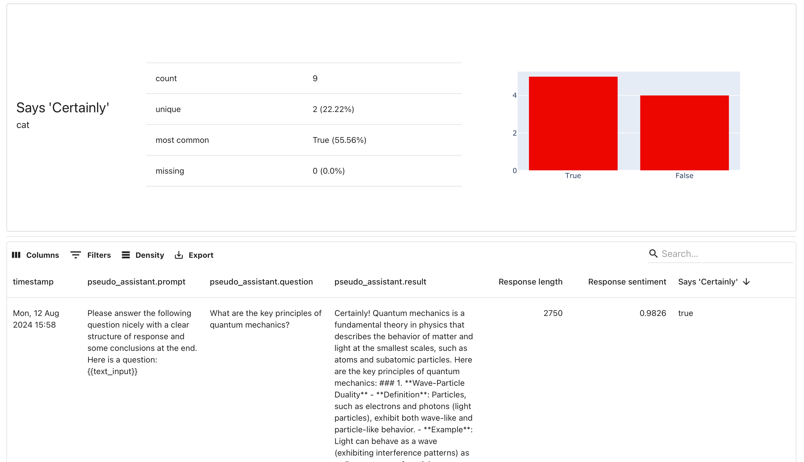

In this tutorial, you will learn how to set up tracing for an LLM application to collect inputs and outputs of your generative AI application and view the collected traces in Evidently Cloud. You can later run evaluations on the created datasets. 

You will use the following tools:
* **Tracely**: An open-source library based on OpenTelemetry to track events in your LLM application.
* **Evidently**: An open-source library to run LLM evaluations and interact with Evidently Cloud. 
* **Evidently Cloud**: A web platform to view traces and run evaluations.
* **OpenAI**: Used to simulate an LLM application.

You will go through the following steps:
* Install libraries 
* Set up and initialize tracing
* Create a simple question-answer LLM function
* Collect and send traces to Evidently Cloud 
* (Optional) Download the resulting dataset to run local evals

To complete the tutorial, use the provided code snippets or run a sample notebook.

Jupyter notebook:


Or click to [open in Colab](https://colab.research.google.com/github/evidentlyai/evidently/blob/main/examples/sample_notebooks/llm_tracing_tutorial.ipynb).

If you're having problems or getting stuck, reach out on [Discord](https://discord.com/invite/xZjKRaNp8b).
  
## 1. Installation
Install the necessary libraries:

```python
pip install evidently 
pip install tracely 
pip install openai
```

Import the required modules:

```python
import pandas as pd
import openai
from tracely import init_tracing
from tracely import trace_event
```

**Optional**. To load the traced dataset back to Python and run evals.

```python
from evidently.ui.workspace.cloud import CloudWorkspace
from evidently.report import Report
from evidently.metric_preset import TextEvals
from evidently.descriptors import *

```

# 2. Get the API keys

Obtain your API keys from Evidently Cloud and OpenAI.

* **Evidently Cloud**: Create an account, set up an Organization and Team. Get the API key from the [Token page](https://app.evidently.cloud/token). (Check the [step by step instructions](../installation/cloud_account.md) if you need help).
* **OpenAI:**  Get your API key from OpenAI. ([Token page](https://platform.openai.com/api-keys)).

Set your API keys:
```python
openai_api_key = "YOUR_OPEN_AI_API_KEY" 
my_token = "YOUR_EVIDENTLY_TOKEN"
```

It is recommended to pass the key as an environment variable. [See Open AI docs](https://help.openai.com/en/articles/5112595-best-practices-for-api-key-safety) for best practices. 

# 3. Configure tracing

Set up configuration details:
* The `address` is the destination backend to store collected traces. In this case, it is Evidently Cloud.
* `Project_id` is the identification of the Evidently Project. Go to the [Projects page](https://app.evidently.cloud/), enter the selected Project and copy its ID.
* `Dataset_name` helps identify the resulting Tracing dataset. All data with the same ID would be grouped into single dataset.

```python
address="https://app.evidently.cloud/"
project_id="YOUR_PROJECT_ID"
dataset_name="YOUR_TRACING_DATASET_NAME"
```

Initialize tracing:
```python
init_tracing(
 address=address,
 api_key=my_token,
 project_id=project_id,
 export_name=dataset_name
 )
```

# 4. Trace a simple LLM app 

You will now create a simple function that sends a list of questions to the LLM and gets the responses.

Initialize the OpenAI client with the API key:

```python
client = openai.OpenAI(api_key=openai_api_key)
```

Define the list of questions to answer:

```python
question_list = [
   "What are the main differences between climate change and global warming?",
   "What are the key principles of quantum mechanics?",
   "Can you explain the theory of relativity in simple terms?",
   "How do vaccines work?",
   "What is blockchain technology and how does it work?",
   "What are the potential benefits and risks of artificial intelligence?",
   "What are the distinguishing features of Baroque art?",
   "What are some effective ways to manage stress?",
   "What is the difference between stocks and bonds?",
   "Can you explain the concept of cryptocurrency and how it works?",

]
```

Create a template for the questions you will pass to the LLM.

```python
question_prompt = """
Please answer the following question nicely with a clear structure of response and some conclusions at the end.
Here is a question: {{text_input}}
"""
```

Use the `@trace_event()` decorator from `Tracely` to trace the execution of the function. This captures input arguments and outputs, sending the trace data to Evidently Cloud. 

```python
@trace_event()
def pseudo_assistant(prompt, question):
 model = "gpt-4o-mini"
 system_prompt = "You are a nice and helpful assistant "
 user_prompt = prompt.replace("{{text_input}}", question)

 choices = client.chat.completions.create(
 model=model,
 messages=[
 {"role": "system", "content": system_prompt},
 {"role": "user", "content": user_prompt},
 ]
 )

 response = choices.choices[0].message.content

 return response
```

Loop through the list of questions and call the traced function `pseudo_assistant` to get responses while `Tracely` captures all relevant data.

```python
for question in question_list:
 pseudo_assistant(prompt=question_prompt, question=question)
```

# 5. View traces
Go to the Evidently Cloud, navigate to the datasets in the left menu, and open the traces you just sent. It might take a few moments until OpenAI processes all the inputs. 

You can now view, sort, export, and work with the traced dataset. You can run evaluations on this dataset both in the Cloud and locally.

 


# 6. Load the dataset 

**This is an optional step**. If you want to access your traced dataset locally, for example, to run evaluations, you can do that by loading your dataset from Evidently Cloud.

Connect to the Evidently Cloud workspace:

```python
ws = CloudWorkspace(token=my_token, url=address)
```

Specify the dataset ID. You can copy it from the dataset page in the UI.

```python
dataset_id = "YOUR_DATASET_ID"
```

Load the dataset to pandas:

```python
traced_data = ws.load_dataset(dataset_id = dataset_id)
```

Preview the dataset with `traced_data.head()`.


# 7. Run an evaluation 

You can run evaluations on this dataset using the Evidently Python library. You can generate the Reports to view them locally or send them to Evidently Cloud.
For example, let’s evaluate the length and sentiment of the responses, and whether they include the word "Certainly".

```python
project = ws.get_project(project_id)
```

Define the evaluations:

```python
evals_report = Report(
    metrics=[
        TextEvals(
            column_name="pseudo_assistant.result",
            descriptors=[
                TextLength(display_name="Response length"),
                Sentiment(display_name="Response sentiment"),
                IncludesWords(words_list=["certainly"], display_name="Says 'Certainly'"),
            ],
        ),
    ]
)
```

Run the Report on the `traced_data`:

```python
evals_report.run(reference_data=None, current_data=traced_data)
```

Send the results to Evidently Cloud:

```python
ws.add_report(project.id, evals_report, include_data=True)
```

To explore the evaluation results, go to Evidently Cloud, enter your Project and navigate to "Reports" in the left menu.

You can view and brows the results. For example, find the longest responses or all responses that say "Certainly".

 
 
To view the evals locally, run `evals_report` for the Report and `evals_report.datasets().current` for the Dataset with added scores. 

# What's next?

Check the complete [LLM evaluation tutorial](tutorial-llm.md) for more details: how to run other evaluation methods, including LLM as a judge, or test for specific conditions. 

Need help? Ask in our [Discord community](https://discord.com/invite/xZjKRaNp8b).
