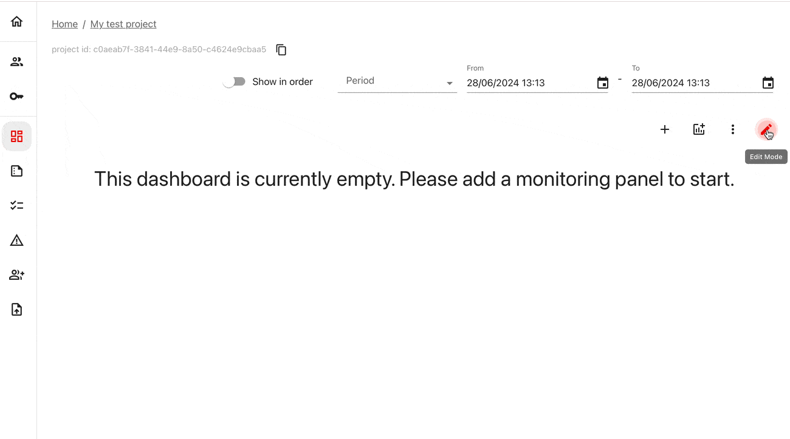

This quickstart shows how to run evaluations over text data: for example, inputs and outputs of your LLM system. 

You will run evaluations locally in any Python environment, and send results to Evidently Cloud for analysis and monitoring.


# 1. Set up Evidently Cloud 

Set up your Evidently Cloud workspace:
* **Sign up**. If you do not have one yet, sign up for an [Evidently Cloud account](https://app.evidently.cloud/signup).
* **Create an Organization**. When you log in the first time, create and name your Organization.
* **Create a Team**. Click **Teams** in the left menu. Create a Team, copy and save the Team ID. ([Team page](https://app.evidently.cloud/teams)).
* **Get your API token**. Click the **Key** icon in the left menu to go. Generate and save the token. ([Token page](https://app.evidently.cloud/token)).

You can now go to your Python environment.

# 2. Installation

Install the Evidently Python library. 

```python
!pip install evidently[llm]
```

Import the components to run the evals:

```python
import pandas as pd
from evidently.report import Report
from evidently.metric_preset import TextEvals
from evidently.descriptors import *
```

Import the components to connect with Evidently Cloud:

```python
from evidently.ui.workspace.cloud import CloudWorkspace
```

# 3. Create a Project

**Connect to Evidently Cloud**. Pass the Evidently API token you generated earlier: 

```python
ws = CloudWorkspace(token="YOUR_API_TOKEN", url="https://app.evidently.cloud")
```

**Create a Project**. Create a new evaluation Project inside your Team, adding your title and description:

```python
project = ws.create_project("My test project", team_id="YOUR_TEAM_ID")
project.description = "My project description"
project.save()
```

# 4. Import the toy dataset 

To run the evals, you must prepare your data as a pandas dataframe. It can contain multiple texts and metadata columns.

Let's create a toy dataframe as if we already have a set of "Questions" and "Answers".

```python
data = [
    ["What is the chemical symbol for gold?", "The chemical symbol for gold is Au."],
    ["What is the capital of Japan?", "The capital of Japan is Tokyo."],
    ["Tell me a joke.", "Why don't programmers like nature? It has too many bugs!"],
    ["What’s the freezing point of water?", "The freezing point of water is 0 degrees Celsius (32 degrees Fahrenheit)."],
    ["Who painted the Mona Lisa?", "Leonardo da Vinci painted the Mona Lisa."],
    ["What’s the fastest animal on land?", "The cheetah is the fastest land animal, capable of running up to 75 miles per hour."],
    ["Can you help me with my math homework?", "I'm sorry, but I can't assist with homework. You might want to consult your teacher for help."],
    ["How many states are there in the USA?", "There are 50 states in the USA."],
    ["What’s the primary function of the heart?", "The primary function of the heart is to pump blood throughout the body."],
    ["Can you tell me the latest stock market trends?", "I'm sorry, but I can't provide real-time stock market trends. You might want to check a financial news website or consult a financial advisor."]
]

# Columns
columns = ["question", "answer"]

# Creating the DataFrame
evaluation_dataset = pd.DataFrame(data, columns=columns)

```
**Note**: To collect the inputs and outputs from the live LLM app, you can use the open-source tracely library.

# 5. Run your first eval

Let's run a few basic evaluations for all "Answers". You will evaluate: 
* text sentiment (measured on a scale from -1 for negative to 1 for positive)
* text length (returns an absolute number of symbols)

```python
text_evals_report = Report(metrics=[
    TextEvals(column_name="Review_Text", descriptors=[
        Sentiment(),
        TextLength(),
        ]
    ),
])

text_evals_report.run(reference_data=None, current_data=reviews)
```

There are multiple evals to choose from. You can also create custom ones, including LLM-as-a-judge. We call the result of each such evaluation a `descriptor`. 

# 6. Send results to Evidently Cloud 

**Upload the Report**. Include the raw data so that you can analyze the scores row by row: 

```python
ws.add_report(project.id, text_evals_report, include_data=True)
```

**View the Report**. Go to the Evidently Cloud. Open your Project and head to the "Reports" in the left menu. ([Cloud home](https://app.evidently.cloud/)).


You will see the summary results with the distribution of length and sentiment for all evaluated texts, and the evaluated dataset with the added scores.

# 7. Get a dashboard 

Go to the "Dashboard" tab and enter the "Edit" mode. Add a new tab, and select the "Descriptors" template.

You'll see a set of panels that show Sentiment and Text Length with a single data point. As you log ongoing evaluation results, you can track trends and set up alerts. 



# Want to see more?

Check out a more in-depth tutorial to learn key workflows. It covers using LLM-as-a-judge, running conditional test suites, monitoring results over time, and more.


[Evidently LLM Tutorial](tutorial-llm.md). 

