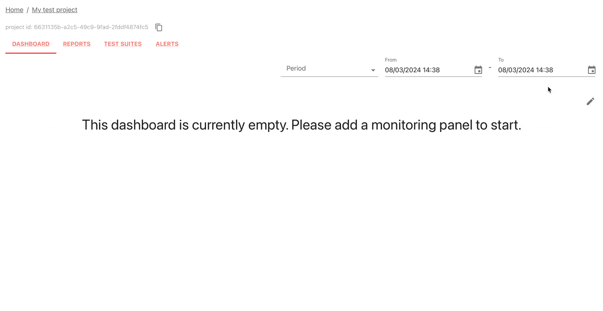

# 1. Set up Evidently Cloud 

Set up your Evidently Cloud workspace:
* **Sign up**. If you do not have one yet, sign up for a free [Evidently Cloud account](https://app.evidently.cloud/signup).
* **Create an Organization** when you log in for the first time. Get an ID of your organization. [Organizations page](https://app.evidently.cloud/organizations).
* **Get your API token**. Click the **Key** icon in the left menu. Generate and save the token. ([Token page](https://app.evidently.cloud/token)).

You can now go to your Python environment.

# 2. Install the Python library

Install the Evidently Python library. You can run this example in Colab or another Python environment.

```
!pip install evidently
```

Import the components to work with the dataset and send the metrics. 

```python
import pandas as pd
from sklearn import datasets

from evidently.ui.workspace.cloud import CloudWorkspace
from evidently.report import Report
from evidently.metric_preset import DataQualityPreset
```

# 3. Create a new Project 

Connect to Evidently Cloud using your access token.

```python
ws = CloudWorkspace(token="YOUR_TOKEN_HERE", url="https://app.evidently.cloud")
```

Create a new Project inside your Organization. Pass the `org_id`.

```python
project = ws.create_project("My test project", org_id="YOUR_ORG_ID")
project.description = "My project description"
project.save()
```

# 4. Import a toy dataset 

Import the demo "adult" dataset as a pandas DataFrame. 

```python
adult_data = datasets.fetch_openml(name="adult", version=2, as_frame="auto")
adult = adult_data.frame
```

# 5. Run an evaluation 

Run a Data Quality Report and upload it to the Project.

```
data_report = Report(
       metrics=[
           DataQualityPreset(),
       ],
    )
data_report.run(reference_data=None, current_data=adult)
ws.add_report(project.id, data_report)
```

We call each such evaluation result a `snapshot`.

# 6. View the Report

Visit Evidently Cloud, open your Project, and navigate to the "Report" tab to see the data stats.


# 7. Add a monitoring panel

Go to the "Dashboard" tab and enter the "Edit" mode. Add a new tab, and select the "Data quality" template.



You'll see a set of panels with a single data point. As you send more snapshots, you can track trends and set up alerts. You can choose from 100+ metrics and tests on data quality, data drift, ML quality (regression, classification, ranking, recsys), LLM quality and text data, and add your own metrics.

# Want to see more?

Check out a more in-depth tutorial to learn the key workflows: 


[Evidently Cloud Tutorial](../examples/tutorial-cloud.md). 


Working with LLMs? See a Quickstart:

[LLM Evaluation Quickstart](cloud_quickstart_llm.md). 


Need help? Ask in our [Discord community](https://discord.com/invite/xZjKRaNp8b).
