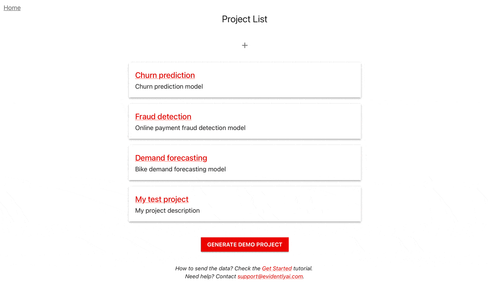
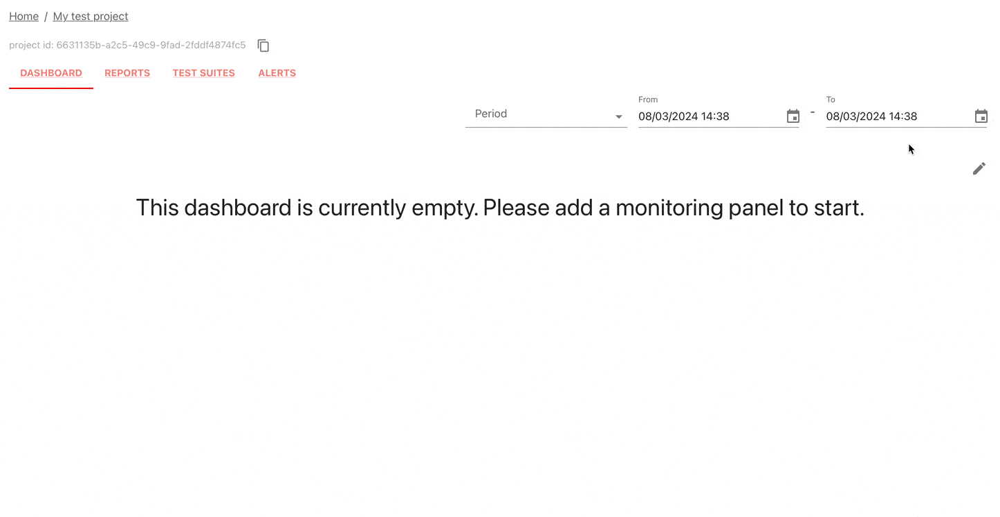

# 1. Create an account  

If not already, [sign up for an Evidently Cloud account](https://app.evidently.cloud/signup).

# 2. Get an access token

Click your username, select "personal token," generate and save the token.

# 3. Install the Python library

Install the Evidently Python library.

```
$ pip install evidently
```

Import the components to work with the dataset and send the metrics. 

```python
import pandas as pd
from sklearn import datasets

from evidently.ui.workspace.cloud import CloudWorkspace
from evidently.report import Report
from evidently.metric_preset import DataQualityPreset
```

# 4. Create a new Project 

Connect to Evidently Cloud using your access token and create a Project.

```python
ws = CloudWorkspace(token="YOUR_TOKEN_HERE", url="https://app.evidently.cloud")

project = ws.create_project("My test project")
project.description = "My project description"
project.save()
```

# 5. Collect metrics

Import the demo "adult" dataset as a pandas DataFrame. 

```python
adult_data = datasets.fetch_openml(name="adult", version=2, as_frame="auto")
adult = adult_data.frame
```

Run a Data Quality Report and upload it to the Project.

```
data_report = Report(
       metrics=[
           DataQualityPreset(),
       ],
    )
data_report.run(reference_data=None, current_data=adult)
ws.add_report(project.id, data_report)
```

We call each such evaluation a `snapshot`.

# 7. View the Report

Visit Evidently Cloud, open your Project, and navigate to the "Report" tab to see the data stats.



# 8. Add a monitoring panel

Go to the "Dashboard" tab and enter the "Edit" mode. Add a new tab, and select the "Data quality" template.



You'll see a set of panels with a single data point. As you send more snapshots, you can track trends and set up alerts. You can choose from 100+ metrics and tests and add yours.

# Want to see more?

Check out a more in-depth tutorial to learn the key workflows and architecture 


[Evidently Cloud Tutoriall](tutorial-cloud.md). 

