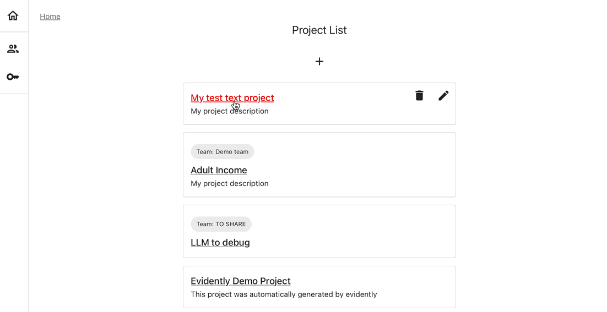

You can run this example in Colab or any Python environment.

# 1. Installation

Install the Evidently Python library. 

```python
!pip install evidently[llm]
```

Import the necessary components:

```python
import pandas as pd
from sklearn import datasets
from evidently.report import Report
from evidently.metric_preset import TextEvals
from evidently.descriptors import *
```

**Optional**. Import the components to send evaluation results to Evidently Cloud:

```python
from evidently.ui.workspace.cloud import CloudWorkspace
```

# 2. Import the toy dataset 

Import a toy dataset with e-commerce reviews. It contains a column with "Review_Text". You will take 100 rows to analyze.

```python
reviews_data = datasets.fetch_openml(
    name='Womens-E-Commerce-Clothing-Reviews', 
    version=2, as_frame='auto')
reviews = reviews_data.frame[:100]
```

# 3. Run your first eval

Run an evaluation for all texts in the "Review_Text" column in the dataframe. You will run a couple basic checks: 
* text sentiment (scale -1 for negative to 1 for positive)
* text length (returns an absolute number of symbols)

We call the result of each such evaluation a `descriptor`.

```python
text_evals_report = Report(metrics=[
    TextEvals(column_name="Review_Text", descriptors=[
        Sentiment(),
        TextLength(),
        ]
    ),
])

text_evals_report.run(reference_data=None, current_data=reviews)
```

There are 20+ built-in evals to choose from. You can also create custom ones, including LLM-as-a-judge. 

View a Report in Python:

```
text_evals_report
```

You will see the summary results: the distribution of length and sentiment for all evaluated texts.  

# 4. Send results to Evidently Cloud 

To record and monitor evaluations over time, send them to Evidently Cloud. 
* **Sign up**. Create an [Evidently Cloud account](https://app.evidently.cloud/signup) and your Organization.
* **Add a Team**. Click **Teams** in the left menu. Create a Team, copy and save the Team ID. ([Team page](https://app.evidently.cloud/teams)).
* **Get your API token**. Click the **Key** icon in the left menu to go. Generate and save the token. ([Token page](https://app.evidently.cloud/token)).
* **Connect to Evidently Cloud**. Pass your API key to connect from your Python environment. 

```python
ws = CloudWorkspace(token="YOUR_API_TOKEN", url="https://app.evidently.cloud")
```
* **Create a Project**. Create a new Project inside your Team, adding your title and description:

```python
project = ws.create_project("My test project", team_id="YOUR_TEAM_ID")
project.description = "My project description"
project.save()
```

* **Upload the Report to the Project**. Send the evaluation results: 

```python
ws.add_report(project.id, text_evals_report)
```

* **View the Report**, Go to the Evidently Cloud. Open your Project and head to the "Reports" in the left menu. ([Cloud home](https://app.evidently.cloud/)).



# 5. Get a dashboard 

Go to the "Dashboard" tab and enter the "Edit" mode. Add a new tab, and select the "Descriptors" template.

You'll see a set of panels that show Sentiment and Text Length with a single data point. As you log ongoing evaluation results, you can track trends and set up alerts. 

# Want to see more?

Check out a more in-depth tutorial to learn key workflows. It covers using LLM-as-a-judge, running conditional test suites, monitoring results over time and more.


[Evidently LLM Tutorial](tutorial-llm.md). 

