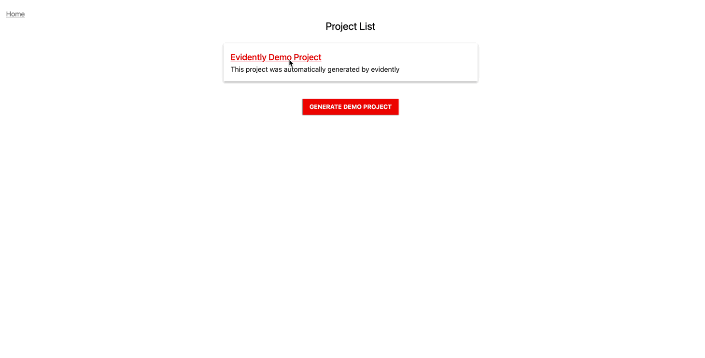
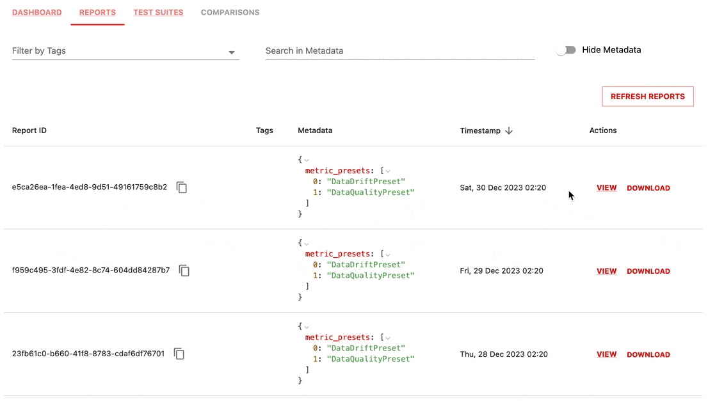
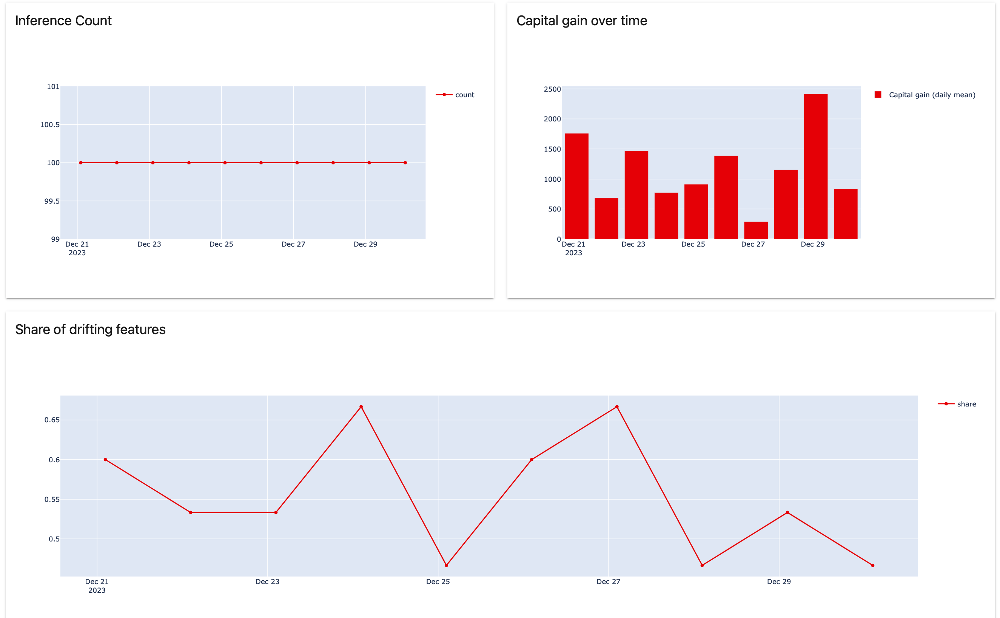
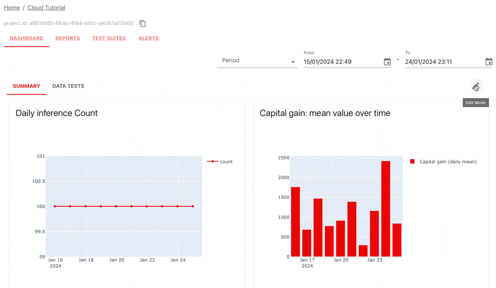
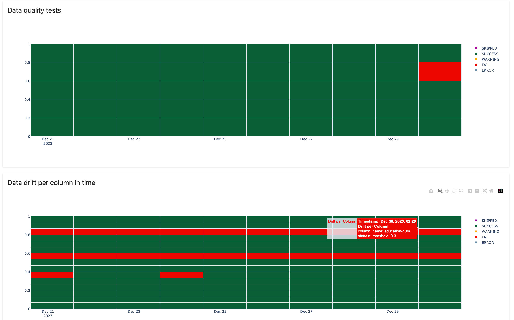
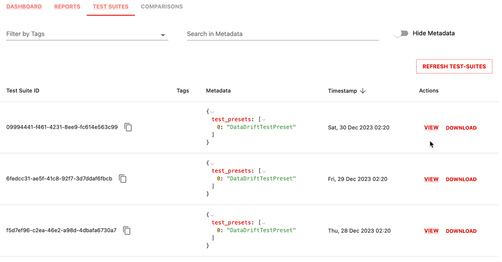
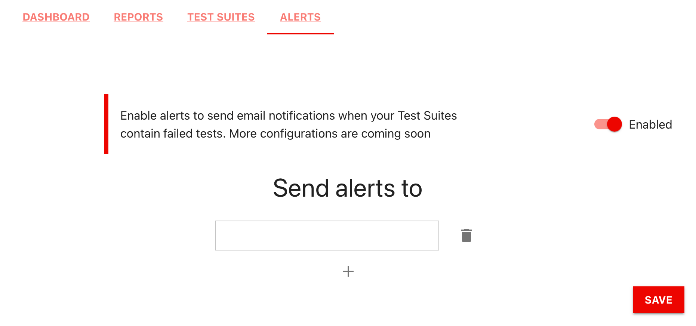

In this tutorial, you will monitor a toy ML model using Evidently Cloud. 

It will take 1 minute to launch a demo dashboard and 10 minutes to complete the tutorial for a new dataset. You must have basic knowledge of Python to work with Evidently Cloud using the API. 

# Part 1. Demo dashboard

## 1. Create an account

Evidently Cloud is in private beta. Once you get the registration link from us, create your account and confirm the email.


**Can I try Evidently Cloud?** To request a free trial, fill out [this form](https://www.evidentlyai.com/cloud-signup).


<details>

<summary>What can I do with Evidently Cloud?</summary>

In Evidently Cloud, you can:

* Monitor data quality, feature, and prediction drift over time.
* Track ML model quality for classification, regression, ranking, and recommendations. This includes assessing models in champion/challenger and shadow mode.
* Monitor changes in text data (e.g., sentiment, drift, trigger words) for NLP and LLM models.
* Monitor embeddings drift.
* Track the results of test suites that include multiple evaluations.

Evidently computes and visualizes 100+ pre-built metrics and tests. You can customize them or add your metrics.

You can conduct evaluations in batch mode, e.g., hourly, daily, weekly, or on demand. You can also monitor data directly from a live ML service for near real-time insights.

Evidently Cloud uses the open-source [Evidently Python library](https://github.com/evidentlyai/evidently) for tests and metric computation. All evaluations are open-source.
</details>

## 2. View a demo project 

After you log in, you will see an empty dashboard. Click on "Generate Demo Project" to see a pre-built example dashboard.


It will take a few moments to populate the project. You can then see a sample dashboard wih different tabs that show data quality, data drift and model quality for a regression model that forecasts bike demand.

You can customize your choice of panels - this is just an example.



You can also open the "Reports" and "Test Suites" tabs to see the individual `snapshots` that serve as a data source for the monitoring panels and help explore the results of the individual daily checks.

Now, let's see how you can create something similar for your project!

# Part 2. Add a new project

You will now create a dashboard to monitor data quality and drift, using a toy dataset to imitate a production ML model.

You will go through the following steps:
* Prepare the tabular dataset.
* Compute the data quality and data drift Reports in daily batches.
* Send them to the Evidently Cloud.
* Create dashboards to visualize metrics in time.
* (Optional) Run Test Suites to perform conditional tests.

This shows a simple batch workflow. You can later explore more advanced workflows, like using the collector for near real-time monitoring, or monitoring NLP models.


<details>

<summary>How does the data collection work?</summary>

Evidently Cloud does not store raw data or model inferences. Instead, you will use the Evidently open-source library to compute JSON `snapshots` locally and send them to the Evidently Cloud.

Each snapshot contains data statistics, metrics, and test results for a specific period. You can choose which evaluations to compute and how often. This hybrid architecture helps avoid duplicating your inference data and preserves raw data privacy. Evidently Cloud stores only aggregates and metadata.  

There are two ways to send the snapshots:
* **Use the Evidently Python library.** You can compute snapshots in any Python environment, for example, as a regular batch job.
* **Deploy a collector service**. You can alternatively deploy and configure an Evidently collector service. Then, you must send inferences from your ML service to the collector. It will manage data batching, compute snapshots, and send them to the Evidently Cloud.

</details>

## 1. Installation and imports

Evidently is available as a PyPi package. Run the `pip install evidently` command to install it:

```python
pip install evidently
```

You can also install Evidently from Conda:
```python
conda install -c conda-forge evidently
```

You must import several components to complete the tutorial.

Import the components to prepare the toy data:

```python
import pandas as pd
import datetime
from sklearn import datasets
```

Import the components to compute and send the snapshots:

```python
from evidently.ui.workspace.cloud import CloudWorkspace

from evidently.report import Report
from evidently.metric_preset import DataQualityPreset
from evidently.metric_preset import DataDriftPreset
from evidently.metrics import *
from evidently.test_suite import TestSuite
from evidently.tests import *
from evidently.test_preset import DataDriftTestPreset
from evidently.tests.base_test import TestResult, TestStatus
```

Import the components to create the monitoring panels. You only need this to design the monitoring panels via API, for example, during the initial setup.

```python
from evidently import metrics
from evidently.ui.dashboards import DashboardPanelPlot
from evidently.ui.dashboards import DashboardPanelTestSuite
from evidently.ui.dashboards import PanelValue
from evidently.ui.dashboards import PlotType
from evidently.ui.dashboards import ReportFilter
from evidently.ui.dashboards import TestFilter
from evidently.ui.dashboards import TestSuitePanelType
from evidently.renderers.html_widgets import WidgetSize
```

## 2. Prepare toy data

You will use the `adult` dataset from OpenML.
* Import it as a pandas `DataFrame`.
* Split it into `adult_ref` (reference dataset) and `adult_prod` (production data). For demo purposes, we base the split on the "education" feature. Production data will include persons with specific education levels not seen in the reference. We do it to introduce some artificial drift.

```python
adult_data = datasets.fetch_openml(name="adult", version=2, as_frame="auto")
adult = adult_data.frame
adult_ref = adult[~adult.education.isin(["Some-college", "HS-grad", "Bachelors"])]
adult_prod = adult[adult.education.isin(["Some-college", "HS-grad", "Bachelors"])]
```


**What is a reference dataset?** Reference dataset is a baseline for distribution comparison when you compute data drift. In this case, the `reference` is required. You can use the data from model validation or a past production batch. You can also use the reference dataset to generate the test conditions quickly. For example, when testing if column values stay within the range. In this case, the reference is optional: you can also specify the test conditions manually.


## 3. Create a Project

Now, let's start monitoring!

**Get the API token**. To send snapshots to Evidently Cloud, you need an access token. Click your username in the top right corner of the web app, select "personal token," and click "generate token." Copy and paste it into a temporary file as it won't be visible once you leave the page.

To connect to the Evidently Cloud workspace, run:

```python
ws = CloudWorkspace(
token="YOUR_TOKEN_HERE",
url="https://app.evidently.cloud")
```

Use the `create_project` command to create a new Project. Add a name and description. 
```python
project = ws.create_project("My project name")
project.description = "My project description"
```


**What is a Project?** A Project is any machine learning model, dataset, and data stream you wish to monitor. You can also group multiple ML models in a single Project, using tags to distinguish between them. For example, you can log performance for shadow and production models or multiple models of the same type (e.g., models for different locations) together.


<details>

<summary>(Optional) Add a Project to a Team</summary>

You can also associate a Project with a particular Team, such as a "Marketing team" for related ML models. Click on you username in the top right corner in the web app, and select "Teams." After creating a team, you can copy the team ID from the page URL. You can then invite other users to this team, so that they view the relevant dashboard.

To add project to a team, reference the `team_id`:
```python
#project = ws.create_project("Add your project name", team_id="TEAM ID")
#project.description = "Add your project description"
```
</details>

## 4. Send snapshots

To capture data and model metrics in JSON `snapshots`, you must create a Report or a Test Suite object and list the selected metrics or tests. You can pass optional parameters, such as the data drift detection method.


**New to Evidently?** Check out this [ Quickstart for Tests and Reports](https://docs.evidentlyai.com/get-started/tutorial). A `snapshot` is simply a "JSON version" of a Report or Test Suite. You can preview any snapshot using the open-source Evidently Python library. 


Let us define the contents of Reports with data quality and data drift metrics. To imitate production use, create a script:

```python
def create_report(i: int):
    data_report = Report(
        metrics=[
            DataDriftPreset(stattest='psi'),
            DataQualityPreset(),
        ],
        timestamp=datetime.datetime.now() + datetime.timedelta(days=i),
    )

    data_report.run(reference_data=adult_ref, current_data=adult_prod.iloc[100 * i : 100 * (i + 1), :])
    return data_report
```

To send snapshots to the Evidently Cloud, use the `add_report` method. You can set the *i* to 10 as if you generate a Report per day for 10 days.

```python
for i in range(0, 10):
        report = create_report(i=i)
        ws.add_report(project.id, report)
```

Once you run this script, you will compute 10 snapshots and send them to the Evidently Cloud.

<details>

<summary>What happens in this code?</summary>

* You create a `Report` with two preset metric combinations. The **[Data Quality](https://docs.evidentlyai.com/presets/data-quality)** preset includes summary statistics like nulls, min-max, etc. The **[Data Drift](https://docs.evidentlyai.com/presets/data-drift)** preset compares new data to reference, using the Population Stability Index (PSI) test ([optional parameter](https://docs.evidentlyai.com/user-guide/customization/options-for-statistical-tests)).
* You add a **timestamp** to each `Report`: `datetime.now` for the first data batch, and the next day's date for subsequent batches.
* You compute each `Report` changing the `current_data` and keeping the `reference_data` static. For current data, you pass 100 new rows for `i` days to simulate batch inference.
* The `add_report` method computes the Report in the JSON snapshot format and sends it to the workspace `ws` (which is Evidently Cloud).

</details>

<details>

<summary>How to modify it for your data later?</summary>

* **Run `Reports` sequentially**. In production, simply pass the `current` data for each run. Evidently will automatically assign the `datetime.now` timestamp (or you can set a custom one). Learn more about [timestamps](https://docs.evidentlyai.com/user-guide/monitoring/snapshots).
* **Choose evaluations**. Pick any available Metrics to include in Report - data quality, integrity, drift (tabular, text, embeddings), or model quality (classification, regression, ranking, recommendations). Explore available [Presets](https://docs.evidentlyai.com/presets), [Metrics](https://docs.evidentlyai.com/reference/all-metrics), and [Tests](https://docs.evidentlyai.com/reference/all-tests).
* **Use Column Mapping**. You might need a [ColumnMapping object](https://docs.evidentlyai.com/user-guide/input-data/column-mapping) to define data structure: like pointing to columns with encoded categorical features, prediction or target column, etc.
* **Include Tags**. Optionally, add metadata or tags to your snapshot. For example, you can indicate whether a Report refers to a shadow or production model. Learn more about [tags](https://docs.evidentlyai.com/user-guide/monitoring/snapshots).

</details>

## 5. View Reports in Evidently Cloud

You can now view the snapshots in the Evidently Cloud web app! Navigate to the "Reports" section in the UI. You can click "view" to see each daily Report. You can even download them as an HTML or JSON.



However, each such Report is static. To see trends over time, you need a monitoring dashboard!

## 6. Add monitoring panels 

Let's add the monitoring panels. You can:
* Visualize any metrics captured within the snapshots over time.
* Choose between panel types, including Line Plot, Bar Plot, Histogram, etc.
* Create multiple panels and organize them using tabs.

You can create the tabs and panels from the user interface or do it programmatically. 

Let's first explore the API route. We will keep it simple and add three panels to a single "Summary" tab. Say, you want track:
* the number of rows (inferences)
* the share of drifting features, and
* the mean value of a specific column (e.g. named "capital-gain" ).

Use the `add_panel` method to add panels to a dashboard. You can specify the panel name, legend, plot type, tab, etc. After implementing the changes, save the configuration with `project.save()`. Here is an example:

```python
project.dashboard.add_panel(
        DashboardPanelPlot(
            title="Daily inference Count",
            filter=ReportFilter(metadata_values={}, tag_values=[]),
            values=[
            	PanelValue(
                	metric_id="DatasetSummaryMetric",
                	field_path=metrics.DatasetSummaryMetric.fields.current.number_of_rows,
                	legend="count",
            	),
            ],
            plot_type=PlotType.LINE,
            size=WidgetSize.HALF,
        ),
        tab="Summary"
    )
project.dashboard.add_panel(
        DashboardPanelPlot(
            title="Capital gain: mean value over time",
            filter=ReportFilter(metadata_values={}, tag_values=[]),
            values=[
                PanelValue(
                    metric_id="ColumnSummaryMetric",
                    field_path="current_characteristics.mean",
                    metric_args={"column_name.name": "capital-gain"},
                    legend="Capital gain (daily mean)",
                ),
            ],
            plot_type=PlotType.BAR,
            size=WidgetSize.HALF,
        ),
        tab="Summary"
    )
project.dashboard.add_panel(
        DashboardPanelPlot(
            title="Share of drifting features (PSI > 0.1)",
            filter=ReportFilter(metadata_values={}, tag_values=[]),
            values=[
                PanelValue(
                	metric_id="DatasetDriftMetric",
                	field_path="share_of_drifted_columns",
                	legend="share",
                ),
            ],
            plot_type=PlotType.LINE,
            size=WidgetSize.FULL,
        ),
        tab="Summary"
)
project.save()
```


**How to add other panels?** Check the detailed instructions on how to [design different monitoring panels](https://docs.evidentlyai.com/user-guide/monitoring/design_dashboard) programmatically. You can also add text-only panels and counters. 


## 7. View and edit the dashboard

Return to the Evidently Cloud web app to view the dashboards you created. Refresh the page if necessary.

You will now see monitoring panels that show metric values over time (each pulled from a corresponding snapshot).



You can also add or delete tabs and individual panels from the UI. To make changes, click on the "edit mode" button in the top right corner of the dashboard. 

To add a new panel from the UI, choose the "add panel" button as shown below. Note that you can only add values from the metrics captured inside the snapshots - in our example, those related to data drift and data quality. (For example, you cannot yet add values related to model quality).




**Coming soon**: We are working on adding templates and further simplifying adding new panels from the UI.


## 8. (Optional) Monitor Test results

Earlier, you used a `Report` to compute metrics. Another option is a `Test Suite`. Each Test checks a specific condition and returns:
* The metric value (e.g., share of nulls).
* The condition (e.g., should be less than 10%).
* The result (e.g., "pass" or "fail").

You can perform column- or dataset-level tests.


**What Tests are available?** You can choose from [50+ Tests](https://docs.evidentlyai.com/reference/all-tests) and learn how to create [custom Test Suites](https://docs.evidentlyai.com/user-guide/tests-and-reports/custom-test-suite).


Let's generate a Test Suite that includes the following:
* **A Data Drift Test Preset**. It contains individual column drift checks. We do not select a data drift method this time, so the [defaults](https://docs.evidentlyai.com/reference/data-drift-algorithm) (Jensen Shennen divergence and Wasserstein distance) apply. However, we set a custom drift detection threshold at 0.3. If the drift score is above 0.3, column drift is detected.
* **Several quality tests**. We picked a few individual Tests related to duplicates, constants, and missing values. You can pick any individual Tests available in the library and set conditions using parameters like `eq` (equal), `lte` (less than or equal), etc. If no condition is set, Evidently will generate them based on the reference data and heuristics. 

Here is the script that follows the same logic to imitate batch inference:

```python
def create_tests(i: int):
    drift_tests = TestSuite(
        tests=[
            DataDriftTestPreset(stattest_threshold=0.3),
            TestShareOfMissingValues(lte=0.05),
            TestNumberOfConstantColumns(eq=0),
            TestNumberOfEmptyRows(eq=0),
            TestNumberOfEmptyColumns(eq=0),
            TestNumberOfDuplicatedColumns(eq=0)
        ],
        timestamp=datetime.datetime.now() + datetime.timedelta(days=i),
    )

    drift_tests.run(reference_data=adult_ref, current_data=adult_prod.iloc[100 * i : 100 * (i + 1), :])
    return drift_tests
```

To send Test Suites to Evidently cloud, use the `add_test_suite` method.

```python
for i in range(0, 10):
        test_suite = create_tests(i=i)
        ws.add_test_suite(project.id, test_suite)
```

To visualize the results, add a new dashboard tab ("Data tests") and a couple of Test-specific monitoring panels. One will display all column drift checks over time, and another will group the selected data quality checks (missing values, empty rows, columns, duplicates, constant columns).

```python
project.dashboard.add_panel(
        DashboardPanelTestSuite(
            title="Data quality tests",
            test_filters=[
                TestFilter(test_id="TestNumberOfConstantColumns", test_args={}),
                TestFilter(test_id="TestShareOfMissingValues", test_args={}),
                TestFilter(test_id="TestNumberOfEmptyRows", test_args={}),
                TestFilter(test_id="TestNumberOfEmptyColumns", test_args={}),
                TestFilter(test_id="TestNumberOfDuplicatedColumns", test_args={}),
            ],
            filter=ReportFilter(metadata_values={}, tag_values=[], include_test_suites=True),
            size=WidgetSize.FULL,
            panel_type=TestSuitePanelType.DETAILED,
            time_agg="1D",
        ),
        tab="Data Tests"
)
project.dashboard.add_panel(
        DashboardPanelTestSuite(
            title="Data drift per column in time",
            test_filters=[
                TestFilter(test_id="TestColumnDrift", test_args={}),
            ],
            filter=ReportFilter(metadata_values={}, tag_values=[], include_test_suites=True),
            size=WidgetSize.FULL,
            panel_type=TestSuitePanelType.DETAILED,
            time_agg="1D",
        ),
        tab="Data Tests"
)
project.save()
```

You can now view the dashboards with test results over time in the UI.



You can also easily explore individual failed Tests in a Test Suite:



<details>

<summary>When to use Test Suites?</summary>

Examples include:

* **Monitoring compliance with multiple conditions at once**. For example, if you track min-max ranges and null percentages for each column. To reduce alert fatigue, you can monitor aggregate results like the number of failed data quality tests over time.
* **Using test results outside Evidently Cloud.** For instance, if tests fail, you can execute a conditional action in your pipeline (e.g., stop pipeline, avoid promoting a new model, etc.), besides sending snapshots to Evidently Cloud.
* **Any batch testing scenarios.** Whenever you want to explicitly compare e.g. new model vs. old, model or data quality against expected levels, and record the test results over time.

</details>

<details>

<summary>Should I use Reports or Test Suites?</summary>

You can choose between Reports or Test Suites or use both in combination.

* You can create identical **metric monitoring panels** from either source. For example, you can pull the data on the share of missing values from any Report or Test Suite that captures this information.
* However, **individual Reports and Test Suites** have distinct looks. Reports offer more explorative visuals, while Test Suites clearly summarize each individual test result. You might prefer one to another.
* If you want to **track the failed tests** (not just the values of the underlying metrics) on the monitoring dashboard, you must use Test Suites.
* If you have **a batch testing scenario** and you can define your success conditions upfront, consider using Test Suites.

</details>

You can also enable email Alerts. Navigate to the "Alerts" tab, toggle it on, and add the email for alerting. Currently, the alerts are tied to the failed Tests in a Test Suite. If any of the Tests fail, Evidently will set an alert.



If you want to allow some Tests to fail without generating an alert, you can set the `is_critical` flag to False.

```
tests = TestSuite(tests=[
    TestColumnAllConstantValues(column_name='education', is_critical=False),
])
```


**Coming soon**: More granular alerting conditions and alternative alerting channels (e.g. Slack).



## 9. (Optional) Work with existing Project

You can continue using Evidently Cloud API to make changes to an existing Project or send new snapshots.

**Connect to an existing Project**. Use the `get_project` method. You can copy the Project ID directly from the UI: it appears above the monitoring dashboard.

```python
project = ws.get_project("PROJECT_ID")
```

**Send new snapshots**. For example, to add a new report with data summaries for the `cur` data batch (without reference), with an automatically assigned current timestamp:

```python
data_report = Report(
       metrics=[
           DataQualityPreset(),
       ],
    )
data_report.run(reference_data=None, current_data=cur)
ws.add_report(project.id, data_report)
```

**Add new monitoring panels and tabs**. Use the `add_panel` method as shown above, and run `project.save()` to update the config after you make the changes. New panels and tabs will be added to existing ones.

**Clean up panels**. To delete the existing monitoring panels (**not** the snapshots):

```python
project.dashboard.panels = []
project.save()
```

**[DANGER]. Delete the project.** To delete the project and all the data.

```python
# ws.delete_project("PROJECT ID")
```

# What's next?

* **Read the monitoring guide**. To go through all the steps in more detail, refer to the complete [Monitoring User Guide](https://docs.evidentlyai.com/user-guide/monitoring/monitoring_overview) in the docs.
* **Browse available evaluations**. You can check all available [Presets](https://docs.evidentlyai.com/presets), [Metrics](https://docs.evidentlyai.com/reference/all-metrics), and [Tests](https://docs.evidentlyai.com/reference/all-tests). A good next step is to explore model quality metrics you can compute once the ground truth is available.
* **Build a batch workflow**. To add monitoring for an existing ML model, you must collect the data from your production pipelines or run monitoring jobs over inferences stored in a data warehouse. For example, you can use a tool like Airflow or set up a script to compute snapshots on a regular cadence.
* **Explore real-time monitoring**. If you have a live ML service, you can run an [Evidently collector service](https://docs.evidentlyai.com/user-guide/monitoring/collector_service) and send the predictions for near real-time monitoring.

Need any help? Ask in our [Discord community](https://discord.com/invite/xZjKRaNp8b).
