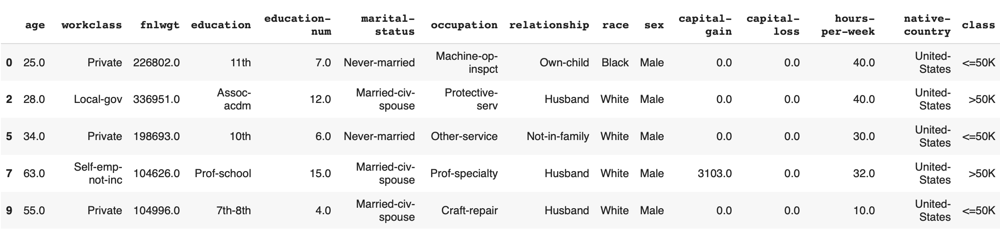

In this tutorial, you'll set up production data and ML monitoring for a toy ML model. You'll run evaluations in Python and access a web dashboard in Evidently Cloud.

The tutorial consists of three parts:
* Overview of the architecture (2 min).
* Launching a pre-built demo dashboard (2-3 min).
* Setting up monitoring for a new toy dataset (10 min).

You'll need basic knowledge of Python. Once you connect the data, you can continue working in the web interface.


**Want a very simple example first?** Check this [Evidently Cloud "Hello World"](quickstart-cloud.md) instead.


Video version:


# How it all works

Evidently Cloud helps you monitor the performance of ML-powered systems in production: from tracking the quality of incoming data to the accuracy of model predictions.  

<details>

<summary>What can you evaluate with Evidently Cloud?</summary>

In Evidently Cloud, you can:
* Monitor tabular and text **data quality** in your production pipelines and services.
* Track **data and prediction drift** over time for text, tabular data and **embeddings**.
* Monitor **text data** (e.g., sentiment, drift, trigger words) for NLP and **LLM models**.
* Monitor **ML model quality** for classification, regression, ranking, and recommendations, including champion/challenger and shadow models and delayed ground truth.
* Track the results of **Test Suites** that bundle multiple evaluations.

Evidently supports over 100 pre-built Metrics and Tests. You can also add custom metrics.
</details>

The monitoring setup consists of two components:
* **Open-source Evidently Python library**. You perform evaluations in your environment. Each run produces a JSON `snapshot` with statistics, metrics, or test results for a specific period. You then send these `snapshots` to Evidently Cloud using an API key.
* **Evidently Cloud web app**. After sending the data, you can access it in the Evidently Cloud UI. You can view individual evaluation results, build dashboards with trends over time, and set up alerts to notify on issues.

You can run batch monitoring jobs (e.g., hourly, daily, weekly) or use Evidently Collector for near real-time checks. This tutorial shows a simple batch workflow. You can later explore alternative deployment architectures.



**Data security by design**. By default, Evidently Cloud does not store raw data or model inferences. Snapshots contain only data aggregates (e.g., histograms of data distributions, descriptive stats, etc.) and metadata with test results. This hybrid architecture helps avoid data duplication and preserves its privacy. 


# Demo dashboard

Let's quickly look at an example monitoring dashboard.

## 1. Create an account

If you do not have one yet, [create an Evidently Cloud account](https://app.evidently.cloud/signup).

## 2. View a demo project 

After logging in, click on "Generate Demo Project". It will create a Project for a toy regression model that forecasts bike demand. 


It'll take a few moments to populate the data. In the background, Evidently will run the code to generate Reports and Test Suites for 20 days. Once it's ready, open the Project to see a monitoring dashboard with multiple Tabs that show data quality, data drift, and model quality over time.


You can customize the choice of Panels and Tabs for your Project – this is just an example.

You can also see individual snapshots if you navigate to the "Reports" or "Test Suites" section using the left menu. They display the performance on a given day and act as a data source for the monitoring panels.

Now, let's see how you can create something similar for your dataset!

# Add a new Project

You'll use a toy dataset to mimic a production ML model. You'll follow these steps:
* Prepare a tabular dataset.
* Run data quality and data drift Reports in daily batches.
* Send them to Evidently Cloud.
* Get dashboards to track metrics over time.
* (Optional) Add custom monitoring panels.
* (Optional) Run Test Suites for continuous testing.

In this example, you'll track data quality and drift. ML monitoring often starts here because true labels for assessing model quality come with a delay. Until then, you can only monitor the incoming data and predictions. 

However, the core workflow tutorial covers works for any evaluation. You can later expand it to monitor ML model quality and text-based LLM models.

To complete the tutorial, use the provided code snippets or run a sample notebook.

Jupyter notebook:


Or click to [open in Colab](https://colab.research.google.com/github/evidentlyai/evidently/blob/main/examples/sample_notebooks/data_and_ml_monitoring_tutorial.ipynb).

## 1. Installation and imports

Evidently is available as a PyPi package. Run the command to install it:

```python
pip install evidently
```

You can also install Evidently from Conda:

```python
conda install -c conda-forge evidently
```

You'll need several components to complete the tutorial. Import the components to prepare the toy data:

```python
import pandas as pd
import datetime
from sklearn import datasets
```

Import the components to compute and send the snapshots:

```python
from evidently.ui.workspace.cloud import CloudWorkspace

from evidently.report import Report
from evidently.metric_preset import DataQualityPreset
from evidently.metric_preset import DataDriftPreset
from evidently.metrics import *
from evidently.test_suite import TestSuite
from evidently.tests import *
from evidently.test_preset import DataDriftTestPreset
from evidently.tests.base_test import TestResult, TestStatus
```

**Optional**. Import the components to design monitoring panels via API. This is entirely optional: you can also add the panels using the UI. 

```python
from evidently import metrics
from evidently.ui.dashboards import DashboardPanelPlot
from evidently.ui.dashboards import DashboardPanelTestSuite
from evidently.ui.dashboards import PanelValue
from evidently.ui.dashboards import PlotType
from evidently.ui.dashboards import ReportFilter
from evidently.ui.dashboards import TestFilter
from evidently.ui.dashboards import TestSuitePanelType
from evidently.renderers.html_widgets import WidgetSize
```

## 2. Prepare toy data

You'll use the `adult` dataset from OpenML. 
* Import it as a pandas `DataFrame`.
* Split it into two datasets: `adult_ref` (reference dataset) and `adult_prod` (current production data).
  
We'll base the split on the "education" feature to introduce some artificial drift for demo purposes. Current data will include people with education levels unseen in the reference dataset. Here's how you can do it:

```python
adult_data = datasets.fetch_openml(name="adult", version=2, as_frame="auto")
adult = adult_data.frame
adult_ref = adult[~adult.education.isin(["Some-college", "HS-grad", "Bachelors"])]
adult_prod = adult[adult.education.isin(["Some-college", "HS-grad", "Bachelors"])]
```


**What is a reference dataset?** You need one to evaluate distribution drift. Here, you compare the current data against a past period, like an earlier data batch. You must provide this reference to compute the distance between two datasets. A reference dataset is optional when you compute descriptive stats or model quality metrics.


Here is how the dataset looks. This could resemble a binary classification use case, with "class" being the prediction column.



## 3. Create a Project

Now, let's start monitoring!

**Get the API token**. To connect to Evidently Cloud, you'll need an access token. Use the "key" sign in the left menu to get to the token page, and click "generate token." Copy and paste it into a temporary file since it won't be visible once you leave the page.

To connect to the Evidently Cloud workspace, run:

```python
ws = CloudWorkspace(
token="YOUR_TOKEN_HERE",
url="https://app.evidently.cloud")
```

Now, you need to create a new Project. You can do this programmatically or in the UI. 



 
Click on the “plus” sign on the home page and type your Project name and description.


After creating a Project, click its name to open the Dashboard. Since there's no data yet, it will be empty. 

To send data to this Project, you'll need to connect to it from your Python environment using `get_project` method. You can find your Project ID above the monitoring dashboard.

```python
project = ws.get_project("PROJECT_ID")
```



 
Use the `create_project` command to create a new Project. Add a name and description. 

```python
project = ws.create_project("My project name")
project.description = "My project description"
project.save()
```





**What is a Project?** Projects help organize monitoring for different use cases. Each project has a shared dashboard and alerting. You can create a Project for a single ML model or dataset or put related models together. For example, you can group shadow and production models and use tags to distinguish them within the Project. 


## 4. Run first evaluation

To send snapshots to the Project, you must compute them using the Evidently Python library. Here's the process:
* Prepare the data batch to evaluate.
* Create a Report or Test Suite object. 
* Define metrics or tests to include.
* Pass optional parameters, like data drift detection method or test conditions.
* Compute and send the snapshot.


**What are Reports and Test Suites?** These are pre-built evaluations available in the open-source Evidently Python library. They cover 100+ checks for data quality, data drift, and model quality. You can check out the [open-source Evidently Tutorial](https://docs.evidentlyai.com/get-started/tutorial) for an introduction. A `snapshot` is a "JSON version" of a Report or Test Suite.  


Let’s start with data quality and drift checks using a preset metric combination. This helps observe how model inputs and outputs are changing. For each batch of data, you'll generate:
* **Data Quality Preset**. It captures stats like feature ranges and missing values.
* **Data Drift Preset**. This compares current and reference data distributions. You will use PSI (Population Stability Index) method, with a 0.3 threshold for significant drift. 

To create a single Report using the first 100 rows of our "production" data:

```python
data_report = Report(
        metrics=[
            DataDriftPreset(stattest='psi', stattest_threshold='0.3'),
            DataQualityPreset(),
        ],
    )

data_report.run(reference_data=adult_ref, current_data=adult_prod.iloc[0 : 100, :])
```


**Defining the current dataset.** To specify which dataset you're evaluating, you pass it as the `current_dataset` inside the `run` method. In our example, we used a slice function `adult_prod.iloc[0 : 100, :]` to select the first 100 rows from the `adult_prod` dataset. In practice, you can simply pass your data batch: `current_data=your_batch_name`.


To send this Report to the Evidently Cloud, use the `add_report` method. 

```python
ws.add_report(project.id, data_report)
```

You can now view the Report in the Evidently Cloud web app. Go to the "Reports" section via the left menu and click to open the first Report. You can also download it as an HTML or JSON.

## 5. Send multiple snapshots

For production use, you can run evaluations like this on a schedule – for example, daily, hourly, or weekly – each time passing a new batch of data. Once you have multiple snapshots in the Project, you can observe trends over time on a monitoring dashboard.

To simulate production use, let’s create a script to compute multiple Reports, taking 100 rows per "day":

```python
def create_report(i: int):
    data_report = Report(
        metrics=[
            DataDriftPreset(stattest='psi', stattest_threshold='0.3'),
            DataQualityPreset(),
        ],
        timestamp=datetime.datetime.now() + datetime.timedelta(days=i),
    )

    data_report.run(reference_data=adult_ref, current_data=adult_prod.iloc[100 * i : 100 * (i + 1), :])
    return data_report
```

You can set the loop variable i to 10 to generate and send Reports for 10 days.

```python
for i in range(0, 10):
        report = create_report(i=i)
        ws.add_report(project.id, report)
```

<details>

<summary>What happens in this code?</summary>

* You create a `Report` with two preset metric combinations. The **[Data Quality](https://docs.evidentlyai.com/presets/data-quality)** preset includes summary statistics like nulls, min-max, etc. The **[Data Drift](https://docs.evidentlyai.com/presets/data-drift)** preset compares new data to reference, using the Population Stability Index (PSI) test as an [optional parameter](https://docs.evidentlyai.com/user-guide/customization/options-for-statistical-tests).
* You add a **timestamp** to each `Report`: `datetime.now` for the first data batch, and the next day's date for subsequent batches. In real use, you can skip this step – the current timestamp will be automatically assigned. We do it for demo purposes.
* You compute each `Report` changing the `current_data` and keeping the `reference_data` static. For current data, you pass 100 new rows for `i` days to simulate batch inference.
* The `add_report` method computes the Report in the JSON snapshot format and sends it to the workspace `ws` (which is Evidently Cloud).

We use the script only to imitate multiple batch checks. In real use, you should create Reports sequentially, passing the true `current_data` for each run. 

</details>

Once you run the script, you will compute and send 10 daily snapshots. Navigate to the "Reports" section in the UI to view them. 


However, each such Report is static. To see trends over time, you need a monitoring dashboard!


**Want to reuse this script for your data?**  If you try replacing the toy dataset for your data, increasing the `i`, or adding more metrics, it's best to send Reports one by one instead of running a script. Otherwise, you might hit Rate Limits when sending many Reports together. For free trial users, the limit on the single data upload is 50MB; for paying users, it is 500MB. Snapshot size varies based on metrics and tests included. 


## 6. Add monitoring Tabs 

Monitoring Dashboard helps observe trends. It pulls selected values from individual Reports to show them over time. You can add multiple individual monitoring panels and organize them using Tabs. 

For a simple start, you can use Tab templates, which are pre-built combinations of monitoring panels. You can choose:
* **Data Quality Tab**: displays data quality metrics (nulls, duplicates, etc.).
* **Columns Tab**: shows descriptive statistics for each column over time.
* **Data Drift Tab**: illustrates the share of drifting features over time.

To add these pre-built Tabs, enter "Edit" mode in the top right corner of the Dashboard, and click the plus sign to add a new Tab. Then, choose the Tab template. You will then observe how the data in the Reports changed over 10 days.

## 7. Add custom Panels [OPTIONAL]

You can also add individual monitoring panels one by one. You can:
* Add them to an existing or a new Tab.
* Choose the panel type, including Line Plot, Bar Plot, Histogram, Counter, etc.
* Customize panel name, legend, etc.


**You can only view values stored inside snapshots.**  In our example, these are values related to data drift and quality. You can't see model quality metrics yet, since there is no such data in a snapshot. If you add a panel for model quality metrics, it will be empty. To populate, you must add more snapshots, for example, with `ClassificationPreset()`.


Say, you want to add a new “Summary” Tab and add a couple of panels:
* inferences over time.
* share of drifting features over time.

You can add panels both in the UI or using the Python API. 



 
Enter the “edit” mode on the Dashboard, and use the “add Tab” and “add Panel” buttons to add a new Panel. Follow the prompts to point to a specific measurement.
* To view inferences over time, plot the value `current.number_of_rows` inside the `DatasetSummaryMetric`.
* To view the share of drifting columns, plot the value `share_of_drifted_columns` inside the `DatasetDriftMetric`.
Choose a Panel type - for example, LINE or BAR plot, and add your legend.




 

**Connect to a Project**. If you've made changes to the dashboard in the UI since creating the Project (such as adding Tabs), use the "get_project" method to load the latest dashboard configuration into your Python environment. This ensures that the new dashboard code won't overwrite Panels previously added in the UI.

```python
project = ws.get_project("YOUR PROJECT ID HERE")
```

**Add new panels**. Use the `add_panel` method. You can specify the Panel name, legend, plot type, destination Tab, etc. After implementing the changes, save the configuration with `project.save()`. 

```python
project.dashboard.add_panel(
        DashboardPanelPlot(
            title="Daily inference Count",
            filter=ReportFilter(metadata_values={}, tag_values=[]),
            values=[
            	PanelValue(
                	metric_id="DatasetSummaryMetric",
                	field_path=metrics.DatasetSummaryMetric.fields.current.number_of_rows,
                	legend="count",
            	),
            ],
            plot_type=PlotType.LINE,
            size=WidgetSize.FULL,
        ),
    )
project.dashboard.add_panel(
        DashboardPanelPlot(
            title="Share of drifting features (PSI > 0.3)",
            filter=ReportFilter(metadata_values={}, tag_values=[]),
            values=[
                PanelValue(
                	metric_id="DatasetDriftMetric",
                	field_path="share_of_drifted_columns",
                	legend="share",
                ),
            ],
            plot_type=PlotType.LINE,
            size=WidgetSize.FULL,
        ),
        tab="Summary"
)
project.save()
```

Return to the Evidently Cloud web app to view the dashboards you created. Refresh the page if necessary.






**How to add and modify Panels?** Check the detailed instructions on how to [design monitoring panels](https://docs.evidentlyai.com/user-guide/monitoring/design_dashboard). You can also add text-only Panels and counters. 


## 8. Monitor Test runs [OPTIONAL]

You just created a dashboard to track individual metric values over time. Another option is to conduct your evaluations as Tests and monitor their outcomes.


To do this, use Test Suites instead of Reports. Each Test in a Test Suite checks a specific condition, e.g., “the share of missing values in this column should be less than 10%”. You can bundle many Tests together and track which passed or failed. You can combine dataset- and column-level tests.


**What Tests are available?** Choose from [50+ Tests](https://docs.evidentlyai.com/reference/all-tests), use Presets and create [custom Test Suites](https://docs.evidentlyai.com/user-guide/tests-and-reports/custom-test-suite).


Let’s create a Test Suite that includes:
* **Data Drift Test Preset**. It will generate a data drift check for all columns in the dataset using the same PSI method with a 0.3 threshold.
* **Individual data quality tests**. They will check for missing values, empty rows, columns, duplicates, and constant columns. You can set test conditions using parameters like `eq` (equal) or `lte` (less than or equal). If no condition is set, Evidently will auto-generate them based on the reference data and heuristics. 

Here's a script that again simulates generating Test Suites for 10 days in a row:  

```python
def create_tests(i: int):
    drift_tests = TestSuite(
        tests=[
            DataDriftTestPreset(stattest_threshold=0.3),
            TestShareOfMissingValues(lte=0.05),
            TestNumberOfConstantColumns(eq=0),
            TestNumberOfEmptyRows(eq=0),
            TestNumberOfEmptyColumns(eq=0),
            TestNumberOfDuplicatedColumns(eq=0)
        ],
        timestamp=datetime.datetime.now() + datetime.timedelta(days=i),
    )

    drift_tests.run(reference_data=adult_ref, current_data=adult_prod.iloc[100 * i : 100 * (i + 1), :])
    return drift_tests
```

To send Test Suites to Evidently cloud, use the `add_test_suite` method.

```python
for i in range(0, 10):
        test_suite = create_tests(i=i)
        ws.add_test_suite(project.id, test_suite)
```

To visualize the results, let’s add a new dashboard Tab ("Data tests") and test-specific monitoring Panels.




 
Enter the “edit” mode on a Dashboard, and click the “add Tab” and “add Panel” buttons. When creating a Panel, choose the “Test Plot” panel type, with a "detailed" option and 1D (daily) aggregation level.
You can add:
* One panel to display all column drift checks over time. Choose the `TestColumnDrift` test for `all' columns.
* One panel for dataset-level data quality checks. Choose the `TestNumberOfConstantColumns`, `TestShareOfMissingValues`, `TestNumberOfEmptyRows`, `TestNumberOfEmptyColumns`, `TestNumberOfDuplicatedColumns` from the dropdown.



 

Run the following code to add two test panels.

```python
project.dashboard.add_panel(
        DashboardPanelTestSuite(
            title="Data quality tests",
            test_filters=[
                TestFilter(test_id="TestNumberOfConstantColumns", test_args={}),
                TestFilter(test_id="TestShareOfMissingValues", test_args={}),
                TestFilter(test_id="TestNumberOfEmptyRows", test_args={}),
                TestFilter(test_id="TestNumberOfEmptyColumns", test_args={}),
                TestFilter(test_id="TestNumberOfDuplicatedColumns", test_args={}),
            ],
            filter=ReportFilter(metadata_values={}, tag_values=[], include_test_suites=True),
            size=WidgetSize.FULL,
            panel_type=TestSuitePanelType.DETAILED,
            time_agg="1D",
        ),
        tab="Data Tests"
)
project.dashboard.add_panel(
        DashboardPanelTestSuite(
            title="Data drift per column in time",
            test_filters=[
                TestFilter(test_id="TestColumnDrift", test_args={}),
            ],
            filter=ReportFilter(metadata_values={}, tag_values=[], include_test_suites=True),
            size=WidgetSize.FULL,
            panel_type=TestSuitePanelType.DETAILED,
            time_agg="1D",
        ),
        tab="Data Tests"
)
project.save()
```





You'll see dashboards with Test results over time in the new Tab. Head to the "Test Suites" section in the left menu for individual Test Suites. This helps debug Test outcomes.


<details>

<summary>When to use Test Suites?</summary>

You can choose between Reports and Test Suites or both in combination. Test Suites are useful for:
* **Monitoring multiple conditions at once**. Bundling checks in a Test Suite helps reduce alert fatigue and ease condition setup. For example, you can quickly check if all columns in a dataset are within a defined min-max range. 
* **Batch testing scenarios** like comparing new vs. old models in CI/CD or validating the quality of input data batch.
* **Using Test results outside Evidently Cloud**. For instance, you can stop your pipeline if data quality tests fail.

However, Test Suites require you to define pass or fail conditions upfront. If you only want to plot metrics, you can start with Reports instead. 

Note that if you use Test Suites, you can also plot the individual metric values (e.g., nulls over time) in addition to the Test-specific panels.

</details>

## What's next?

To go through all the steps in more detail, read to the complete [Monitoring User Guide](https://docs.evidentlyai.com/user-guide/monitoring/monitoring_overview). Here are some of the things you might want to explore next:

* **Customize your evaluations**. Check available [Presets](https://docs.evidentlyai.com/presets), [Metrics](https://docs.evidentlyai.com/reference/all-metrics), and [Tests](https://docs.evidentlyai.com/reference/all-tests) to see other evaluations you can run.
* **Build your batch or real-time workflow**. For batch evaluations, you can run regular monitoring jobs - for example, using a tool like Airflow or a script to orchestrate them. If you have a live ML service, you use [Evidently collector service](https://docs.evidentlyai.com/user-guide/monitoring/collector_service) to collect incoming production data and manage the computation of Reports and Test Suites following your configuration.
* **Add alerts**. You enable email, Slack, or Discord alerts for Test Suites failures or when specific metrics are out of bounds. 
* **Use Tags**. You can add metadata or tags to your snapshots. For instance, indicate shadow and production models and build individual monitoring panels.

Need help? Ask in our [Discord community](https://discord.com/invite/xZjKRaNp8b).
