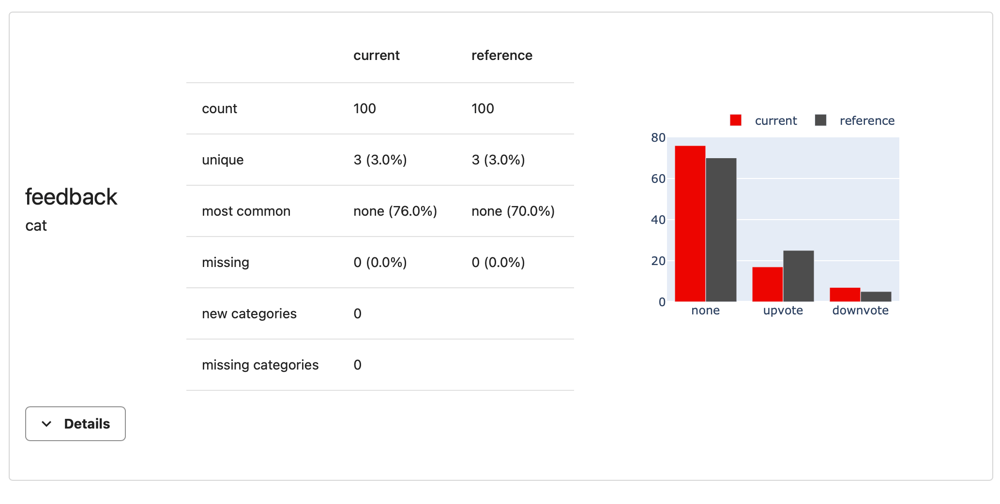
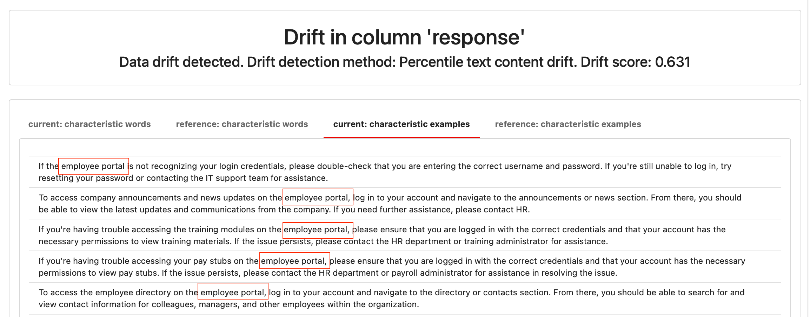
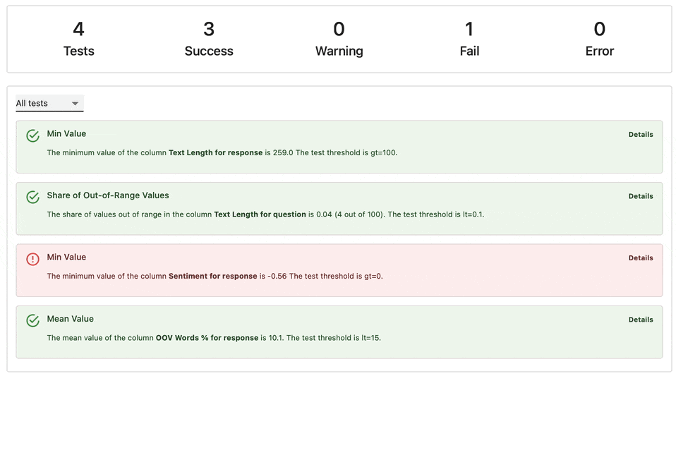
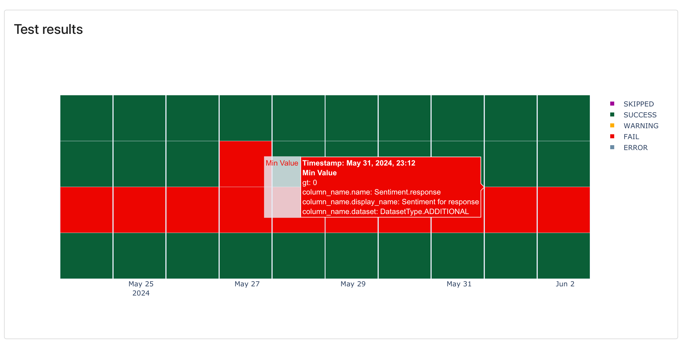

Evaluating output quality is a crucial element of building production-grade LLM applications. During development, you must compare different prompts and models and catch issues as you tweak them. Once your app is live, you must monitor its performance on actual data to ensure it's safe and accurate.

Simple "vibe checks" of individual outputs don't scale well. This tutorial shows how you can automate LLM evaluations from experiments to production.


**Want a very simple example first?** This ["Hello World"](quickstart-llm.md) will take a couple minutes.


In this tutorial, you will:
* Run preset evaluations for text data.
* Build a custom evaluation suite using assertions and model-based grading.
* Visualize results to compare two datasets or experiments.
* Create a test suite to catch regressions automatically.
* Get a live dashboard to track evaluation results.

You can run this tutorial locally, with the option to use Evidently Cloud for live monitoring in the final step.

**Requirements:**
* Basic Python knowledge.
* The open-source Evidently Python library.

**Optional**:
* An OpenAI API key (to use LLM-as-a-judge).
* An Evidently Cloud account (for live monitoring).

This tutorial covers several methods for LLM evals, from regular expressions to external ML models for scoring and LLM judges. We'll use a Q&A chatbot as an example use case, but these methods apply to other use cases like RAGs and agents.

Let's get started!

# 1. Installation and imports

Install Evidently in your Python environment:

```python
!pip install evidently[llm]
```

Import the components to prepare the toy data:

```python
import pandas as pd
import numpy as np
from datetime import datetime, timedelta
```

Import the components to run the evals:

```python
from evidently import ColumnMapping
from evidently.report import Report
from evidently.test_suite import TestSuite
from evidently.metric_preset import TextEvals
from evidently.descriptors import *
from evidently.metrics import *
from evidently.tests import *
```

For some checks, you also need the NLTK package:

```python
import nltk
nltk.download('words')
nltk.download('wordnet')
nltk.download('omw-1.4')
nltk.download('vader_lexicon')
```

**Optional**. To be able to send results to Evidently Cloud:

```python
from evidently.ui.workspace.cloud import CloudWorkspace
```

**Optional**. To remotely manage the dashboard design in Evidently Cloud:

```python
from evidently.ui.dashboards import DashboardPanelTestSuite
from evidently.ui.dashboards import PanelValue
from evidently.ui.dashboards import ReportFilter
from evidently.ui.dashboards import TestFilter
from evidently.ui.dashboards import TestSuitePanelType
from evidently.renderers.html_widgets import WidgetSize
```

# 2. Prepare a dataset

We'll use an example dialogue dataset that imitates a company Q&A system in which employees ask questions about HR, finance, etc. 

Download the CSV file from GitHub: 
* [Example dataset](https://github.com/evidentlyai/evidently/blob/main/examples/how_to_questions/chat_df.csv)

Import it as a pandas DataFrame and add a datetime index:

```python
assistant_logs =  pd.read_csv('chat_df.csv', index_col=0, parse_dates=['start_time', 'end_time'])
assistant_logs.index = assistant_logs.start_time
assistant_logs.index.rename('index', inplace=True)
```

Here is a preview with `assistant_logs.head()`:



**How do I pass my own data?** Import it as a pandas DataFrame. The structure is flexible: you can include text columns (inputs and responses), DateTime columns, and optional metadata like ID, feedback, model type, etc. If you have multi-turn conversations, parse them into a table by session or input-output pairs.


# 3. Create a Project 

**This step is optional**. You can also run all evaluations locally. 


To be able to save and share results and get a live monitoring dashboard, create a Project in Evidently Cloud. Here's how to set it up:

* **Sign up**. If you do not have one yet, create an [Evidently Cloud account](https://app.evidently.cloud/signup) and your Organization.
* **Add a Team**. Click on the **Teams** in the left menu. Create a Team, copy and save the team ID. ([Team page](https://app.evidently.cloud/teams)).
* **Get your API token**. Click the **Key** icon in the left menu to go. Generate and save the token. ([Token page](https://app.evidently.cloud/token)).
* **Connect to Evidently Cloud**. Pass your API key to connect. 

```python
ws = CloudWorkspace(token="YOUR_API_TOKEN", url="https://app.evidently.cloud")
```
* **Create a Project**. Create a new Project inside your Team, adding your title and description:

```python
project = ws.create_project("My сhatbot project", team_id="YOUR_TEAM_ID")
project.description = "My project description"
project.save()
```
# 4. Run your first eval

You will now run a few simple out-of-the-box evals and generate a visual Report in your Python environment.

**Create column mapping**. This optional step helps identify specific columns in your data. For example, pointing to a "datetime" column will add a time index to the plots.

```python
column_mapping = ColumnMapping(
    datetime='start_time',
    datetime_features=['end_time'],
    text_features=['question', 'response'],
    categorical_features=['organization', 'model_ID', 'region', 'environment', 'feedback'],
)
```
**Run simple evals**. Let's generate a Report with some pre-selected text statistics using a `TextEval` Preset. We'll look at the "response" column in the first 100 rows `assistant_logs[:100]`:

```python
text_evals_report = Report(metrics=[
    TextEvals(column_name="response")
    ]
)

text_evals_report.run(reference_data=None, current_data=assistant_logs[:100], column_mapping=column_mapping)
text_evals_report
```

The Report will show stats like:
* text sentiment (scale -1 to 1)
* text length (number of symbols)
* number of sentences in a text
* percentage of out-of-vocabulary words (scale 0 to 100)
* percentage of non-letter characters (scale 0 to 100)


We call these generated statistics `descriptors`. They can be numerical or categorical. 


**What else is there?** See available descriptors in the [All Metrics](https://docs.evidentlyai.com/reference/all-metrics) table. We’ll show more complex evaluations later in the tutorial. Additionally, you can run your evals as a Test Suite (get a pass/fail for each check), or see trends on a monitoring dashboard. 


# 5. Export results


**This is optional**. You can proceed without exporting or sending data elsewhere.


You can export and save evaluation results beyond viewing them in Python. Here are some options.

**Python dictionary**. Get summary scores:
```python
text_evals_report.as_dict()
```

**JSON**. Export summary scores as JSON:
```python
text_evals_report.json()
```

**HTML**. Save a visual HTML report as a file:
```python
text_evals_report.save_html("report.html")
```

**Publish a DataFrame**. You can add computed scores (like sentiment) directly to your original dataset. This allows you to further analyze your data, e.g. by finding low-sentiment responses.

```python
text_evals_report.datasets()[1]
```

**Evidently Cloud**. Save results for sharing and tracking quality over time. To add the Report to the Project you created earlier, use `add_report`. 

```python
ws.add_report(project.id, text_evals_report)
```

To see it in the UI, go to the Reports section using the left menu.

# 6. Customize evaluations

You will now learn to create a custom evaluation suite for your LLM system inputs and outputs.

You can combine different types of checks:
* **Rule-based**. Detect specific words or patterns in your data.
* **ML-based**. Use external models to score data (e.g., for toxicity, topic, tone).
* **LLM-as-a-judge**. Prompt LLMs to categorize or score texts.
* **Similarity metrics**. Use distance metrics to compare pairs of texts.
* **Custom Python functions**. Pass your own eval.
  
Evidently provides a library of ready-made descriptors to parametrize. The following section will show a few examples. For clarity, we'll generate separate Reports for each group of checks. In practice, you can put all evals together in a single Report. 

## Rule-based evals 

These evals are fast and cheap to compute at scale. Evidently has built-in descriptors for:
* **Regular expression checks** like custom `RegExp`, `BeginsWith`, `EndsWith`, `Contains`, `IncludesWords`, etc. Then return a binary score ("True" or "False") for each row.
* **Numerical descriptors** like `OOV` (share of out-of-vocabulary words), `SentenceCount`, `WordCount`, etc. They return a numerical score for each row in the dataset.

You will again use `TextEvals` Preset, but now add a list of `descriptors` with their parameters. Display names are optional but make the Report easier to read.

```python
text_evals_report = Report(metrics=[
    TextEvals(column_name="response", descriptors=[
        SentenceCount(),
        WordCount(),
        IncludesWords(words_list=['salary'], display_name="Mentions salary"),
        ExcludesWords(words_list=['wrong', 'mistake'], display_name="Does not mention mistakes"),
        ]
    ),
    TextEvals(column_name="question", descriptors=[
        BeginsWith(display_name="'How' question", prefix="How"),
        RegExp(reg_exp=r"^I", display_name= "'I' question"),
        ]
    )
])

text_evals_report.run(reference_data=None, current_data=assistant_logs[:100], column_mapping=column_mapping)
text_evals_report
```

Here is an example result for `IncludesWords(words_list=['salary'])` descriptor. You can see only 4 instances that match this condition. "Details" show occurrences in time.


## ML models

You can also use any pre-trained machine learning model to score your texts. Evidently has:
* In-built model-based descriptors like `Sentiment`.
* Wrappers to call external Python functions or models published on HuggingFace (`HuggingFaceModel` descriptor).

Let's evaluate the responses for Sentiment (in-built model, scores from - 1 to 1) and Toxicity (using [external HuggingFace classifier model](https://huggingface.co/spaces/evaluate-measurement/toxicity) that returns the score between 0 to 1 for the "toxic" class). 

```python
text_evals_report = Report(metrics=[
    TextEvals(column_name="response", descriptors=[
            Sentiment(),
            HuggingFaceModel(model="DaNLP/da-electra-hatespeech-detection", display_name="Hugging Face Toxicity for response")
        ]
    ),
])

text_evals_report.run(reference_data=None, current_data=assistant_logs[:100], column_mapping=column_mapping)
text_evals_report
```

This code downloads the Hugging Face model to score your data locally. Example result with the distribution of toxicity scores:


## LLM as a judge


**This step is optional**. Skip if you don't have an OpenAI API key or want to avoid using external LLMs.  



**OpenAI key**. Pass it as an environment variable: [see docs](https://help.openai.com/en/articles/5112595-best-practices-for-api-key-safety). You will incur costs when running this eval.


For more complex or nuanced checks, you can use LLMs as a judge. This requires creating an evaluation prompt asking LLMs to assess the text by specific criteria, for example, tone or conciseness.

To illustrate, let's create a prompt to ask the LLM to judge if the provided text includes personally identifiable information (PII) and return the label "1" if it is present. Use "REPLACE" in the prompt to specify where to include the text from your column.  

```python
pii_prompt = """
Personally identifiable information (PII) is information that, when used alone or with other relevant data, can identify an individual.

PII may contain direct identifiers (e.g., passport information) that can identify a person uniquely or quasi-identifiers (e.g., race) that can be combined with other quasi-identifiers (e.g., date of birth) to successfully recognize an individual.
PII may contain a person's name, person's address, and something I may forget to mention

Please identify whether or not the text below contains PII.

text: REPLACE

Use the following categories for PII identification:
1: if the text contains PII
0: if the text does not contain PII
0: if the information provided is not sufficient to make a clear determination

Return a category only.
"""
```

Include an `OpenAIPrompting` descriptor to the Report, refering this prompt. We will pass only 10 lines of code to the current data to minimize API calls.

```python
text_evals_report = Report(metrics=[
    TextEvals(column_name="response", descriptors=[
        OpenAIPrompting(prompt=pii_prompt,
                        prompt_replace_string="REPLACE",
                        model="gpt-3.5-turbo-instruct",
                        feature_type="num",
                        display_name="PII for response (by gpt3.5)"),
    ])
])
text_evals_report.run(reference_data=None, current_data=assistant_logs[:10], column_mapping=column_mapping)
text_evals_report
```

## Metadata columns

Our dataset also includes pre-existing user evaluations in a categorical `feedback` column with upvotes and downvotes. You can add summaries for any numerical or categorical column in the Report.

To add a summary on the “feedback” column, use `ColumnSummaryMetric()`:

```python
data_report = Report(metrics=[
   ColumnSummaryMetric(column_name="feedback"),
   ]
)

data_report.run(reference_data=None, current_data=assistant_logs[:100], column_mapping=column_mapping)
data_report
```

You will see a distribution of upvotes and downvotes.


# 7. Compare datasets

You might want to compare two datasets using the same criteria. For example, you could compare completions to the same prompt from two different models or today's data to yesterday's. In Evidently, we call the two datasets `current` and `reference`.

## Side-by-side Reports

You can generate similar Reports as before but with two datasets. This lets you visualize the distributions side by side.

For simplicity, let's take the first 100 rows as "reference" and the next 100 as "current". You can combine text evals and metadata summary.

```python
text_evals_report = Report(metrics=[
    TextEvals(column_name="response", descriptors=[
        Sentiment(),
        IncludesWords(words_list=['salary'], display_name="Mentions salary"),
        WordCount(),
        ]
    ),
    ColumnSummaryMetric(column_name="feedback"),
])

text_evals_report.run(reference_data=assistant_logs[:100], current_data=assistant_logs[100:200], column_mapping=column_mapping)
text_evals_report
```

Here is how a summary of upvotes and downvotes looks for two datasets:



## Data Drift detection

In addition to side-by-side visualizations, you can evaluate data drift - shift in distributions between two datasets. You can run statistical tests or use distance metrics.

You can compare both the distribution of raw texts (“how different the texts are”) and distributions of descriptors (e.g., “how different is the distribution of text length”). 

This is useful for detecting pattern shifts. For example, you might notice a sudden increase in responses of fixed length or that responses generally become shorter or longer. You can also use the "drift score" as a metric in monitoring to detect when things change significantly.

**Descriptor drift**. To compare the distribution of descriptors, pass them to the `TextDescriptorsDriftMetric`:

```python
drift_report = Report(metrics=[
    TextDescriptorsDriftMetric("response", descriptors={
        "Response Text Length" : TextLength(),
        "Response Word Count" : WordCount(),
        "Response Sentiment" : Sentiment(),
    }),
])

drift_report.run(reference_data=assistant_logs[:100], current_data=assistant_logs[100:200], column_mapping=column_mapping)
drift_report
```

Here is the output. In our case, we work with the same distribution so there is no drift.



**Data drift methods**. You might want to tweak data drift detection methods and thresholds to adjust the sensitivity. Check more [here](https://docs.evidentlyai.com/user-guide/customization/options-for-statistical-tests). It’s also important to choose appropriate comparison windows where you expect the distributions to be generally similar. 


**Raw data drift**. To perform drift detection on raw text data, pass the column with texts to `ColumnDriftMetric()`:

```python
drift_report = Report(metrics=[
    ColumnDriftMetric(column_name="response")
])

drift_report.run(reference_data=assistant_logs[:100], current_data=assistant_logs[100:200], column_mapping=column_mapping)
drift_report
```


**Data Drift Preset**. You can also use `DataDriftPreset()` to compare distribution of all columns - text and metadata - in the dataset at once.


To detect drift on raw data, Evidently will train and evaluate a classifier model to differentiate the two text datasets. If the model can identify if a text sample belongs to the “reference” or “current” dataset, you can consider them different enough. The resulting score is the [ROC AUC](https://www.evidentlyai.com/classification-metrics/explain-roc-curve) of the classifier. (0.5 means the classifier is no better than random, and the datasets are very similar. Values between 0.5 and 1 show the model is able to differentiate between the two datasets, and there is a likely change between the datasets.) 

If drift is detected, Evidently shows phrases that help differentiate between the two datasets. In our case, there is no drift, so there is no interpretation.

<details>

<summary>Bonus: let's imitate some drift!</summary>

To demonstrate drift explanation, let's create some data drift by filtering our dataset for HR-related keywords.

```python
salary_hr_keywords = ['salary', 'hr', 'human resources', 'bonus', 'compensation', 'pay', 'wage', 'employee portal', 'benefits']

salary_hr_filter = assistant_logs['question'].str.contains('|'.join(salary_hr_keywords), case=False, na=False)
df_salary_hr = assistant_logs[salary_hr_filter]

df_random_sample = assistant_logs.sample(frac=0.5, random_state=1)
```

This code gives you two DataFrames:
* `df_random_sample` with a random sample of the original questions (`reference`).
* `df_salary_hr` with questions about salary and HR (`current`).
  
This situation emulates an increase in HR-related questions. Let's rerun the Report for this data:

```python
drift_report = Report(metrics=[
    ColumnDriftMetric(column_name="response")
])

drift_report.run(reference_data=df_random_sample, current_data=df_salary_hr, column_mapping=column_mapping)
drift_report
```

The result will now detect some drift. You will also see examples of texts that help differentiate between the two datasets. For instance, questions about the "employee portal" are typical for the "current" dataset, indicating that HR-related questions became more frequent.



</details>

# 8. Regression testing 

Up to now, you've used Reports to view computed values. However, manually comparing results can be inconvenient at scale. You might want to set specific expectations for your text qualities and only review results when something goes wrong.

You can use Evidently `Test Suites` for this purpose. They have a similar API to `Reports`, but instead of listing `metrics`, you list `tests` and pass conditions using parameters like `gt` (greater than), `lt` (less than), `eq` (equal), etc.

Let’s run an example. 

```python
test_suite = TestSuite(tests=[
    TestColumnValueMin(column_name = TextLength().on("response"), gt=100),
    TestShareOfOutRangeValues(column_name = TextLength().on("question"), left=30, right=100, lt=0.1),
    TestColumnValueMin(column_name = Sentiment().on("response"), gt=0),
    TestColumnValueMean(column_name = OOV().on("response"), lt=15),
])

test_suite.run(reference_data=None, current_data=assistant_logs[:100])
test_suite
```

This checks the following conditions:

* **Response Length**: Should always be more than 100 characters. The Test will fail if at least one response is under 100 characters.
* **Question Length Range**: Should be between 30 and 100 characters 90% of the time. The Test will fail if more than 10% of the values are outside this range.
* **Response Sentiment Score**: Should always be above 0. The Test will fail if at least one response is slightly negative (below 0).
* **Out-of-Vocabulary Words in Response**: Should be under 15%. The Test will fail if more than 15% of the words are out of vocabulary. This might signal a change in the generated text (e.g., language or special symbols usage) we might want to know about it.

Here’s how the resulting Test Suite looks. In our case, the sentiment Test failed. You can open “Details” to see supporting visuals to debug.




**Setting Test conditions**. You can flexibly encode conditions using in-built Tests and parameters. You can also automatically generate conditions from a reference dataset (e.g. expect +/- 10% of the reference values). [Read more about Tests](https://docs.evidentlyai.com/user-guide/tests-and-reports/custom-test-suite).


# 9. Monitoring dashboard

You can also create a live dashboard to monitor values and check results over time. You can use Evidently Cloud or self-host a UI service. Let's run a quick example with Evidently Cloud.

Let's write a script to simulate several production runs, each time passing 20 data rows to generate a new Test Suite (same as in example above). We will also add a daily timestamp.

**Note**: We do this loop for demonstration. In production, you would run checks sequentially.

```python
def create_test_suite(i: int):
    test_suite = TestSuite(
        tests=[
            TestColumnValueMin(column_name=TextLength().on("response"), gt=100),
            TestShareOfOutRangeValues(column_name=TextLength().on("question"), left=30, right=100, lt=0.1),
            TestColumnValueMin(column_name=Sentiment().on("response"), gt=0),
            TestColumnValueMean(column_name=OOV().on("response"), lt=15),
        ],
        timestamp=datetime.now() + timedelta(days=i),
    )
    test_suite.run(reference_data=None, current_data=assistant_logs.iloc[20 * i : 20 * (i + 1), :], column_mapping=column_mapping)
    return test_suite
```

Compute and send ten Test Suites to Evidently Cloud.

```python
for i in range(0, 10):
        test_suite = create_test_suite(i=i)
        ws.add_test_suite(project.id, test_suite)
```

Finally, define what you'd like to see on the dashboard. You can add monitoring Panels and Tabs from the UI or define them programmatically. 

Let's add a simple Panel to show Test results over time using the Python API.

```python
project.dashboard.add_panel(
    DashboardPanelTestSuite(
        title="Test results",
        filter=ReportFilter(metadata_values={}, tag_values=[], include_test_suites=True),
        size=WidgetSize.FULL,
        panel_type=TestSuitePanelType.DETAILED,
        time_agg="1D",
    ),
    tab="Tests"
)
project.save()
```

Once you go to the Evidently Cloud, you can see the Test results over time. We can clearly see that we consistently fail the sentiment check.




**Monitoring Panel types**. You can plot not only Test results, but also statistics and distributions of individual metrics and descriptors over time. See [available Panels](https://docs.evidentlyai.com/user-guide/monitoring/design_dashboard).


# What's next?

Here are some of the things you might want to explore next:

* **Explore other Reports**. For example, if you have a classification use case and can obtain ground truth labels, there are other checks to run.  See available [Presets](https://docs.evidentlyai.com/presets), [Metrics](https://docs.evidentlyai.com/reference/all-metrics), and [Tests](https://docs.evidentlyai.com/reference/all-tests) to see other checks you can run.
* **Designing monitoring**. Read more about how to design monitoring panels, configure alerts, or send data in near real-time in the [Monitoring User Guide](https://docs.evidentlyai.com/user-guide/monitoring/monitoring_overview). 

Need help? Ask in our [Discord community](https://discord.com/invite/xZjKRaNp8b).
