Evaluating the quality of LLM outputs is essential for building a production-grade LLM application. During development, you need to compare quality with different prompts and detect regressions. Once your app is live, you need to ensure outputs are safe and accurate and understand user behavior.

Manually reviewing individual outputs doesn't scale. This tutorial shows you how to automate LLM evaluations from experiments to production.

You will learn both about the evaluation methods and the workflow to run and track them.


**Want a very simple example first?** This ["Hello World"](quickstart-llm.md) will take a couple minutes.


In this tutorial, you will:
* Prepare a toy chatbot dataset
* Evaluate responses using different methods:
    * Text statistics
    * Text patterns
    * Model-based evaluations
    * LLM-as-a-judge
    * Metadata analysis
* Generate visual Reports to explore evaluation results
* Get a monitoring Dashboard to track results over time
* Build a custom Test Suite to run conditional checks

You can run this tutorial locally, with the option to use Evidently Cloud for monitoring. You will work with a Q&A chatbot example, but the methods will apply to other use cases, such as RAGs and agents.

**Requirements:**
* Basic Python knowledge.
* The open-source Evidently Python library.

**Optional**:
* An OpenAI API key (to use LLM-as-a-judge).
* An Evidently Cloud account (for live monitoring).

Let's get started!

To complete the tutorial, use the provided code snippets or run a sample notebook.

Jupyter notebook:


Or click to [open in Colab](https://colab.research.google.com/github/evidentlyai/evidently/blob/main/examples/sample_notebooks/llm_evaluation_tutorial.pynb).

You can also follow the video version: 

# 1. Installation and imports

Install Evidently in your Python environment:

```python
!pip install evidently[llm]
```

Run the imports. To work with toy data:

```python
import pandas as pd
import numpy as np
import requests
from datetime import datetime, timedelta
from io import BytesIO
```

To run the evals:

```python
from evidently import ColumnMapping
from evidently.report import Report
from evidently.test_suite import TestSuite
from evidently.metric_preset import TextEvals
from evidently.descriptors import *
from evidently.metrics import *
from evidently.tests import *
```

To send results to Evidently Cloud:

```python
from evidently.ui.workspace.cloud import CloudWorkspace
```

**Optional**. To remotely manage the dashboard design in Evidently Cloud:

```python
from evidently.ui.dashboards import DashboardPanelTestSuite
from evidently.ui.dashboards import PanelValue
from evidently.ui.dashboards import ReportFilter
from evidently.ui.dashboards import TestFilter
from evidently.ui.dashboards import TestSuitePanelType
from evidently.renderers.html_widgets import WidgetSize
```

# 2. Prepare a dataset

We'll use a dialogue dataset that imitates a company Q&A system where employees ask questions about HR, finance, etc. You can download the [example CSV file](https://github.com/evidentlyai/evidently/blob/main/examples/how_to_questions/chat_df.csv) from source or import it using `requests`:

```python
response = requests.get("https://raw.githubusercontent.com/evidentlyai/evidently/main/examples/how_to_questions/chat_df.csv")
csv_content = BytesIO(response.content)
```

Convert it into the pandas DataFrame. Parse dates and set conversation "start_time" as index:

```python
assistant_logs = pd.read_csv(csv_content, index_col=0, parse_dates=['start_time', 'end_time'])
assistant_logs.index = assistant_logs.start_time
assistant_logs.index.rename('index', inplace=True)
```

To get a preview:

```python
pd.set_option('display.max_colwidth', None)
assistant_logs.head(3)
```

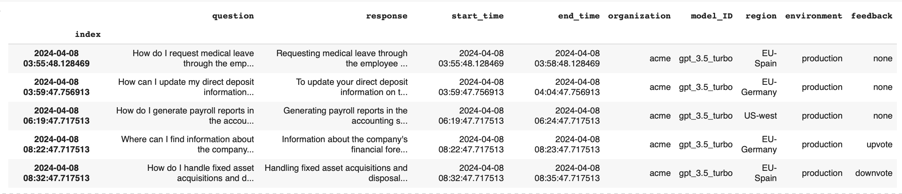


**How do I pass my data?** You can import a pandas DataFrame with flexible structure. Include any text columns (e.g., inputs and responses), DateTime, and optional metadata like ID, feedback, model type, etc. If you have multi-turn conversations, parse them into a table by session or input-output pairs.


# 3. Create a Project 

**This step is optional**. You can also run the evaluations locally without sending results to the Cloud. 


To be able to save and share results and get a live monitoring dashboard, create a Project in Evidently Cloud. Here's how to set it up:

* **Sign up**. If you do not have one yet, create a free [Evidently Cloud account](https://app.evidently.cloud/signup) and name your Organization.
* **Add a Team**. Click **Teams** in the left menu. Create a Team, copy and save the Team ID. ([Team page](https://app.evidently.cloud/teams)).
* **Get your API token**. Click the **Key** icon in the left menu to go. Generate and save the token. ([Token page](https://app.evidently.cloud/token)).
* **Connect to Evidently Cloud**. Pass your API key to connect. 

```python
ws = CloudWorkspace(token="YOUR_API_TOKEN", url="https://app.evidently.cloud")
```
* **Create a Project**. Create a new Project inside your Team, adding your title and description:

```python
project = ws.create_project("My сhatbot project", team_id="YOUR_TEAM_ID")
project.description = "My project description"
project.save()
```
# 4. Run evaluations

You will now learn how to apply different methods to evaluate your text data. 
* **Text statistics**. Evaluate simple properties like text length.
* **Text patterns**. Detect specific words or regular patterns.
* **Model-based evals**. Use ready-made ML models to score data (e.g., by sentiment).
* **LLM-as-a-judge**. Prompt LLMs to categorize or score texts by custom criteria.
* **Similarity metrics**. Measure semantic similarity between pairs of text.

To view the evaluation results, you will generate visual Reports in your Python environment. Later, you'll explore other formats like Test Suite.

This section introduces different LLM evaluation methods. Each example is self-contained, so you can skip any and head to Step 6 for the end-to-end example.

## Text statistics 

Let's run a simple evaluation to understand the basic flow.

**Create column mapping**. This optional step helps correctly parse the data schema. For example, pointing to a "datetime" column will add a time index to the plots.

```python
column_mapping = ColumnMapping(
    datetime='start_time',
    datetime_features=['end_time'],
    text_features=['question', 'response'],
    categorical_features=['organization', 'model_ID', 'region', 'environment', 'feedback'],
)
```

**Evaluate text length**. Generate a Report to evaluate the length of texts in the "response" column. Run this check for the first 100 rows in the `assistant_logs` dataframe:

```python
text_evals_report = Report(metrics=[
    TextEvals(column_name="response",
              descriptors=[
                  TextLength(),
                  ]
              )
])

text_evals_report.run(reference_data=None,
                      current_data=assistant_logs[:100],
                      column_mapping=column_mapping)
text_evals_report
```

This calculates the number of symbols in each text and shows a summary. You can see the distribution of text length across all responses and descriptive statistics like the mean or minimal text length.

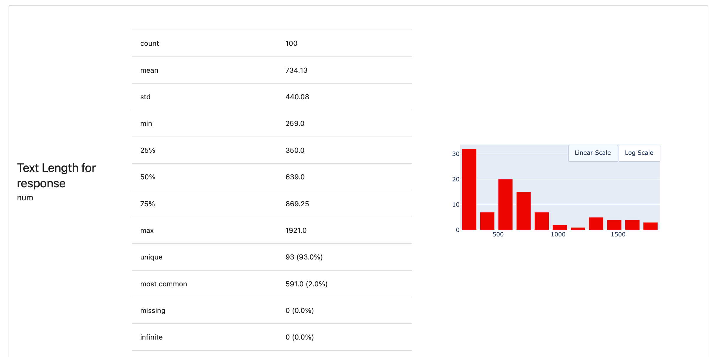

Click on "details" to see how the mean text length changes over time. The index comes from the `datetime` column you mapped earlier. This helps you notice any temporal patterns, such as if texts are longer or shorter during specific periods.

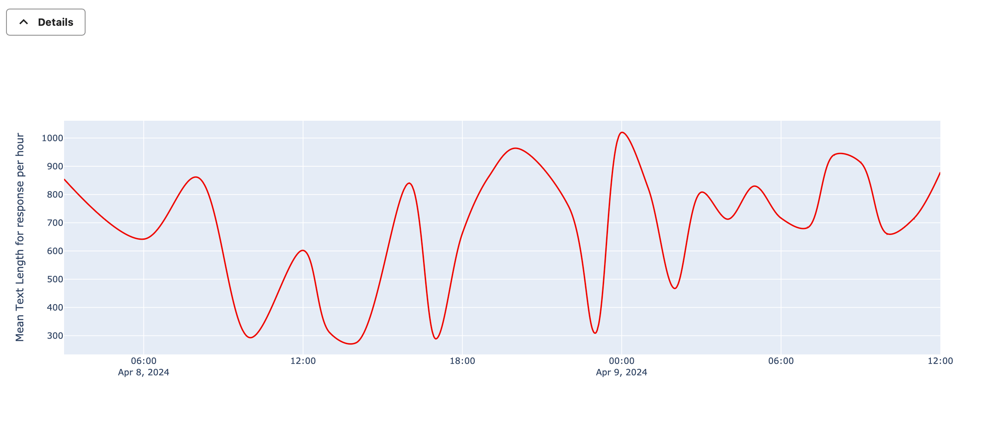 

**Get a side-by-side comparison**. You can also generate statistics for two datasets at once. For example, compare the outputs of two different prompts or data from today against yesterday.

Pass one dataset as `reference` and another as `current`. For simplicity, let's compare the first and next 50 rows from the same dataframe:

```python
text_evals_report = Report(metrics=[
    TextEvals(column_name="response",
              descriptors=[
                  TextLength(),
                  ]
              )
])

text_evals_report.run(reference_data=assistant_logs[:50],
                      current_data=assistant_logs[50:100],
                      column_mapping=column_mapping)
text_evals_report
```

You will now see the summary results for both datasets:

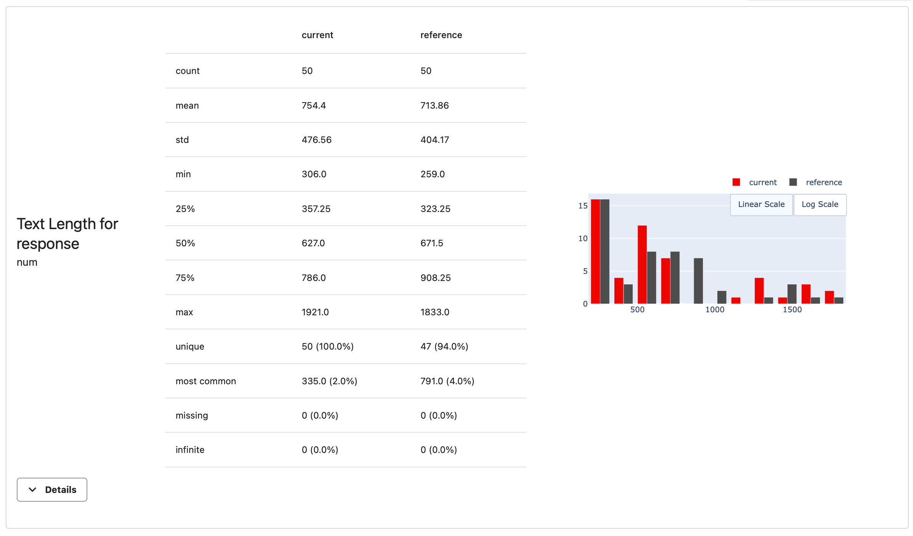 

Each evaluation that computes a score for every text in the dataset is called a `descriptor`. Descriptors can be numerical (like the `TextLength()` you just used) or categorical.

Evidently has many built-in descriptors. For example, try other simple statistics like SentenceCount() or WordCount(). We'll show more complex examples below.


**List of all descriptors** See available descriptors in the "Descriptors" section of [All Metrics](https://docs.evidentlyai.com/reference/all-metrics) table. 


## Text patterns

You can use regular expressions to identify text patterns. For example, check if the responses mention competitors, named company products, include emails, or specific topical words. These descriptors return a binary score ("True" or "False") for pattern matches.

Let's check if responses contain words related to compensation (such as salary, benefits, or payroll). Pass this word list to the `IncludesWords` descriptor. This will also check for word variants.

Add an optional display name for this eval:

```python
text_evals_report = Report(metrics=[
    TextEvals(column_name="response",
              descriptors=[
                  IncludesWords(
                      words_list=['salary', 'benefits', 'payroll'],
                      display_name="Mention Compensation")
            ]
        ),
        ]
)

text_evals_report.run(reference_data=None,
                      current_data=assistant_logs[:100],
                      column_mapping=column_mapping)
text_evals_report
```

Here is an example result. You can see that 10 responses out of 100 relate to the topic of compensation as defined by this word list. "Details" show occurrences in time.

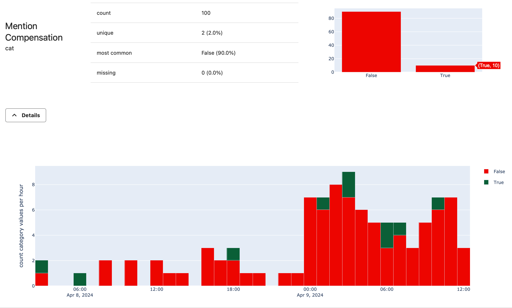 

Such pattern evals are fast and cheap to compute at scale. Try other descriptors like `Contains(items=[])` (for non-vocabulary words like competitor names or longer expressions), `BeginsWith(prefix="")` (for specific starting sequence), custom `RegEx(reg_exp=r"")`, etc.

## Model-based scoring

You can use pre-trained machine learning models to score your texts. Evidently has:
* Built-in model-based descriptors like `Sentiment`.
* Wrappers to call external models published on HuggingFace.

Let's start with a **Sentiment** check. This returns a sentiment score from -1 (very negative) to 1 (very positive).

```python
text_evals_report = Report(metrics=[
    TextEvals(column_name="response", descriptors=[
            Sentiment(),
        ]
    ),
])

text_evals_report.run(reference_data=None,
                      current_data=assistant_logs[:100],
                      column_mapping=column_mapping)
text_evals_report
```

You will see the distribution of response sentiment. Most are positive or neutral, but there are a few chats with a negative sentiment. 

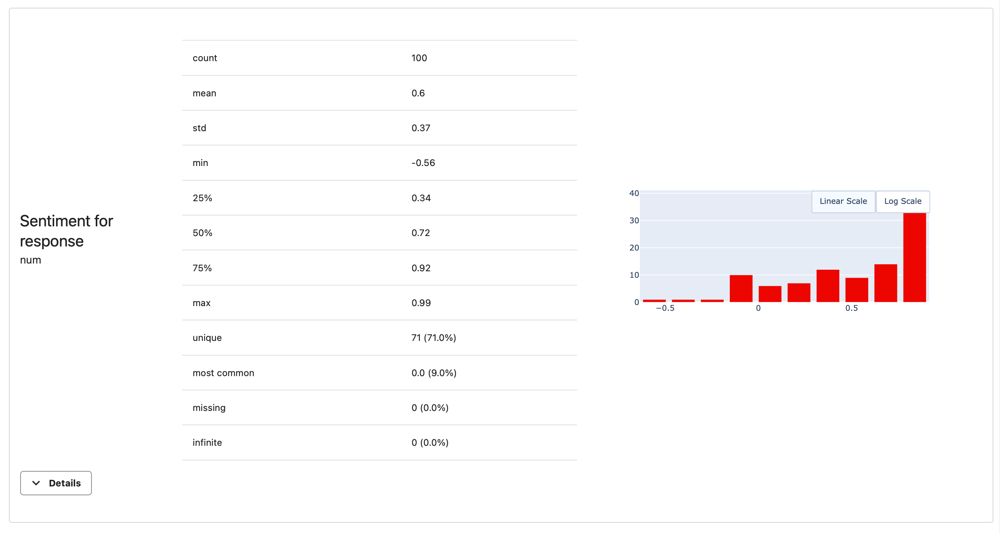 

In "details", you can look at specific times when the average sentiment of responses dipped:

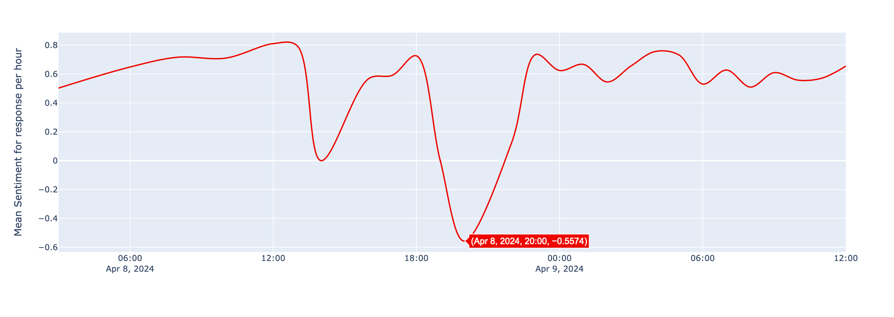 

To review specific responses with sentiment below zero, you can access the dataset with scores. We'll show this in the following tutorial section.

Let's first see how to use external models from HuggingFace. There are two options:
* **Pre-selected models**, like **Toxicity**. Pass the `HuggingFaceToxicityModel()` descriptor. This [model](https://huggingface.co/spaces/evaluate-measurement/toxicity) returns a predicted toxicity score between 0 to 1.
* **Custom models**, where you specify the model name and output to use. For example, let's call the `SamLowe/roberta-base-go_emotions` [model](https://huggingface.co/SamLowe/roberta-base-go_emotions) using the general `HuggingFaceModel` descriptor. This model classifies text into 28 emotions. If you pick the "neutral" label, the descriptor will return the predicted score from 0 to 1 on whether responses convey neutral emotion.

```python
text_evals_report = Report(metrics=[
    TextEvals(column_name="response", descriptors=[
            HuggingFaceToxicityModel(),
            HuggingFaceModel(
                model="SamLowe/roberta-base-go_emotions",
                params={"label": "neutral"},
                display_name="Response Neutrality"),
        ]
    ),
])

text_evals_report.run(reference_data=None,
                      current_data=assistant_logs[:100],
                      column_mapping=column_mapping)
text_evals_report
```


In each case, the descriptor first downloads the model from HuggingFace to your environment and then uses it to score the data. It takes a few moments to load the model.

**How to interpret the results?** It's typical to use a predicted score above 0.5 as a "positive" label. The toxicity score is near 0 for all responses - nothing to worry about! For neutrality, most responses have predicted scores above the 0.5 threshold, but a few are below. You can review them individually.

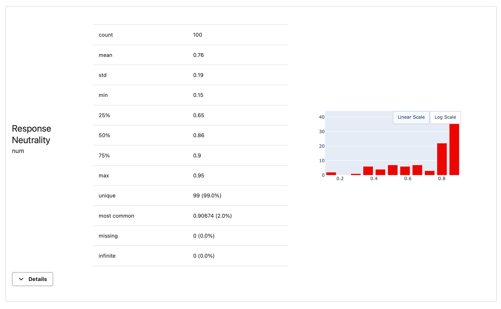 


**Choosing other models**. You can choose other models, e.g. to score texts by topic. See [docs](../customization/llm_as_a_judge.md)  


## LLM as a judge


**This step is optional**. You'll need an OpenAI API key and will incur costs by running the evaluation. Skip if you don't want to use external LLMs. 


For more complex or nuanced checks, you can use LLMs as a judge. This requires creating an evaluation prompt asking LLMs to assess the text by specific criteria, such as tone or conciseness.


**Recommended: pass the key as an environment variable**. [See Open AI docs](https://help.openai.com/en/articles/5112595-best-practices-for-api-key-safety) for best practices. 


```python
## import os
## os.environ["OPENAI_API_KEY"] = "YOUR KEY"
```

To illustrate, let's create a prompt asking the LLM to judge whether the provided responses are concise.

```python
conciseness_prompt = """
Conciseness refers to the quality of being brief and to the point, while still providing all necessary information.

A concise response should:
- Provide the necessary information without unnecessary details or repetition.
- Be brief yet comprehensive enough to address the query.
- Use simple and direct language to convey the message effectively.

Please evaluate the following chatbot response for conciseness.

response: REPLACE

Use the following categories for conciseness evaluation:
CONCISE if the response is concise and to the point
VERBOSE if the response is overly detailed or contains unnecessary information
UNKNOWN if the information provided is not sufficient to make a clear determination

Return a category only
"""
```

Include an `OpenAIPrompting` descriptor to the Report, referring to this prompt. To minimize API calls, we will pass only 10 data rows.

```python
report = Report(metrics=[
    TextEvals(column_name="response", descriptors=[
        OpenAIPrompting(prompt=conciseness_prompt,
                        prompt_replace_string="REPLACE",
                        model="gpt-3.5-turbo-instruct",
                        feature_type="cat",
                        display_name="Response Conciseness"),
    ])
])

report.run(reference_data= None,
           current_data= assistant_logs[:10],
           column_mapping=column_mapping)

#report
```

All our responses are concise - great!

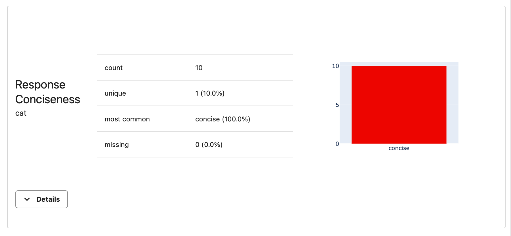 


**How to create your own judge**. You can create custom prompts, and optionally pass the context or reference answer alongside the response. See [docs](../customization/huggingface_descriptor.md).  


## Metadata summary

Our dataset includes user upvotes and downvotes in a categorical `feedback` column. You can easily add summaries for any numerical or categorical column to the Report.

To add a summary on the “feedback” column, use `ColumnSummaryMetric()`:

```python
data_report = Report(metrics=[
   ColumnSummaryMetric(column_name="feedback"),
   ]
)

data_report.run(reference_data=None, current_data=assistant_logs[:100], column_mapping=column_mapping)
data_report
```

You will see a distribution of upvotes and downvotes.

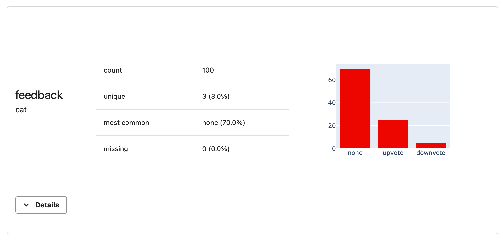

## Semantic Similarity

You can evaluate how closely two texts are in meaning using an embedding model. This descriptor requires you to define two columns. In our example, we can compare Responses and Questions to see if the chatbot answers are semantically relevant to the question.

This descriptor converts all texts into embeddings, measures Cosine Similarity between them, and returns a score from 0 to 1:
* 0 means that texts are opposite in meaning;
* 0.5 means that texts are unrelated;
* 1 means that texts are similar.

To compute the Semantic Similarity:

```python
text_evals_report = Report(metrics=[
    ColumnSummaryMetric(
        column_name=SemanticSimilarity(
            display_name="Response-Question Similarity"
        )
        .on(["response", "question"])
    )
])

text_evals_report.run(reference_data=None,
                      current_data=assistant_logs[:100],
                      column_mapping=column_mapping)
text_evals_report
```

In our examples, the semantic similarity always stays above 0.81, which means that answers generally relate to the question.

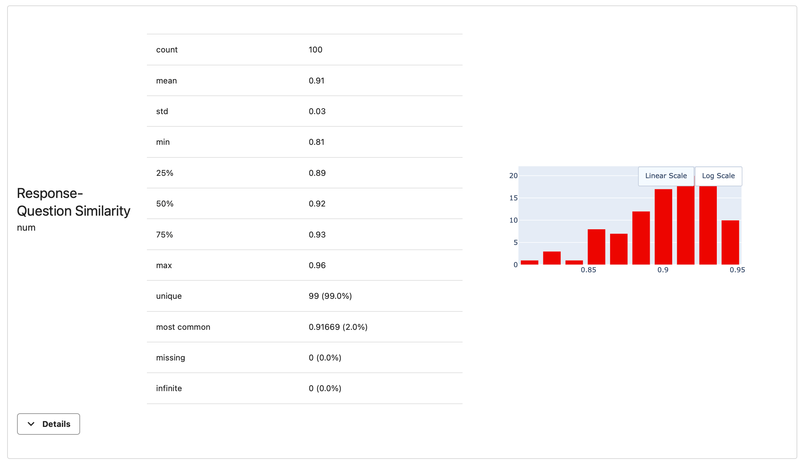 

# 5. Export results


**This is optional**. You can proceed without exporting the results.


You can export the evaluation results beyond viewing the visual Reports in Python. Here are some options.

**Publish a DataFrame**. Add computed scores (like semantic similarity) directly to your original dataset. This will let you further analyze the data, like identifying examples with the lowest scores.

```python
text_evals_report.datasets()[1]
```

**Python dictionary**. Get summary scores as a dictionary. Use it to export specific values for further pipeline actions:

```python
text_evals_report.as_dict()
```

**JSON**. Export summary scores as JSON:
```python
text_evals_report.json()
```

**HTML**. Save a visual HTML report as a file:
```python
text_evals_report.save_html("report.html")
```

You can also send the results to Evidently Cloud for monitoring!

# 6. Monitor results over time

In this section, you will learn how to monitor evaluations using Evidently Cloud. This allows you to:

* **Track offline experiment results**. Keep records of evaluation scores from different experiments, like comparing output quality using different prompts.
* **Run evaluations in production**. Periodically evaluate batches or samples of production data, such as hourly or daily.

Here's how you can set this up.

**Define the evaluations**. First, let's design a Report. This will specify what you want to evaluate. 

Say, you want to compute summaries for metadata columns and evaluate text length, sentiment, and mentions of compensation in chatbot responses.

```python
text_evals_report = Report(metrics=[
    TextEvals(column_name="response", descriptors=[
            Sentiment(),
            TextLength(),
            IncludesWords(words_list=['salary', 'benefits', 'payroll'],
                          display_name="Mention Compensation")

        ],
    ),
    ColumnSummaryMetric(column_name="feedback"),
    ColumnSummaryMetric(column_name="region"),
    ColumnSummaryMetric(column_name="organization"),
    ColumnSummaryMetric(column_name="model_ID"),
    ColumnSummaryMetric(column_name="environment"),
])
```
You can include more complex checks like LLM-as-a-judge in the same way: just list the corresponding descriptor.

**Run the Report**. Compute the Report for the first 50 rows:

```python
text_evals_report.run(reference_data=None,
                      current_data=assistant_logs[:50],
                      column_mapping=column_mapping)
```

**Upload the results**. Send the Report to the Evidently Cloud Project you created earlier:

```python
ws.add_report(project.id, text_evals_report)
```

**View the Report**. Go to the Project and open the Reports section using the menu on the left.

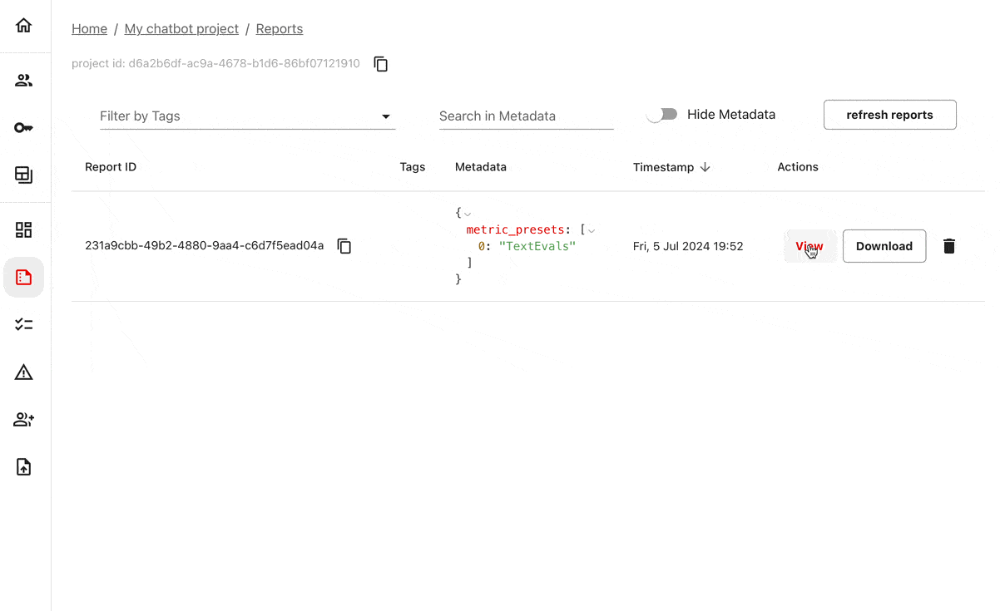

A single Report gives us all the information right there. But as you run more checks, you want to track how values change over time. Let's imitate a few consecutive runs to evaluate more batches of data. 

**Imitate ongoing monitoring**. Run and send several Reports, each time taking the next 50 rows of data. For illustration, we repeat the runs. In practice, you would compute each Report after each new experiment or after you get a new batch of production data to evaluate. 

Run the Report for the next 50 rows of data:

```python
text_evals_report.run(reference_data=None,
                      current_data=assistant_logs[50:100],
                      column_mapping=column_mapping)
ws.add_report(project.id, text_evals_report)
```

<details>

<summary>And a few more times!</summary>

Run 3:

```python
text_evals_report.run(reference_data=None,
                      current_data=assistant_logs[100:150],
                      column_mapping=column_mapping)
ws.add_report(project.id, text_evals_report)
```

Run 4:

```python
text_evals_report.run(reference_data=None,
                      current_data=assistant_logs[150:200],
                      column_mapping=column_mapping)
ws.add_report(project.id, text_evals_report)
```

Run 5:

```python
text_evals_report.run(reference_data=None,
                      current_data=assistant_logs[200:250],
                      column_mapping=column_mapping)
ws.add_report(project.id, text_evals_report)
```

</details>

Now you will have 5 Reports in the Project. Let's get a dashboard! 

**Get a Monitoring Dashboard**. You can start with pre-built templates.
* Go to Project Dashboard.
* Enter the edit mode by clicking on the "Edit" button in the top right corner.
* Choose "Add Tab",
* Add a "Descriptors" Tab and then a "Columns" Tab.
* Use the "Show in Order" toggle above the dashboard to ignore the time gaps.

You will instantly get a dashboard with evaluation results over time.

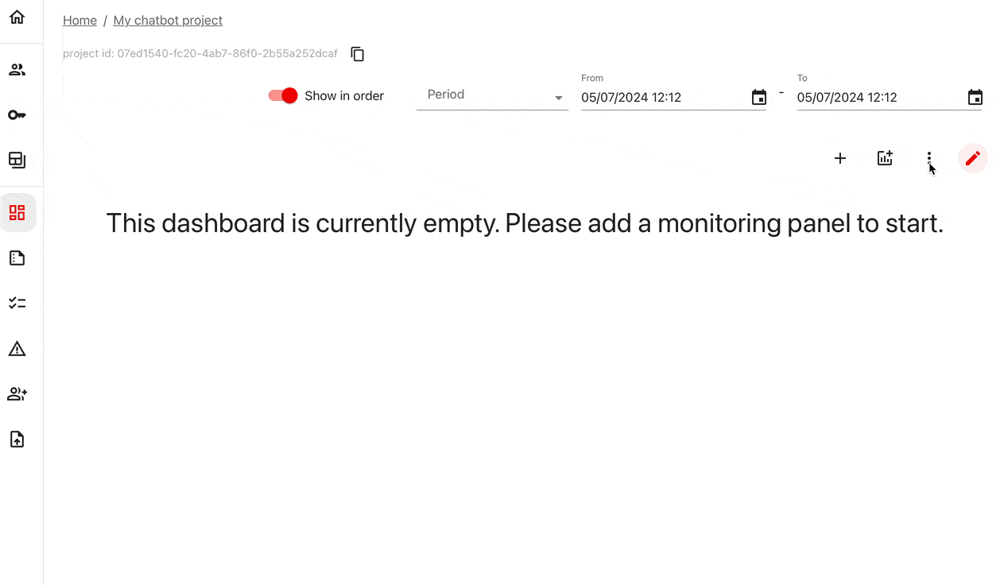

In the "Desriptors" tab, you will see how the distributions of the text evaluation results. For example, you can notice a dip in mean Sentiment in the fourth evaluation run. 
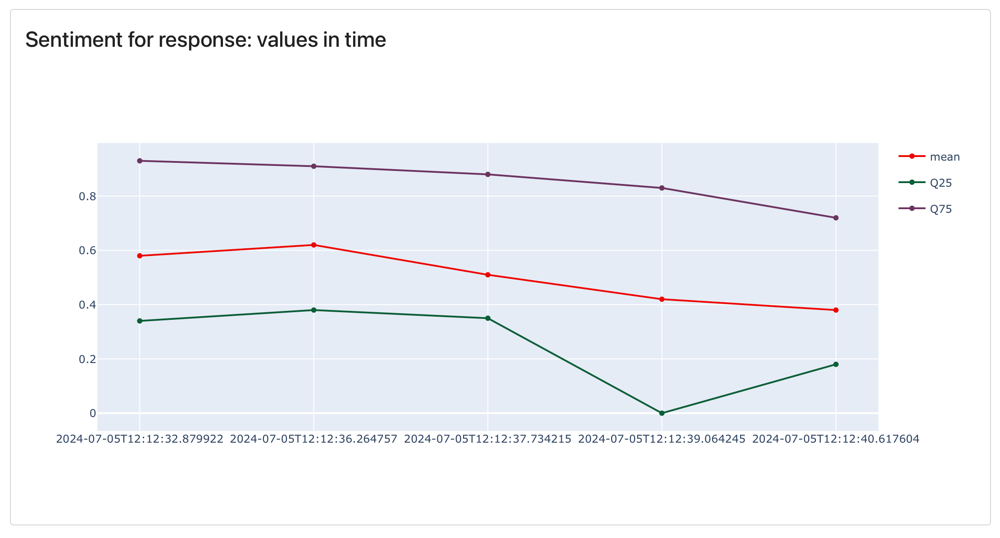 

In the "Columns" tab, you can see all the metadata summaries over time. For example, you can notice that all responses in the last run were generated with gpt-3.5.

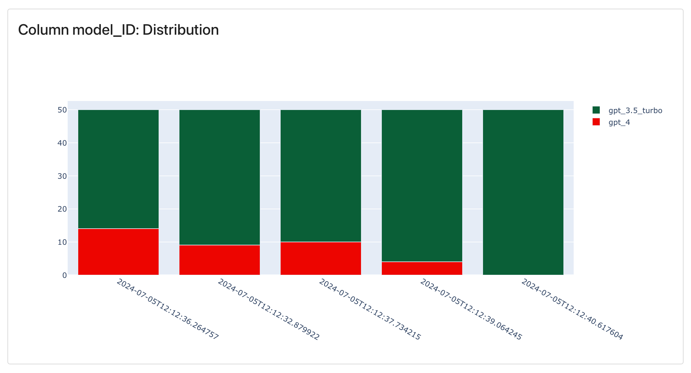

You can also add alerting conditions for specific values.


**Monitoring Panel types**. In addition to Tabs, you can choose monitoring panels one by one. You can choose panel title, type (bar, line chart), etc. Read more on [available Panels](https://docs.evidentlyai.com/user-guide/monitoring/design_dashboard).


# 7. Run conditional tests

So far, you've used Reports to summarize evaluation outcomes. However, you often want to set specific conditions for the metric values. For example, check if all texts fall within the expected length range and review results only if something goes wrong.

This is where you can use an alternative interface called `TestSuites`. It will look like this: 

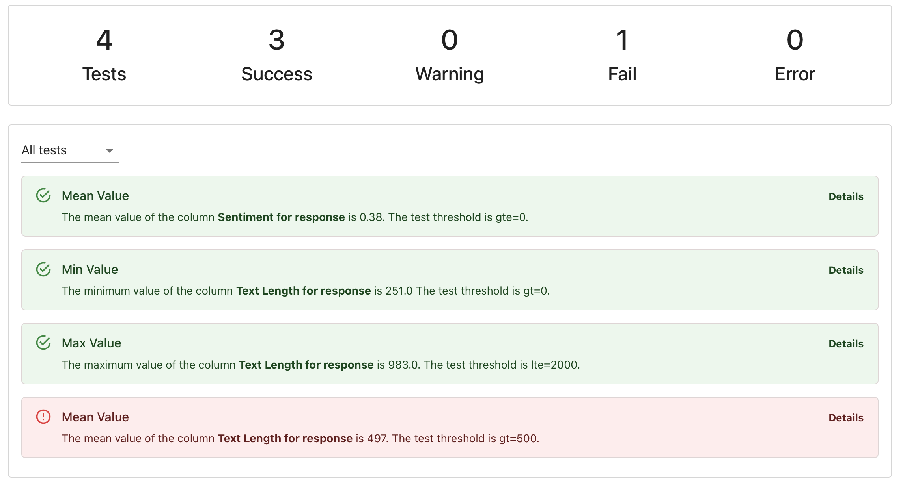 

Test Suites work similarly to `Reports`, but instead of listing `metrics`, you define `tests` and set conditions using parameters like `gt` (greater than), `lt` (less than), `eq` (equal), etc.

**Define a Test Suite**. Let’s create a simple example:

```python
test_suite = TestSuite(tests=[
    TestColumnValueMean(column_name = Sentiment().on("response"), gte=0),
    TestColumnValueMin(column_name = TextLength().on("response"), gt=0),
    TestColumnValueMax(column_name = TextLength().on("response"), lte=2000),
    TestColumnValueMean(column_name = TextLength().on("response"), gt=500),
])
```

This test checks the following conditions:
* Average response sentiment is positive.
* Response length is always non-zero.
* Maximum response length does not exceed 2000 symbols (e.g., due to chat window constraints).
* Mean response length is above 500 symbols (e.g., this is a known pattern).

You can use other descriptors and tests. For example, use `TestCategoryShare` to check if the share of responses labeled "Concise" by the LLM judge is above a certain threshold.


**How to test set test conditions**. [Read more about Tests](https://docs.evidentlyai.com/user-guide/tests-and-reports/custom-test-suite). You can also automatically generate conditions from a reference dataset (e.g. expect +/- 10% of the reference values). 


**Compute multiple Test Suites**. Let's simulate running 5 Test Suites sequentially, each on 50 rows of data, with timestamps spaced hourly:

```python
for i in range(5):
    test_suite.run(
        reference_data=None,
        current_data=assistant_logs.iloc[50 * i : 50 * (i + 1), :],
        column_mapping=column_mapping,
        timestamp=datetime.now() + timedelta(hours=i)
    )
    ws.add_test_suite(project.id, test_suite)
```

We use a cycle for demonstration. In production, you would run these checks sequentially.

**Add a test monitoring Panel**. Now, let's add a simple panel to display Test results over time. You can manage dashboards in the UI (like you did before) or programmatically. Let's now explore how to do it from Python. 

Load the latest dashboard configuration to Python. If you skip this step, the new Test panels will override the Tabs you added earlier.

Copy the Project ID from above the dashboard:

```python
project = ws.get_project("PROJECT_ID")
```

Next, create a Test panel within the "Tests" tab to display detailed test results:

```python
project.dashboard.add_panel(
    DashboardPanelTestSuite(
        title="Test results",
        filter=ReportFilter(metadata_values={}, tag_values=[], include_test_suites=True),
        size=WidgetSize.FULL,
        panel_type=TestSuitePanelType.DETAILED,
        time_agg="1D",
    ),
    tab="Tests"
)
project.save()
```

**View the test results in time**. Go to the Evidently Cloud dashboard to see the history of all tests. You can notice that a single test failed in the last run. If you hover on the specific test, you can see that we failed the mean text length condition.

**View the individual Test Suite**. To debug, open the latest Test Suite. In "Details," you will see the distribution of text length and the current mean value, which is just slightly below the set threshold.   

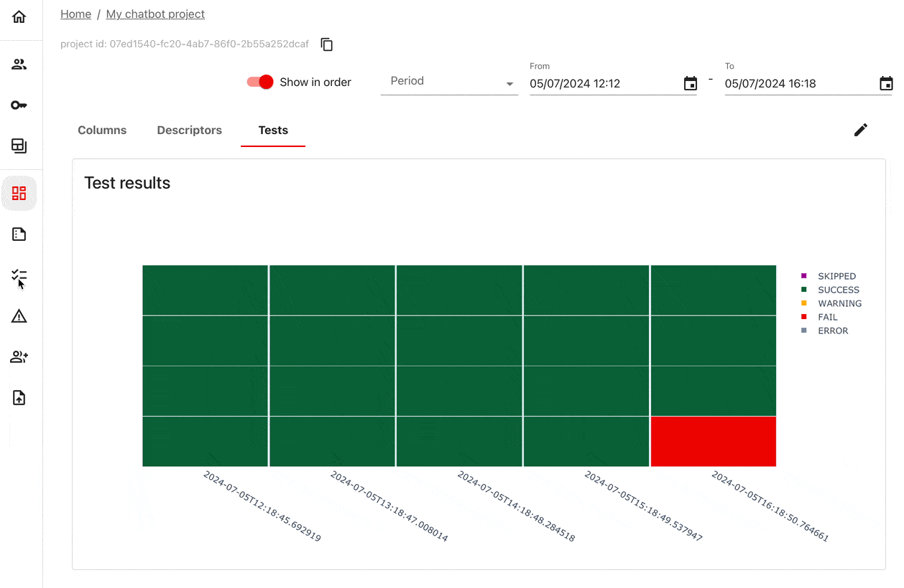 

When can you use these Test Suites? Here are two ideas:
* **Regression testing**. Run Test Suites whenever you change prompt or app parameters to compare new responses with references or against set criteria.
* **Continous testing**. Run Test Suites periodically over production logs to check that the output quality stays within expectations.

You can also set up alerts to get a notification if your Tests contain failures. 


**What is regression testing?**. Check a separate tutorial on the [regression testing workflow](https://www.evidentlyai.com/blog/llm-testing-tutorial).


# What's next?

Here are some of the things you might want to explore next:

* **Explore other Reports**. For example, if your LLM solves a classification or retrieval task, you can evaluate classification or ranking quality. See available [Presets](https://docs.evidentlyai.com/presets), [Metrics](https://docs.evidentlyai.com/reference/all-metrics), and [Tests](https://docs.evidentlyai.com/reference/all-tests) to see other checks you can run.
* **Design the monitoring**. Read more about how to add monitoring panels, configure alerts, or send data in near real-time in the [Monitoring User Guide](https://docs.evidentlyai.com/user-guide/monitoring/monitoring_overview). 

Need help? Ask in our [Discord community](https://discord.com/invite/xZjKRaNp8b).
