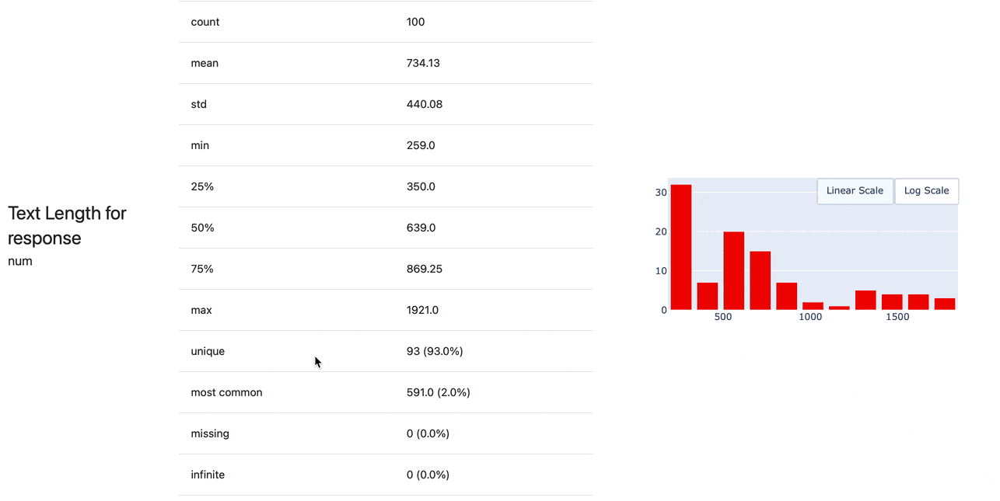
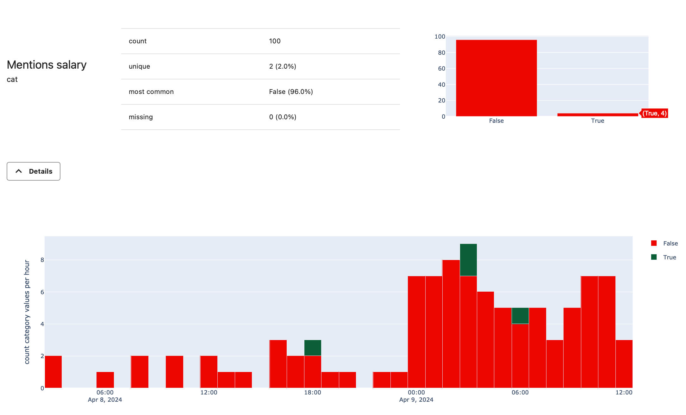
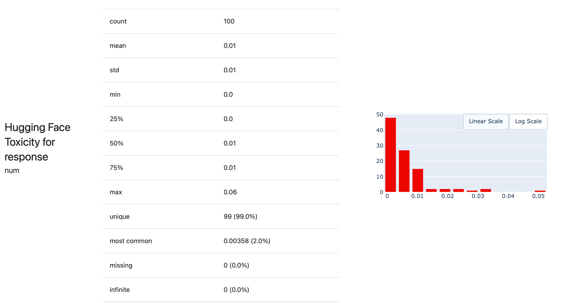

Evaluating output quality is a crucial element of building production-grade LLM applications. During development, you must compare different prompts and models and catch issues as you tweak them. Once your application is live, you must monitor its performance on actual data to ensure it's safe and accurate and learn from user interactions.

Simple "vibe checks" of individual outputs don't scale well. This tutorial shows how you can automate LLM evaluations from experiments to productions.


**Want a very simple example first?** This ["Hello World"](quickstart-llm.md) will take a couple minutes.


In this tutorial, you will:
* Run preset evaluations for text data.
* Build a custom evaluation suite using assertions and model-based grading.
* Visualize results to compare two datasets or experiments.
* Create a test suite to catch regressions automatically.
* Get a live dashboard to track evaluation results.

You can run this tutorial locally, with the option to use Evidently Cloud for live monitoring in the final step.

**Requirements:**
* Basic Python knowledge.
* The open-source Evidently Python library.

**Optional**:
* An OpenAI API key (to use LLM-as-a-judge).
* An Evidently Cloud account (for live monitoring).

This tutorial covers several methods for LLM evals, from regular expressions to external ML models for scoring and LLM judges. We'll use a Q&A chatbot as an example use case, but these methods apply to other use cases like RAGs and agents.

Let's get started!

# 1. Installation and imports

Install Evidently in your Python environment:

```python
!pip install evidently[llm]
```

Import the components to prepare the toy data:

```python
import pandas as pd
import numpy as np
from datetime import datetime, timedelta
```

Import the components to run the evals:

```python
from evidently import ColumnMapping
from evidently.report import Report
from evidently.test_suite import TestSuite
from evidently.metric_preset import TextEvals
from evidently.descriptors import *
from evidently.metrics import *
from evidently.tests import *
```

For some checks, you also need the NLTK package:

```python
import nltk
nltk.download('words')
nltk.download('wordnet')
nltk.download('omw-1.4')
nltk.download('vader_lexicon')
```

**Optional**. To be able to send results to Evidently Cloud.

```python
from evidently.ui.workspace.cloud import CloudWorkspace
```

**Optional**. To remotely manage the dashboard design.

```python
from evidently.ui.dashboards import DashboardPanelTestSuite
from evidently.ui.dashboards import PanelValue
from evidently.ui.dashboards import ReportFilter
from evidently.ui.dashboards import TestFilter
from evidently.ui.dashboards import TestSuitePanelType
from evidently.renderers.html_widgets import WidgetSize
```

# 2. Prepare a dataset

We'll use an example dialogue dataset imitating a company Q&A system where employees ask questions about HR, finance, etc. Download the CSV file from GitHub: 
* [Example dataset](https://github.com/evidentlyai/evidently/blob/main/examples/how_to_questions/chat_df.csv)

Import it as a pandas DataFrame and add a datetime index:

```python
assistant_logs =  pd.read_csv('chat_df.csv', index_col=0, parse_dates=['start_time', 'end_time'])
assistant_logs.index = assistant_logs.start_time
assistant_logs.index.rename('index', inplace=True)
```

Here is a preview. Use `assistant_logs.head()` to see it:



**How do I pass my own data?** Import it as a pandas DataFrame. The structure is flexible: you can include text columns (inputs and responses), DateTime columns, and optional metadata like ID, feedback, model type, etc. If you have multi-turn conversations, parse them into a table by session or input-output pairs.


# 3. Create a Project 

**This step is optional**. You can also run all evaluations locally. 


To be able to save and share results and get a live monitoring dashboard, create a Project in Evidently Cloud. Here's how to set it up:

1. **Sign up**: Create an [Evidently Cloud account](https://app.evidently.cloud/signup)).
2. **Add a Team**: Click “plus” on the homepage. Copy the team ID from the [team page](https://app.evidently.cloud/teams).
3. **Get your API token**: Click the key icon in the left menu. Generate and save a token.
4. **Create a Project**: Connect to Evidently Cloud using the API key. Create a new Project inside your Team, adding your title and description.

```python
ws = CloudWorkspace(token="YOUR_API_TOKEN", url="https://app.evidently.cloud")

project = ws.create_project("My сhatbot project", team_id="YOUR_TEAM_ID")
project.description = "My project description"
project.save()
```
# 4. Run your first eval

**Column mapping**. This optional step helps identify specific columns in your data. For example, pointing to a "datetime" column will add a time index to the plots.

```python
column_mapping = ColumnMapping(
    datetime='start_time',
    datetime_features=['end_time'],
    text_features=['question', 'response'],
    categorical_features=['organization', 'model_ID', 'region', 'environment', 'feedback'],
)
```
** Run simple evals**. Let's generate a Report with some text statistics using a `TextEval` Preset. We'll look at the "response" column in the first 100 rows `assistant_logs[:100]`:

```python
text_evals_report = Report(metrics=[
    TextEvals(column_name="response")
    ]
)

text_evals_report.run(reference_data=None, current_data=assistant_logs[:100], column_mapping=column_mapping)
text_evals_report
```

The Report will show stats like text length, sentiment and % of out-of-vocabulary words. 



We call these generated statistics `descriptors`. They can be numerical or categorical. 

This simple example is just a starting point. We’ll show more evaluations later on.

## 5. Export results


**This step is optional**. You can proceed with exporting or sending data.


You can export and save evaluation results beyond viewing them in Python. Here are some options.

**Python dictionary**. Get summary scores:
```python
text_evals_report.as_dict()
```

**JSON**. Export summary scores as JSON:
```python
text_evals_report.json()
```

**HTML**. Save a visual HTML report as a file:
```python
text_evals_report.save_html("report.html")
```

**Publish a DataFrame**. You can add computed scores (like sentiment) directly to your original dataset. This allows you to further analyze your data, e.g. by finding low-sentiment responses.

```python
text_evals_report.datasets()[1]
```

**Evidently Cloud**. Save results for sharing and tracking quality over time. To add the Report to the Project you created earlier, use `add_report`. 

```python
ws.add_report(project.id, text_evals_report)
```

To see it in the UI, go to the Reports section using the left menu.

# 6. Customize evaluations

You can create a custom evaluation suite with different types of checks:
* **Rule-based**. Detect specific words or patterns in your data.
* **ML-based**. Use external models to score data (e.g., for toxicity, topic, tone).
* **LLM-as-a-judge**. Prompt LLMs to categorize or score texts.
* **Statistical evals**. Apply similarity and distance metrics.
* **Custom Python functions**.
  
Evidently provides a library of ready-made descriptors to parametrize. The following section will show a few examples. For clarity, we'll generate separate Reports for each group of checks. In practice, you can put all evals together in a single Report. 

**Note**: These are not just visual Reports! Later sections will also cover automating pass/fail checks with Test Suites and monitoring dashboards. 

## Rule-based evals 

These evals are fast and cheap to compute at scale. Evidently has built-in descriptors for:
* **Regular expression checks** (custom `RegExp`, `BeginsWith`, `EndsWith`, `Contains`, `IncludesWords`, etc.). Then return a binary score ("True" or "False") for each row.
* **Numerical descriptors** like `OOV` (share of out-of-vocabulary words), `SentenceCount`, `WordCount`, etc., which return a numerical score for each row in the dataset.

You will again use `TextEvals` preset, but now add a list of descriptors with their parameters. Display names are optional but make the Report easier to read.

```python
text_evals_report = Report(metrics=[
    TextEvals(column_name="response", descriptors=[
        SentenceCount(),
        WordCount(),
        IncludesWords(words_list=['salary'], display_name="Mentions salary"),
        ExcludesWords(words_list=['wrong', 'mistake'], display_name="Does not mention mistakes"),
        ]
    ),
    TextEvals(column_name="question", descriptors=[
        BeginsWith(display_name="'How' question", prefix="How"),
        RegExp(reg_exp=r"^I", display_name= "'I' question"),
        ]
    )
])

text_evals_report.run(reference_data=None, current_data=assistant_logs[:100], column_mapping=column_mapping)
text_evals_report
```

Here is an example result for `IncludesWords(words_list=['salary'])` descriptor. You can see only 4 instances that match this condition. "Details" show occurrences in time.



## ML models

You can also use any pre-trained machine learning model to score your texts. Evidently has:
* In-built model-basded descriptors like `Sentiment` (scores texts from negative -1 to positive 1).
* Wrappers to call external Python functions or models published on HuggingFace (`HuggingFaceModel` descriptor).

Let's score the data by Sentiment (in-built model) and a Toxicity (exteranl HuggingFace model). 

```python
text_evals_report = Report(metrics=[
    TextEvals(column_name="response", descriptors=[
        Sentiment(),
        HuggingFaceModel("toxicity", "DaNLP/da-electra-hatespeech-detection",
                         {"module_type": "measurement"}, {"toxic_label": "offensive"},
                         "toxicity", display_name="Hugging Face Toxicity for response")
        ]
    ),
])

text_evals_report.run(reference_data=None, current_data=assistant_logs[:100], column_mapping=column_mapping)
text_evals_report
```

This code downloads the Hugging Face model to score your data locally. 
Example result with distribution of toxicity scores:



## LLM as a judge


**This step is optional**. Skip if you don't have an OpenAI API key or want to avoid using external LLMs.  



**OpenAI key**. Pass it as an environmental variable. You will incur costs when running this eval.


For more complex or nuanced checks, you can use LLMs as a judge. This requires creating an evaluation prompt asking LLMs to assess the text by specific criteria, for example, tone or conciseness.

To illustrate, let's create a prompt to ask the LLM to judge if the provided text includes personally identifiable information (PII) and return the label "1" if it is present. Use "REPLACE" in the prompt to specify where to include the text from your column.  

```python
pii_prompt = """
Personally identifiable information (PII) is information that, when used alone or with other relevant data, can identify an individual.

PII may contain direct identifiers (e.g., passport information) that can identify a person uniquely or quasi-identifiers (e.g., race) that can be combined with other quasi-identifiers (e.g., date of birth) to successfully recognize an individual.
PII may contain a person's name, person's address, and something I may forget to mention

Please identify whether or not the text below contains PII.

text: REPLACE

Use the following categories for PII identification:
1: if the text contains PII
0: if the text does not contain PII
0: if the information provided is not sufficient to make a clear determination

Return a category only.
"""
```

Include an `OpenAIPrompting` descriptor to the Report, refering this prompt. We will pass only 10 lines of code to the current data to minimize API calls.

```python
text_evals_report = Report(metrics=[
    TextEvals(column_name="response", descriptors=[
        OpenAIPrompting(prompt=pii_prompt,
                        prompt_replace_string="REPLACE",
                        model="gpt-3.5-turbo-instruct",
                        feature_type="num",
                        display_name="PII for response (by gpt3.5)"),
    ])
])
text_evals_report.run(reference_data=None, current_data=assistant_logs[:10], column_mapping=column_mapping)
text_evals_report
```

## Metadata columns

Our dataset also includes pre-existing metadata like a categorical columns with upvotes and downvotes. You can include summaries for any numerical or categorical column in the Report.

To add a summary on the “feedback” column, use `ColumnSummaryMetric()`:

```python
data_report = Report(metrics=[
   ColumnSummaryMetric(column_name="feedback"),
   ]
)

data_report.run(reference_data=None, current_data=assistant_logs[:100], column_mapping=column_mapping)
data_report
```

You will see a summary of upvotes and downvotes.


# 7. Compare datasets

You might want to compare two datasets using the same criteria. For example, you could compare completions to the same prompt from two different models or today's data to yesterday's. In Evidently, we call the two datasets `current` and `reference`.

## Side-by-side Reports

You can generate similar Report as before but with two datasets. This lets you visualize the distributions side by side.

For simplicity, let's take the first 100 rows as "reference" and the next 100 as "current". You can combine text evals and metadata summary.

```python
text_evals_report = Report(metrics=[
    TextEvals(column_name="response", descriptors=[
        Sentiment(),
        IncludesWords(words_list=['salary'], display_name="Mentions salary"),
        WordCount(),
        ]
    ),
    ColumnSummaryMetric(column_name="feedback"),
])

text_evals_report.run(reference_data=assistant_logs[:100], current_data=assistant_logs[100:200], column_mapping=column_mapping)
text_evals_report
```

Here is how a summary of upvotes and downvotes looks for two datasets:


## Data Drift detection

In addition to side-by-side visualizations, you can evaluate data drift - shift in distributions between two datasets. You can run statistical tests or use distance metrics.

You can compare both the distribution of raw texts (“how different the texts are”) and distributions of descriptors (e.g., “how different is the distribution of text length”). 

This is useful for detecting pattern shifts. For example, you might notice a sudden increase in responses of fixed length or that responses generally become shorter or longer. You can also use the "drift score" as a metric in monitoring to detect when things change significantly.

**Descriptor drift**. To compare the distribution of descriptors:

```python
drift_report = Report(metrics=[
    TextDescriptorsDriftMetric("response", descriptors={
        "Response Text Length" : TextLength(),
        "Response Word Count" : WordCount(),
        "Response Sentiment" : Sentiment(),
    }),
])

drift_report.run(reference_data=assistant_logs[:100], current_data=assistant_logs[100:200], column_mapping=column_mapping)
drift_report
```


