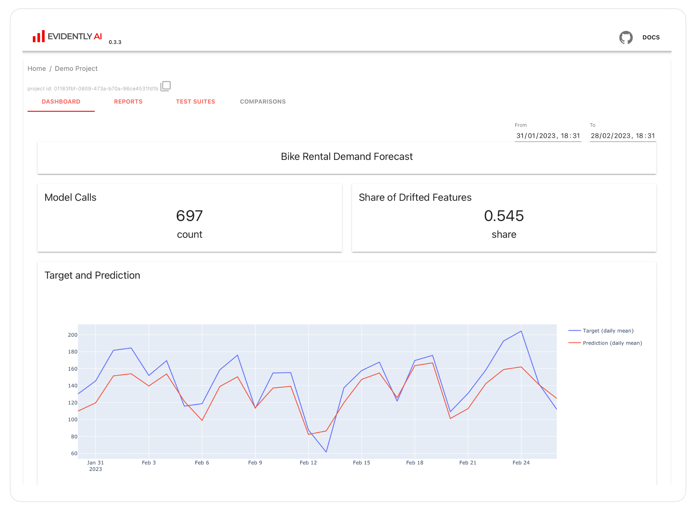
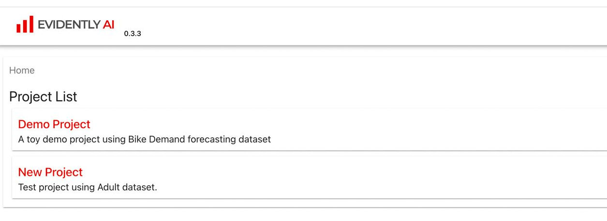

In this tutorial, you'll learn how to start with Evidently ML monitoring. You will launch a locally hosted dashboard to visualize the performance of a toy model.

**Note**: If you want to start with ad hoc Reports and Tests without hosting a Monitoring UI service, go here instead: [Quickstart for Evidently Tests and Reports](tutorial.md).

The tutorial is split into two parts. 

**Part 1**. Estimated time: 2 minutes. You will launch a demo example.
* Install Evidently
* Launch a pre-built demo project 

**Part 2**. Estimated time: 15 minutes. You will add a new project to the monitoring UI.
* Create a new workspace and project 
* Imitate batch model inference
* Design a few monitoring panels 
* View the dashboards

**Note**: This guide assumes you run Evidently locally.

# Part 1. Pre-built demo

## 1. Create virtual environment

Optional, but highly recommended. Create a virtual environment and activate it. Run the following command in the Terminal:

```
pip install virtualenv
virtualenv venv
source venv/bin/activate
```

## 2. Install Evidently

Evidently is available as a PyPi package. Run this command to install Evidently:

```
pip install evidently
```

You can also install Evidently from Conda:
```
conda install -c conda-forge evidently
```

**Note**: ML monitoring is available starting from Evidently version 0.4.0.

## 3. Run demo project

To launch the Evidently service with the demo project, run: 

```
evidently ui --demo-project
```
 
## 4. View the project

To view the Evidently interface, go to URL http://localhost:8000 in your web browser.



You will see a pre-built project that shows the toy model quality over 20 days. You can switch between tabs and view individual Reports and Test Suites. Each Report or Test Suite contains the information logged for a daily period. The monitoring dashboard parses the data from these Reports and shows how metrics change over time.


**What is a Test Suite and a Report?** If you are new to Evidently, we recommend that you go through the [Quickstart for Tests and Reports](tutorial.md) next. This functionality helps log data and model metrics for ML monitoring. 


# Part 2. Add a new project

In this section, you will create a new project as if you add a new ML model to monitor. You will imitate batch model inference to collect logs and design panels to visualize them. 
All steps are available as a Python script. 

You can access it here: 


**Note**: we assume you already installed Evidently at the previous step.

## 1. Open the Python script

Open and explore the `get_started_monitoring.py`.   

This script does the following:
* Imports the required components
* Imports a toy dataset 
* Defines the metrics to log using Evidenty Reports and Test Suites 
* Computes the metrics iterating over toy data 
* Creates a new Evidently workspace and project
* Creates several panels to visualize the metrics  
 
You can simply run this script without changes. The sections below are optional. They describe each step in the script and what you can change – if you are up to it!

### 1.1. Imports

Import the required components.

```python
import datetime

from sklearn import datasets

from evidently.metrics import ColumnDriftMetric
from evidently.metrics import ColumnSummaryMetric
from evidently.metrics import DatasetDriftMetric
from evidently.metrics import DatasetMissingValuesMetric
from evidently.report import Report
from evidently.test_preset import DataDriftTestPreset
from evidently.test_suite import TestSuite
from evidently.ui.dashboards import CounterAgg
from evidently.ui.dashboards import DashboardPanelCounter
from evidently.ui.dashboards import DashboardPanelPlot
from evidently.ui.dashboards import PanelValue
from evidently.ui.dashboards import PlotType
from evidently.ui.dashboards import ReportFilter
from evidently.ui.remote import RemoteWorkspace
from evidently.ui.workspace import Workspace
from evidently.ui.workspace import WorkspaceBase
```
Import the data and create a `pandas.DataFrame` using the OpenML `adult` dataset. 

We single out the part of the dataset `adult_ref` that we will later use as a baseline for drift detection. We use the rest `adult_cur` to imitate batch inference. 

```python
adult_data = datasets.fetch_openml(name="adult", version=2, as_frame="auto")
adult = adult_data.frame

adult_ref = adult[~adult.education.isin(["Some-college", "HS-grad", "Bachelors"])]
adult_cur = adult[adult.education.isin(["Some-college", "HS-grad", "Bachelors"])]
```

This step is added for demo purposes. In practice, you should work with production data.

### 1.2. Name the workspace and project

Assign a name to the Evidently workspace and your project. A project corresponds to an ML model you monitor. You will see this name and description in the user interface. 

```python
WORKSPACE = "workspace"

YOUR_PROJECT_NAME = "New Project"
YOUR_PROJECT_DESCRIPTION = "Test project using Adult dataset."
```

Workspace defines the folder where Evidently will log data to. It will be created in the directory where you launch the script from. 

### 1.3. Define metrics to log

To capture data and model metrics, we use Evidently Reports and Test Suites. You need to define a Report and/or a Test Suite object and list the metrics or tests to include. You can pass optional parameters – such as set a drift detection method instead of the [default](../reference/data-drift-algorithm.md) choice. 


**Test Suites and Reports.** We use the same syntax to log the data as when running Evidently Reports and Tests Suites ad hoc, for example, in a Jupyter notebook. Go through the [Quickstart](tutorial.md) if you need a refresher.  


To imitate batch inference, we run computations as if we captured data for `i` days (we will set it to 5), each time taking 100 observations. In practice, you must work with actual prediction data.

We also pass `adult_ref` as the `reference_data` to the Evidently Report. It will be used as the basis of comparison for distribution drift detection.   

```python
def create_report(i: int):
    data_drift_report = Report(
        metrics=[
            DatasetDriftMetric(),
            DatasetMissingValuesMetric(),
            ColumnDriftMetric(column_name="age", stattest="wasserstein"),
            ColumnSummaryMetric(column_name="age"),
            ColumnDriftMetric(column_name="education-num", stattest="wasserstein"),
            ColumnSummaryMetric(column_name="education-num"),
        ],
        timestamp=datetime.datetime.now() + datetime.timedelta(days=i),
    )

    data_drift_report.run(reference_data=adult_ref, current_data=adult_cur.iloc[100 * i : 100 * (i + 1), :])
    return data_drift_report
```

**What you can change:**
* The complete script uses both Test Suite and Report for logging. It is not required to use both – this depends on your preference. 
* You can select other Metrics or Tests to define the contents of your monitoring. Consider using other checks for data quality, integrity, or data drift. You can select individual metrics or pre-built presets. See the full list of [Metrics](../reference/all-metrics.md) and [Tests](../reference/all-tests.md) in the docs. 
* You can pass additional parameters to the individual tests and metrics.


**Evaluating model quality.** For simplicity, the example works with a raw dataset. There is no model! You cannot compute model quality metrics for this dataset – you need to include prediction and target columns. You might also need to use [column Mapping](../input-data/column-mapping.md) to map your inputs.


### 1.4. Add panels to the project

Define how you create a new project in the workspace: 

```python
def create_project(workspace: WorkspaceBase):
    project = workspace.create_project(YOUR_PROJECT_NAME)
    project.description = YOUR_PROJECT_DESCRIPTION
```

Each project can include multiple panels that appear on the monitoring dashboard. A panel visualizes a particular metric or metrics captured in Reports or Test Suites over time. You can visualize metrics as counters, time series plots, bar charts, and scatter plots.

Here is an example of adding a counter metric. The complete script includes several more.

```python
    project.dashboard.add_panel(
        DashboardPanelCounter(
            title="Model Calls",
            filter=ReportFilter(metadata_values={}, tag_values=[]),
            value=PanelValue(
                metric_id="DatasetMissingValuesMetric",
                field_path=DatasetMissingValuesMetric.fields.current.number_of_rows,
                legend="count",
            ),
            text="count",
            agg=CounterAgg.SUM,
            size=1,
        )
    )
```

As a `metric_id`, you pass the name of the Evidently Metric that was logged as part of the Report. As a `field_path`, you select the metric result computed as part of this Metric. Since Evidently Metrics contain multiple data points, you must specify which to show on a dashboard. You can display multiple metrics on a single panel. 

**What you can change**:
* You can specify the panel title and the legend visible in the interface. 
* You can set the size of each panel as full-width (`size=2`, default) or half-width (`size=1`). 
* You can define the aggregation function or select to show the last metric value.
* You can add panels of different types following the examples in the script.

### 1.5. Save snapshots

To create logs parsable by the Evidently UI, you must save the Report or Test Suite output as a `snapshot`. This is a rich JSON object that contains summaries of the captured data and model metrics. You must store the snapshots in the object storage under the corresponding workspace name.

```python
project.save()
return project
```

### 1.6. Create the workspace and project

Finally, create the project and workspace. When you execute the script, Evidently will log the snapshots with the selected metrics to the defined workspace folder, as if you captured data for 5 days. It will also create the dashboard panels.

```python
def create_demo_project(workspace: str):
    ws = Workspace.create(workspace)
    project = create_project(ws)

    for i in range(0, 5):
        report = create_report(i=i)
        ws.add_report(project.id, report)

        test_suite = create_test_suite(i=i)
        ws.add_test_suite(project.id, test_suite)

if __name__ == "__main__":
    create_demo_project("workspace")
```

If you made any edits to this script, save them. 

## 2. (Optional). Delete workspace

If this is not the first run of the script, and you reuse the same project – run the command to delete a previously generated workspace:

```
cd src/evidently/ui/
rm -r workspace
```

## 3. Run the script

Run the command to generate a new example project as defined in the script above.

```
python get_started_monitoring.py
```

## 4. Run the Evidently UI service

Finally, launch the user interface that will include the defined project. 

**4.1**. If you only want to include your project, run:

```
evidently ui 
```

**4.2**. If you want to see both your new project and a standard demo project, run:

```
evidently ui –-demo-project
```

**Note**: If you already launched a demo project previously, it will remain in the workspace. There is no need to add it the second time.



**4.3**. If you want to have your project in the specified workspace and have the UI service running at the specific port:

```
evidently ui --workspace ./workspace --port 8080
```

**4.4**. If you want to see both your project and demo project in the specified workspace and run the UI service at the specific port:

``` 
evidently ui --workspace ./workspace --port 8080 –-demo-project
```

**Note**. Evidently collects anonymous telemetry about service usage. You can opt-out as described [here](../support/telemetry.md)). We’d greatly appreciate it if you keep the telemetry on since it allows us to understand usage patterns and continue building useful free tools for the community.

## 5. View the new project 

Access Evidently UI service in your browser to see the dashboards for the new project. Go to the `localhost:8000`, or a specified port if you set a different one. 

# What’s next?
If you want to enable monitoring for an existing ML project, you must collect the data from your production pipelines or services, or run monitoring jobs over production logs stored in a data warehouse. The exact integration scenario depends on the model deployment type and infrastructure.  

Here is one possible approach. You can implement it using a workflow manager like Airflow to compute Evidently snapshots on a regular cadence.


You can browse sample [integrations](../integrations). We’ll add more example integrations in the future.  

# Join our Community!

We run a [Discord community](https://discord.gg/xZjKRaNp8b) to connect with our users and chat about ML in production topics. In case you have feedback or need help, just ask in Discord or open a GitHub issue.

Evidently is in active development, so expect things to change and evolve. Subscribe to the [user newsletter](https://www.evidentlyai.com/user-newsletter) to stay updated about the latest functionality. 

And if you want to support a project, give us a star on [GitHub](https://github.com/evidentlyai/evidently)!


