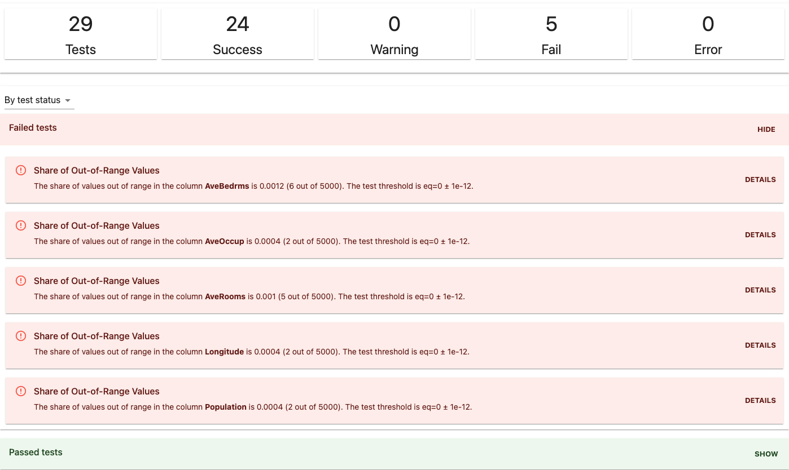
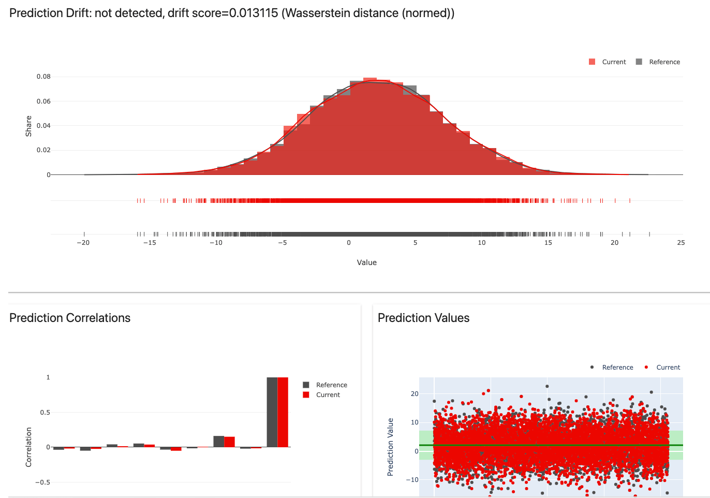

# Get Started Tutorial

In this tutorial, you will use the Evidently open-source Python library to evaluate **data stability** and **data drift**. You will run batch checks on a toy dataset and generate visual reports.

We suggest going through this tutorial once to understand the basic functionality. You can then explore advanced features such as custom metrics and real-time monitoring.

To complete the tutorial, you need basic knowledge of Python and familiarity with notebook environments. You should be able to complete it in **under 10 minutes**.

You can reproduce the steps in Jupyter notebooks or Colab or open and run a sample notebook from the links below.  

Colab:


Jupyter notebook:


In the tutorial, you will go through the following steps:
* Install Evidently
* Prepare the data
* Run data stability tests 
* Generate data and prediction drift report 
* Create a custom test suite

## 1. Install Evidently

### MAC OS and Linux

To install Evidently using the pip package manager, run:

```bash
$ pip install evidently
```
If you want to explore the plots inside a Jupyter notebook, you must install Jupyter **nbextension**. After installing `evidently`, run the **two following commands** in the terminal from the Evidently directory.

To install jupyter nbextension, run:

```
$ jupyter nbextension install --sys-prefix --symlink --overwrite --py evidently
```

To enable it, run:

```
$ jupyter nbextension enable evidently --py --sys-prefix
```

That's it!

### Google Colab, Kaggle Kernel, Deepnote


To install `evidently`, run the following command in the notebook cell:

```
!pip install evidently
```
### Windows

Unfortunately, building visual HTML reports inside a **Jupyter notebook** is **not yet possible** for Windows. You can still install Evidently and get the output as JSON or a separate HTML file.

To install Evidently, run:

```bash
$ pip install evidently
```

## 2. Import Evidently

After installing the tool, import `evidently` and the required components. In this tutorial, you will use several **test suites** and **reports**. Each of them corresponds to a specific type of analysis. 
 
You will also need to import `pandas`, `numpy`, and the toy `california_housing` dataset.

```python
import pandas as pd
import numpy as np

from sklearn.datasets import fetch_california_housing

from evidently.pipeline.column_mapping import ColumnMapping

from evidently.report import Report
from evidently.metric_preset import DataDriftPreset
from evidently.metric_preset import NumTargetDrift

from evidently.test_suite import TestSuite
from evidently.test_preset import DataQualityTestPreset
from evidently.test_preset import DataStabilityTestPreset
from evidently.tests import *
```

## 3. Prepare the data

In the example, you will work with a toy dataset. In practice, you should use the model prediction logs. They can include input data, model predictions, and true labels or actuals, if available. 

To prepare the data for analysis, create a `pandas.DataFrame`:

```python
data = fetch_california_housing(as_frame=True)
housing_data = data.frame
```

Rename one of the columns to “target” and create a “prediction” column. This way, the dataset will resemble the model application logs with known labels. 

```python
housing_data.rename(columns={'MedHouseVal': 'target'}, inplace=True)
housing_data['prediction'] = housing_data['target'].values + np.random.normal(0, 5, housing_data.shape[0])
```

Split the dataset by taking 5000 objects for **reference** and **current** datasets. This way, you’ll get two samples you can compare.  

```python
reference = housing_data.sample(n=5000, replace=False)
current = housing_data.sample(n=5000, replace=False)
```

The first **reference** dataset is the baseline. This is often the data used in model training or earlier production data. The second dataset is the **current** production data. Evidently will compare the current data to the reference. 
 
You can prepare two datasets with an identical schema like in this example or take a single dataset and explicitly identify rows for reference and current data.


**Column mapping.** In this example, we directly proceed to analysis. In other cases, you might need to create a **ColumnMapping** object to help Evidently process the input data correctly. For example, you can point to the encoded categorical features or specify the name of the target column. Consult the [Column Mapping section](../tests-and-reports/column-mapping.md) section for help.


## 4. Run the Data Stability tests

Imagine you received a new batch of data. Before generating the predictions, you want to check if the latest data looks similar to before. 

You will use Evidently **test suites** functionality.

Test suites help compare the two datasets in a structured way. A **test suite** contains several individual tests. Each **test** compares a specific metric against a defined condition and returns a pass/fail result. You can apply tests to the whole dataset or individual columns. 

You can create a custom test suite or use one of the **presets** that work out of the box.

Let’s start by running the **DataStabilityTestPreset**. It will run several checks for data quality and integrity and help detect issues like feature values out of the expected range. 

You need to create a `TestSuite` object and specify the preset to include. You will also point to the reference and current datasets created at the previous step.

```python
data_stability = TestSuite(tests=[
    DataStabilityTestPreset(),
])
data_stability.run(reference_data=reference, current_data=current)
```

Each test has default in-built configurations, and you can run them as is. To see the visual report, call the object in the notebook:

```python
data_stability
```

It will display the HTML report with the outcomes of the tests.



You can group the outputs by test status, feature, test group, and type. By clicking on “details,” you can also explore the visuals related to a specific test. 


**How does it work?** The data stability test suite compares two batches of data you expect to be similar. It automatically derives descriptive statistics from the reference dataset and compares them with the current data. For example, it expects the number of columns and their type to match precisely and no more than 10% of values to be out of range. 
 
You can also save the test results as a separate HTML file. You might need that for documentation or to share with the team.

To save the HTML, run:

```python
data_stability.save_html("file.html")
```

Go to the specified directory and open the file. If you get a security alert, press "trust HTML."


**Visualizations might work differently in other notebook environments**. For example, in the Jupyter lab, you won't be able to display the HTML directly in the cell. In this case, try exporting the file as HTML. In other notebooks like Kaggle and Deepnote, you might need to add an argument to display the report inline: iris_data_drift_report.show(mode='inline'). Consult [this section](../tests-and-reports/supported-environments.md) for help.


## 5. Get the Data and Target drift report

An alternative (or an addition!) to the test suite is a **report**. 

Evidently **reports** help to explore and debug data and model quality. Unlike tests, reports do not require defining explicit pass or fail conditions. Instead, they calculate various metrics and generate a dashboard with rich visuals. 

To start, you can again use presets that combine relevant metrics in a single report.

Let’s generate the pre-built report for Data Drift and combine it with Target Drift. The first report compares the input feature distributions, while the second compares the model outputs. You can use both to explore if an ML model still operates in a familiar environment.

To get the report, create a corresponding object and list the two presets. In the toy dataset, the target is numerical, so you will use the Numerical Target Drift report in addition to Data Drift.

```python
drift_report = Report(metrics=[DataDrift(), NumTargetDrift()])
 
drift_report.run(reference_data=reference, current_data=current)
drift_report
```
It will display the HTML combined report. 

First, you can see the Data Drift summary.


If you click on individual features, it will show additional plots to explore. 


**How does it work?** The data drift report compares the distributions of each feature in the two datasets. It [automatically picks](../reference/data-drift-algorithm.md) an appropriate statistical test or metric based on the feature type and volume. It then returns p-values or distances and visually plots the distributions. 

Since you combined the two reports in a single output, you can scroll to the Target Drift section. The toy dataset contains both **prediction** and **target** columns, so Evidently generated the reports for both.



**How does it work?** There are two use cases for the Target Drift report. When you only have the model predictions, you can evaluate the prediction drift. It will show if there is a statistically significant change: for example if the model assigns a particular category more frequently. If you have the true labels, you can evaluate target drift. It will show if the concept behind the model has evolved: for example, if a specific label does appear more frequently. The report picks the optimal statistical test and visualizes the relationship between features and target.

To save the report as HTML, run:

```python
drift_report.save_html("file.html")
```


**Large reports might take time to load.** The example dataset is small, so the report should appear quickly. If you use a larger dataset, the report might take time to show. The size limitation depends on your infrastructure. In this case, we suggest applying sampling to your dataset before passing it to Evidently. You can do it with pandas.


## 6. Run a custom test suite

Pre-built reports and test suites are handy and allow for an easy start. But once you start using the tool, you might want to see a different composition of tests or metrics. 

Here is how you can do this for **tests**. 

Create the `TestSuite` object and list the `tests` to include. Instead of the preset, you can add individual tests one by one.

```python
tests = TestSuite(tests=[
    TestNumberOfColumnsWithNulls(),
    TestNumberOfRowsWithNulls(),
    TestNumberOfConstantColumns(),
    TestNumberOfDuplicatedRows(),
    TestNumberOfDuplicatedColumns(),
    TestColumnsType(),
    TestNumberOfDriftedFeatures(), 
])
```

Run the tests as usual by pointing to the reference and current data.

```python
tests.run(reference_data=reference, current_data=current)
```

Call the object to see the HTML with the test results for this custom test suite.

```python
tests
```

It works the same for custom Reports which you can create from individual Metrics (coming soon).


**Customize it!** To explore the list of available individual tests, consult [All tests](../reference/all-tests.md) reference table. To see how to set custom test conditions, head to [User Guide](../tests-and-reports/run-tests.md).


## 7. Get the output as JSON

Interactive HTML output is helpful when you want to debug issues or share results with the team. However, it is not that convenient if you want to run your checks automatically.

To integrate Evidently checks in the prediction pipeline, you can get the output as JSON. 

To do it, run:

```python
tests.json()
```

You can extract necessary information from the JSON output and design a conditional workflow around it. For example, if some tests fail, you can trigger an alert, retrain the model or generate the report. 

Reports are also available as JSON. In this case, they include the metrics summary and simple histograms you can log and use elsewhere. 

```python
drift_report.json()
```

## 8. What else is there?

Both **tests** and **reports** have multiple presets available. Some require only input data, like Data Quality report and Data Quality test suite. You can use them even without the reference dataset. 

When you have the true labels, you can run presets like **Regression Performance** and **Classification Performance** to evaluate the model quality and errors. 

To understand the contents of each preset, you can explore the [Reports](../reports) and [Test Suites](../tests). If you want to see the code, head straight to the [Examples](../get-started/examples.md) section. 

If you need help with specific steps, consult the [User Guide](../tests-and-reports). 

If you want to explore more examples of how to integrate Evidently with other tools like MLflow and Airflow, refer to the [Integrations](../integrations). 
 
If you have a real-time ML service and want to collect data and model metrics on top of the live data stream, you can explore the [integration with Grafana and Prometheus](../integrations/evidently-and-grafana.md). 

Evidently is in active development, so expect things to change and evolve. You can subscribe to the [newsletter](https://evidentlyai.com/sign-up) or follow our [releases on GitHub](https://github.com/evidentlyai/evidently/releases) to stay updated about the latest functionality. 

## Join our Community!

We run a [Discord community](https://discord.gg/xZjKRaNp8b) to connect with our users and chat about ML in production topics. 

In case you have feedback or need help, just ask in Discord or open a GitHub issue. 

And if you want to support a project, give us a star on [GitHub](https://github.com/evidentlyai/evidently)!

