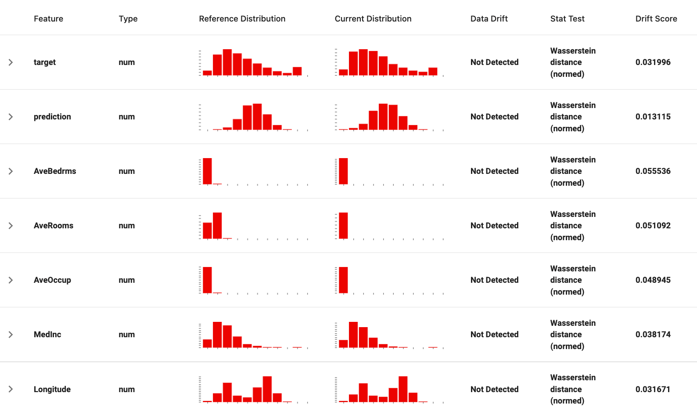
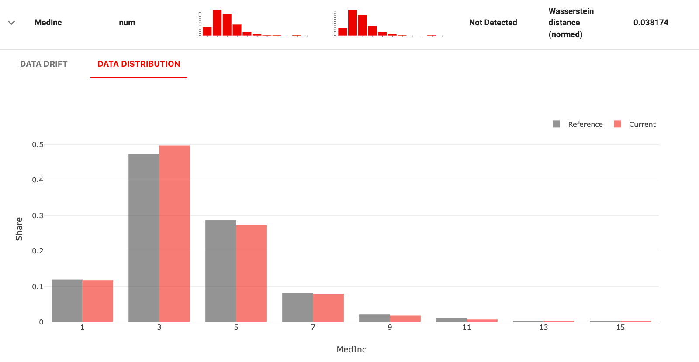
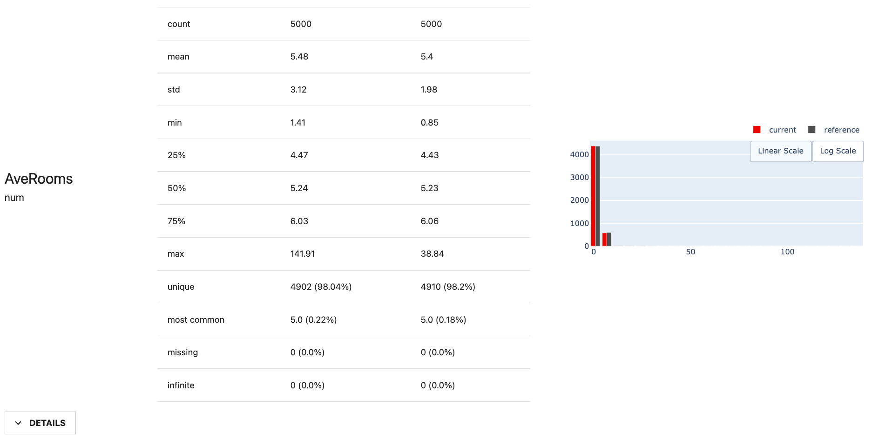
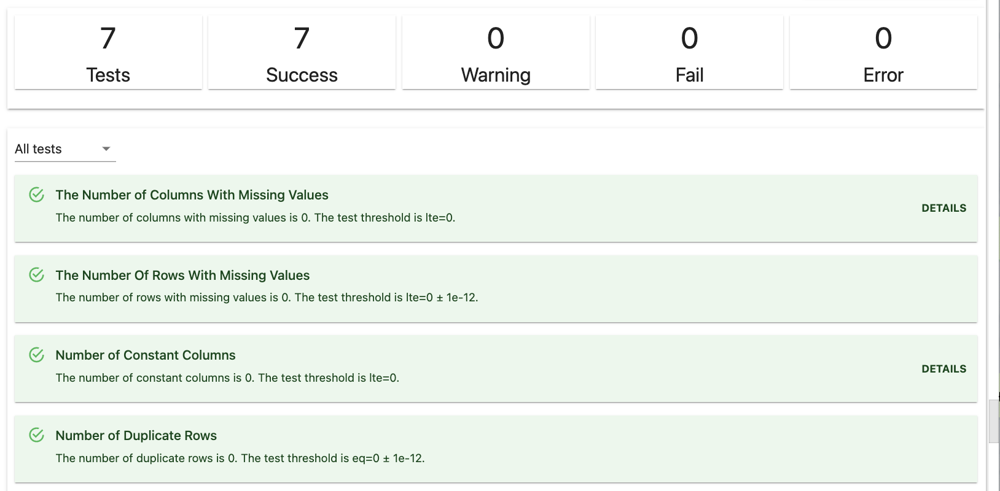
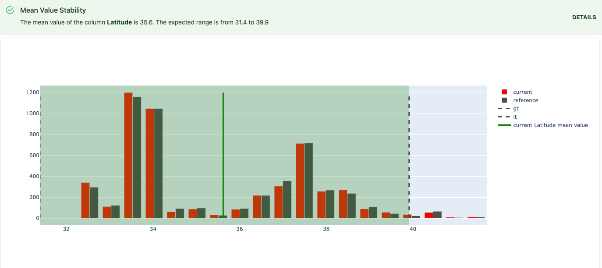
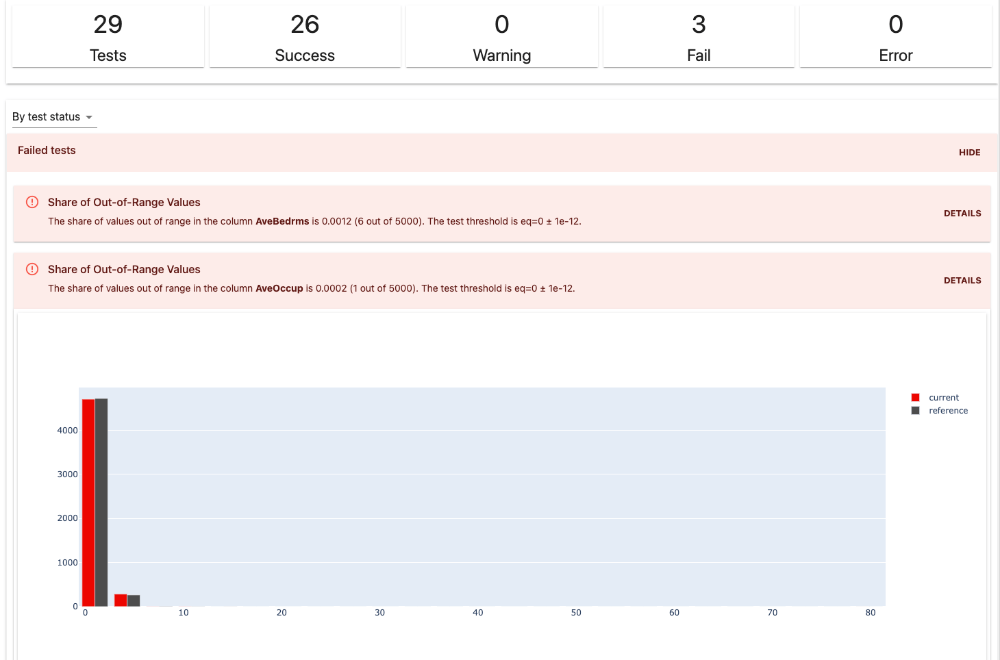

# Get Started Tutorial

In this tutorial, you will use the Evidently open-source Python library to evaluate **data stability** and **data drift**. You will run batch checks on a toy dataset and generate visual reports and test suites.

We recommend going through it once to understand the basic functionality. You can then explore more advanced workflows, like adjusting test parameters, adding custom metrics or integrating the tool in the prediction pipelines.

To complete the tutorial, you need basic knowledge of Python. You should be able to complete it in **about 15 minutes**.

You can reproduce the steps in Jupyter notebooks or Colab or open and run a sample notebook from the links below.  

Colab:


Jupyter notebook:


Video version:


You will go through the following steps:
* Install Evidently
* Prepare the input data
* Generate a pre-built data drift report
* Customize the report 
* Run and customize data stability tests 


## 1. Install Evidently

### MAC OS and Linux

To install Evidently using the pip package manager, run:

```bash
$ pip install evidently
```
If you want to explore the plots inside a Jupyter notebook, you must install Jupyter **nbextension**. After installing `evidently`, run the **two following commands** in the terminal from the Evidently directory.

To install jupyter nbextension, run:

```
$ jupyter nbextension install --sys-prefix --symlink --overwrite --py evidently
```

To enable it, run:

```
$ jupyter nbextension enable evidently --py --sys-prefix
```

That's it!

### Google Colab, Kaggle Kernel, Deepnote

To install `evidently`, run the following command in the notebook cell:

```
!pip install evidently
```

### Windows

Unfortunately, building visual HTML reports inside a **Jupyter notebook** is **not yet possible** for Windows. You can still install Evidently and get the output as JSON or a separate HTML file.

To install Evidently, run:

```bash
$ pip install evidently
```

## 2. Import Evidently

After installing the tool, import `evidently` and the required components. In this tutorial, you will use several **test suites** and **reports**. Each corresponds to a specific type of analysis. 
 
You should also import `pandas`, `numpy`, and the toy `california_housing` dataset.

```python
import pandas as pd
import numpy as np

from sklearn.datasets import fetch_california_housing

from evidently import ColumnMapping

from evidently.report import Report
from evidently.metrics.base_metric import generate_column_metrics
from evidently.metric_preset import DataDriftPreset, TargetDriftPreset
from evidently.metrics import *

from evidently.test_suite import TestSuite
from evidently.tests.base_test import generate_column_tests
from evidently.test_preset import DataStabilityTestPreset,NoTargetPerformanceTestPreset
from evidently.tests import *
```

## 3. Prepare the data

In the example, you will work with a toy dataset. In practice, you should use the model prediction logs. They can include input data, model predictions, and true labels or actuals, if available. 

To prepare the data for analysis, create a `pandas.DataFrame`:

```python
data = fetch_california_housing(as_frame=True)
housing_data = data.frame
```

Rename one of the columns to “target” and create a “prediction” column. This way, the dataset will resemble the model application logs with known labels. 

```python
housing_data.rename(columns={'MedHouseVal': 'target'}, inplace=True)
housing_data['prediction'] = housing_data['target'].values + np.random.normal(0, 5, housing_data.shape[0])
```

Split the dataset by taking 5000 objects for **reference** and **current** datasets.   

```python
reference = housing_data.sample(n=5000, replace=False)
current = housing_data.sample(n=5000, replace=False)
```

The first **reference** dataset is the baseline. This is often the data used in model training or earlier production data. The second dataset is the **current** production data. Evidently will compare the current data to the reference. 
 
If you work with your own data, you can prepare two datasets with an identical schema. You can also take a single dataset and explicitly identify rows for reference and current data.


**Column mapping.** In this example, we directly proceed to analysis. In other cases, you might need a `ColumnMapping` object to help Evidently process the input data correctly. For example, you can point to the encoded categorical features or specify the name of the target column. Consult the [Column Mapping section](../input-data/column-mapping.md) section for help.


## 4. Get the Data Drift report

Evidently **Reports** help explore and debug data and model quality. They calculate various metrics and generate a dashboard with rich visuals. 

To start, you can use **Metric Presets**. These are pre-built Reports that group relevant metrics to evaluate a specific aspect of the model performance. 

Let’s start with the **Data Drift**. This Preset compares the distributions of the model features and show which have drifted. When you do not have ground truth labels or actuals, evaluating input data drift can help understand if an ML model still operates in a familiar environment.

To get the Report, create a corresponding `Report` object, list the `preset` to include, and point to the reference and current datasets created in the previous step: 

```python
report = Report(metrics=[
    DataDriftPreset(), 
])

report.run(reference_data=reference, current_data=current)
report
```

It will display the HTML report directly in the notebook. 


**Visualizations might work differently in other notebook environments**. If you use Databricks, Kaggle and Deepnote notebooks, you should add an argument to display the report inline: report.show(mode='inline'). Consult [this section](../integrations/notebook-environments.md) for help.


First, you can see the Data Drift summary.



If you click on individual features, it will show additional plots to explore. 



<details>
<summary>How does it work?</summary>
 
The data drift report compares the distributions of each feature in the two datasets. It [automatically picks](../reference/data-drift-algorithm.md) an appropriate statistical test or metric based on the feature type and volume. It then returns p-values or distances and visually plots the distributions. You can also [adjust the drift detection method or thresholds](../customization/options-for-statistical-tests.md), or pass your own.
</details>


**Large reports might take time to load.** The example dataset is small, so the report appears quickly. If you use a larger dataset, the report might take time to show. The size limitation depends on your infrastructure. In this case, we suggest taking a sample of your dataset before passing it to Evidently. 


## 5. Customize the report

Evidently Reports are very configurable. You can define which Metrics to include and how to calculate them. 

To create a custom Report, you need to list individual **Metrics**. Evidently has dozens of Metrics that help evaluate anything from descriptive feature statistics to model quality. You can calculate Metrics on the column level (e.g., mean value of a specific column) or dataset-level (e.g., share of drifted features in the dataset).  

In this example, you can list several Metrics that evaluate individual statistics for the defined column. 

```python
report = Report(metrics=[
    ColumnSummaryMetric(column_name='AveRooms'),
    ColumnQuantileMetric(column_name='AveRooms', quantile=0.25),
    ColumnDriftMetric(column_name='AveRooms')
])

report.run(reference_data=reference, current_data=current)
report
```
You will see a combined report that includes multiple Metrics:



If you want to generate multiple column-level Metrics, there is a helper function. For example, in order to to calculate the same quantile value for all the columns in the list, you can use the generator: 

```
report = Report(metrics=[
    generate_column_metrics(ColumnQuantileMetric, parameters={'quantile':0.25}, columns=['AveRooms', 'AveBedrms']),
])

report.run(reference_data=reference, current_data=current)
report
```

You can easily combine individual Metrics, Presets and metric generators in a single list:

```
report = Report(metrics=[
    ColumnSummaryMetric(column_name='AveRooms'),
    generate_column_metrics(ColumnQuantileMetric, parameters={'quantile':0.25}, columns='num'),
    DataDriftPreset()
])

report.run(reference_data=reference, current_data=current)
report
```


**Available metrics and presets**. You can refer to the All Metrics [reference table](../reference/all-metrics.md) to browse available Metrics and Presets or use one of the example notebooks in the [Examples](../examples/examples.md) section.


## 6. Define the report output format

You can render the visualizations directly in the notebook as shown above. There are also alternative options. 

If you only want to log the calculated metrics and test results, you can export the results as a Python dictionary.

```python
report.as_dict()
```
You can also get the output as JSON. 

```python
report.json()
```

You can also save HTML or JSON externally. 

```python
report.save_html("file.html")
```

## 7. Run data stability tests

Reports are useful when you want to visually explore the data or model quality or share results with the team. However, it is less convenient if you want to run your checks automatically and only react to meaningful issues.

To integrate Evidently checks in the prediction pipeline, you can use the **Test Suites** functionality. They are also better suited to handle large datasets.

Test Suites help compare the two datasets in a structured way. A **Test Suite** contains several individual tests. Each **Test** compares a specific value against a defined condition and returns an explicit pass/fail result. You can apply Tests to the whole dataset or individual columns. 

Just like with Reports, you can create a custom Test Suite or use one of the **Presets** that work out of the box. 

Let's create a custom one! Imagine you received a new batch of data. Before generating the predictions, you want to check if the quality is good enough to run your model. You can combine several Tests to check missing values, duplicate columns, and so on. 

You need to create a `TestSuite` object and specify the `preset`:

```python
tests = TestSuite(tests=[
    TestNumberOfColumnsWithMissingValues(),
    TestNumberOfRowsWithMissingValues(),
    TestNumberOfConstantColumns(),
    TestNumberOfDuplicatedRows(),
    TestNumberOfDuplicatedColumns(),
    TestColumnsType(),
    TestNumberOfDriftedColumns(),
])

tests.run(reference_data=reference, current_data=current)
tests
```

You will get a summary with the test results:



<details>
<summary>How does it work?</summary>
 
Evidently automatically generates the test conditions based on the provided reference dataset. They are based on heuristics. For example, the test for column types fails if the column types do not match the reference. The test for the number of columns with missing values fails if the number is higher than in reference. The test for the share of drifting features fails if over 50% are drifting. If you want to override these defaults, you can [pass custom conditions](../tests-and-reports/custom-test-suite.md).
 
</details>

You can also use **Test Presets**. For example, `NoTargetPerformance` preset combines multiple checks related to data stability, drift and data quality to help evaluate the model without ground truth labels. 

```python
suite = TestSuite(tests=[
    NoTargetPerformanceTestPreset(),
])

suite.run(reference_data=reference, current_data=current)
suite
```

You can group the outputs by test status, feature, test group, and type. By clicking on “details,” you will see related plots or tables.



If some of the Tests fail, you can use the supporting visuals for debugging:



Just like with Reports, you can combine individual Tests and Presets in a single Test Suite and use column test generator to generate multiple column-level tests:

```python
suite = TestSuite(tests=[
    TestColumnDrift('Population'),
    TestShareOfOutRangeValues('Population'),
    generate_column_tests(TestMeanInNSigmas, columns='num'),
    
])

suite.run(reference_data=reference, current_data=current)
suite
```

**Available tests and presets**. You can refer to the All tests [reference table](../reference/all-tests.md) to browse available Tests and Presets. To see interactive examples, refer to the notebooks in the [examples](../examples/examples.md) section.


You can also export the output in other formats.

To integrate Evidently checks in the prediction pipeline, you can get the output as JSON or a Python dictionary: 

```python
suite.as_dict()
```

You can extract necessary information from the JSON or Python dictionary output and design a conditional workflow around it. For example, if some tests fail, you can trigger an alert, retrain the model or generate the report. 

## 8. What else is there?

* **Go through the steps in more detail**

If you want to walk through all the described steps in more detail, refer to the **User Guide** section of the docs. A good next step is to explore how to pass custom test parameters to define your own [test conditions](../tests-and-reports/custom-test-suite.md).  

* **Explore available presets**

Both **Tests** and **Reports** have multiple Presets available. Some, like Data Quality, require only input data. You can use them even without the reference dataset. When you have the true labels, you can run Presets like **Regression Performance** and **Classification Performance** to evaluate the model quality and errors. 

To understand the contents of each Preset, head to the [Preset overview](../presets). If you want to see the pre-rendered examples of the reports, browse Colab notebooks in the [Examples](../examples/examples.md) section. 

* **Explore available integrations**

To explore how to integrate Evidently with other tools, refer to the [Integrations](../integrations). 

If you are running predictions in batches, explore integrations with [MLflow](../integrations/evidently-and-mlflow.md) and [Airflow](../integrations/evidently-and-airflow.md).
 
If you have a real-time ML service and want to collect data and model metrics on top of the live data stream, you can explore the [integration with Grafana and Prometheus](../integrations/evidently-and-grafana.md). 

Evidently is in active development, so expect things to change and evolve. You can subscribe to the [user newsletter](https://www.evidentlyai.com/user-newsletter) or follow our [releases on GitHub](https://github.com/evidentlyai/evidently/releases) to stay updated about the latest functionality. 

## Join our Community!

We run a [Discord community](https://discord.gg/xZjKRaNp8b) to connect with our users and chat about ML in production topics. 

In case you have feedback or need help, just ask in Discord or open a GitHub issue. 

And if you want to support a project, give us a star on [GitHub](https://github.com/evidentlyai/evidently)!

