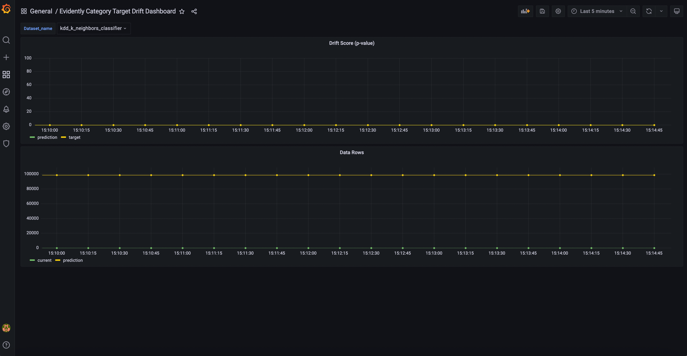
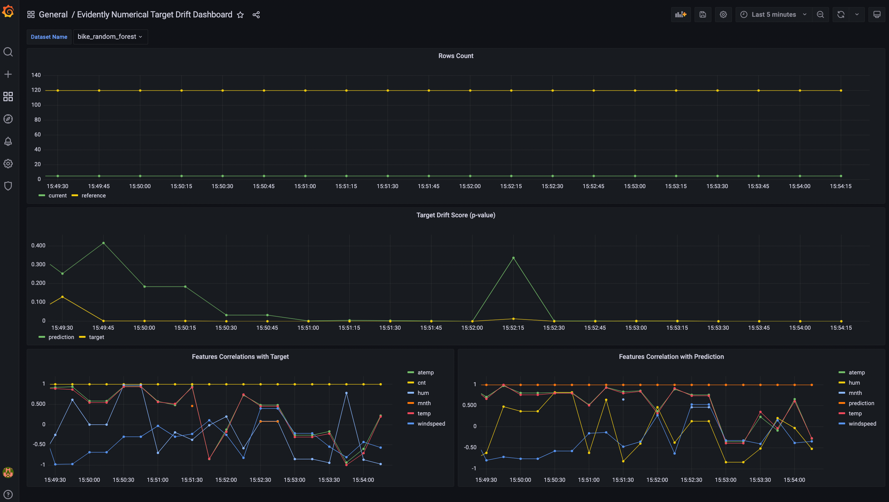

Evidently has a monitoring service component that collects data and model metrics from an ML service. It is based on the shared `Analyzer` functionality and can compute the same metrics and statistical tests as `Dashboards` and JSON `Profiles`. 

The `Monitors` output the metrics that can be further logged elsewhere. It is currently recommended to use the Evidently monitoring service together with Grafana and Prometheus. 

The core difference from JSON profiles is the ability to calculate metrics on top of the streaming data. Monitoring includes the configuration options that help define the monitoring logic by setting options like the size of the window, choice of moving reference, etc.    


**Monitoring functionality is in active developement and may be subject to API change.** If you integrate this in your production pipeline, we suggest explicitly specifying the Evidently package version. Feel free to ping us on Discord if you face any issues, and we'll help to figure them out. 


# Evidently and Grafana for real-time ML monitoring 

Grafana is an open-source [data visualization platform](https://github.com/grafana/grafana). It is frequently paired with the Prometheus [time series database](https://github.com/prometheus/prometheus) to monitor software system performance.

You can use this same stack for ML monitoring. In this case, Evidently provides a metrics calculation layer, Prometheus is used to store the metrics, and Grafana is used to display the dashboards and manage alerts. 

## Integration example

**An integration example is available as a Docker container:**


It contains a script that will spin up the example locally. Follow the readme to install and modify the example to adapt it to your use case.

The example includes several pre-built dashboards to display Evidently reports in the Grafana interface. You can customize and modify dashboards to your needs. The example also shows how you can set up several dashboards to monitor multiple models, and switch between the views.

## 1. Data Drift Dashboard

## 2. Classification Performance Dashboard

## 3. Regression Performance Dashboard

## 4. Categorical Target Drift Dashboard

## 5. Numerical Target Drift Dashboard

Go to example:


We plan to add more pre-built dashboards in the future. 

You can also read the [release blog post](https://evidentlyai.com/blog/evidently-and-grafana-ml-monitoring-live-dashboards).
