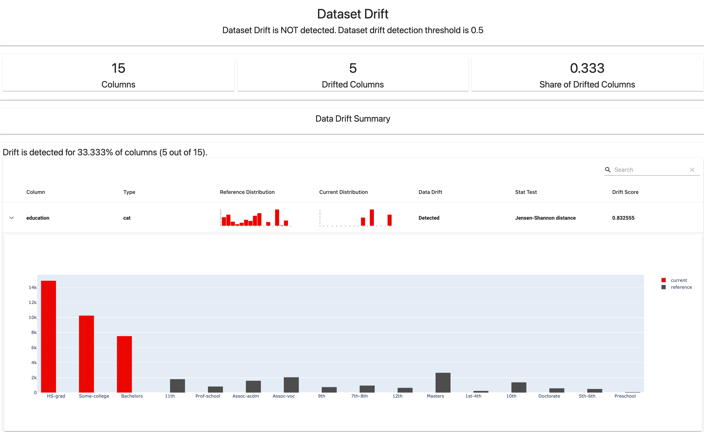
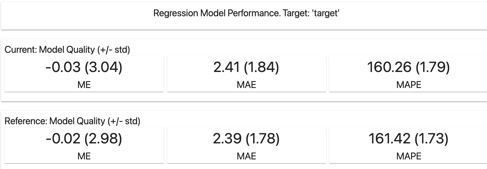
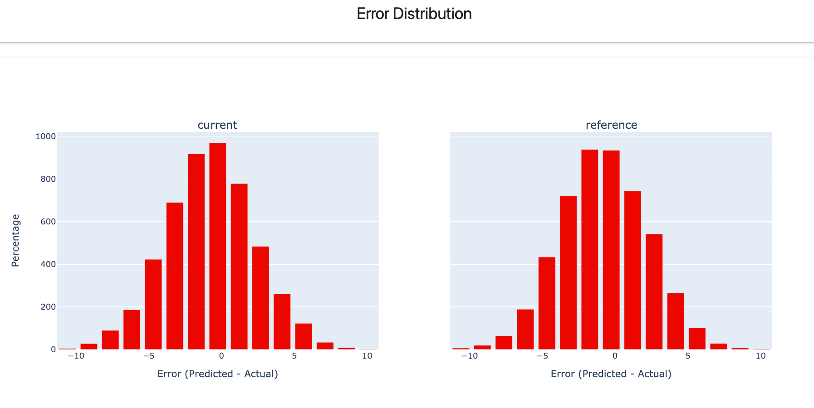
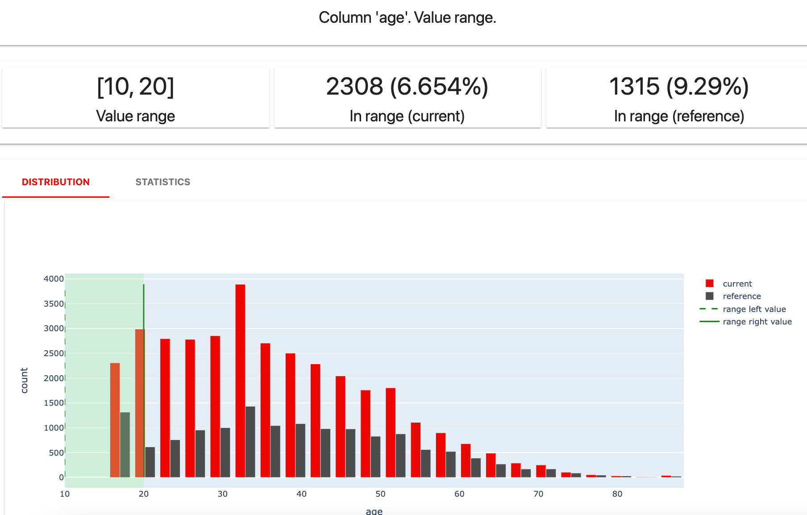
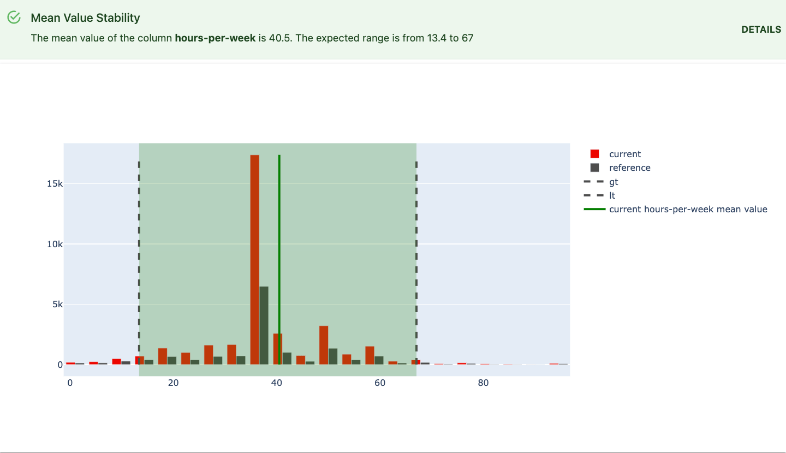
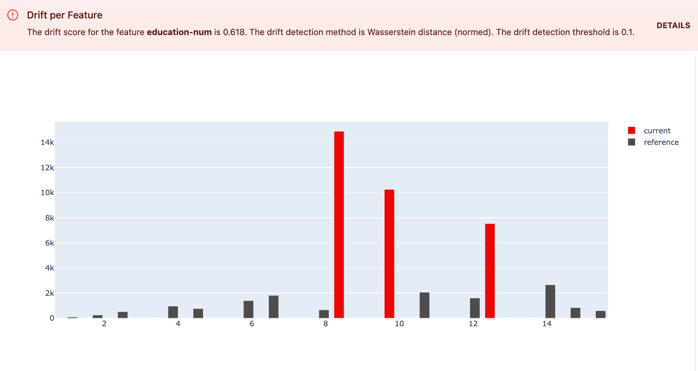
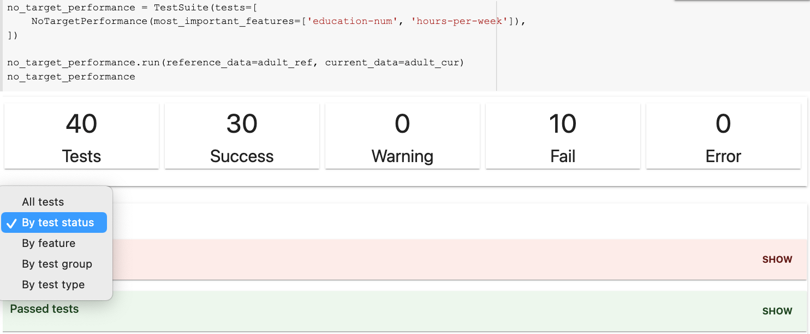
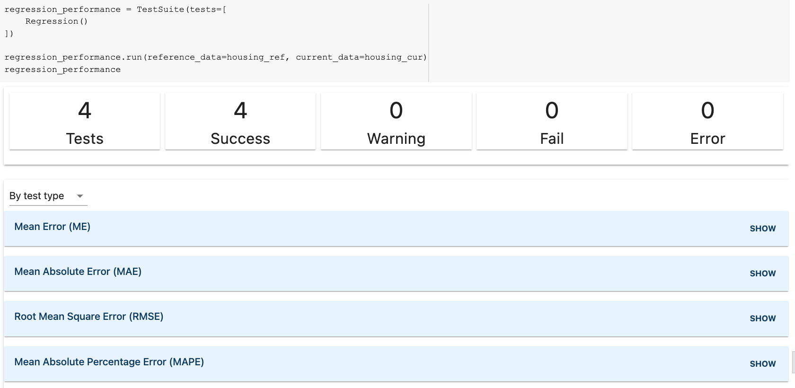
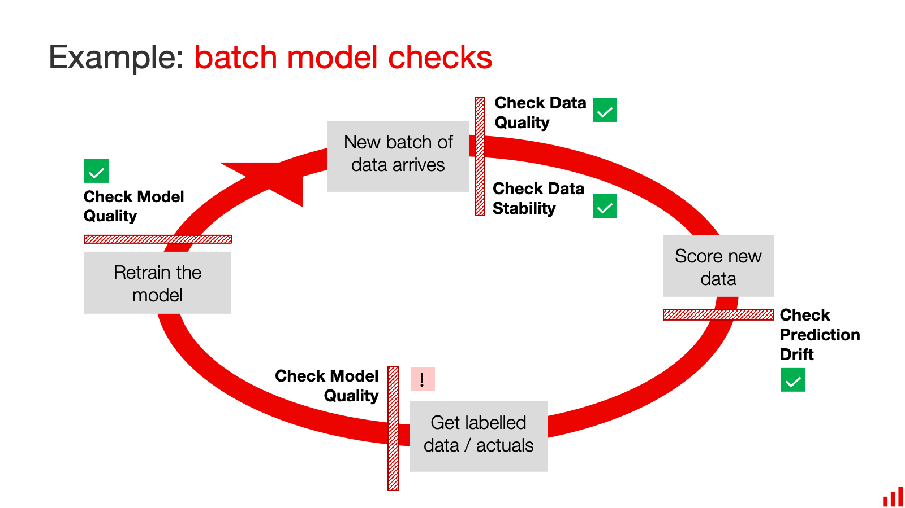

This is an explanatory page to describe the functionality of the Evidently Tests Suites and Tests. For code instructions, head to the [user guide](../tests-and-reports/run-tests.md).

This is an explanatory page to describe the functionality of the Evidently Reports and Metrics. For code instructions, head to the [user guide](../tests-and-reports/get-reports.md).

# What is a Report?

A **Report** is a combination of different metrics that evaluate data or ML model quality. 

Уou can display an interactive report inside a Jupyter notebook or export it as an HTML file:



You can also generate the report as a text summary: as a JSON or as a Python dictionary. 

```python
{'timestamp': '2022-10-26 17:46:47.214403',
 'metrics': {'DatasetDriftMetric': {'threshold': 0.5,
   'number_of_columns': 15,
   'number_of_drifted_columns': 5,
   'share_of_drifted_columns': 0.3333333333333333,
   'dataset_drift': False},
  'DataDriftTable': {'number_of_columns': 15,
   'number_of_drifted_columns': 5,
   'share_of_drifted_columns': 0.3333333333333333,
   'dataset_drift': False,
   'drift_by_columns': {'age': {'column_name': 'age',
     'column_type': 'num',
     'stattest_name': 'Wasserstein distance (normed)',
     'drift_score': 0.18534692319042428,
     'drift_detected': True,
     'threshold': 0.1}}}}}
```
Most reports can be calculated for a single dataset. If you pass two datasets, they will show a side-by-side comparison.

You can generate a report by listing individual **Metrics** to include in it. You can also run one of the **Presets** that cover a specific aspect of the model or data performance. 

# What is a Metric?

A **Metric** is a component of a report that evaluates a specific aspect of the data or model quality. 

A **Metric** can be, literally, a single metric (such as an accuracy value). It can also be a combination of metrics, a plot, or a table. Each **Metric** has a visual render.

Some metrics simply return the values:  



Others have rich visualizations or plots. Here is an example of a model-related metric:



Here is an example of a data-related metric applied to a single column: 



The JSON “version” of a metric returns any new calculated values and, optionally, some other useful information such as histogram bins. 

Evidently contains 30+ **Metrics** related to data quality, integrity, drift and model performance. You can also implement a custom one.

# What is a Metric Preset?

A metric **Preset** is a pre-built report that combines metrics for a particular use case.

You can think of it as a template. For example, there is a preset to check for Data Drift (`DataDriftPreset`), Data Quality (`DataQualityPreset`), or Regression Performance (`RegressionPreset`). 


You can explore all metrics and presets here:


[All metrics](all-metrics.md)


# When to use Reports

You can use Reports at different stages of the ML lifecycle: from exploratory data analysis and pre-deployment model evaluation to production monitoring and debugging.  

**Debugging and exploration**. Reports are best for visual analysis of the data or model performance. For example, during model quality evaluation on the training set, when debugging the model quality decay, or comparing two models.

**Metric logging**. You can also add a model or data evaluation step in the ML pipeline, get outputs as JSON, and log it to a database. For example, you can later visualize it using other BI tools.

**Reporting and documentation**. You can also use Evidently reports to share results with the team and stakeholders or log them as documentation. For example, you can record the results of the model performance after training.

# Test Suites or Reports?

**Reports** and **[Test Suites](../tests/overview.md)** are complementary interfaces. 

Test Suites are best for automation and integration in the prediction pipelines. They require defining test conditions (expectations for your data and model performance) upfront or providing a reference dataset to learn from.

Reports are best for visual exploration and ad hoc evaluation, debugging, and reporting. 

# How to get Reports?

Head here for a complete user guide with the code snippets:
 

[Get reports](get-reports.md)



# What is a test?

Tests help perform structured data and ML model performance checks. They explicitly define the expectations from your data and model.

A **test** is a single check. It calculates a given metric and compares it with the defined condition or threshold. 

If the condition is satisfied, it returns **success**. 

If you choose a visual report, you will see the current value of the metric and the test condition. On expand, you will get a supporting visualization. 

Here is an example of a data-related test:



Here is an example of a model-related test:


If the condition is not satisfied, the test returns a **fail**:



If the test execution fails, it will return an error. 

Evidently contains 50+ individual tests that cover different aspects of model and data quality. 


[All tests](all-tests.md)



# What is a Test Suite?

In most cases, you’d want to run more than one test. 

You can list multiple tests and execute them together in a **test suite**. You will see a summary of the results:


If you include a lot of tests, you can navigate the output by groups: 



You can create your test suite from individual tests or use one of the existing **presets**. 

# What is a Preset?

A **preset** is a pre-built test suite that combines checks for a particular use case. 

You can think of it as a template to start with. For example, there is a preset to check for Data Quality (`DataQualityTestPreset`), Data Stability (`DataStabilityTestPreset`), or Regression model performance (`RegressionTestPreset`).



# When to use tests

For **test-based monitoring** of production ML models: tests are best suited for integration in ML prediction pipelines. You can use them to perform batch checks for your data or models. 

For example, you can run the tests when you:
* get a new batch of the input data 
* generate a new set of predictions
* receive a new batch of the labeled data
* want to check on your model on a schedule



You can then build a conditional workflow based on the result of the tests: for example, generate a visual report for debugging, trigger model retraining, or send an alert.

**During model development**: you can also use tests during model development and validation. For example, you can run tests to evaluate the data quality of the new feature set or to compare test performance to training.

# How to use tests

As an input, you can provide two datasets you want to compare: **reference** and **current** data. You can use training or earlier production data as the reference and new data as current. You can also run most tests with a single (current) dataset.

You can execute the tests as a Python script or in Jupyter notebook or Colab. You can also easily integrate Evidently Tests with workflow management tools like Airflow.

Test output is available as an interactive HTML report, JSON, or Python dictionary.

To start, you can run tests with the default Evidently parameters. They use heuristics and dummy models or learn the expectations from the reference dataset. You can also set custom parameters. 

Head here for a complete user guide with the code snippets:
 

[Run tests](run-tests.md)

