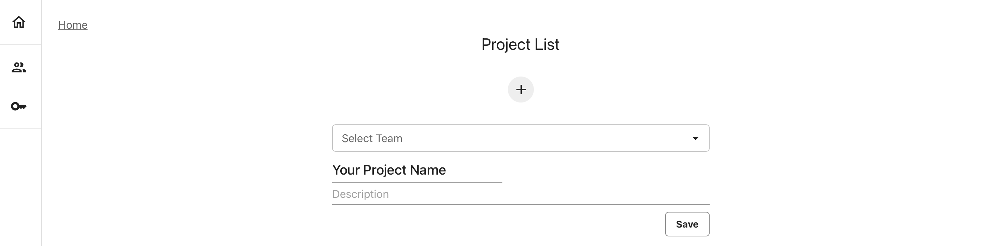

---
description: Organize your data in a Project.
---   

# What is a Project?

A Project helps gather all Reports and Test Suites related to the same use case. Each Project has a dedicated monitoring Dashboard and snapshot storage.


**Should you have one Project for one ML model?** You will often create one project per ML model or dataset, but this is not a strict rule. For example, you can log data from champion/challenger models, or related models in one Project and use Tags to organize them. 


Once you create a Project, you can connect via Python to send data or edit the Dashboard. In Evidently Cloud, you can also the web interface.

# Create a Project

## Add a new Project



 

To create a Project inside a workspace `ws`, assign a name and description, and save the changes:

```
project = ws.create_project("My project name")
project.description = "My project description"
project.save()
```



 

Click on the “plus” sign on the home page and type your Project name and description.



After creating a Project, you can click to open a Dashboard. Since there's no data yet, it will be empty. 





**Project ID**. Once you run `create_project`, you will see the Project ID. You can later use it to reference the Project. You can also copy the Project ID directly from the UI: it appears above the monitoring dashboard.

## Add a Team Project


Team management is a Pro feature available in the Evidently Cloud.


You can associate a Project with a particular Team: it becomes visible to all Team members.

You must create a Team before adding a Project. Navigate to the “Teams” section in the left menu, and add a new one. You can add other users to this Team at any point after creating it.



 

After creating the team, copy the `team_id` from the team page. To add a Project to a Team, reference the `team_id` when creating the Project:

```
project = ws.create_project("Add your project name", team_id="TEAM ID")
project.description = "Add your project description"
project.save()
```



 

Click on the “plus” sign on the home page and type your Project name and description. Select the team name from the dropdown menu to add a Project to a team.







**What's next?** Head to the next section to see how to [send data to a Project](snapshots.md).


## Connect to a Project

To connect to an existing Project from Python, use the `get_project` method.

```python
project = ws.get_project("PROJECT_ID")
```

## Save changes

After making changes to the Project (such as editing description or adding monitoring Panels), always use the `save()` command:

```python
project.save()
```

## Browse Projects

You can see all available Projects on the monitoring homepage, or request a list programmatically. To get a list of all Projects in a workspace `ws`, use:

```python
ws.list_projects()
```

To find a specific Project by its name, use the `search_project` method: 

```python
ws.search_project("project_name")
```

# [DANGER] Delete Project 


**You are deleting the data in a Project**. If you delete a Project, you will delete all the associated snapshots stored in a Project.




 

To delete the Project and all the data inside it:

```
# ws.delete_project("PROJECT ID")
```



 

Go to the "home page", and hover over a Project name. Click on the bin sign and confirm that you want to delte the Project.





## Project parameters

Each Project has the following parameters.

| Parameter | Description |
|---|---|
| `name: str` | Project name. |
| `id: UUID4 = Field(default_factory=uuid.uuid4)` | Unique identifier of the Project. Assigned automatically. |
| `description: Optional[str] = None` | Optional description. Visible when you browse Projects. |
| `dashboard: DashboardConfig` | Dashboard configuration that describes the composition monitoring Panels.<br><br>**Note**: See [Dashboard Design](design_dashboard_api.md) for details. You don't need to explicitly pass `DashboardConfig` if you use the `.dashboard.add_panel` method to add Panels. |
| `date_from: Optional[datetime.datetime] = None` | Start DateTime of the monitoring Dashboard. By default, Evidently shows data for all available periods based on the snapshot timestamps. <br><br>You can set a different DateTime. E.g., to refer to the last 30 days:<br>`from datetime import datetime, timedelta`<br>`datetime.now() + timedelta(-30)`|
| `date_to: Optional[datetime.datetime] = None` | End DateTime of the monitoring Dashboard. <br>Works the same as above. |

# What’s next?

Once you create or connect to a Project, you can:
* [Send snapshots](snapshots.md) using the `add_report` or `add_test_suite` methods. 
* Configure the monitoring dashboard in the [user interface](add_dashboard_tabs.md) or via the [Python API](design_dashboard_api.md).
