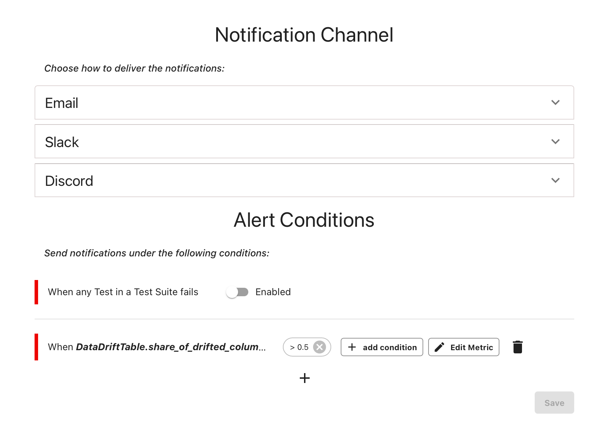

---
description: How to send alerts. 
---   

 
Built-in alerting is a Pro feature available in the Evidently Cloud. 


To enable alerts, open the Project and navigate to the "Alerts" section in the left menu. To enable alerts, you must set:
* A notification channel.
* An alert condition. 

# Notification channels

You can choose between the following options:
* **Email**. Add email addresses to send alerts to. 
* **Slack**. Add a Slack webhook. 
* **Discord**. Add a Discord webhook.

# Alert conditions

## Failed tests

If you use Test Suites, you can tie alerting to the failed Tests in a Test Suite. Toggle this option on the Alerts page. Evidently will set an alert to the defined channel if any of the Tests fail.

 
**How to avoid alert fatigue?** When you create a Test Suite, you can [mark certain conditions as Warnings](../tests-and-reports/custom-test-suite.md) using the `is_critical` parameters. This helps distinguish between critical failures that trigger alerts (set `is_critical` as `True`; default) and non-critical ones for which no alerts will be generated (set `is_critical` as `False`).


## Custom conditions 

You can also set alerts on individual Metric values for both Reports and Test Suites. For example, you can generate Alerts when the share of drifting features is above a certain threshold. 

Click on the plus sign below the “Add new Metric alert” and follow the prompts to set an alert condition. 

