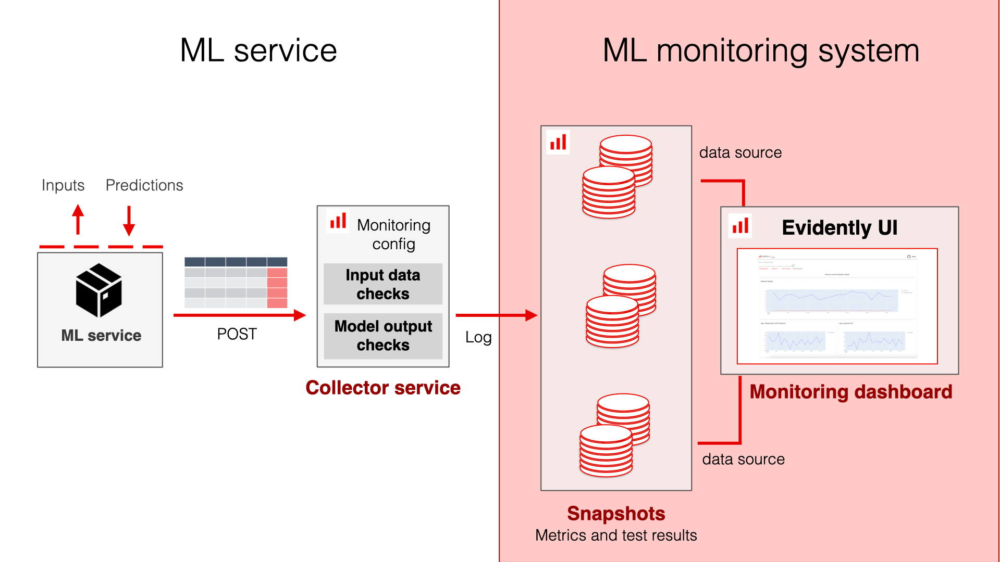
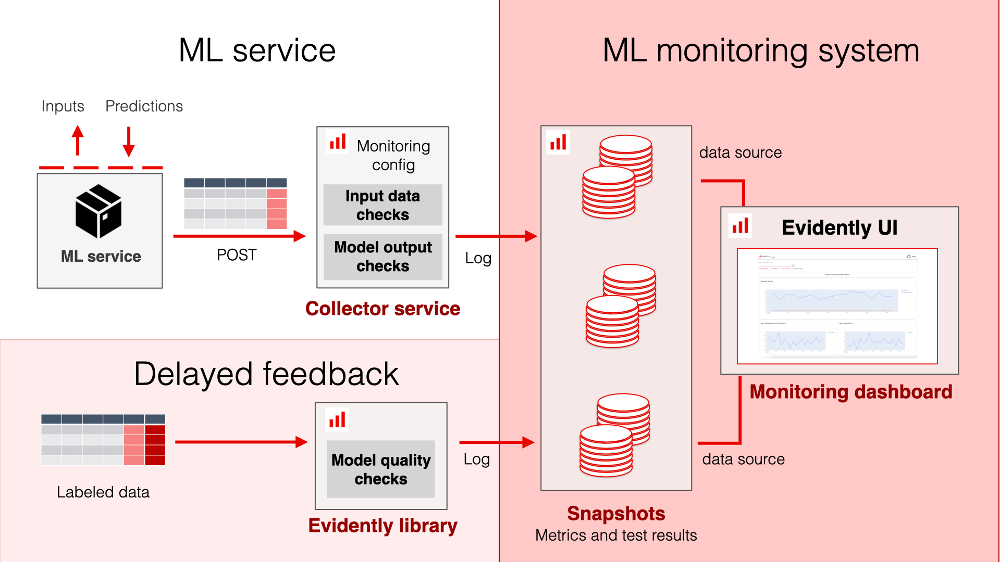
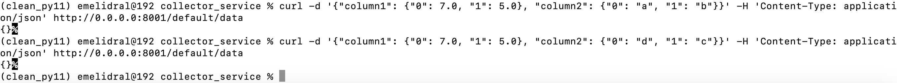
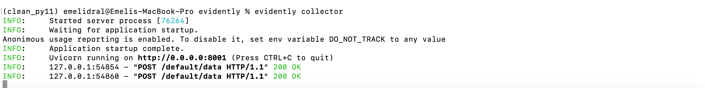

---
description: Send data in near real-time.
---   

# Overview

In this scenario, you deploy an **Evidently Collector** service for near real-time monitoring. 

Evidently Collector is a service that allows you to collect online events into batches, create Reports or Test Suites over batches of data, and save them as `snapshots` into the `workspace`.

You will need to POST the predictions from the ML service to the Evidently Collector service. You can POST data on every prediction or batch them. The Evidently collector service will perform asynchronous computation of monitoring snapshots based on the provided config. 

You can also pass the path to the optional reference dataset. 



If you receive delayed ground truth, you can also later compute and log the model quality to the same project. You can run it as a separate process or batch monitoring job. 



# Code example

Refer to this example:



# Collector configuration

Before sending events, you must configure the collector and start the service. 

You can choose either of the two options:
* Create configuration via code, save it to a JSON file, and run the service using it.
* Run the service first and create configuration via API.

The collector service can simultaneously run multiple “collectors” that compute and save snapshots to different workspaces or projects. Each one is represented by a `CollectorConfig` object.

## `CollectorConfig` Object

You can configure the following parameters:

| Parameter       | Type             | Description                                                                                      |
|-----------------|------------------|--------------------------------------------------------------------------------------------------|
| `trigger`         | `CollectorTrigger`| Defines when to create a new snapshot from the current batch.                                 |
| `report_config`   | `ReportConfig`    | Configures the contents of the snapshot: Report or TestSuite computed for each batch of data. |
| `reference_path`  | Optional[str]     | Local path to a *.parquet* file with the reference dataset.                                   |
| `cache_reference` | bool              | Defines whether to cache reference data or re-read it each time.                              |
| `api_url`         | str               | URL where the Evidently UI Service runs and snapshots will be saved to. For Evidently Cloud, use `api_url="https://app.evidently.cloud"`|
| `api_secret`      | Optional[str]     | Evidently UI Service secrets.                                                                 |
| `project_id`      | str               | ID of the project to save snapshots to.                                                       |

You can create a `ReportConfig` object from `Report` or `TestSuite` objects. You must run them first so that all `Metrics` and `Tests` are collected (including when you use Presets or Test/Metric generators).

```python
report = Report(...) 
report.run(...) 
report_config = ReportConfig.from_report(report) 

# or 

test_suite = TestSuite(...) 
test_suite.run(...) 
report_config = ReportConfig.from_test_suite(test_suite)
```

## CollectorTrigger

Currently, there are two options available: 
* `IntervalTrigger`: triggers the snapshot calculation each interval seconds 
* `RowsCountTrigger`: triggers the snapshot calculation every time the configured number of rows has been sent to the collector service

**Note**: we are also working on `CronTrigger` and other triggers. Would you like to see additional scenarios? Please open a GitHub issue with your suggestions.

## Setup via file

You can define the configuration and save it as a JSON file. Example:

```python
config = CollectorServiceConfig(collectors={
        "main": CollectorConfig(
            trigger=IntervalTrigger(interval=60 * 60),
            report_config=ReportConfig.from_report(report),
            reference_path="reference_data.parquet",
            project_id="834ec9a0-ee58-4e64-816b-c593b0b6c45c",
            api_url="http://localhost:8000"
        )
    })

config.save("collector_config.json")
```

Then, run the following command:

```bash
evidently collector --config-path collector_config.json
```

## Setup via API

First, run the collector service:

```bash
evidently collector
```

Then, use the `CollectorClient` to add a new collector config:

```python
config = CollectorConfig(
        trigger=IntervalTrigger(interval=60 * 60),
        report_config=ReportConfig.from_report(report),
        reference_path="reference_data.parquet",
        project_id="834ec9a0-ee58-4e64-816b-c593b0b6c45c",
        api_url="<http://localhost:8000>"
    )
```

## Update reference via API

To specify the path to the reference dataset: 

```python
reference: pd.DataFrame = ...
client = CollectorClient("<http://localhost:8001>")
client.set_reference("main", reference)
```

## Send events via API

To send events from your ML service:

```python
client = CollectorClient("http://localhost:8001")

events: pd.DataFrame = ...
client.send_data("main", events)
```

## Send events via curl

To send data with `curl`:

```bash
curl 

POST '.../<collector config id>/data'

headers {'evidently-secret': '...', 'Content-Type': 'application/json'}

body '{"column1": {"0": 7.0, "1": 5.0}, "column2": {"0": "a", "1": "b"}}'
```

Example:

```bash
curl -d '{"column1": {"0": 7.0, "1": 5.0}, "column2": {"0": "a", "1": "b"}}' -H 'Content-Type: application/json' http://0.0.0.0:8001/default/data
```

This is how it looks in the Terminal. 

Sending data:



The data is received by the collector service:


