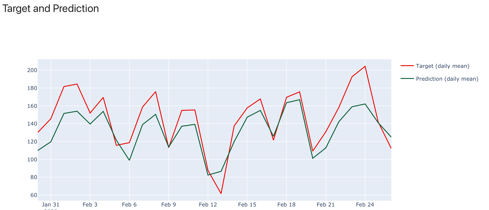

---
description: How to add and configure monitoring panels.
---   

New dashboards are empty by default. You must define the dashboard composition in the code. You can choose which values or test results to display and select from several monitoring panel types. 

**Note**: we plan to add the ability to add panels from the interface in the next releases. 

# Code example

Refer to the ML Monitoring QuickStart for a complete Python script with multiple monitoring panels.


[Get started tutorial](../get-started/tutorial-monitoring.md). 


You can also explore [live demo dashboards](https://demo.evidentlyai.com/) and the corresponding [source code](https://github.com/evidentlyai/evidently/tree/d43d33017a0fc4a69f9ff72581fe3f34b4abd45e/src/evidently/ui/demo_projects). 

# How it works 

Evidently `snapshots` contain multiple measurements. For example, when you log the `DataDriftTable()` Metric in a `snapshot`, it will contain the dataset drift summary, similar to this:

```python
'number_of_columns': 15,
'number_of_drifted_columns': 5,
'share_of_drifted_columns': 0.3333333333333333,
'dataset_drift': False,
```

It will also contain data on individual column drift. Here is a partial example:

```python
'column_name': 'age',
'column_type': 'num',
'stattest_name': 'Wasserstein distance (normed)',
'stattest_threshold': 0.1,
'drift_score': 0.18534692319042428,
'drift_detected': True,
```

The same logic applies to other Metrics and Tests.

You can visualize any measurement captured in the individual `snapshots` over time. To do that, you must add a `panel` to a monitoring `dashboard` of a specific `project` and specify the value you'd like to plot. 

For example, if you logged the DataDriftTable() metric, you may later choose to plot measurements like:
* `share_of_drifted_columns`
* `number_of_drifted_columns`
* `drift_score` for a specific column. 
All these measurements are available as **MetricResults** inside the `snapshot`.

To create a monitoring panel, you will also need to specify other parameters, such as panel type, width, title and legend. This docs section explains how.

# Add panel

To add a new `panel` to an existing `dashboard`, use the `add_panel()` method. 

**Example**. To add a new Counter `panel` showing the share of drifting columns:

```python
project.dashboard.add_panel(
    DashboardPanelCounter(
        title="Share of Drifted Features",
        filter=ReportFilter(metadata_values={}, tag_values=[]),
        value=PanelValue(
            metric_id="DatasetDriftMetric",
            field_path="share_of_drifted_columns",
            legend="share",
         ),
         text="share",
         agg=CounterAgg.LAST,
         size=1,
    )
)
```

*Note: `project.dashboard` is an exemplar of the `DashboardConfig` class.*

You can add multiple panels to the same project dashboard. They will appear in the order listed in the project. 

# Panel types

You can choose between the following panel types.

### 1. Metric counter (`DashboardPanelCounter`) 
A counter panel shows a single number (a metric result from a Report or Test Suite) with supporting text. You can also create text-only panels, e.g. a title panel.

Example:


### 2. Metric plot (`DashboardPanelPlot`)

The panel displays any measurement (a metric result from a Report or Test Suite) as a line plot, bar plot, scatter plot or histogram. 

**Example - line plot**:


**Example - bar plot**:
ADD IMAGE

**Example - scatter plot**:
ADD IMAGE

**Example - histogram**:
ADD IMAGE

### 3. Test counter (`DashboardPanelTestSuiteCounter`)

The panel displays a counter of failed or passed tests. 

**Example**
ADD IMAGE

### 4. Test plot (`DashboardPanelTestSuite`)

The panel displays failed and passed tests in time. You can choose a detailed view (shows the results of individual tests) or an aggregate (shows the total number of tests). 

**Example - aggregate:**
ADD IMAGE

**Example - detailed:**
ADD IMAGE

# Panel parameters

## Class DashboardPanel

This is a base class. The parameters below apply to all panel types. There are also panel-specific parameters explained in the following sections.

| Parameter | Description  |
|---|---|
| `title: str`<br><br>**Usage:**<br>`title="My New Panel”` | The name of the panel. It will be visible at the header of a panel on a dashboard.  |
| `filter: ReportFilter`<br><br>`metadata_values: Dict[str, str]`<br>`tag_values: List[str]`<br><br>**Usage**:<br>`filter=ReportFilter(metadata_values={}, tag_values=[])` | Filters allow you to choose a subset of snapshots from which to display values on the panel. <br><br>To use filtering, you must provide metadata or tags when you log Reports or Test Suites.When you create a panel, you can reference these `metadata_values` or `tag_values`.  |
| `size: WidgetSize = WidgetSize.FULL`<br><br>**Available**: `1`, `2`<br><br>**Usage:**<br>`size=1` | Sets the size of the panel: <br>`1` for a half-width panel<br>`2` for a full-sized panel (Default)  |

## Class DashboardPanelCounter
`DashboardPanelCounter` allows you to add a Counter panel. You can also use this panel type to create text panels.

**Example 1**. To create a panel with the dashboard title only:

```python
project.dashboard.add_panel(
    DashboardPanelCounter(
        filter=ReportFilter(metadata_values={}, tag_values=[]),
        agg=CounterAgg.NONE,
        title="Bike Rental Demand Forecast",
        )
    )
```

**Example 2**. To create a panel that sums up measurements (number of rows) over time.

```python
project.dashboard.add_panel(
    DashboardPanelCounter(
        title="Model Calls",
        filter=ReportFilter(metadata_values={}, tag_values=[]),
        value=PanelValue(
            metric_id="DatasetSummaryMetric",
            field_path=DatasetSummaryMetric.fields.current.number_of_rows,
            legend="count",
        ),
        text="count",
        agg=CounterAgg.SUM,
        size=1,
    )
)
```

| Parameter | Description |
|---|---|
| `value: Optional[PanelValue] = None` | The value (**MetricResult**) to show in the Counter.<br><br>You can create a simple text panel if you do not pass the Value. <br><br>*See the section below on Panel Values for more examples.* |
| `text: Optional[str] = None` | Supporting text to be shown on the Counter. |
| `agg: CounterAgg`<br><br>**Available:**<br> `SUM`, `LAST`, `NONE` | Data aggregation options:<br>`SUM` - sums the values from different snapshots over time<br>`LAST` - shows the last available value<br>`NONE` - to be used for text panels  |

## Class DashboardPanelPlot
`DashboardPanelPlot` allows you to create scatter, bar, line, and histogram plots.

**Example**. To plot MAPE over time in a line plot.

```python
project.dashboard.add_panel(
    DashboardPanelPlot(
        title="MAPE",
        filter=ReportFilter(metadata_values={}, tag_values=[]),
        values=[
        PanelValue(
            metric_id="RegressionQualityMetric",
            field_path=metrics.RegressionQualityMetric.fields.current.mean_abs_perc_error,
            legend="MAPE",
        ),
    ],
    plot_type=PlotType.LINE,
    size=1,
    )
)
```

| Parameter | Description |
|---|---|
| `values: List[PanelValue]` | You must pass at least one value (**MetricResult**). You can also pass multiple values as a list. They will appear together: for example, as separate lines on a Line plot, bars on a Bar Chart, or points on a Scatter Plot. If you use a Histogram, the values will be aggregated.<br><br>*See the section below on Panel Values for more examples.* |
| `plot_type: PlotType`<br><br>**Available:** `SCATTER`, `BAR`, `LINE`, `HISTOGRAM` | Specifies the plot type. |

# Panel value 

To add a numerical measurement to your panel, you must pass the `PanelValue`. For example, you can choose to display the number of drifting features, the share of empty columns, mean error, etc. 

To define which exact value to show on a specific panel, you must specify the following:
* A `metric_id` that corresponds to the Evidently Metric logged in a `snapshot`.
* A `field_path` that corresponds to the specific **MetricResult** (numerical measurement) computed as part of this Metric. You can pass either a complete field path or a `"field_name"`.

You can also pass the optional `legend` that will be visible on the plot.

**Example 1**. To include the `share_of_drifted_columns` MetricResult, available inside the `DatasetDriftMetric()`: 

```python
value=PanelValue(
    metric_id="DatasetDriftMetric",
    field_path="share_of_drifted_columns",
    legend="share",
)
```
    
In this example, you pass the exact name of the field.

**Example 2**. To include the `current.share_of_missing_values` available inside the `DatasetMissingValueMetric()`:  

```python
value=PanelValue(
    metric_id="DatasetMissingValuesMetric",
    field_path=DatasetMissingValuesMetric.fields.current.share_of_missing_values,
    legend="Missing Values Share",
)
```

In this example, you pass the complete field path inside the Metric

**Note**: you must always reference a `metric_id`, even if you used a `Preset`. For example, if you used a `DataDriftPreset()`, you can reference either of the Metrics it contains (`DataDriftTable()` or `DatasetDriftMetric()`). You can verify the Metrics included in each Preset [here](../reference/all-metrics.md).

### How to find the field path?

**Option 1**. Use autocomplete.

You can use autocomplete in interactive Python environments (like Jupyter notebook or Colab) to see available fields inside a specific Metric. They appear as you start typing the `.fields.` path for a specific Metric.


**Note**: some types of values (e.g. mean, sum, max, min) will not be visible using this method. This is because they match the names of the standard Python fields.

**Option 2**. Explore the contents of the snapshot, Metric or Test and find the relevant keys. 

To look at all available measurements, you can also:
* Open an existing `snapshot` file and explore its contents.
* Generate a Report or a Test Suite, include the selected Metric or Test, and get the output as a Python dictionary. You can then explore the keys that contain the metric field names. 

Once you identify the specific name of the field you would like to add to a panel, you can pass it as the `field_path` to the `PanelValue` parameter.

**Note**: in one of the next releases, we plan to add the ability to create panels from the visual interface and pre-built tabs with a fixed dashboard design. This will minimize the need to define the path to the metric values manually. If you need any help right now - ask in [Discord](https://discord.com/invite/xZjKRaNp8b)! 

