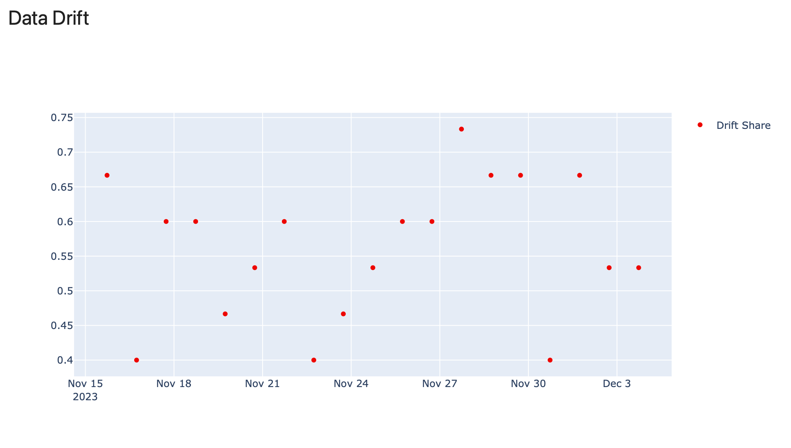
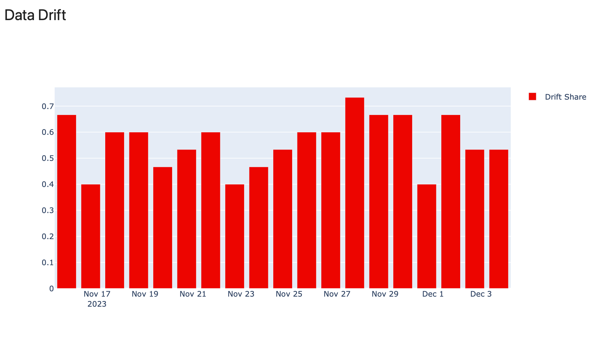
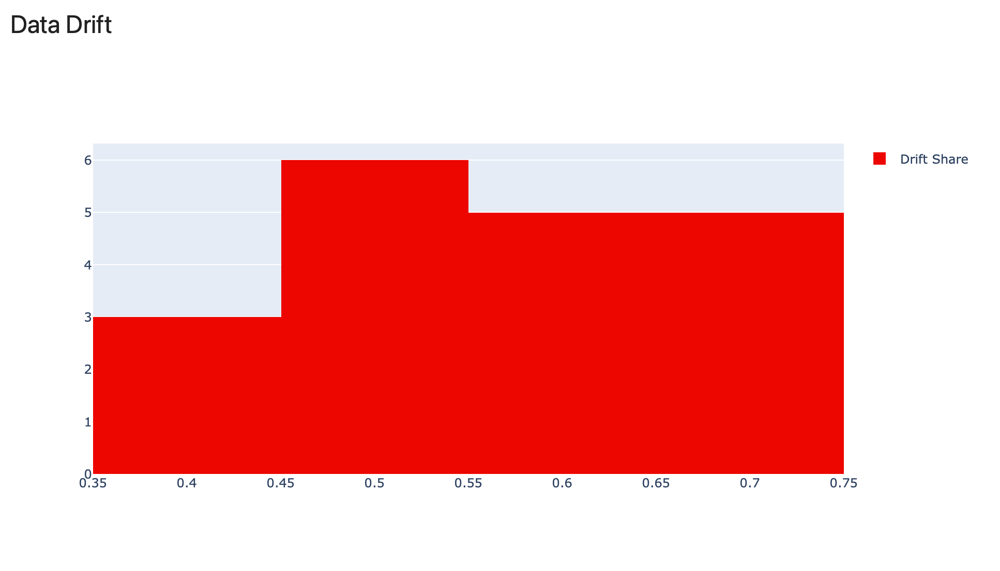
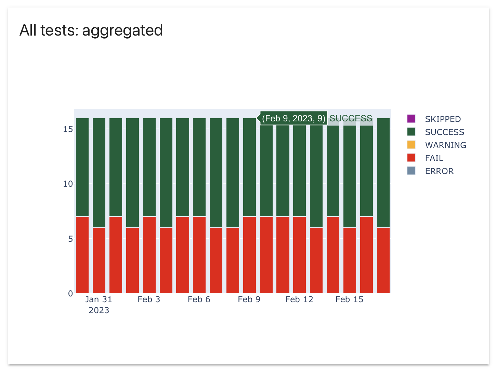

# Code example

Refer to the QuickStart Tutorial for a complete Python script with multiple monitoring panels.


[Get started tutorial](../get-started/tutorial-monitoring.md). 


You can also explore [live demo dashboards](https://demo.evidentlyai.com/) and the corresponding [source code](https://github.com/evidentlyai/evidently/tree/d43d33017a0fc4a69f9ff72581fe3f34b4abd45e/src/evidently/ui/demo_projects). 

# How it works 

Evidently `snapshots` contain multiple measurements. For example, when you log the `DataDriftTable()` Metric in a `snapshot`, it will contain the dataset drift summary, similar to this:

```python
'number_of_columns': 15,
'number_of_drifted_columns': 5,
'share_of_drifted_columns': 0.3333333333333333,
'dataset_drift': False,
```

It will also contain data on individual column drift. Here is a partial example:

```python
'column_name': 'age',
'column_type': 'num',
'stattest_name': 'Wasserstein distance (normed)',
'stattest_threshold': 0.1,
'drift_score': 0.18534692319042428,
'drift_detected': True,
```

The same logic applies to other Metrics and Tests.

You can visualize any measurement captured in the `snapshots` over time. To do that, you must add a `panel` to a monitoring `dashboard` of a specific `project` and specify the value you'd like to plot. 

For example, if you logged the `DataDriftTable()` metric, you may later choose to plot measurements like:
* `share_of_drifted_columns`
* `number_of_drifted_columns`
* `drift_score` for a specific column. 

All these measurements will be available as **MetricResults** inside the `snapshot`.

To create a monitoring panel, you will also need to specify other parameters, such as panel type, width, title and legend. This docs section explains how.

# Add panel

To add a new `panel` to an existing `dashboard`, use the `add_panel()` method. 

**Example**. To add a new Counter `panel` showing the share of drifting columns:

```python
project.dashboard.add_panel(
    DashboardPanelCounter(
        title="Share of Drifted Features",
        filter=ReportFilter(metadata_values={}, tag_values=[]),
        value=PanelValue(
            metric_id="DatasetDriftMetric",
            field_path="share_of_drifted_columns",
            legend="share",
         ),
         text="share",
         agg=CounterAgg.LAST,
         size=WidgetSize.HALF,
    )
)
```

*Note: `project.dashboard` is an exemplar of the `DashboardConfig` class.*

You can add multiple panels to a project dashboard. They will appear in the order listed in the project. 

# Panel types

You can choose between the following panel types.

| Panel Type| Example  |
|---|---|
|**Metric counter (`DashboardPanelCounter`)**<br>Shows a measurement (a MetricResult from a Report or Test Suite) with supporting text. Also works as a text-only panel, e.g. a title panel.||
|**Metric plot (`DashboardPanelPlot`)**<br>Shows a measurement (a MetricResult from a Report or Test Suite) as a line plot, bar plot, scatter plot or histogram. |See below.|
|Line plot (`PlotType.LINE`)||
|Scatter plot (`PlotType.SCATTER`)| |
|Bar plot (`PlotType.BAR`)|  |
|Histogram (`PlotType.HISTOGRAM`)|  |
|**Test counter (`DashboardPanelTestSuiteCounter`)**<br>Shows a counter of failed or passed tests.|||
|**Test plot (`DashboardPanelTestSuite`)**<br>Shows failed and passed tests in time. You can choose a detailed view (with individual test results) or aggregate (with the total number of tests).|See below.|
|Detailed plot (`TestSuitePanelType.DETAILED`)||
|Aggregate plot (`TestSuitePanelType.AGGREGATE`)||

# Panel parameters

## Class DashboardPanel

This is a base class. The parameters below apply to all panel types. There are also panel-specific parameters explained in the following sections.

| Parameter | Description  |
|---|---|
| `title: str`<br><br>**Usage:**<br>`title="My New Panel”` | The name of the panel. It will be visible at the header of a panel on a dashboard.  |
| `filter: ReportFilter`<br><br>`metadata_values: Dict[str, str]`<br>`tag_values: List[str]`<br>`include_test_suites=False`<br><br>**Usage**:<br>`filter=ReportFilter(metadata_values={}, tag_values=[], include_test_suites=True)` | Filters help specify a subset of snapshots from which to display the values. <ul><li>To use filtering, you must add metadata or tags when logging Reports or Test Suites. (See [docs](snapshots.md#add-tags)). You can then reference these `metadata_values` or `tag_values` when creating a panel.</li><li>To include data from Test Suites, you must set the `include_test_suites` parameter as `True` (default: `False`).</li></ul>|
| `size: WidgetSize = WidgetSize.FULL`<br><br>**Available**: ` WidgetSize.FULL`, `WidgetSize.HALF`<br><br>**Usage:**<br>`size=WidgetSize.FULL` | Sets the size of the panel as half-width or full-sized (Default). |

## DashboardPanelCounter
`DashboardPanelCounter` helps add metric counters or text panels. You can pull metric values from both Reports and Test Suites.

**Example 1**. To create a panel with the dashboard title only:

```python
project.dashboard.add_panel(
    DashboardPanelCounter(
        filter=ReportFilter(metadata_values={}, tag_values=[]),
        agg=CounterAgg.NONE,
        title="Bike Rental Demand Forecast",
        )
    )
```

**Example 2**. To create a panel that sums up measurements (number of rows) over time.

```python
project.dashboard.add_panel(
    DashboardPanelCounter(
        title="Model Calls",
        filter=ReportFilter(metadata_values={}, tag_values=[]),
        value=PanelValue(
            metric_id="DatasetSummaryMetric",
            field_path=DatasetSummaryMetric.fields.current.number_of_rows,
            legend="count",
        ),
        text="count",
        agg=CounterAgg.SUM,
        size=WidgetSize.HALF,
    )
)
```

| Parameter | Description |
|---|---|
| `value: Optional[PanelValue] = None` | The value (**MetricResult**) to show in the Counter.<br><br>You can create a simple text panel if you do not pass the Value. <br><br>*See the section below on Panel Values for more examples.* |
| `text: Optional[str] = None` | Supporting text to be shown on the Counter. |
| `agg: CounterAgg`<br><br>**Available:**<br> `SUM`, `LAST`, `NONE` | Data aggregation options:<br>`SUM` - sums the values from different snapshots over time considering the applied filters (if any).<br>`LAST` - shows the last available value<br>`NONE` - to be used for text panels  |

## DashboardPanelPlot
`DashboardPanelPlot` allows creating scatter, bar, line, and histogram plots with metric values. You can pull metric values from both Reports and Test Suites.

**Example**. To plot MAPE over time in a line plot.

```python
project.dashboard.add_panel(
    DashboardPanelPlot(
        title="MAPE",
        filter=ReportFilter(metadata_values={}, tag_values=[]),
        values=[
        PanelValue(
            metric_id="RegressionQualityMetric",
            field_path=metrics.RegressionQualityMetric.fields.current.mean_abs_perc_error,
            legend="MAPE",
        ),
    ],
    plot_type=PlotType.LINE,
    size=WidgetSize.HALF,
    )
)
```

| Parameter | Description |
|---|---|
| `values: List[PanelValue]` | You must pass at least one value (**MetricResult**). You can also pass multiple values as a list. They will appear together: for example, as separate lines on a Line plot, bars on a Bar Chart, or points on a Scatter Plot. If you use a Histogram, the values will be aggregated.<br><br>*See the section below on Panel Values for more examples.* |
| `plot_type: PlotType`<br><br>**Available:** `SCATTER`, `BAR`, `LINE`, `HISTOGRAM` | Specifies the plot type. |

## DashboardPanelTestSuiteCounter
`DashboardPanelTestSuiteCounter` displays a counter of failed and passed tests. It applies to Test Suites only.

**Example 1**. To display the result of the last test.

```python
project.dashboard.add_panel(
    DashboardPanelTestSuiteCounter(
        title="Success of last",
        agg=CounterAgg.LAST
    )
)
```

**Example 2**. To display the number of failed tests and errors in the test results for a specific column.

```python
project.dashboard.add_panel(
    DashboardPanelTestSuiteCounter(
        title="Success of 1",
        test_filters=[TestFilter(test_id="TestNumberOfUniqueValues", test_args={"column_name.name": "1"})],
        statuses=[TestStatus.ERROR, TestStatus.FAIL]
    )
)
```

See applicable parameters in the following section.

## DashboardPanelTestSuite

`DashboardPanelTestSuite` displays the results of failed and passed tests over time. It applies to Test Suites only.

**Example 1**. To show the results of all individual tests over time, with daily level aggregation. 

```python
project.dashboard.add_panel(
    DashboardPanelTestSuite(
        title="All tests: detailed",
        filter=ReportFilter(metadata_values={}, tag_values=[], include_test_suites=True),
        size=WidgetSize.HALF,
        panel_type=TestSuitePanelType.DETAILED,
        time_agg="1D",
    )
)
```

**Example 2**. To show the results of individual tests for specific columns, with daily aggregation.

```python
project.dashboard.add_panel(
    DashboardPanelTestSuite(
        title="Column Drift tests for key features: detailed",
        test_filters=[
            TestFilter(test_id="TestColumnDrift", test_args={"column_name.name": "hours-per-week"}),
            TestFilter(test_id="TestColumnDrift", test_args={"column_name.name": "capital-gain"}),
        ],
        filter=ReportFilter(metadata_values={}, tag_values=[], include_test_suites=True),
        size=WidgetSize.HALF,
        panel_type=TestSuitePanelType.DETAILED,
        time_agg="1D",
    )
)
```

**Example 3**. To show the number of passed and failed tests, with daily level aggregation. 

```
project.dashboard.add_panel(
    DashboardPanelTestSuite(
        title="All tests: aggregated",
        filter=ReportFilter(metadata_values={}, tag_values=[], include_test_suites=True),
        size=WidgetSize.HALF,
        time_agg="1D",
    )
)
```

| Parameter | Description |
|---|---|
| `test_filters: List[TestFilter]=[]`<br>`test_id: test_id`<br>`test_arg: List[str]`<br><br>**Usage**:<br>`test_filters=[TestFilter(test_id="TestNumberOfUniqueValues", test_args={"column_name.name": "1"})]`| Filters that help include the results only for specific Tests and/or columns.<br>If not specified, all logged tests will be considered. |
| `statuses: List[statuses]`<br><br>**Available**:<br>`TestStatus.ERROR`, `TestStatus.FAIL`, `TestStatus.SUCCESS`, `TestStatus.WARNING`, `TestStatus.SKIPPED` <br><br>**Usage**: <br>`statuses=[TestStatus.ERROR, TestStatus.FAIL]` | Filters that help include only the test results with a specific status. <br>If not specified, tests with any status will be considered.  |
| <br>`agg: CounterAgg`<br><br>**Available**:<br>SUM, LAST <br><br>**Usage**:<br>`agg=CounterAgg.LAST` | Applies to the `DashboardPanelTestSuiteCounter`.<br><br>Data aggregation options:<br>`SUM` - sums the test results from multiple snapshots, considering the applied filters (if any).<br>`LAST` - shows the last available test result. |
| `panel_type=TestSuitePanelType`<br><br>**Available**:<br>`TestSuitePanelType.DETAILED`<br>`TestSuitePanelType.AGGREGATE` <br><br>**Usage**: <br>`panel_type=TestSuitePanelType.DETAILED` | Applies to the `DashboardPanelTestSuite`.<br><br>You can use it to define the type of the plot:<br>Detailed (includes the individual test results)<br>Aggregate (default, includes only the total number of passed/failed tests) |
| <br>`time_agg: Optional[str] = None`<br><br>**Available**:<br>`1H`, `1D`, `1W`, `1M` (see [period aliases](https://pandas.pydata.org/docs/user_guide/timeseries.html#timeseries-period-aliases))<br><br>**Usage**:<br>`time_agg="1D"` | Applies to the `DashboardPanelTestSuite`.<br><br>Aggregation options to group the test results within a defined time period on a plot.|

# Panel value 

To add a numerical measurement to the plot, you must pass the `PanelValue`. For example, you can display the number of drifting features, the share of empty columns, mean error, etc.

**Parameters**. To define which values to show on a specific panel, you must specify:

| Parameter | Description |
|---|---|
| `metric_id` | A metric ID that corresponds to the Evidently Metric logged inside the snapshots. You must specify the `metric_id` even if you use Test Suites.  |
| `field_path` | The path that corresponds to the specific **MetricResult** computed as part of this Metric or Test. You can pass either a complete field path or a "field_name". |
| `metric_args` (optional) | Additional arguments that specify the metrics parameters. This is applicable when multiple instances of the same metric are logged in a snapshot. For example: column name, text descriptor, drift detection method used, etc. |
| `legend` (optional) | The legend that will be visible in the plot. |


**Example 1**. To include the `share_of_drifted_columns` MetricResult, available inside the `DatasetDriftMetric()`: 

```python
value=PanelValue(
    metric_id="DatasetDriftMetric",
    field_path="share_of_drifted_columns",
    legend="share",
)
```
    
In this example, you pass the exact name of the field.

**Example 2**. To include the `current.share_of_missing_values` available inside the `DatasetMissingValueMetric()`:  

```python
value=PanelValue(
    metric_id="DatasetMissingValuesMetric",
    field_path=DatasetMissingValuesMetric.fields.current.share_of_missing_values,
    legend="Missing Values Share",
)
```
In this example, you pass the complete field path inside the Metric.


**Note**. You must always reference a metric_id, even if you used a Preset. For example, if you used a `DataDriftPreset()`, you can reference either of the Metrics it contains (`DataDriftTable()` or `DatasetDriftMetric()`). You can verify the Metrics included in each Preset in the [reference table](../reference/all-metrics.md).


**Example 3**. To display the mean values of target and prediction over time in a line plot.  

```python
values=[
    PanelValue(
        metric_id="ColumnSummaryMetric",
        field_path="current_characteristics.mean",
        metric_args={"column_name.name": "cnt"},
        legend="Target (daily mean)",
    ),
    PanelValue(
        metric_id="ColumnSummaryMetric",
        field_path="current_characteristics.mean",
        metric_args={"column_name.name": "prediction"},
        legend="Prediction (daily mean)",
    ),
]
```
In this example, you pass additional metric arguments to specify the column names.

**Example 4**. To specify the drift detection method (when results for multiple methods logged inside a snapshot) using `metric_args`.

```python
values=[
    PanelValue(
        metric_id="EmbeddingsDriftMetric", 
        metric_args={"drift_method.dist": "euclidean"}
    )
}
```

**Example 5**. To specify the text descriptor using `metric_args`. 

```python
values=[
    PanelValue(
        metric_id="ColumnSummaryMetric",
        metric_args={"column_name": descriptors.OOV(display_name="OOV").for_column("Review_Text")},
        field_path="current_characteristics.mean",
        legend="OOV % (mean)",
    ),
]
```

### How to find the field path?

**Option 1**. Use autocomplete.

You can use autocomplete in interactive Python environments (like Jupyter notebook or Colab) to see available fields inside a specific Metric. They appear as you start typing the `.fields.` path for a specific Metric.


**Note**: some types of values (e.g. mean, sum, max, min) will not be visible using this method. This is because they match the names of the standard Python fields.

**Option 2**. Explore the contents of the snapshot, Metric or Test and find the relevant keys. 

To look at all available measurements, you can also:
* Open an existing `snapshot` file and explore its contents.
* Generate a Report or a Test Suite, include the selected Metric or Test, and get the output as a Python dictionary. You can then explore the keys that contain the metric field names. 

Once you identify the specific name of the field you would like to add to a panel, you can pass it as the `field_path` to the `PanelValue` parameter.


## Project parameters

You can pass the following parameters to a project:

| Parameter | Description |
|---|---|
| `name: str` | Project name. |
| `id: UUID4 = Field(default_factory=uuid.uuid4)` | Unique identifier of the project. Assigned automatically. |
| `description: Optional[str] = None` | Optional description. It will be visible in the interface when you browse projects. |
| `dashboard: DashboardConfig` | Configuration of the project dashboard. It describes the monitoring panels which will appear on the dashboard.<br><br>**Note**: Explore the [Dashboard Design](design_dashboard.md) section for details. There is no need to explicitly pass `DashboardConfig` as a parameter if you use the `.dashboard.add_panel` method. |
| `date_from: Optional[datetime.datetime] = None` | Start DateTime of the monitoring dashboard. By default, Evidently will show all available periods based on the snapshot timestamps. <br><br>You can set a specific date or a relative DateTime. For example, to refer to the last 30 days:<br>`from datetime import datetime, timedelta`<br>`datetime.now() + timedelta(-30)`<br>When you view the dashboard, the data will be visible from this start date. You can switch to other dates in the interface. |
| `date_to: Optional[datetime.datetime] = None` | End datetime of the monitoring dashboard. <br>Works the same as above. |

