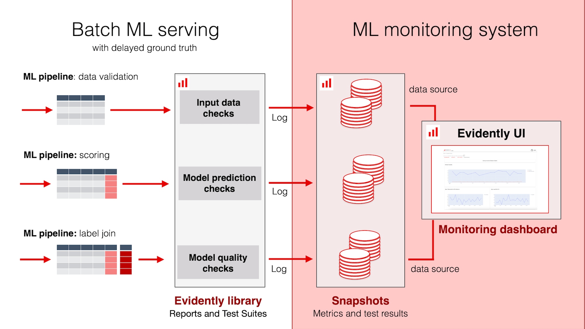

---
description: A high-level description of the Evidently ML monitoring. 
---   

# How it works

To deploy an ML monitoring system, you need 3 components:

1. **Logging**. You must use the Evidently Python library to capture JSON `snapshots`. Each `snapshot` summarizes data or ML model quality for a specific period. You can instrument your production ML pipelines, collect data from ML services, or write logs ad hoc. The logging functionality is powered by Evidently `Reports` and `Test Suites` (which you can also use separately). You control what exactly you log.

2. **Snapshot storage**. You must store JSON `snapshots` in a directory accessible by UI service. 

3. **Monitoring dashboard**. To view metrics and test results over time, you must launch an Evidently Monitoring service. It will parse the contents of the `snapshots` and allow visualizing the logged metrics or test results in the UI. You can choose which values to visualize and how.

# What you can monitor

You can pick from 100+ in-built metrics and tests, including:
* The number of model calls.
* Descriptive statistics of the dataset (feature ranges, column types, etc.)
* Data quality and integrity metrics for dataset and individual columns (nulls, range violations, new categorical values, etc.)
* Data and prediction drift checks for tabular, text data and embeddings (statistical tests, distance metrics).
* Model quality metrics for classification and regression (precision, recall, MAE, etc.)
* Text descriptors (length, sentiment, regular expression matches, etc.)
* Custom user-defined metrics

# Example scenario
Say, you have a batch model and score new data once per day. Every time you generate the predictions, you can capture a `snapshot` with the input dataset summary, data quality metrics, and prediction drift checks. 

Once you get the labels that arrive with a delay, you can compute the true model performance and log a snapshot with model quality metrics to update the performance dashboard.

# User guide 

To start, we recommend going through the [ML Monitoring Quickstart](https://docs.evidentlyai.com/get-started/tutorial-monitoring) tutorial. It shows a simple end-to-end example.

This user guide focuses on each component in-depth:
* [Add workspace and project](workspace_project.md)
* [Log snapshots](snapshots.md)
* [Design dashboard](design_dashboard.md)
* [Monitoring UI](monitoring_ui.md)

# Cloud ML Monitoring

Don't want to self-host? Sign up for the [Evidently Cloud Waitlist](https://www.evidentlyai.com/product/cloud)!

