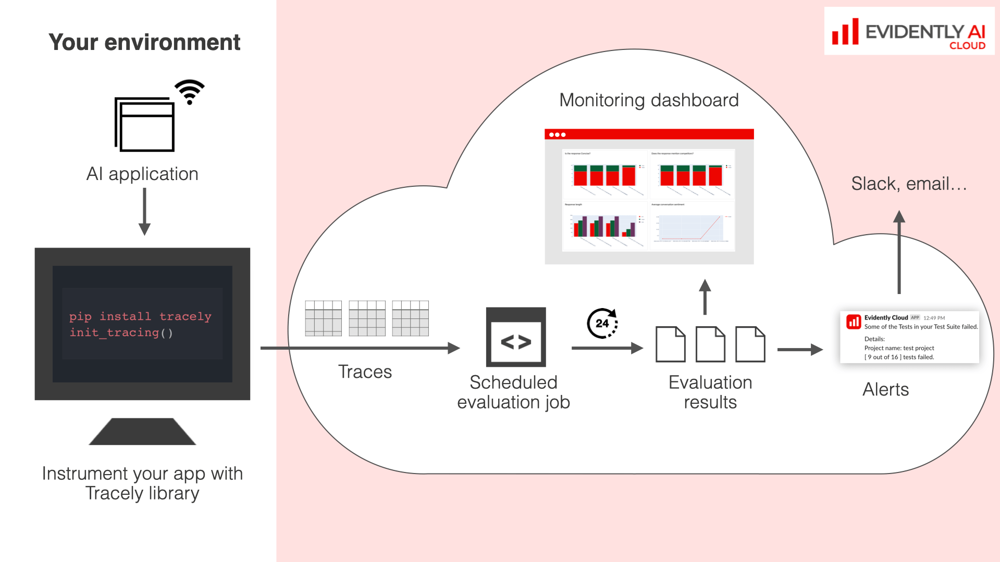
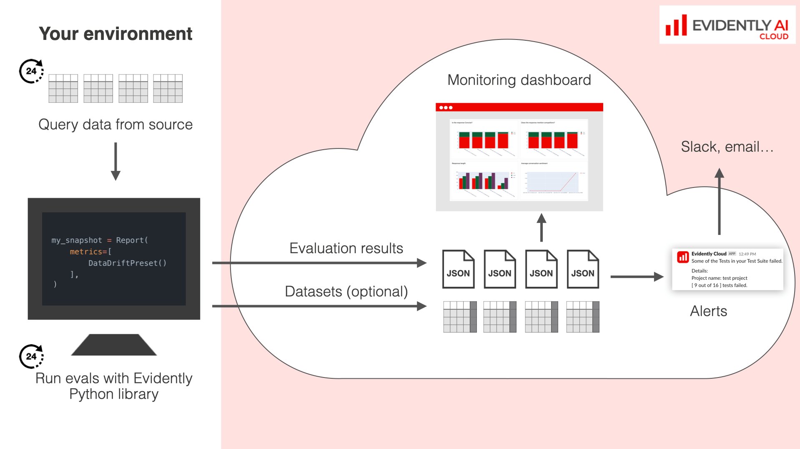
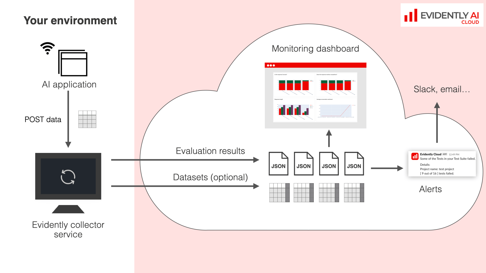

---
description: How to set up online evaluations and monitoring. 
---   

AI quality monitoring automatically evaluates your AI application’s inputs and outputs. This helps you spot and fix issues while keeping an up-to-date view of your system behavior.


**New to AI quality evaluations?** Start with individual evaluations first. Read more on [evaluations](../evaluations/evals_overview.md). 


Evidently offers several ways to set up monitoring. Consider the following:
* **Type of AI application**. Do you work with simple tabular data or need to capture complex LLM interactions?
* **Batch or real-time**. Does your AI system process data in batches, or does it generate predictions live?
* **Evaluation frequency**. How often do you need to check the system's performance? Is real-time monitoring necessary, or can you evaluate at intervals like hourly or daily?
* **Where to store prediction logs**. Do you want to store raw data (inferences or traces) together with monitoring metrics, or would you prefer to manage them separately?
  
Considering these factors will help you choose the best monitoring setup. Here are three recommended architectures you can implement with Evidently.

# Tracing with scheduled evals 

**Best for**: LLM-powered applications.


Supported in: `Evidently Cloud` and `Evidently Enterprise`. Scheduled evaluations are in beta on Evidently Cloud. Contact our team to try it.


How it works:
* **Instrument your app**. Use the `Tracely` library (based on OpenTelemetry) to capture all relevant data from your application, including inputs, outputs, tool calls, and intermediate steps.
* **Store raw data**. Evidently Platform stores all raw data, providing a complete record of activity.
* **Schedule evaluations**. Set up evaluations to run automatically at scheduled times. This will generate Reports or run Tests directly on the Evidently Platform.

You can also manually run evaluations anytime to assess individual predictions.

Benefits of this approach: 
* **Solves the data capture**. You collect complex traces and all production data in one place, making it easier to manage and analyze. 
* **Easy to re-run evals**. With raw traces stored on the platform, you can easily re-run evaluations or add new metrics whenever needed.
* **No-code**. Once your trace instrumentation is set up, you can manage everything from the UI.

**What’s next?** To get started, [instrument your app with Tracely](../tracing/tracing_overview.md) and set up [scheduled evaluations](scheduled_evals.md). 


[Set up tracing](../tracing/set_up_tracing.md)


# Batch monitoring jobs 

**Best for**: batch ML pipelines, regression testing, and near real-time ML systems that don’t need instant evaluations.


Supported in: `Evidently OSS`, `Evidently Cloud` and `Evidently Enterprise`.


How it works:
* **Build your evaluation pipeline**. Create a pipeline in your infrastructure to run monitoring jobs. This can be a Python script, cron job, or orchestrated with a tool like Airflow. Run it at regular intervals (e.g., hourly, daily) or trigger it when new data or labels arrive. 
* **Run metric calculations**. Implement the evaluation step in the pipeline using the Evidently Python library. Select the evals, and compute JSON `snapshots` that will summarize data, metrics, and test results. 
* **Store and visualize snapshots**. Store and monitor results in Evidently Cloud, or in a designated self-hosted workspace.

Benefits of this approach:
* **Decouples log storage and monitoring metrics**. Evidently generates snapshots with data summaries and test results. It does not store raw data or model predictions unless you choose to. This protects data privacy and avoids duplicating logs if they’re already stored elsewhere, like for retraining.
* **Full control over the evaluation pipeline**. You decide when evaluations happen. This setup is great for batch ML models, where you can easily add monitoring as another step in your existing pipeline. For online inference, you can log your predictions to a database and set up separate monitoring jobs to query data at intervals.
* **Fits most ML evaluation scenarios**. Many evaluations, like data drift detection, naturally work in batches since you need to collect a set of new data points before running them. Model quality checks often only happen when new labeled data arrives, which can be delayed. Analyzing prediction or user behavior shifts is also usually more meaningful when done at intervals rather than recalculating after every single event.

**What’s next?** Understand the batch workflow in more detail:


[Batch monitoring](batch_monitoring.md)


# Near real-time with collector

**Best for**: near real-time integration with an ML prediction service.


Supported in: `Evidently OSS`, `Evidently Cloud` and `Evidently Enterprise`.


Near real-time monitoring is for scenarios where you need frequent insights into your AI system's performance. In this setup, data from your ML service is sent directly to a monitoring system, where metrics are calculated on the fly and visualized in an online dashboard.

In Evidently, this works through the Evidently collector service that you deploy on your infrastructure.

How it works:
* **Deploy Evidently collector service**. Install the Evidently collector and configure it to run evaluations at set intervals with chosen Evidently Metrics and Tests.
* **Send inferences**. Post data (inputs and predictions) from your ML prediction service to the collector. The Evidently Collector manages data batching, computes Reports or Test Suites based on the configuration that you set, and sends them to the Evidently Cloud or designated self-hosted workspace.

The benefits of the approach is that you do not need to write your own evaluation pipelines, and it is suited for frequent calculations.

What’s next? Read how to set up the collector:


[Collector service](collector_service.md)

