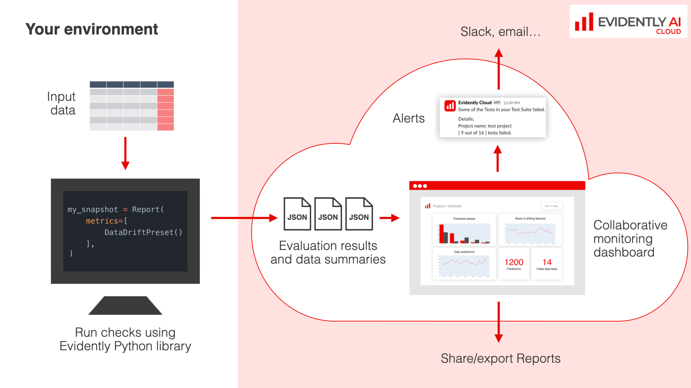

---
description: How Evidently ML Monitoring works.
---   

# How It Works
ML monitoring helps you track data and ML model performance over time, identify issues, and receive alerts. 

* **Instrumentation**: You use the open-source Evidently Python library to collect metrics and generate JSON `snapshots` containing data summaries, metrics, and test results.
* **Snapshot Storage**: You save `snapshots` in Evidently Cloud or in a local or remote workspace.
* **Monitoring Service**: You visualize metrics from `snapshots` on a Dashboard in the Evidently Cloud web app or a self-hosted UI service.

The evaluation functionality relies on Evidently `Reports` and `Test Suites` available in the open-source Python library. You can use all 100+ metrics and tests on data quality, data and prediction drift, model quality (classification, regression, ranking, LLMs, NLP models), etc. You can also add custom metrics.

By default, Evidently Cloud does not store raw data or model inferences. `Snapshots` contain data aggregates (e.g., distribution summaries) and metadata with test results. This hybrid architecture helps avoid data duplication and preserves its privacy.

# Deployment Options

* **Evidently Cloud (Recommended)**: This is the easiest way to start with ML monitoring without the need to manage infrastructure. Snapshots and the UI service are hosted by Evidently. Evidently Cloud includes support, a scalable backend, and premium features such as in-built alerting, user management, and UI features like visual dashboard design.
* **Self-hosted ML Monitoring**: You can also self-host an open-source dashboard service, suitable for proof of concept, small-scale deployments, or teams with advanced infrastructure knowledge.
* **Self-hosted Enterprise Deployment**: For a scalable self-hosted version of Evidently Platform with support, contact us for a [demo of Evidently Enterprise](https://www.evidentlyai.com/get-demo) which can be hosted in your private cloud or on-premises.

# Deployment architecture 

For initial exploration, you can send individual snapshots ad hoc. For production monitoring, you can orchestrate batch evaluation jobs, or send data directly from live ML services.

## Batch 

You can run monitoring jobs using a Python script or a workflow manager tool like Airflow. 

If you already have batch data pipelines, you can add a monitoring or validation step directly when you need it. Say, you have a batch ML model and score new data once per day. Every time you generate the predictions, you can capture a snapshot with the input data summary, data quality metrics, and prediction drift checks. Once you get the true labels, you can compute the model performance and log the model quality metrics to update the performance dashboard.

This approach also allows you to run tests for your batch pipelines or during CI/CD. For example, you can validate data at ingestion or model after retraining, and implement automatic actions based on the validation results.

If you store your data (model inference logs) in a data warehouse, you can design separate monitoring jobs. For example, you can set up a script that would query the data and compute snapshots on a regular cadence, e.g., hourly, daily, weekly, or after new data or labeles are added. 

# Near real-time

If you have a live ML service, you can send the data and predictions for near real-time monitoring. In this case, you must deploy and configure the **Evidently collector service** and send inferences from your ML service to the self-hosted collector. 

Evidently Collector will manage data batching, compute `Reports` or `Test Suites` based on the configuration, and send them to the Evidently Cloud or to your designated workspace.

If you receive delayed ground truth, you can also later compute and log the model quality to the same project via a batch workflow. You can run it as a separate process or monitoring job.

# How to start 

For an end-to-end example, check these tutorials:
* [Evidently Cloud: Data & ML Monitoring](https://docs.evidentlyai.com/get-started/tutorial-cloud)
* [Self-hosting ML Monitoring](https://docs.evidentlyai.com/get-started/tutorial-monitoring)

This user guide explains each step in detail:
* [Set up your Workspace](workspace.md)
* [Create a Project](add_project.md)
* [Log snapshots](snapshots.md) or set up a near real-time [collector service](collector_service.md) 
* [Get a pre-built Dashboard](add_dashboard_tabs.md)
* Understand available [Panel types](design_dashboard.md) and add custom [monitoring Panels](design_dashboard_api.md)
* [Send alerts](alerting.md)
