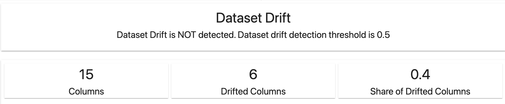
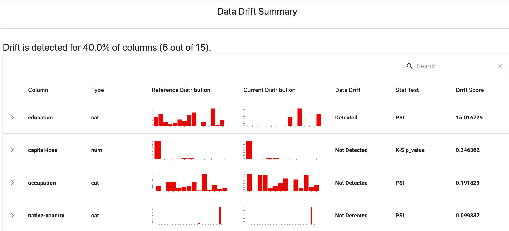
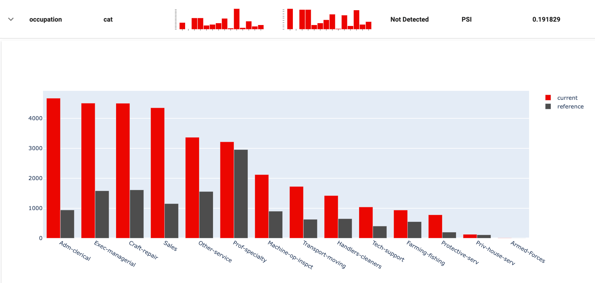
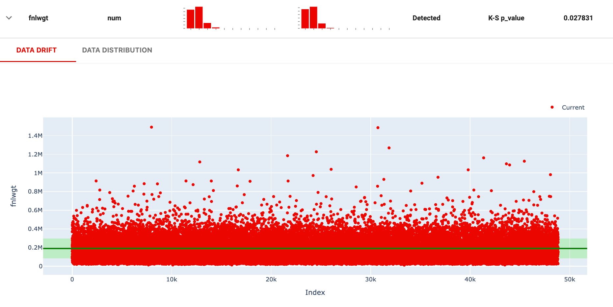
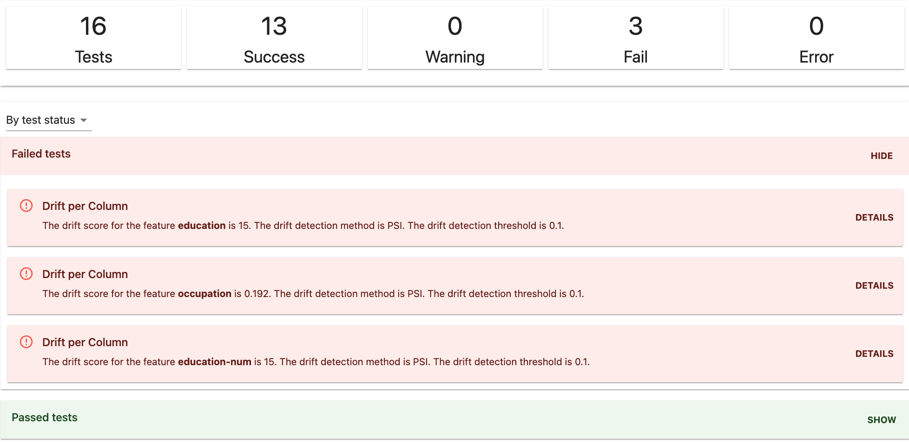

**TL;DR:** You can detect and analyze changes in the input feature distributions. Evidently has pre-built Data Drift Reports and Test Suites that work out of the box.

* For visual analysis using Reports, use the `DataDriftPreset`. 
* For pipeline checks using Test Suites, use the `DataDriftTestPreset`.  

# Use Case

You can evaluate data drift in different scenarios.

1. **To monitor the model performance without ground truth.** When you do not have true labels or actuals, you can monitor the feature drift to check if the model operates in a familiar environment. You can combine it with the [Prediction Drift](prediction-drift.md). If you detect drift, you can trigger labeling and retraining, or decide to pause and switch to a different decision method. 

2. **When you are debugging the model quality decay.** If you observe a drop in the model quality, you can evaluate Data Drift to explore the change in the feature patterns, e.g., to understand the change in the environment or discover the appearance of a new segment. 

3. **To understand model drift in an offline environment.** You can explore the historical data drift to understand past changes in the input data and define the optimal drift detection approach and retraining strategy. 

4. **To decide on the model retraining.** Before feeding fresh data into the model, you might want to verify whether it even makes sense. If there is no data drift, the environment is stable, and retraining might not be necessary.

To run drift checks as part of the pipeline, use the Test Suite. To explore and debug, use the Report.  

# Data Drift Report

If you want to get a visual report, you can create a new Report object and use the `DataDriftPreset`. 

## Code example

```python
data_drift_report = Report(metrics=[
    DataDriftPreset(),
])

data_drift_report.run(reference_data=ref, current_data=cur)
data_drift_report
```

## How it works

The **Data Drift** report helps detect and explore changes in the input data.

* Applies as suitable **drift detection method** for numerical, categorical or text features.
* Plots **feature values and distributions** for the two datasets.

## Data Requirements

* You will need **two** datasets. The **reference** dataset serves as a benchmark. Evidently analyzes the change by comparing the **current** production data to the **reference** data to detect distribution drift. 

* **Input features**. The dataset should include the features you want to evaluate for drift. The schema of both datasets should be identical. If your dataset contains target or prediction column, they will also be analyzed for drift. 

* **Column mapping**. Evidently can evaluate drift both for numerical, categorical and text features. You can explicitly specify the type of each column using [column mapping object](../input-data/column-mapping.md). If it is not specified, Evidently will try to identify the numerical and categorical features automatically. It is recommended to use column mapping to avoid errors. If you have text data, you must always specify it. 

## How it looks

The default report includes 4 components. All plots are interactive.

### 1. Data Drift Summary

The report returns **the share of drifting features** and an aggregate **Dataset Drift** result.



Dataset Drift sets a rule on top of the results of the statistical tests for individual features. By default, Dataset Drift is detected if at least 50% of features drift.

Evidently uses the default [data drift detection algorithm](../reference/data-drift-algorithm.md) to select the drift detection method based on feature type and the number of observations in the reference dataset.


You can modify the drift detection logic by selecting a different method, including PSI, K–L divergence, Jensen-Shannon distance, Wasserstein distance, setting a different threshold and condition for the dataset drift. See more details about [setting data drift parameters](../customization/options-for-statistical-tests.md). You can also implement a [custom drift detection method](../customization/add-custom-metric-or-test.md). 


To build up a better intuition for which tests are better in different kinds of use cases, visit our blog to read [an in-depth guide](https://evidentlyai.com/blog/data-drift-detection-large-datasets) to the tradeoffs when choosing the statistical test for data drift.

### 2. Data Drift Table

The table shows the drifting features first. You can also choose to sort the rows by the feature name or type.



### 3. Data Distribution by Feature

By clicking on each feature, you can explore the distributions or top characteristic words (for text features).



### 4. Data Drift by Feature

For numerical features, you can also explore the values mapped in a plot.

* The dark green line is the **mean**, as seen in the reference dataset.
* The green area covers **one standard deviation** from the mean.



## Metrics output

You can get the report output as a JSON or a Python dictionary:

<details>
<summary>See JSON example</summary>
 

```yaml
{
  "data_drift": {
    "name": "data_drift",
    "datetime": "datetime",
    "data": {
      "utility_columns": {
        "date": null,
        "id": null,
        "target": null,
        "prediction": null,
        "drift_conf_level": value,
        "drift_features_share": value,
        "nbinsx": {
          "feature_name": value,
          "feature_name": value
        },
        "xbins": null
      },
      },
      "cat_feature_names": [],
      "num_feature_names": [],
      "metrics": {
        "feature_name" :{
          "prod_small_hist": [
            [],
            []
          ],
          "ref_small_hist": [
            [],
            []
          ],
          "feature_type": "num",
          "p_value": p_value
      },
      "n_features": value,
      "n_drifted_features": value,
      "share_drifted_features": value,
      "dataset_drift": false
    }
  },
  "timestamp": "timestamp"
}
``` 
</details>

## Report customization

* You can [specify the drift detection methods and thresholds](../customization/options-for-statistical-tests.md). 
* You can add a [custom drift detection method](../customization/add-custom-metric-or-test.md).
* You can use a [different color schema for the report](../customization/options-for-color-schema.md). 
* You can create a different report from scratch taking this one as an inspiration. 
* You can apply the report only to selected columns, for example, the most important features.  

# Data Drift Test Suite

If you want to run data drift checks as part of the pipeline, you can create a Test Suite and use the `DataDriftTestPreset`.



## Code example

```python
data_drift_test_suite = TestSuite(tests=[
   DataDriftTestPreset(),
])
 
data_drift_test_suite.run(reference_data=ref, current_data=curr)
data_drift_test_suite
```

## How it works

You can use the `DataDriftTestPreset` to test features for drift when you receive a new batch of input data or generate a new set of predictions.

The test preset works similarly to the metric preset. It will perform two types of tests: 
* test the **share of drifted columns** to detect dataset drift;
* test distribution **drift in the individual columns** (all or from a defined list).  

Head here to the [All tests](../reference/all-tests.md) table to see the description of individual tests and parameters. 

## Test Suite customization

* You can [specify the drift detection methods and thresholds](../customization/options-for-statistical-tests.md). 
* You can add a [custom drift detection method](../customization/add-custom-metric-or-test.md).
* You can apply the preset only to selected columns.
* You can create a different test suite from scratch taking this one as an inspiration. 

If you want to compare descriptive statistics between the two datasets, you can also use the [Data Stability test preset](data-quality.md).

# Examples

* Browse the [examples](../examples/examples.md) for sample Jupyter notebooks and Colabs.

You can also explore [blog posts](https://www.evidentlyai.com/tags/data-drift) about drift detection, including [How to handle drift](https://www.evidentlyai.com/blog/ml-monitoring-data-drift-how-to-handle) or [how to analyze historical drift patterns](https://evidentlyai.com/blog/tutorial-3-historical-data-drift).

