**TL;DR:** You can explore and track various dataset and feature statistics.

* **Report**: for visual analysis or metrics export, use the `DataQualityPreset`.
* **Test Suite**: for pipeline checks, use the `DataQualityTestPreset`or `DataStabilityTestPreset`.  

# Use Cases

You might need to track and evaluate data quality and integrity in different scenarios.

1. **Data quality tests in production.** You can check the quality and stability of the input data before you generate the predictions, every time you perform a certain transformation, add a new data source, etc. 

2. **Data profiling in production.** You can log and store JSON snapshots of your production data stats for future analysis and visualization. 

3. **Exploratory data analysis.** You can use the visual report to explore your training dataset and understand which features are stable and useful enough to use in modeling. 

4. **Dataset comparison.** You can use the report to compare two datasets to confirm similarities or understand the differences. For example, you might compare training and test dataset, subgroups in the same dataset (e.g., customers from Region 1 and Region 2), or current production data against training.

5. **Production model debugging.** If your model is underperforming, you can use this report to explore and interpret the details of changes in the input data or debug the quality issues.

For production pipeline tests, use Test Suites. For exploratory analysis and debugging, use Report.

# Data Quality Report 

If you want to get a visual report, you can create a new Report object and use the `DataQualityPreset`.

## Code example

```python
data_quality_report = Report(metrics=[
    DataQualityPreset(),
])

data_quality_report.run(reference_data=adult_ref, current_data=adult_cur)
data_quality_report
```

## How it works

The Data Quality report provides detailed feature statistics and a feature behavior overview. 

* The report works for a **single dataset** or **compares the two**. 
* Calculates base **statistics** for numerical, categorical and datetime features 
* Displays **interactive plots** with data distribution and behavior in time
* Plots **interactions and correlations** between features and target


## Data Requirements 

* **Input features**. You need to pass only the input features. Target and prediction are optional. 
* **One or two datasets**. If you want to perform a side-by-side comparison, pass two datasets with identical schema. You can also pass a single dataset. 
* **Column mapping**. Feature types (numerical, categorical, datetime) will be parsed based on pandas column type. If you want to specify a different feature mapping strategy, you can explicitly set the feature type using `column_mapping`. 

You might also need to specify additional column mapping:
* If you have a **datetime** index column and want to learn how features change with time, specify the datetime column in the `column_mapping`.
* If you have a **target** column and want to see features distribution by target, specify the target column in the `column_mapping`. 
* Specify the **task** if you want to explore interactions between the features and the target. This section looks slightly different for classification and regression tasks. By default, if the target has a numeric type and has >5 unique values, Evidently will treat it as a regression problem. Everything else is treated as a classification problem. If you want to explicitly define your task as `regression` or `classification`, you should set the `task` parameter in the `column_mapping` object. 
* If you have **text** features, you should specify it in the column mapping to generate descriptive statistics specific to text.


You can read more to understand [column mapping](../input-data/column-mapping.md) and [data requirements](../input-data/data-requirements.md) for Evidently reports in the corresponding sections of documentation.  


## How it looks

The default report includes 3 widgets. All plots are interactive.

**Aggregated visuals in plots.** Starting from v 0.3.2, all visuals in the Evidently Reports are aggregated by default. This helps decrease the load time and report size for larger datasets. If you work with smaller datasets or samples, you can pass an [option to generate plots with raw data](../customization/report-data-aggregation.md). You can choose whether you want it on not based on the size of your dataset.

### 1. Summary widget

The table gives an overview of the dataset, including missing or empty features and other general information. It also shows the share of almost empty and almost constant features. This applies to cases when 95% or more features are missing or constant.

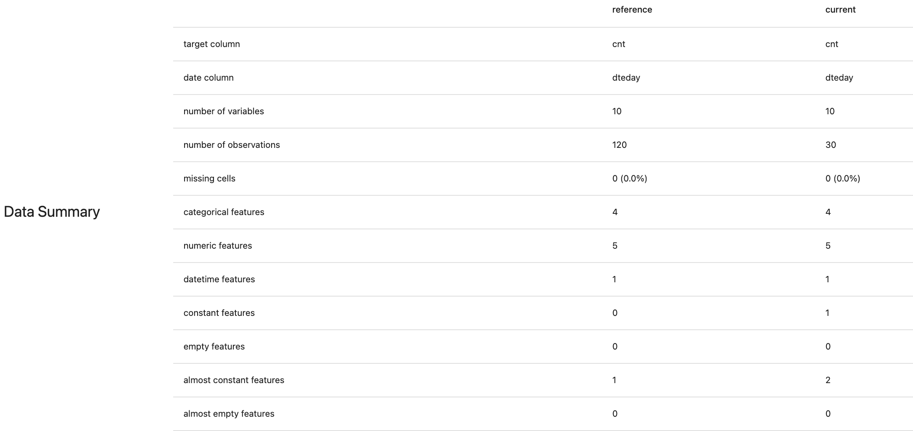

### 2. Features widget

For each feature, this widget generates a set of visualizations. They vary depending on the feature type. There are 3 components:

#### 2.1. Feature overview table

The table shows relevant statistical summaries for each feature based on its type and a visualization of feature distribution. 

##### Example for a categorical feature:


##### Example for a numerical feature:

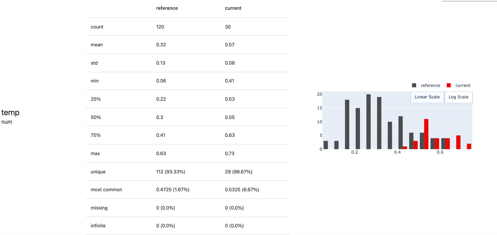

##### Example for a datetime feature:


##### Example for a text feature:


#### 2.2. Feature in time

If you click on "details", each feature would include additional visualization to show feature behavior in time.

##### Example for a categorical feature:

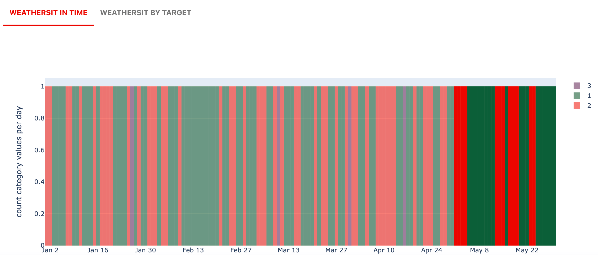

##### Example for a numerical feature:

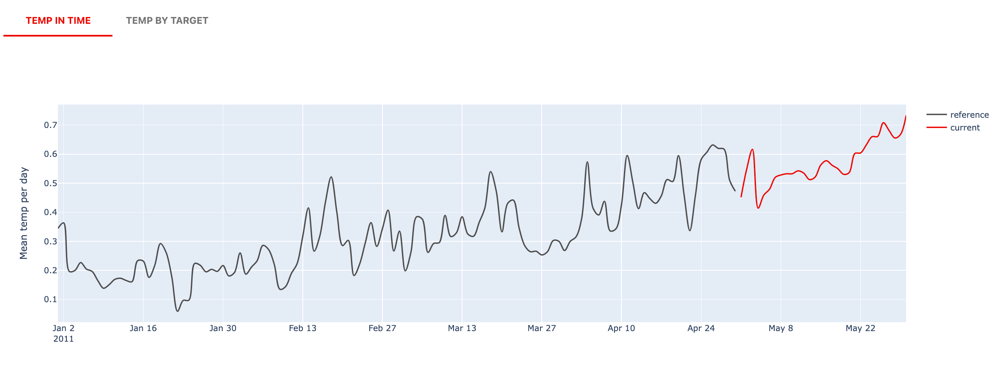

##### Example for a datetime feature:

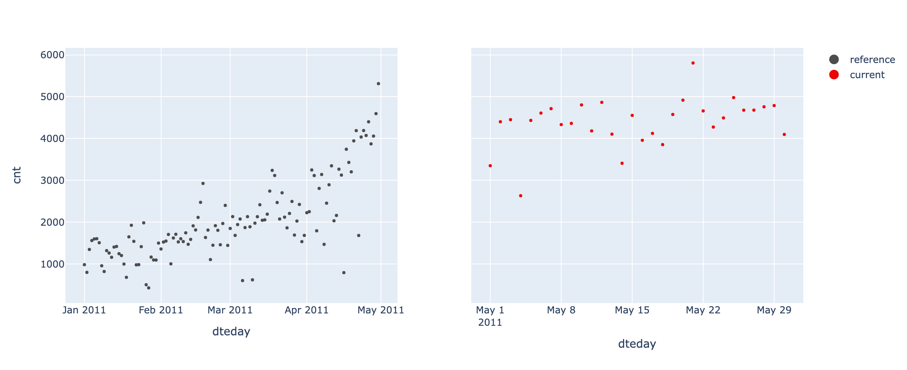

#### 2.3. Feature by target 

Categorical and numerical features include an additional visualization that plots the interaction between a given feature and the target. 

##### Example for a categorical feature:

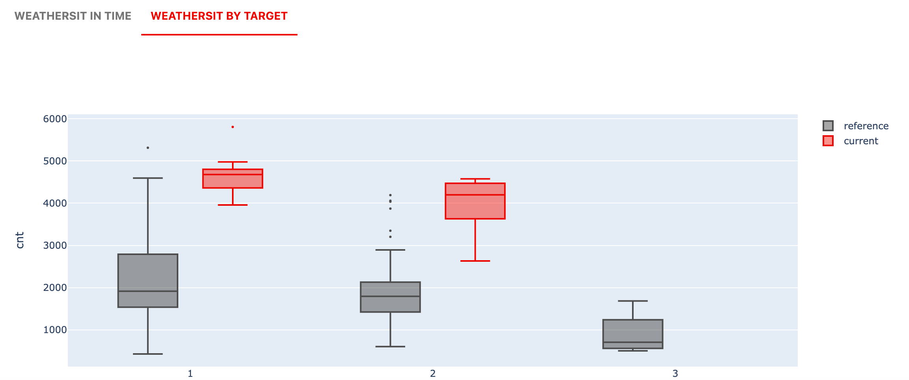

##### Example for a numerical feature:

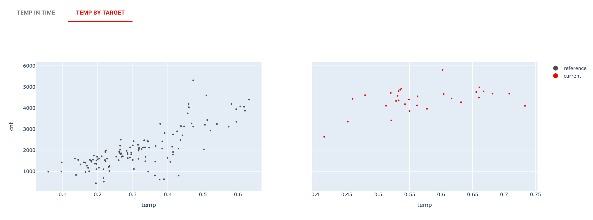

### 3. Correlation widget

This widget shows the correlations between different features. 

#### 3.1. Insights

This table shows a summary of pairwise feature correlations.  

For a single dataset, it lists the top-5 highly correlated variables from Cramer's v correlation matrix (categorical features) and from Spearman correlation matrix (numerical features).

For two datasets, it lists the top-5 pairs of variables **where correlation changes** the most between the reference and current datasets. Similarly, it uses categorical features from Cramer's v correlation matrix and numerical features from Spearman correlation matrix.

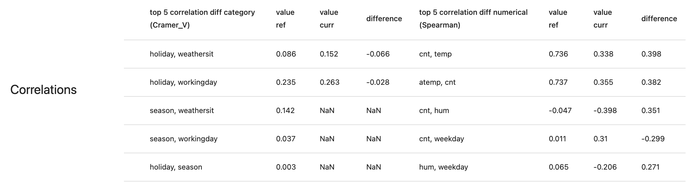

#### 3.2. Correlation heatmaps


**This widget has been removed from Preset in versions above 0.4.31**. You can add it to your Report as `DatasetCorrelationsMetric()`.



This section includes four heatmaps. 

For categorical features, Evidently calculates the [Cramer's v](https://en.wikipedia.org/wiki/Cramér%27s_V) correlation matrix.
For numerical features, Evidently calculates the [Pearson](https://en.wikipedia.org/wiki/Pearson_correlation_coefficient), [Spearman](https://en.wikipedia.org/wiki/Spearman%27s_rank_correlation_coefficient) and [Kendall](https://en.wikipedia.org/wiki/Kendall_rank_correlation_coefficient) matrices. 

If your dataset includes the target, the target will be also shown in the matrix according to its type. 

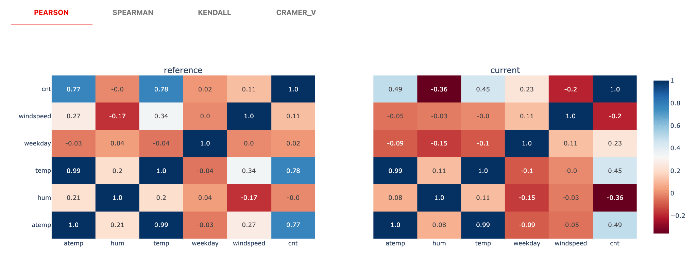

## Metrics outputs

You can get the report output as a JSON or a Python dictionary:

<details>
<summary>See JSON example</summary>
 
```yaml
{
  'data_quality': {
    'data': {
      'cat_feature_names': [],
      'datetime_feature_names': [],
      'metrics': {
        'current': {
          'feature_name': {
            'count': count,
            'feature_type': 'num',
            'infinite_count': 0,
            'infinite_percentage': 0.0,
            'max': max,
            'mean': mean,
            'min': min,
            'missing_count': 0,
            'missing_percentage': 0.0,
            'most_common_value': most_common_value,
            'most_common_value_percentage': most_common_value_percentage,
            'percentile_25': percentile_25,
            'percentile_50': percentile_50,
            'percentile_75': percentile_75,
            'std': std,
            'unique_count': unique_count,
            'unique_percentage': unique_percentage
            },
          },
        },
        'num_feature_names': [],
        'target_names': None,
        'utility_columns': {
          'date': 'dteday',
          'id': None,
          'prediction': 'prediction',
          'target': 'target'
          }
        },
      'correlations': {
        'current': {
          'pearson': {
            'feature_name_1': {
              'feature_name_2': value,
              'feature_name_3': value
              },
            'feature_name_2': {
              'feature_name_1': value,
              'feature_name_3': value
              },
            'feature_name_3': {
              'feature_name_1': value,
              'feature_name_2': value
              }
            },
          'spearman': {
            'feature_name_1': {
              'feature_name_2': value,
              'feature_name_3': value
              },
            'feature_name_2': {
              'feature_name_1': value,
              'feature_name_3': value
              },
            'feature_name_3': {
              'feature_name_1': value,
              'feature_name_2': value
              }
            },
          'kendall': {
            'feature_name_1': {
              'feature_name_2': value,
              'feature_name_3': value
              },
            'feature_name_2': {
              'feature_name_1': value,
              'feature_name_3': value
              },
            'feature_name_3': {
              'feature_name_1': value,
              'feature_name_2': value
              }
            },
          'cramer_v': {
            'feature_name_4': {
              'feature_name_5': value
              },
            'feature_name_5': {
              'feature_name_4': value
              }
            }  
          }
        }  
    'datetime': '2022-02-22 16:35:15.529404',
    'name': 'data_quality'
    },
  'timestamp': 'timestamp'
}
```
</details>
    
## Report customization
* You can use a [different color schema for the report](../customization/options-for-color-schema.md). 
* You can create a different report from scratch taking this one as an inspiration by combining chosen metrics. 
* You can apply the report only to selected columns, for example, the most important features.  

# Data Quality Test Suite

If you want to run data quality checks as part of the pipeline, you can create a new Test Suite and include the `DataQualityTestPreset`.

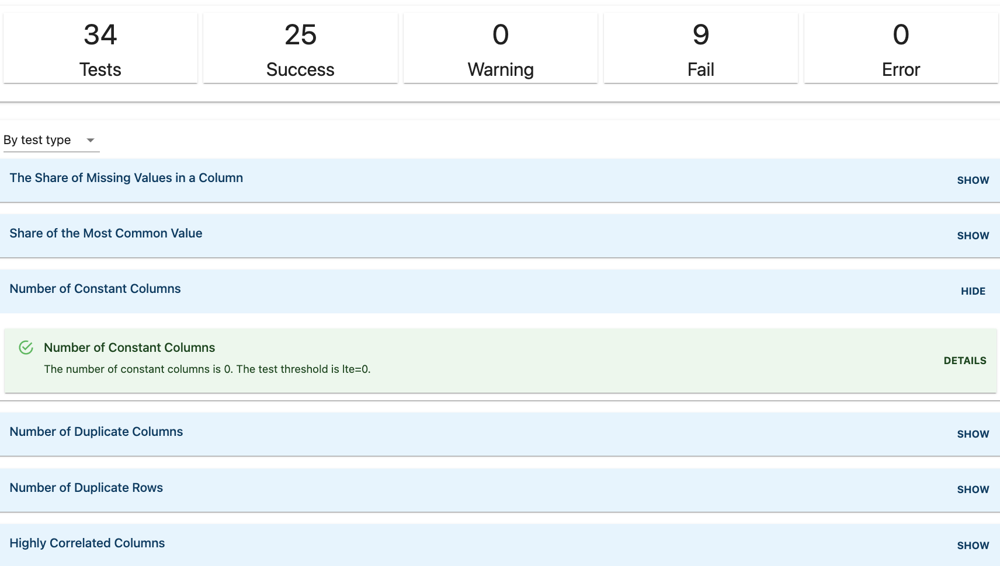

## Code example

```python
data_quality_test_suite = TestSuite(tests=[
   DataQualityTestPreset(),
])
 
data_quality_test_suite.run(reference_data=ref, current_data=curr)
data_quality_test_suite
```

## How it works

You can use the `DataQualityTestPreset` when you want to evaluate the quality of a new data batch, even **without a reference dataset**. It will help assess whether a data batch is e.g. **suitable for training or retraining**. 

* It calculates various descriptive statistics for the dataset. 
* It helps detect issues like **missing data**, **duplicates**, or **almost constant** features.   
* Evidently will **generate the test conditions automatically** based on the set of heuristics or provided reference dataset. You can also pass custom conditions. 

Head here to the [All tests](../reference/all-tests.md) table to see the composition of the preset and default parameters for each test. 

## Test Suite customization

* You can pass custom test conditions.
* You can apply the tests only to chosen columns.
* If you want to exclude or add some tests, you can create a custom test suite. See the complete [test list](../reference/all-tests.md).

# Data Stability Test Suite

If you want to run data stability checks as part of the pipeline, you can create a new Test Suite and include the `DataStabilityTestPreset`.

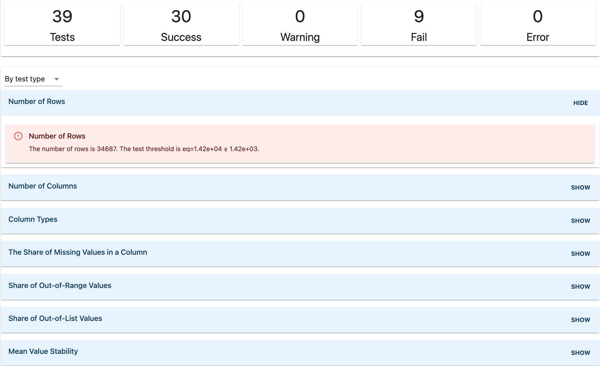

## How it works

You can use the `DataStabilityTestPreset` when you receive a new batch of input data that you **expect to be similar to the previous batch** and want to compare them.

* It calculates various dataset and feature statistics. 
* It helps detect issues like **new categorical values**, **values out of range**, or change in the **data volume**.   
* Evidently will **generate the test conditions automatically** based on the provided reference dataset. You can also pass custom conditions. 

## Test Suite customization

* You can pass custom test conditions.
* You can apply the tests only to chosen columns.
* If you want to exclude or add some tests, you can create a custom test suite. See the complete [test list](../reference/all-tests.md).

## Examples

* Browse our [example](../examples/examples.md) notebooks to see sample Reports and Test Suites.
