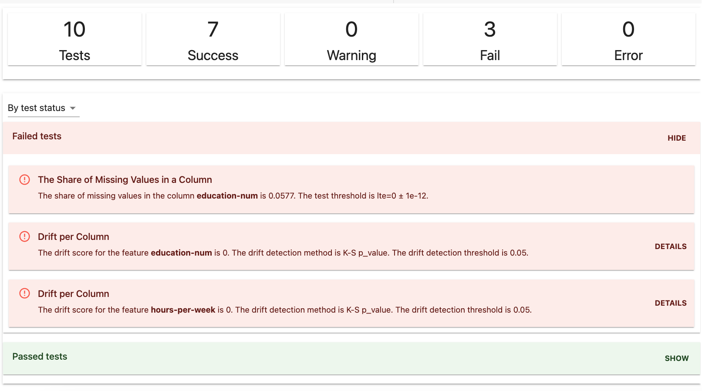
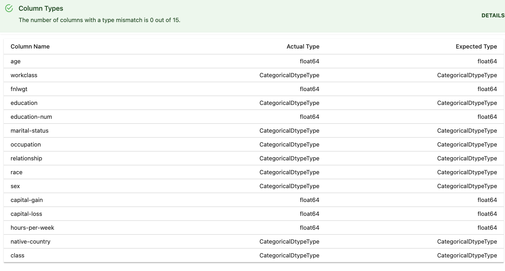
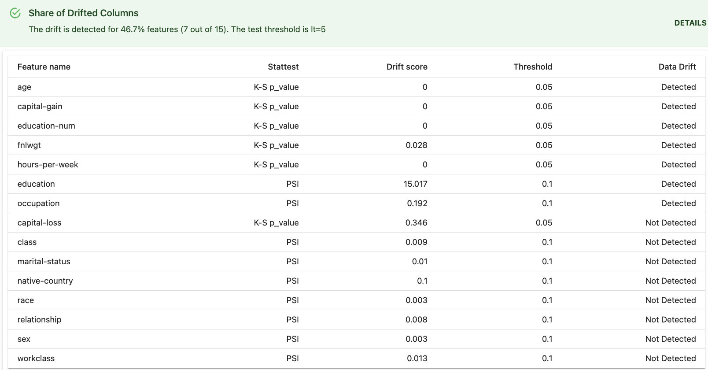
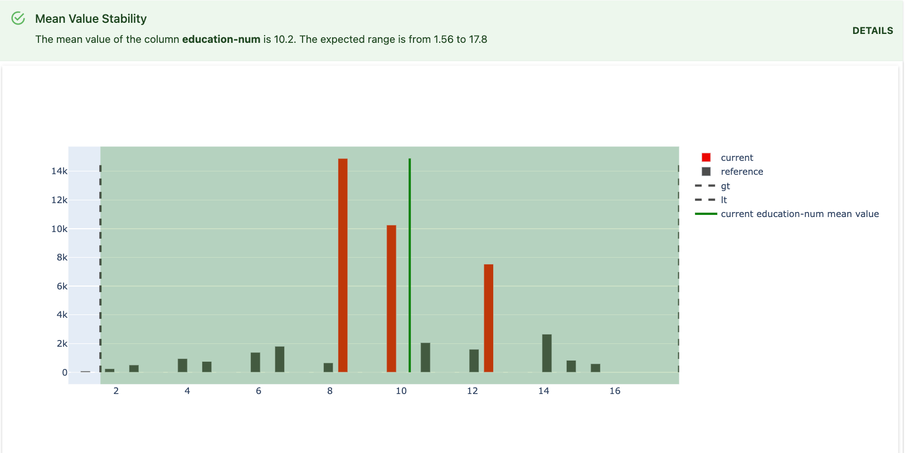

**TL;DR:** You can combine different checks to test data quality, stability, and drift when you have a model with delayed feedback.

* **Test Suite**: for pipeline checks, use the `NoTargetPerformanceTestPreset`.

# Use Case

This test suite is designed for a specific scenario:

**To monitor the model performance without ground truth.** You can use it to perform batch checks for a model that has delayed feedback (when true labels or actuals come days, weeks or months after the prediction is made). This preset helps evaluate the production model quality through proxy metrics. It combines several metrics that check for data quality, data integrity, and data and prediction drift. 

# NoTargetPerformance Test Suite

To perform the check, create a new Test Suite object and include `NoTargetPerformanceTestPreset`.



## Code example

```python
no_target_performance = TestSuite(tests=[
   NoTargetPerformanceTestPreset()
])
 
no_target_performance.run(reference_data=past_week, current_data=curr_week)
no_target_performance
```

## Data requirements

* You need to provide **two** datasets with identical schema. The **reference** dataset serves as a benchmark (e.g., previous data batch). Evidently analyzes the change by comparing the **current** production data to the **reference** data.
* They should include **input features and predictions**.
* **Column mapping**. You can explicitly specify the types input columns and target using [column mapping](../input-data/column-mapping.md). If it is not specified, Evidently will try to guess the types automatically. It is recommended to use column mapping to avoid errors. If you have text features, you must always specify this in column mapping. 

## How it works

Evidently will generate the test conditions automatically based on the set of heuristics or provided reference dataset. You can also pass custom conditions for data drift.

The preset combines several checks that go well together.

**Data stability**. They verify if the input column types match the reference and whether you have features out of range (for numerical columns) or out of the list (for categorical data). The preset also checks for missing data. 



**Prediction drift**. This test checks if there is a distribution shift in the model prediction. The default [drift detection algorithm](../reference/data-drift-algorithm.md) is used.

**Input data drift**. The preset also tests for distribution shifts in the model input features. It returns the overall share of drifting features (alerting if more than ⅓ of the features drifted). 



**Input data stability**. One more check verifies the change in the mean values of numerical features. It automatically tests if the means of all numerical columns are within 2 standard deviations from the reference mean. This test helps detect significant changes.



## Report customization

* You can [specify the drift detection methods and thresholds](../customization/options-for-statistical-tests.md). 
* You can add a [custom drift detection method](../customization/add-custom-metric-or-test.md).
* You can apply data quality and stability checks only to selected columns. 
* You can add extra tests to this preset, e.g., to perform column-level drift checks for the most important features. 
* You can create a different test suite from scratch, taking this one as an inspiration. 

Head here to the [All tests](../reference/all-tests.md) table to see the description of individual tests and default parameters. 

## Examples

* Browse the [example](../examples/examples.md) notebooks to see a sample Test Suite.
