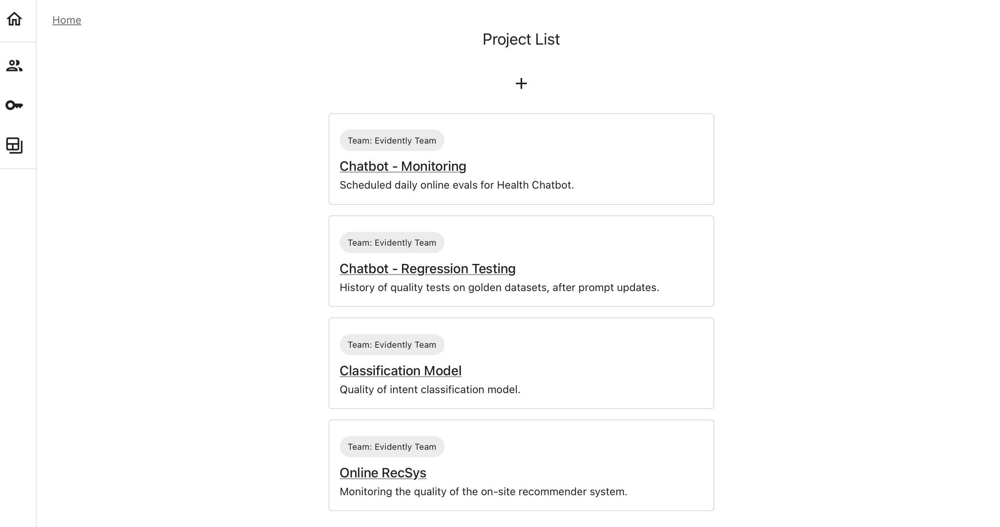

---
description: Intro to the Projects feature in Evidently.
---   


This feature is available in <mark style="color:black;background-color:lightgray;">Evidently OSS UI</mark>, <mark style="color:white;background-color:darkred;">Evidently Cloud</mark>, <mark style="color:white;background-color:mediumpurple;">Evidently Enterprise</mark>.
You can run also evaluations locally with Evidently Python library without creating a Project.


# What is a Project?

To start using the Evidently web application, you must create at least one Project. 

**Home Page**. You can see all your Projects on the home page of the Evidently platform:

**Project Dashboard**. A Project helps you organize all data and evaluations for a specific use case. Each Project has its own Dashboard and alerting rules. Inside the Project, you can also access the results of all experimental evaluations, regression testing, or ongoing online monitoring. 

You can organize Projects in a way that suits your workflow, for example, by creating separate Projects for the experimental and production phases, each ML model, or different components of an LLM-based application. Alternatively, you can group the results within a single Project, using Tags (such as model version, A/B test status, or other dimensions) to differentiate between evaluation results on the Dashboard.

Once you create a Project, it gets a unique ID. You can then connect via the Python API or through the UI to send data, edit the Dashboard, and manage the Project.
