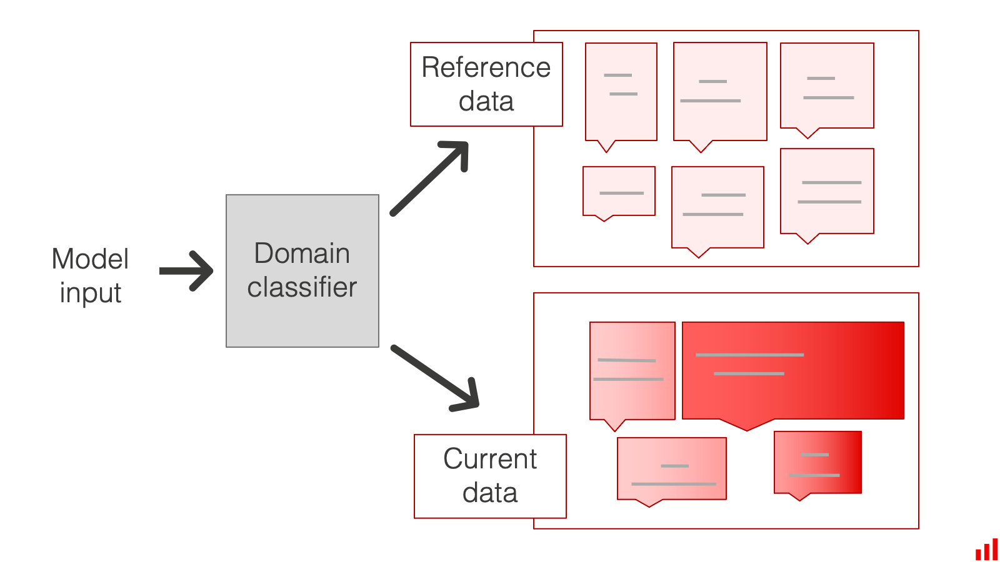
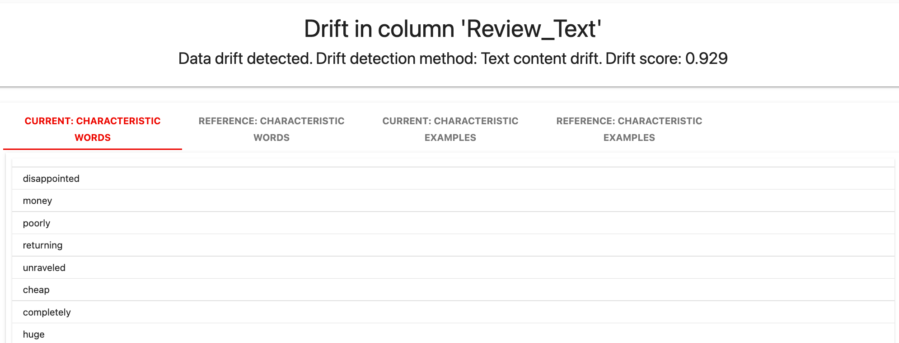
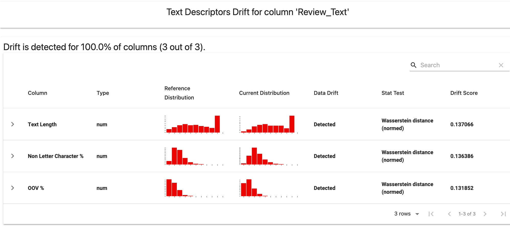

In some tests and metrics, Evidently uses the default Data Drift Detection algorithm. It helps detect the distribution drift in the individual features, prediction, or target. This page describes how the **default** algorithm works.

# How it works

Evidently compares the distributions of the values in a given column (or columns) of the two datasets. You should pass these datasets as **reference** and **current**. Evidently applies several statistical tests and drift detection methods to detect if the distribution has changed significantly. It returns a "drift detected" or "not detected" result.

There is a default logic to choosing the appropriate drift test for each column. It is based on:

* column type: categorical, numerical, text data or embeddings
* the number of observations in the reference dataset
* the number of unique values in the column (n\_unique)

## Tabular Data 

For **small data with <= 1000 observations** in the reference dataset:

* For numerical columns (n\_unique \> 5): [two-sample Kolmogorov-Smirnov test](https://en.wikipedia.org/wiki/Kolmogorov%E2%80%93Smirnov_test).
* For categorical columns or numerical columns with n\_unique <= 5: [chi-squared test](https://en.wikipedia.org/wiki/Chi-squared_test).
* For binary categorical features (n\_unique <= 2): proportion difference test for independent samples based on Z-score.

All tests use a 0.95 confidence level by default.  

For **larger data with \> 1000 observations** in the reference dataset:

* For numerical columns (n\_unique \> 5):[Wasserstein Distance](https://en.wikipedia.org/wiki/Wasserstein_metric).
* For categorical columns or numerical with n\_unique <= 5):[Jensen--Shannon divergence](https://en.wikipedia.org/wiki/Jensen%E2%80%93Shannon_divergence).

All metrics use a threshold = 0.1 by default.  


**You can always modify this drift detection logic**. You can select any of the statistical tests available in the library (including PSI, K-L divergence, Jensen-Shannon distance, Wasserstein distance, etc.), specify custom thresholds, or pass a custom test. You can read more about using [data drift parameters and available drift detection methods](../customization/options-for-statistical-tests.md).


## Text Data 

Text content drift using a **domain classifier**. Evidently trains a binary classification model to discriminate between data from reference and current distributions. 

The default for **small data with <= 1000 observations** detects drift if the ROC AUC of the drift detection classifier > possible ROC AUC of the random classifier at a 95th percentile.

The default for **larger data with > 1000 observations** detects drift if the ROC AUC > 0.55.

Text content drift detection method

**For small data**. The drift score is the ROC-AUC score of the domain classifier computed on a validation dataset. The ROC AUC of the created classifier is compared to the ROC AUC of the random classifier at a set percentile. To ensure the result is statistically meaningful, we repeat the calculation 1000 times with randomly assigned target class probabilities. This produces a distribution with a mean of 0,5. We then take the 95th percentile (default) of this distribution and compare it to the ROC-AUC score of the classifier. If the classifier score is higher, we consider the data drift to be detected. You can also set a different percentile as a parameter.
**For large data**. Directly compare against defined ROC AUC threshold. 


**You can set different thresholds**. You can specify a custom threshold as a [parameter](../customization/options-for-statistical-tests.md).



**You can also check for drift in Text Descriptors**. There is an additional method that detects drift in Text Descriptors (such as text length, share of OOV words). This test is available as part of [Text Overview Preset](../presets/text-overview.md). You can also include it as a **TextDescriptorsDriftMetric()** in a custom Report, or in a Test Suite accordingly.  


## Embeddings 

Embedding drift using a **classifier**. Evidently trains a binary classification model to discriminate between data from reference and current distributions. 

The default for **small data with <= 1000 observations** detects drift if the ROC AUC of the drift detection classifier > possible ROC AUC of the random classifier at a 95th percentile.

The default for **larger data with > 1000 observations** detects drift if the ROC AUC > 0.55.


**You can choose other embedding drift detection methods**. You can specify custom thresholds and parameters such as dimensionality reduction and choose from other methods, including Euclidean distance, Cosine Similarity, Maximum Mean Discrepancy, and share of drifted embeddings. You must specify this as a [parameter](../customization/embeddings-drift-parameters.md).


## Dataset-level drift

With Presets like `DatasetDriftPreset()`, Metrics like `DatasetDriftMetric()` or Tests like `TestShareOfDriftedColumns()` you can also set a rule on top of the individual feature drift results to detect dataset-level drift. 

For example, you can declare dataset drift if 50% of all features (columns) drifted or if ⅓ of the most important features drifted. 
**The default in `DatasetDriftPreset()` is 0.5**. 

Note that by default this includes all columns in the dataset. Suppose your dataset contains the prediction column, and you want to separate it from input drift detection. In that case, you should pre-process your dataset to exclude it or specify a list of columns you want to test for drift, and pass the list as a parameter.   


**You can set different thresholds**. You can specify a custom threshold as a [parameter](../customization/options-for-statistical-tests.md).


# Input data requirements

### Empty columns 

To evaluate data or prediction drift in the dataset, you need to ensure that the columns you test for drift are not empty. If these columns are empty in either reference or current data, Evidently will not calculate distribution drift and will raise an error.

### Empty values 

If some columns contain empty or infinite values (+-np.inf), these values will be filtered out when calculating distribution drift in the corresponding column.

By default, drift tests do not react to changes or increases in the number of empty values. Since the high number of nulls can be an important indicator, we recommend grouping the data drift tests (that check for distribution shift) with data integrity tests (that check for a share of nulls). You can choose from several null-related [tests](all-tests.md#data-integrity) and metrics and set a threshold.

# Resources

To build up a better intuition for which tests are better in different kinds of use cases, you can read our in-depth blog with experimental code:   

[Which test is the best? We compared 5 methods to detect data drift on large datasets](https://evidentlyai.com/blog/data-drift-detection-large-datasets).  

Additional links:  

* [How to interpret data and prediction drift together? ](https://evidentlyai.com/blog/data-and-prediction-drift)  

* [Do I need to monitor data drift if I can measure the ML model quality?](https://evidentlyai.com/blog/ml-monitoring-do-i-need-data-drift)  

* ["My data drifted. What's next?" How to handle ML model drift in production.](https://evidentlyai.com/blog/ml-monitoring-data-drift-how-to-handle)  

* [What is the difference between outlier detection and data drift detection?](https://evidentlyai.com/blog/ml-monitoring-drift-detection-vs-outlier-detection)
