# Recall 

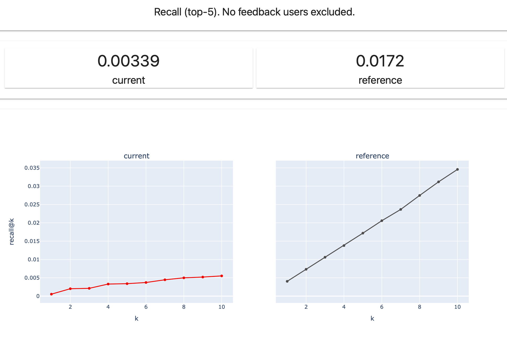

**Evidently Metric**: `RecallTopKMetric`. 

Recall at K reflects the ability of the recommender or ranking system to retrieve all relevant items within the top K results. 

**Implemented method:**
* **Compute recall at K by user**. Compute the recall at K for each individual user, by measuring the share of all relevant items in the dataset (e.g. that a given user liked or interacted with) that appear in the top K results.

$$\text{Recall at } K = \frac{\text{Number of relevant items in } K}{\text{Total number of relevant items}}$$
* **Compute overall recall**. Average the results across all users in the dataset. 

**Range**: 0 to 1.

**Interpretation**: a higher recall at K indicates that the model is able to retrieve a higher proportion of relevant items, which is generally desirable. 

**Notes**: if the total number of relevant items is greater than K, it's impossible to recall all of them within the top K results (making 100% recall impossible).

# Precision 

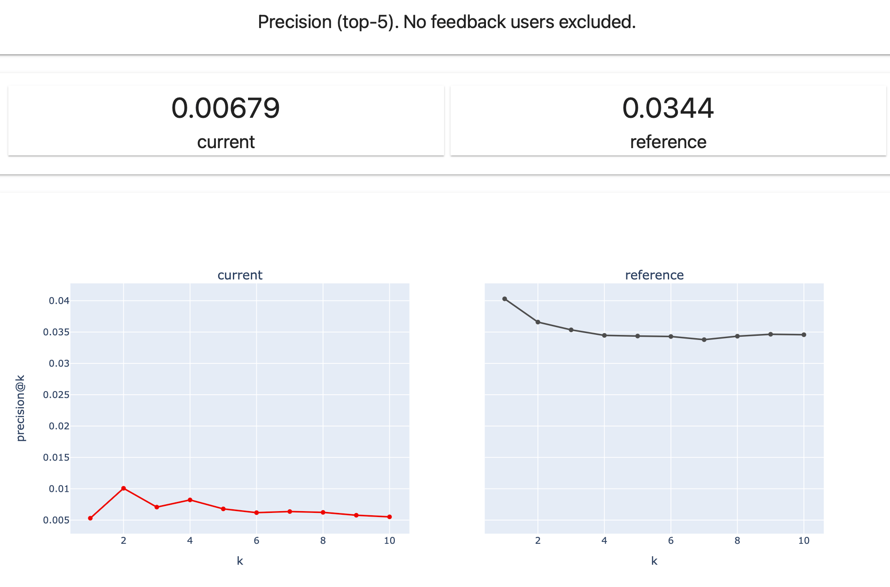

**Evidently Metric**: `PrecisionTopKMetric`. 

Precision at K reflects the ability of the system to suggest items that are truly relevant to the users’ preferences. 

**Implemented method:**
* **Compute precision at K by user**. Compute the precision at K for each user by measuring the share of the relevant results within the top K (e.g. that the user liked or interacted with). 

$$\text{Precision at } K = \frac{\text{Number of relevant items in } K}{\text{Total number of items in }K}$$
* **Compute overall precision**. Average the results across all users in the dataset. 

**Range**: 0 to 1.

**Interpretation**: a higher precision at K indicates that a larger proportion of the top results are relevant, which is generally desirable.

## F Beta

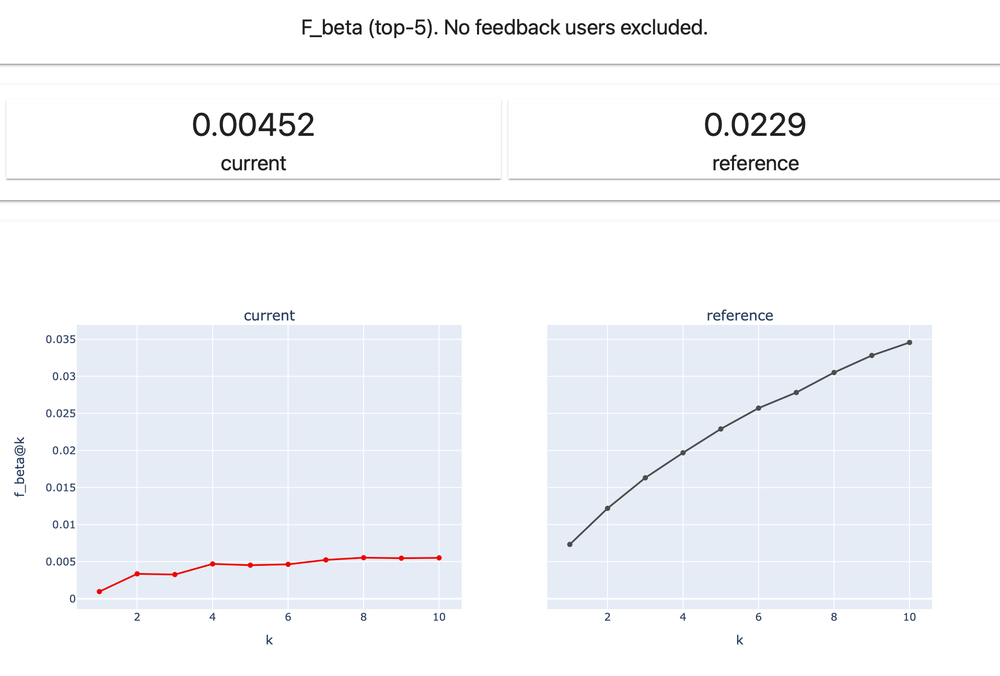

**Evidently Metric**: `FBetaTopKMetric`.

The F Beta score at K combines precision and recall into a single value, providing a balanced measure of a recommendation system's performance. 

$$F_{\beta} = \frac{(1 + \beta^2) \times \text{Precision at K} \times \text{Recall at K}}{(\beta^2 \times \text{Precision at K}) + \text{Recall at K}} \$$

`Beta` is a parameter that determines the weight assigned to recall relative to precision. `Beta` > 1 gives more weight to recall, while `beta` < 1 favors precision.

If `Beta` = 1 (default), it is a traditional F1 score that provides a harmonic mean of precision and recall at K. It provides a balanced estimation, considering both false positives (items recommended that are not relevant) and false negatives (relevant items not recommended).

**Range**: 0 to 1.

**Interpretation**: Higher F Beta at K values indicate better overall performance.

# Mean average precision (MAP) 

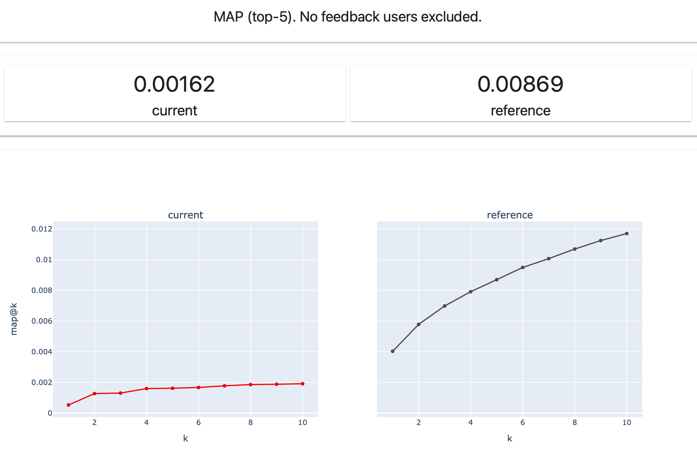

**Evidently Metric**: `MAPKMetric`.

MAP (Mean Average Precision) at K assesses the ability of the recommender system to suggest relevant items in the top-K results, while placing more relevant items at the top. 

Compared to precision at K, MAP at K is rank-aware. It penalizes the system for placing relevant items lower in the list, even if the total number of relevant items at K is the same.

**Implemented method:**
* **Compute Average Precision (AP) at K by user**. The Average Precision at K is computed for each user as an average of precision values at each relevant item position within the top K. To do that, we sum up precision at all values of K when the item is relevant (e.g., Precision @1, Precision@2..), and divide it by the total number of relevant items in K.

$$\text{AP@K} = \frac{1}{N} \sum_{k=1}^{K} Precision(k) \times rel(k)$$

Where *N* is the total number of relevant items at K, and *rel(k)* is equal to 1 if the item is relevant, and is 0 otherwise.

Example: if K = 10, and items in positions 1, 2, and 10 are relevant, the formula will look as:

$$AP@10 = \frac{Precision@1+Precision@2+Precision@10}{3}$$
* **Compute Mean Average Precision (MAP) at K**. Average the results across all users in the dataset.

$$\text{MAP@K} = \frac{1}{U} \sum_{u=1}^{U} \text{AP@K}_u$$

Where *U* is the total number of users or queries in the dataset, and *AP* is the average precision for a given list.

**Range**: 0 to 1.

**Interpretation**: Higher MAP at K values indicates a better ability of the system to place relevant items high in the list. 

# Mean average recall (MAR) 

**Evidently Metric**: `MARKMetric`.

MAR (Mean Average Recall) at K assesses the ability of a recommendation system to retrieve all relevant items within the top-K results, averaged by all relevant positions. 

**Implemented method:**
* **Compute the average recall at K by user**. Compute and average the recall at each relevant position within the top K for every user. To do that, we sum up the recall at all values of K when the item is relevant (e.g. Recall @1, Recall@2..), and divide it by the total number of relevant recommendations in K.

$$\text{AR@K} = \frac{1}{N} \sum_{k=1}^{K} Recall(k) \times rel(k)$$

Example: if K = 10, and items in positions 1, 2, and 10 are relevant, the formula will look as:

$$\text{AR@10} = \frac{Recall@1+Recall@2+Recall@10}{3}$$
* **Compute mean average recall at K**. Average the results across all users.

$$\text{MAR@K} = \frac{1}{U} \sum_{u=1}^{U} \text{AR@K}_u$$

Where *U* is the total number of users or queries in the dataset, and *AR* is the average recall for a given list.

**Range**: 0 to 1.

**Interpretation**: Higher MAR at K values indicates a better ability of the system to retrieve relevant items across all users.  

# Normalized Discounted Cumulative Gain (NDCG)

**Evidently Metric**: `NDCGKMetric`.

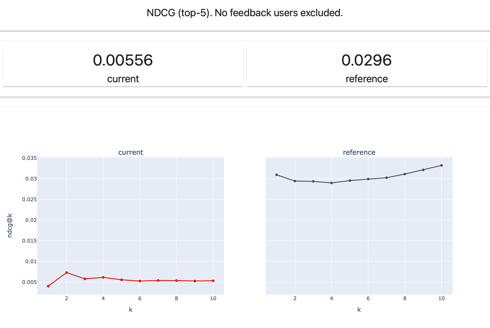

NDCG (Normalized Discounted Cumulative Gain) at K reflects the ranking quality, compared to an ideal order where all relevant items for each user are placed at the top of the list.

**Implemented method**:
* **Provide the item relevance score**. You can assign a relevance score for each item in each user’s top-K list. Depending on the model type, it can be a binary outcome (1 is relevant, 0 is not) or a score.  
* **Compute the discounted cumulative gain (DCG)** at K by the user. DCG at K measures the quality of the ranking (= total relevance) for a list of top-K items. We add a logarithmic discount to account for diminishing returns from each following item being lower on the list. To get the resulting DCG, you can compute a weighted sum of the relevance scores for all items from the top of the list to K with an applied discount.

$$\text{DCG@K} = \sum_{k=1}^{K} \frac{rel_i}{\log_2(i + 1)}$$

Where *Rel(i)* is the relevance score of the item at rank *i*. 
* **Compute the normalized DCG (NDCG)**. To normalize the metric, we divide the resulting DCG by the ideal DCG (IDCG) at K. Ideal DCG at K represents the maximum achievable DCG for a user when the items are perfectly ranked in descending order of relevance. 

$$\text{NDCG@K} = \frac{DCG@K}{IDCG@K}$$

This way, it is possible to compare NDCG values across different use cases. The resulting NDCG values for all users are averaged to measure the overall performance of a model. 

**Range**: 0 to 1, where 1 indicates perfect ranking.

**Interpretation**: Higher NDCG at K indicates a better ability of the system to place more relevant items higher up in the ranking.

# Hit Rate

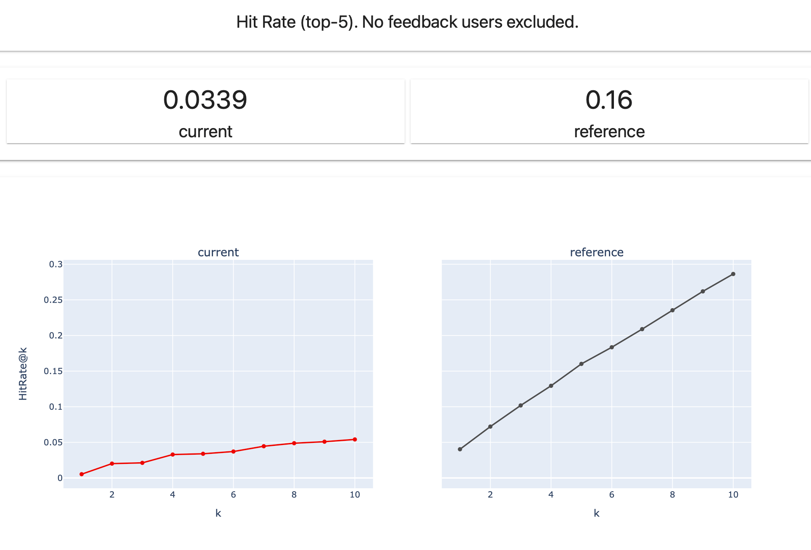

**Evidently Metric**: `HitRateKMetric`.

Hit Rate at K calculates the share of users for which at least one relevant item is included in the K.

**Implemented method**:
* **Compute “hit” for each user**. For each user, we evaluate if any of the top-K recommended items is relevant. It is a binary metric equal to 1 if any relevant item is included in K, or 0 otherwise.
* **Compute average hit rate**. The average of this metric is calculated across all users.

**Range**: 0 to 1, where 1 indicates that each user gets at least one relevant recommendation.

**Interpretation**: A higher Hit Rate indicates that a higher share of users have relevant recommendations in their lists. 

**Note**: the Hit Rate will typically increase for higher values of K (since there is a higher chance that a relevant item will be recommended in a longer list).

# Mean Reciprocal Rank (MRR)

**Evidently Metric**: `MRRKMetric`

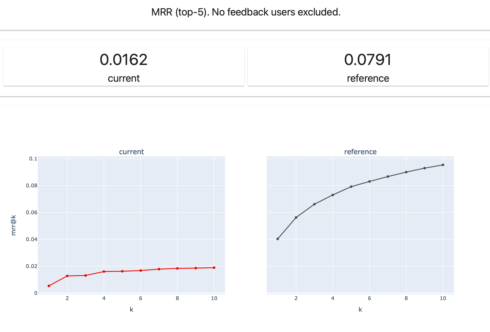

Mean Reciprocal Rank (MRR) measures the ranking quality considering the position of the first relevant item in the list of recommendations.

**Implemented method:**
* For each user, identify the position of the **first relevant item** in the recommended list.
* Calculate the **reciprocal rank**, taking the reciprocal of the position of the first relevant item for each user (i.e., 1/position). 
Example: if the first relevant item is at the top of the list - the reciprocal rank is 1, if it is on the 2nd position - the reciprocal rank ½, if on the 3rd - ⅓, etc.
* Calculate the **mean reciprocal rank** (MRR). Compute the average reciprocal rank across all users.

$$\text{MRR} = \frac{1}{U} \sum_{u=1}^{U}\frac{1}{rank_i}$$

Where *U* is the total number of users, and *rank(i)* is the rank of the first relevant item for user *u* in the top-K results.

**Range**: 0 to 1, where 1 indicates that the first recommended item for every user is relevant.

**Interpretation**: A higher MRR indicates that, on average, relevant items are positioned closer to the top of the recommended lists. 

**Note**: Only a single top relevant item is considered in this metric, disregarding the position and relevance of other items in the list.

# Diversity

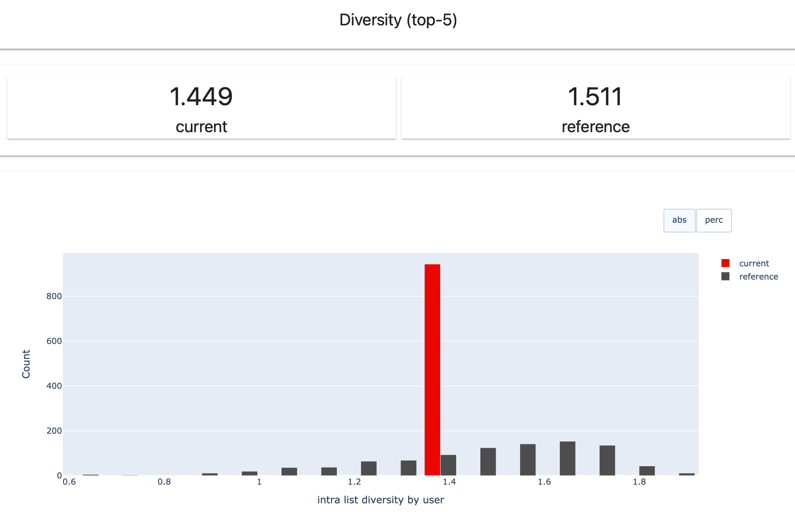

**Evidently Metric**: `DiversityMetric`

**Recommendation diversity**: this metric measures the average intra-list diversity at K. It reflects the variety of items within the same user's recommendation list, averaged by all users. 

**Implemented method**:
* **Measure the difference between recommended items**. Calculate the Cosine distance for each pair of recommendations inside the top-K in each user's list. The cosine distance serves a measure of diversity between vectors representing recommended items, and is computed as:

$$\text{Cosine distance} = 1 - \text{Cosine Similarity}$$

Link: [Cosine Similarity on Wikipedia](https://en.wikipedia.org/wiki/Cosine_similarity). 

* **Intra-list diversity**. Calculate intra-list diversity for each user by averaging the Cosine Distance between each pair of items in the user's top-K list.
* **Overall diversity**. Calculate the overall diversity by averaging the intra-list diversity across all users.

**Range**: The metric is based on Cosine distance, and can take values from 0 to 2. 
**0:** identical recommendations in top-K.
**2:** very diverse recommendations in top-K.

**Interpretation**: the higher the value, the more varied items are shown to each user (e.g. inside a single recommendation block).

**Requirements**: You must pass the `item_features` list to point to numerical columns or embeddings that describe the recommended items. For example, these could be encoded genres that represent each movie. This makes it possible to compare the degree of similarity between different items. 

**Notes**: 
* This metric does not consider relevance. A recommender system showing varied but irrelevant items will have high diversity.
* This method performs many pairwise calculations between items and can take some time to compute.
  
# Novelty

**Evidently Metric**: `NoveltyMetric`

**Recommendation novelty**: this metric measures the average novelty of recommendations at K. It reflects how unusual top-K items are shown to each user, averaged by all users. 

**Implemented method**:
* Measure **novelty of recommended items**. The novelty of an item can be defined based on its popularity in the training set.

$$\text{novelty}_i = -\log_2(p_i)$$

where *p* represents the probability that item *i* is observed. It is calculated as the share of users that interacted with an item in the training set.

$$\text{novelty}_i = -\log_2\left(\frac{\text{users who interacted with } i}{\text{number of users}}\right)$$

High novelty corresponds to long-tail items that few users interacted with, and low novelty values correspond to popular items. If all users had interacted with an item, novelty is 0.
* Measure **novelty by user**. For each user, compute the average item novelty at K, by summing up the novelty of all items and dividing by K.
* **Overall novelty**. Average the novelty by user across all users.

**Range**: 0 to infinity. 

**Interpretation**: if the value is higher, the items shown to users are more unusual. If the value is lower, the recommended items are well-known.   

**Notes**: 
* This metric does not consider relevance. A recommender system showing many irrelevant but unexpected (long tail) items will have high novelty. 
* It is not possible to define the novelty of an item absent in the training set. The evaluation only considers items that are present in training. 

Further reading: [Castells, P., Vargas, S., & Wang, J. (2011). Novelty and Diversity Metrics for Recommender Systems: Choice, Discovery and Relevance](https://repositorio.uam.es/bitstream/handle/10486/666094/novelty_castells_DDR_2011.pdf)

# Serendipity

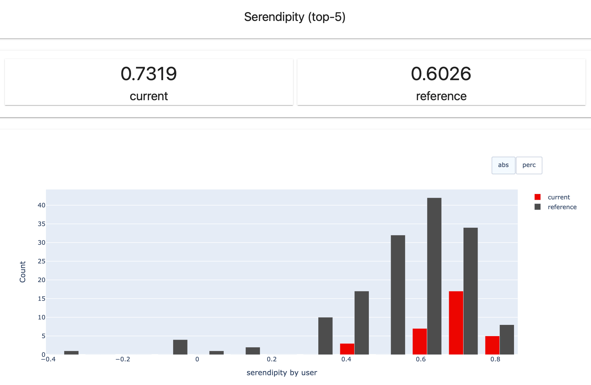

**Evidently Metric**: `SerendipityMetric`

Recommendation serendipity: this metric measures how unusual the relevant recommendations are in K, averaged for all users. 

Serendipity combines unexpectedness and relevance. It reflects the ability of a recommender system to show relevant items (that get a positive ranking or action) that are unexpected in the context of the user history (= are not similar to previous interactions). For example, a user that usually likes comedies gets recommended and upvotes a thriller.

**Implemented method**. 
* Measure the **unexpectedness** of relevant recommendations. The “unexpectedness” is measured using Cosine distance. For every relevant recommendation in top-K, we compute the distance between this item and the previous user interactions in the training set. Higher cosine distance indicates higher unexpectedness.
* **Serendipity by user**. Calculate the average of the resulting distances for all relevant recommendations in the user list.  
* **Overall serendipity**. Calculate the overall recommendation serendipity by averaging the results across all users.

$$\text{serendipity}_i = \text{unexpectedness}_i\times\text{relevance}_i$$

Where *relevance(i)* is equal to 1 if the item is relevant, and is 0 otherwise.

**Range**: The metric is based on Cosine distance, and can take values from 0 to 2. 
* **0**: only popular, expected relevant recommendations.
* **2**: completely unexpected relevant recommendations.
 
**Interpretation**: the higher the value, the better the ability of the system to “positively surprise” the user. 

**Requirements**: You must pass the `item_features` list to point to the numerical columns or embeddings that describe the recommended items. This allows comparing the degree of similarity between recommended items.

**Notes**: 
* This metric is only computed for the users that are present in the training set. If there is no previous recommendation history, these users will be ignored. 
* This metric only considers the unexpectedness of relevant items in top-K. Irrelevant recommendations, and their share, are not taken into account.

Further reading: [Zhang, Y., Séaghdha, D., Quercia, D., Jambor, T. (2011). Auralist: introducing serendipity into music recommendation.](http://www.cs.ucl.ac.uk/fileadmin/UCL-CS/research/Research_Notes/RN_11_21.pdf)

# Personalization

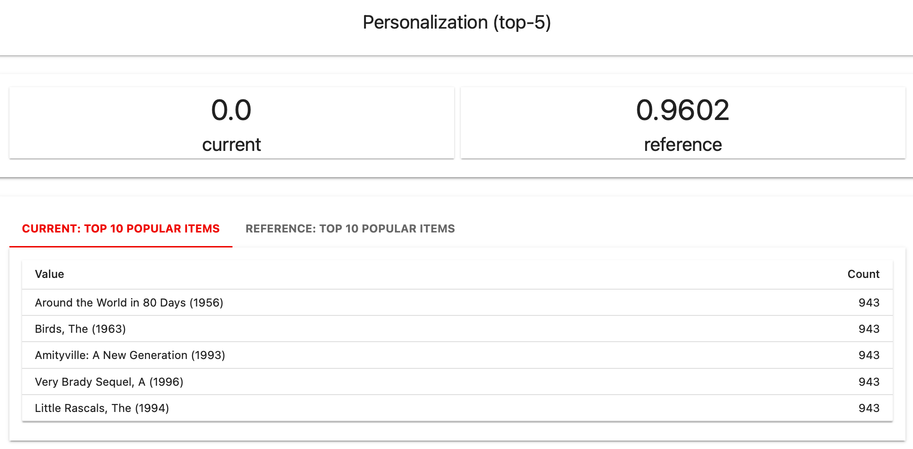

**Evidently Metric**: `PersonalizationMetric`

Personalization of recommendations: this metric measures the average uniqueness of each user's recommendations in top-K.

**Implemented method**:
* For every two users, compute the **overlap between top-K recommended items**. (The number of common items in top-K between two lists, divided by K).
* Calculate the **average overlap** across all pairs of users.
* Calculate personalization as: 

$$\text{Personalization} = 1 - \text{average overlap}$$
 
The resulting metric reflects the average share of unique recommendations in each user’s list.

**Range**: 0 to 1.
* **0**: Identical recommendations for each user in top-K. 
* **1**: Each user’s recommendations in top-K are unique.   

**Interpretation**: the higher the value, the more personalized (= different from others) is each user’s list. The metric visualization also shows the top-10 most popular items.

# Popularity Bias 

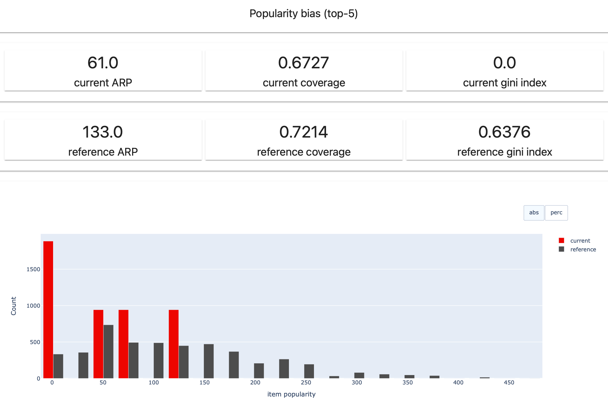

**Evidently Metric**: `PopularityBias`

The recommendation popularity bias is a tendency of favoring a few popular items. This metric includes several measurements: ARP, Coverage and Gini index.

## Average Recommendation Popularity (ARP)

ARP reflects the average popularity of the items recommended to the users. 

**Implementation**.
* Compute the item popularity as the number of times each item was seen in training. 
* Compute the average popularity for each user’s list as a sum of all items’ popularity divided by the number of recommended items.
* Compute the average popularity for all users by averaging the results across all users.

$$ARP = \frac{1}{|U|} \sum_{u \in U} \frac{1}{|L_u|} \sum_{i \in L_u} \phi(i) \$$

Where:
* *U* is the total number of users.
* *L(u)* is the list of items recommended for the user *u*.
* *ϕ(i)* is the number of times item *i* was rated in the training set (popularity of item *i*)

**Range**: 0 to infinity 

**Interpretation**: the higher the value, the more popular on average the recommendations are in top-K.  

**Note**: This metric is not normalized and depends on the number of recommendations in the training set.

Further reading: [Abdollahpouri, H., Mansoury, M., Burke, R., Mobasher, B., & Malthouse, E. (2021). User-centered Evaluation of Popularity Bias in Recommender Systems](https://dl.acm.org/doi/fullHtml/10.1145/3450613.3456821)

## Coverage

Coverage reflects the item coverage as a proportion of items that has been recommended by the system.

**Implementation**: compute the share of items recommended to the users out of the total number of potential items (as seen in the training dataset).

$$\text{Coverage} = \frac{\text{Number of unique items recommended} K}{\text{Total number of unique items}}$$

**Range**: 0 to 1, where 1 means that 100% of items have been recommended to users. 

**Interpretation**: the higher the value (usually preferable), the larger the share of items represented in the recommendations. Popularity-based recommenders that only recommend a limited number of popular items will have a low coverage.

## Gini index 

Coverage reflects the item coverage as a proportion of items that has been recommended by the system.

**Implementation**: compare the actual distribution of the recommended items to a perfectly equal distribution. 

$$ Gini(L) = 1 - \frac{1}{|I| - 1} \sum_{k=1}^{|I|} (2k - |I| - 1) p(i_k | L) \$$

Where 
* *L* is the combined list of all recommendation lists given to different users (note that an item may appear multiple times in L, if recommended for more than one user).
* *p(i|L)* is the ratio of occurrence of item *i* in *L*.
* *I* is the set of all items in the catalog.

**Range**: 0 to 1, where 0 represents the perfect equality (recommended items are evenly distributed among users), and 1 is complete inequality (the recommendations are concentrated on a single item).

**Interpretation**: the lower the value (usually preferable), the more equal is the item distribution in recommendations. If the value is high, it means that a few items are being frequently recommended to many users, while others are ignored.

Further reading: [Abdollahpouri, H., Mansoury, M., Burke, R., Mobasher, B., & Malthouse, E. (2021). User-centered Evaluation of Popularity Bias in Recommender Systems](https://dl.acm.org/doi/fullHtml/10.1145/3450613.3456821)

# Recommendation table

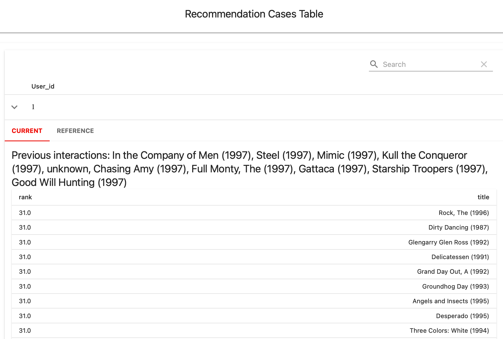

**Evidently Metric**: `RecCasesTable`

This visual Metric shows the list of recommendations for the specified user IDs ('user_ids: List'). If you do not pass the list of IDs, Evidently will choose 5 random ones.

You can optionally specify:
* The number of training items in the user history to display ('train_item_num')
* Whether you’d like to additionally include the values of specific features in the table ('display_features: List')
* The number of items recommended for user to display ('item_num')

# Score Distribution (Entropy)

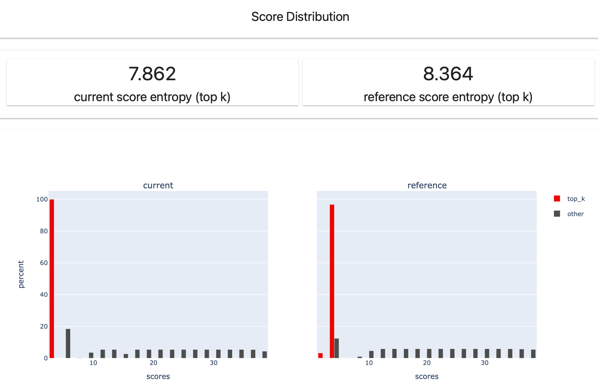

**Evidently Metric**: `ScoreDistribution`

This metric computes the predicted score entropy. It applies only when the recommendations_type is a score.

**Implementation**:
* Apply softmax transformation for top-K scores for all users.
* Compute the KL divergence (relative entropy in [scipy](https://docs.scipy.org/doc/scipy/reference/generated/scipy.stats.entropy.html)). 

The visualization shows the distribution of the predicted scores at K (and all scores, if available). 

# Item Bias 

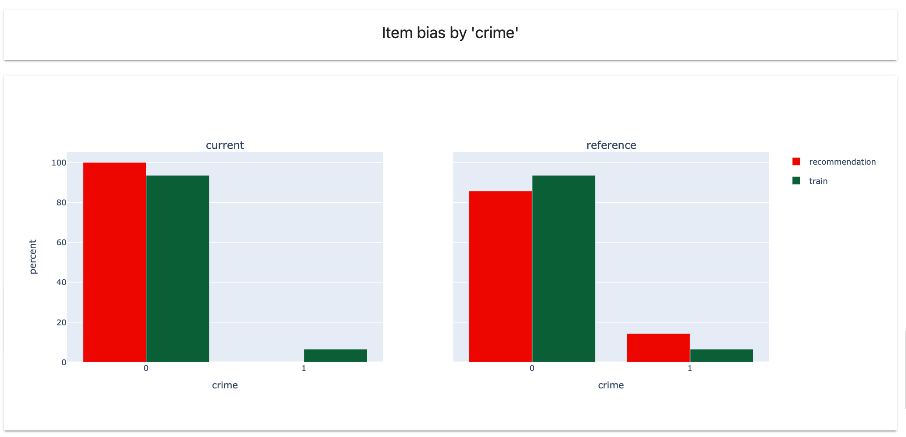

**Evidently Metric**: `ItemBiasMetric`

This visual metric shows the distribution of recommendations by a specified category or numerical value (`column_name`) compared to its distribution in the training set.

This helps compare the model recommendations against what could have been a random classifier that follows the observed distribution of items by a chosen characteristic.

The visualization shows:
* The distribution of items in the training set for the defined column_name (with duplicates dropped). This represents the item catalog by this dimension. 
* The distribution of the recommended items for the defined column_name in the current and reference (if available) datasets. 

This visualization helps see the patterns in the model recommendations. In a simplified example, you might observe that the training data contains 3x comedies compared to dramas, but the model recommends dramas 10x more often. 

# UserBiasMetric

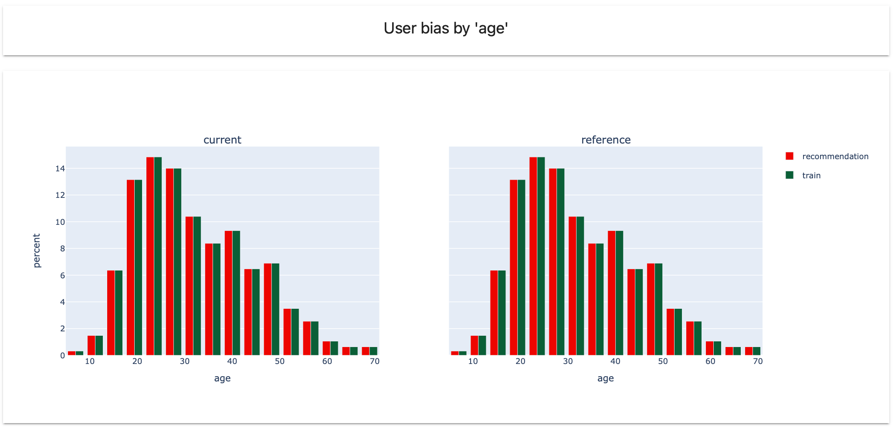

This visual metric shows the distribution of a specified category or numerical value (`column_name`) compared to its distribution in the training set.

This helps evaluate the distribution of users by a specific category (e.g., age, gender, etc.) in production data compared to training. Before visualization, we drop duplicates in training and current (reference) data.

For example, exploring this metric might help notice that a particular user group is underrepresented in training but is prevalent in production, or vice versa.

