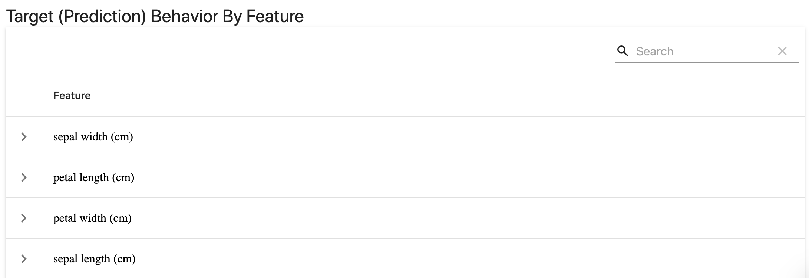

# Categorical Target Drift

**TL;DR:** The report explores the changes in the categorical target function (prediction).

* Performs a suitable **statistical test** to compare target (prediction) **distribution**.
* **Plots the relations** between each individual feature and the target (prediction)

## Summary

The **Target Drift** report helps detect and explore changes in the target function and/or model predictions.

The **Categorical Target Drift** report is suitable for problem statements with the categorical target function: binary classification, multi-class classification, etc.

## Requirements

To run this report, you need to have input features, and **target and/or prediction** columns available.

You will need **two** datasets. The **reference** dataset serves as a benchmark. We analyze the change by comparing the **current** production data to the **reference** data.

You can potentially choose any two datasets for comparison. But keep in mind that only the **reference** dataset will be used as a basis for comparison.

## How it works

We estimate the drift for the **target** (actual values) and **predictions** in the same manner. If both columns are passed to the dashboard, we build two sets of plots.

If only one of them (either target or predictions) is provided, we build one set of plots. If neither target nor predictions column is available, you will get an error.

To estimate the **categorical target (prediction) drift**, we compare the distribution of the target (prediction) in the two datasets. There is a default logic to choosing the appropriate statistical test, based on:
* the number of observations in the reference dataset 
* the number of unique values in the target (n_unique)

For **small data with <= 1000 observations** in the reference dataset:
* For categorical target with **n_unique <= 5**: [chi-squared test](https://en.wikipedia.org/wiki/Chi-squared\_test).
* For **binary** categorical target (n_unique <= 2), we use the proportion difference test for independent samples based on Z-score.

For **larger data with > 1000 observations** in the reference dataset:
* For categorical target: [Jensen–Shannon divergence](https://en.wikipedia.org/wiki/Jensen–Shannon_divergence).

* We use the [chi-squared test](https://en.wikipedia.org/wiki/Chi-squared\_test) with 0.95 confidence level to detect if the distribution has changed significantly.
* If the categorical target is **binary**, we use the proportion difference test for independent samples based on Z-score.

All tests use a 0.95 confidence level by default.


You can modify the drift detection logic by selecting a statistical test already available in the library, including PSI, K–L divergence, Jensen-Shannon distance, Wasserstein distance. See more details about [available tests](../customization/options-for-statistical-tests.md). You can also set a different confidence level or implement a custom test, by defining [custom options](../customization/options-for-data-target-drift.md). 


## How it looks

The report includes 2 components. All plots are interactive.

### 1. Target (Prediction) Drift&#x20;

The report first shows the **comparison of target (prediction) distributions** in the current and reference dataset. The result of the statistical test and P-value are displayed in the title.

For a classification problem with three classes, it can look like this (an example of the extreme target drift with the appearance of a new class):


### 2. Target (Prediction) Behavior By Feature

The report generates an interactive table with the **visualizations of dependencies between the target and each feature**.&#x20;



If you click on any feature, you get a plot that shows the feature distribution for the different target labels.&#x20;


These plots help analyze how feature values relate to the target labels and identify the differences between the datasets.&#x20;

We recommend paying attention to the behavior of the most important features since significant changes might confuse the model and cause higher errors.

## Report customization

You can set different [options-for-data-target-drift.md](../customization/options-for-data-target-drift.md "mention") and [options-for-quality-metrics.md](../customization/options-for-quality-metrics.md "mention") to modify the report components.

You can also select which components of the reports to display or choose to show the short version of the report: [select-widgets-to-display.md](../customization/select-widgets-to-display.md "mention").

If you want to create a new plot or metric, you can [add-a-custom-widget-or-tab.md](../customization/add-a-custom-widget-or-tab.md "mention").

## When to use the report

Here are our suggestions on when to use it—best combined with the [Data Drift report.](data-drift.md)

**1. Before model retraining.** Before feeding fresh data into the model, you might want to verify whether it even makes sense.

**2. When you are debugging the model decay.** If you observe a drop in performance, this report can help see what has changed.

**3. When you are flying blind, and no ground truth is available.** If you do not have immediate feedback, you can use this report to explore the changes in the model output and the relationship between the features and prediction. This can help anticipate [data and concept drift](https://evidentlyai.com/blog/machine-learning-monitoring-data-and-concept-drift).

## JSON Profile

If you choose to generate a JSON profile, it will contain the following information:

```yaml
{
 cat_target_drift": {
    "name": "cat_target_drift",
    "datetime": "datetime",
    "data": {
      "utility_columns": {
        "date": null,
        "id": null,
        "target": "target",
        "prediction": null
      },
      "cat_feature_names": [],
      "num_feature_names": [],
      "metrics": {
        "target_name": "target",
        "target_type": "cat",
        "target_drift": p_value
      }
    }
  },
  "timestamp": "timestamp"
}
```

## Examples

* Browse our [examples](../get-started/examples.md) for sample Jupyter notebooks.

You can also read the initial [release blog](https://evidentlyai.com/blog/evidently-014-target-and-prediction-drift).
