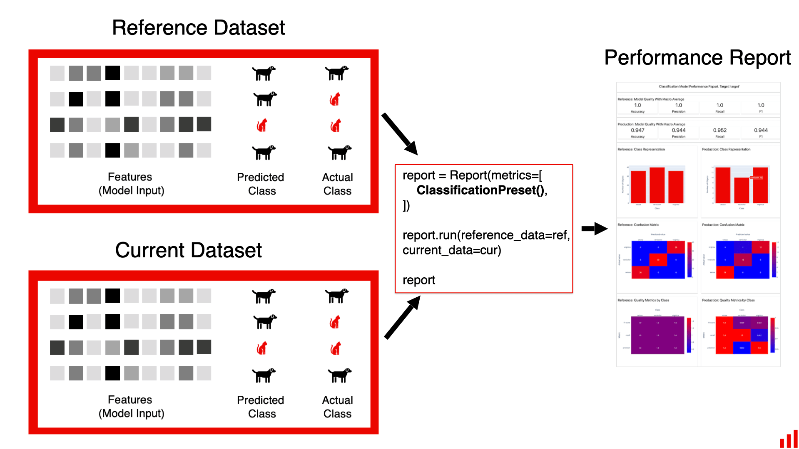
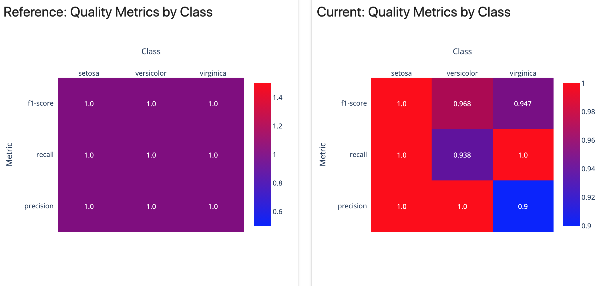
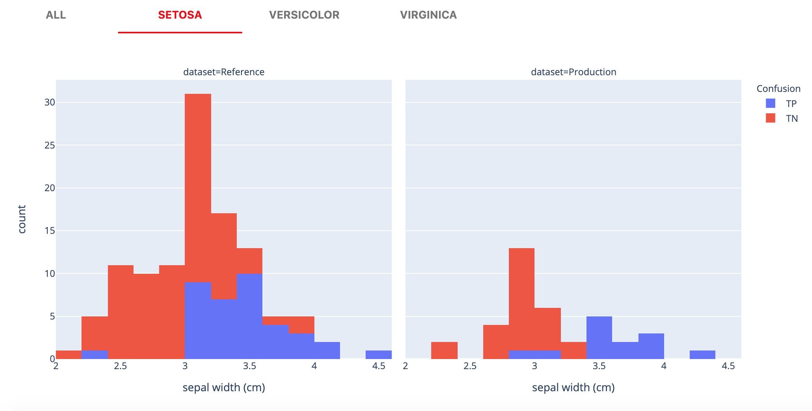

# Classification Performance

**TL;DR:** The report analyzes the performance of a classification model

* Works for a **single model** or helps compare the **two**
* Works for **binary** and **multi-class** classification&#x20;
* Displays a variety of plots related to the model **performance**&#x20;
* Helps **explore regions** where the model makes different types of **errors**

## Summary&#x20;

**Classification Performance** report evaluates the quality of a classification model. It works both for binary and multi-class classification. If you have a probabilistic classification, refer to a [separate report](probabilistic-classification-performance.md).

This report can be generated for a single model, or as a comparison. You can contrast your current production model performance against the past or an alternative model.

## Requirements

To run this report, you need to have input **features**, and **both target and prediction** columns available.

You can use both **numerical labels** like "0", "1", "2" or **class names** like "virginica", "setoza", "versicolor" inside the target and prediction columns. The labels should be the same for the target and predictions.

**NOTE: Column order in Binary Classification.** For binary classification, class order matters. The tool expects that the target (so-called positive) class is the **first** in the `column_mapping['prediction']` list.

To generate a comparative report, you will need the **two** datasets. The **reference** dataset serves as a benchmark. We analyze the change by comparing the **current** production data to the **reference** data.



You can also run this report for a **single** `DataFrame` , with no comparison performed. In this case, pass it as `reference_data`.

## How it looks

The report includes 5 components. All plots are interactive.

### **1. Model Quality Summary Metrics**

We calculate a few standard model quality metrics: Accuracy, Precision, Recall, and F1-score.


**To support the model performance analysis, we also generate interactive visualizations. They help analyze where the model makes mistakes and come up with improvement ideas.**

### 2. Class Representation

Shows the number of objects of each class.


### 3. Confusion Matrix

Visualizes the classification errors and their type.


### 4. Quality Metrics by Class

&#x20;Shows the model quality metrics for the individual classes.



### 5. Classification Quality by Feature

In this table, we show a number of plots for each feature. To expand the plots, click on the feature name.


In the tab “**ALL**”, we plot the distribution of classes against the values of the feature. This is the “Target Behavior by Feature” plot from the [Categorial Target Drift ](categorical-target-drift.md)report.&#x20;


If you compare the two datasets, it visually shows the changes in the feature distribution and in the relationship between the values of the feature and the target. 

Then, for each class, we plot the **distribution of the True Positive, True Negative, False Positive, and False Negative predictions** alongside the values of the feature.



It visualizes the regions where the model makes errors of each type and reveals the low-performance segments. This helps explore if a **specific type of misclassification error is sensitive to the values of a given feature.**&#x20;

## Report customization

You can select which components of the reports to display or choose to show the short version of the report: [select-widgets-to-display.md](../customization/select-widgets-to-display.md "mention").&#x20;

If you want to create a new plot or metric, you can [add-a-custom-widget-or-tab.md](../customization/add-a-custom-widget-or-tab.md "mention").

## When to use the report

Here are our suggestions on when to use it—you can also combine it with the [Data Drift](data-drift.md) and [Categorical Target Drift](categorical-target-drift.md) reports to get a comprehensive picture.

**1. To analyze the results of the model test.** You can explore the results of an online or offline test and contrast it to the performance in training. Though this is not the primary use case, you can use this report to compare the model performance in an A/B test, or during a shadow model deployment.

**2. To generate regular reports on the performance of a production model.** You can run this report as a regular job (e.g. weekly or at every batch model run) to analyze its performance and share it with other stakeholders.

**3. To analyze the model performance on the slices of data.** By manipulating the input data frame, you can explore how the model performs on different data segments (e.g. users from a specific region).

**4. To trigger or decide on the model retraining.** You can use this report to check if your performance is below the threshold to initiate a model update and evaluate if retraining is likely to improve performance. 

**5. To debug or improve model performance.** You can use the Classification Quality table to identify underperforming segments and decide on ways to address them.

## JSON Profile

If you choose to generate a JSON profile, it will contain the following information:&#x20;

```yaml
{
  "classification_performance": {
    "name": "classification_performance",
    "datetime": "datetime",
    "data": {
      "utility_columns": {
        "date": null,
        "id": null,
        "target": "target",
        "prediction": "prediction"
      },
      "cat_feature_names": [],
      "num_feature_names": [],
      "metrics": {
        "reference": {
          "accuracy": accuracy,
          "precision": precision,
          "recall": recall,
          "f1": f1,
          "metrics_matrix": {
            "label_1": {
              "precision": precision,
              "recall": recall,
              "f1-score": f1,
              "support": support
            },
            "accuracy": accuracy,
            "macro avg": {
              "precision": precision,
              "recall": recall,
              "f1-score": f1,
              "support": support
            },
            "weighted avg": {
              "precision": precision,
              "recall": recall,
              "f1-score": f1,
              "support": support
            }
          },
          "confusion_matrix": {
            "labels": [],
            "values": []
            ]
          }
        },
        "current": {
          "accuracy": accuracy,
          "precision": precision,
          "recall": recall,
          "f1": f1,
          "metrics_matrix": {
            "label_1": {
              "precision": precision,
              "recall": recall,
              "f1-score": f1,
              "support": support
            },
            "accuracy": accuracy,
            "macro avg": {
              "precision": precision,
              "recall": recall,
              "f1-score": f1,
              "support": support
            },
            "weighted avg": {
              "precision": precision,
              "recall": recall,
              "f1-score": f1,
              "support": support
            }
          },
          "confusion_matrix": {
            "labels": [],
            "values": []
            ]
          }
        },
      }
    }
  },
  "timestamp": "timestamp"
}
```

## Examples

* Browse our [examples](../get-started/examples.md) for sample Jupyter notebooks.

You can also read the [release blog](https://evidentlyai.com/blog/evidently-018-classification-model-performance).
