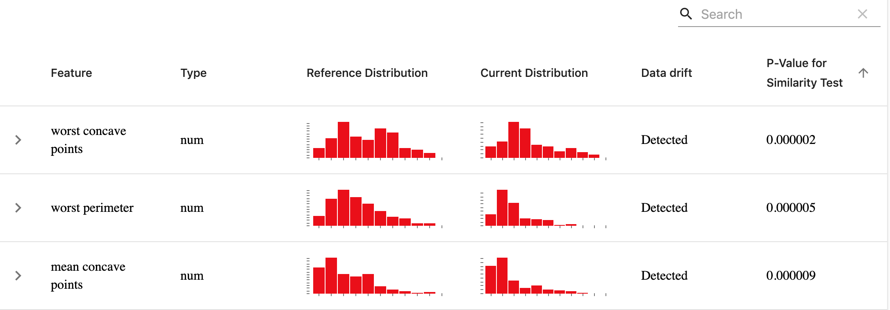
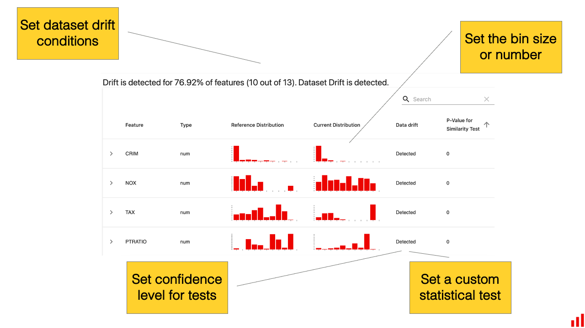

# Data Drift

**TL;DR:** The report detects changes in feature distributions.

* Performs a suitable **statistical test** for numerical and categorical features
* Plots **feature values and distributions** for the two datasets.

## Summary

The **Data Drift** report helps detect and explore changes in the input data.

## Requirements

You will need **two** datasets. The **reference** dataset serves as a benchmark. We analyze the change by comparing the **current** production data to the **reference** data.

The dataset should include the features you want to evaluate for drift. The schema of both datasets should be identical.

* In the case of pandas `DataFrame,`all column names should be `string` 
* All feature columns analyzed for drift should have the **numerical** type (`np.number)`
* **Categorical** data can be encoded as numerical labels and specified in the **column\_mapping**.
* **DateTime** column is the only exception. If available, it can be used as the x-axis in the plots.

You can potentially choose any two datasets for comparison. But keep in mind that only the **reference** dataset will be used as a basis for comparison.

## How it works

To estimate the data drift, we compare distributions of each individual feature in the two datasets.

We use **statistical tests** to detect if the distribution has changed significantly.;

* For **numerical** features, we use the [two-sample Kolmogorov-Smirnov test](https://en.wikipedia.org/wiki/Kolmogorov%E2%80%93Smirnov\_test).
* For **categorical** features, we use the [chi-squared test](https://en.wikipedia.org/wiki/Chi-squared\_test).
  * For **binary categorical** features, we use the proportion difference test for independent samples based on Z-score.

All tests use a 0.95 confidence level by default.


To set a different confidence level or implement a custom test, you can define [custom options](../customization/options-for-data-target-drift.md). You can also select a different statistical test already available in the library, including PSI, K–L divergence, Jensen-Shannon distance, Wasserstein distance. See more details about [available tests](../customization/options-for-statistical-tests.md). 


## How it looks

The default report includes 4 components. All plots are interactive.

### 1. Data Drift Summary

The report returns **the share of drifting features** and an aggregate **Dataset Drift** result. For example:


Dataset Drift sets a rule on top of the results of the statistical tests for individual features. By default, Dataset Drift is detected if at least 50% of features drift at a 0.95 confidence level.&#x20;


To set different Dataset Drift conditions, you can define [custom options](../../step-by-step-guides/report-customization/options-for-data-target-drift.md).


### 2. Data Drift Table

The table shows the drifting features first, sorting them by P-value. You can also choose to sort the rows by the feature name or type.



### 3. Data Drift by Feature

By clicking on each feature, you can explore the values mapped in a plot.&#x20;

* The dark green line is the **mean**, as seen in the reference dataset.&#x20;
* The green area covers **one standard deviation** from the mean.&#x20;


### 4. Data Distribution by Feature

You can also zoom on distributions to understand what has changed.



To change the bins displayed, you can define [custom options](../customization/options-for-data-target-drift.md).


## Report customization

You can set different [options-for-data-target-drift.md](../customization/options-for-data-target-drift.md "mention") to modify the existing components of the report. Use this to change the statistical tests used, define Dataset Drift conditions, or change histogram Bins.



You can also set [options-for-quality-metrics.md](../customization/options-for-quality-metrics.md "mention") to define the width of the confidence interval displayed for individual feature drift.

You can also select which components of the reports to display or choose to show the short version of the report: [select-widgets-to-display.md](../customization/select-widgets-to-display.md "mention").

If you want to create a new plot or metric, you can [add-a-custom-widget-or-tab.md](../customization/add-a-custom-widget-or-tab.md "mention").

## When to use this report

Here are a few ideas on when to use the report:

1. **In production: as early monitoring of model quality.** In absence of ground truth labels, you can monitor for changes in the input data. Use it e.g. to decide when to retrain the model, apply business logic on top of the model output, or whether to act on predictions. You can combine it with monitoring model outputs using the [Numerical](num-target-drift.md) or [Categorical Target Drift ](categorical-target-drift.md)report.&#x20;
2. **In production: to debug the model decay**. Use the tool to explore how the input data has changed.
3. **In A/B test or trial use.** Detect training-serving skew and get the context to interpret test results.
4. **Before deployment.** Understand drift in the offline environment. Explore past shifts in the data to define retraining needs and monitoring strategies. Here is a [blog](https://evidentlyai.com/blog/tutorial-3-historical-data-drift) about it.
5. **To find useful features when building a model.** You can also use the tool to compare feature distributions in different classes to surface the best discriminants.

## JSON Profile

If you choose to generate a JSON profile, it will contain the following information:&#x20;

```yaml
{
  "data_drift": {
    "name": "data_drift",
    "datetime": "datetime",
    "data": {
      "utility_columns": {
        "date": null,
        "id": null,
        "target": null,
        "prediction": null,
        "drift_conf_level": value,
        "drift_features_share": value,
        "nbinsx": {
          "feature_name": value,
          "feature_name": value
        },
        "xbins": null
      },
      },
      "cat_feature_names": [],
      "num_feature_names": [],
      "metrics": {
        "feature_name" :{
          "prod_small_hist": [
            [],
            []
          ],
          "ref_small_hist": [
            [],
            []
          ],
          "feature_type": "num",
          "p_value": p_value
      },
      "n_features": value,
      "n_drifted_features": value,
      "share_drifted_features": value,
      "dataset_drift": false
    }
  },
  "timestamp": "timestamp"
}
```

## Data Drift Dashboard Examples

* Browse our [example](../get-started/examples.md) notebooks to see sample Reports.

You can also read the initial [release blog](https://evidentlyai.com/blog/evidently-001-open-source-tool-to-analyze-data-drift).
