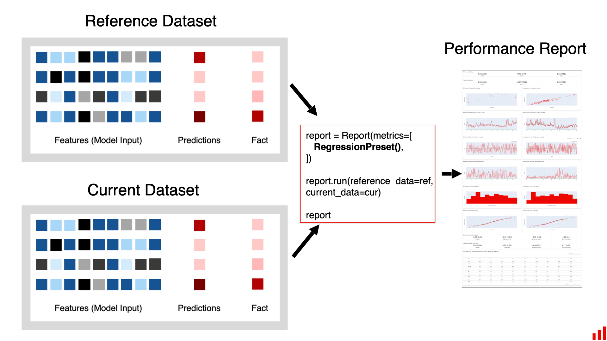
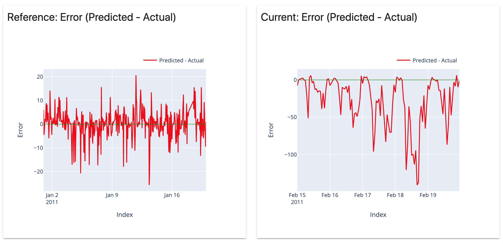
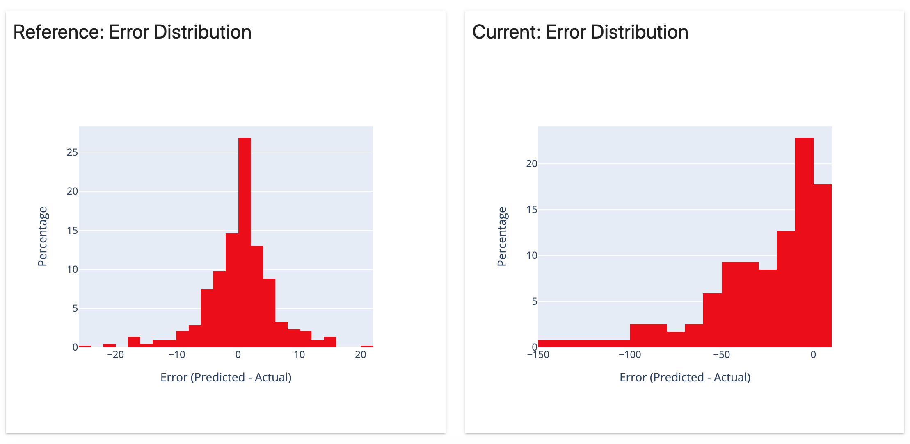
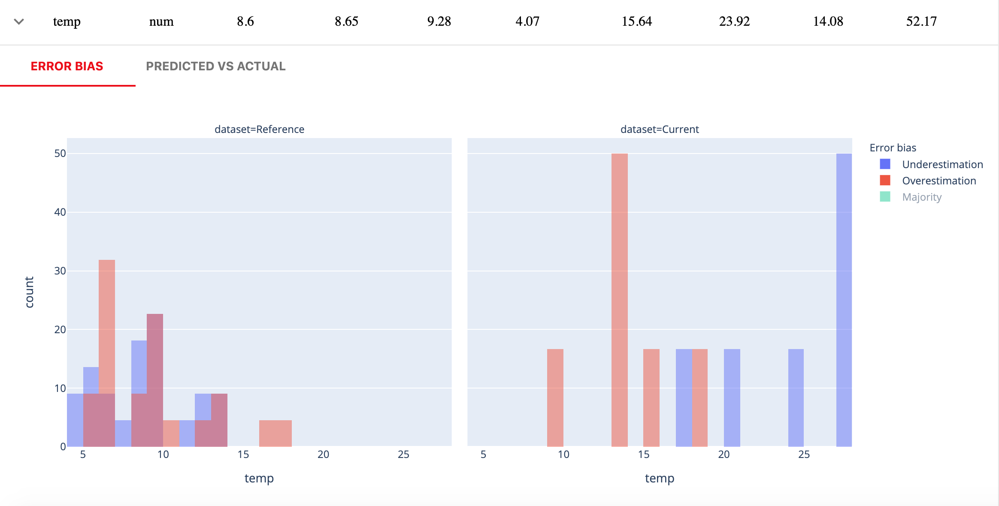

# Regression Performance

**TL;DR:** The report analyzes the performance of a regression model

* Works for a **single model** or helps compare the **two**
* Displays a variety of plots related to the **performance** and **errors**
* Helps explore areas of **under-** and **overestimation**&#x20;

## Summary

The **Regression Performance** report evaluates the quality of a regression model.

It can also compare it to the past performance of the same model, or the performance of an alternative model.

## Requirements

To run this report, you need to have input features, and **both target and prediction** columns available.

To generate a comparative report, you will need **two** datasets. The **reference** dataset serves as a benchmark. We analyze the change by comparing the **current** production data to the **reference** data.



You can also run this report for a **single** `DataFrame` , with no comparison performed. In this case, pass it as `reference_data`.

## How it looks

The report includes 12 components. All plots are interactive.

### **1. Model Quality Summary Metrics**&#x20;

We calculate a few standard model quality metrics: Mean Error (ME), Mean Absolute Error (MAE), Mean Absolute Percentage Error (MAPE).


For each quality metric, we also show one standard deviation of its value (in brackets) to estimate the stability of the performance.&#x20;

**Next, we generate a set of plots. They help analyze where the model makes mistakes and come up with improvement ideas.**

### 2. **Predicted vs Actual**&#x20;

Predicted versus actual values in a scatter plot.


### 3. **Predicted vs Actual in Time**

Predicted and Actual values over time or by index, if no datetime is provided.


### 4. Error (Predicted - Actual)

Model error values over time or by index, if no datetime is provided.&#x20;



### 5. Absolute Percentage Error

Absolute percentage error values over time or by index, if no datetime is provided.


### 6. Error Distribution

Distribution of the model error values.&#x20;



### 7. Error Normality&#x20;

Quantile-quantile plot ([Q-Q plot](https://en.wikipedia.org/wiki/Q%E2%80%93Q\_plot)) to estimate value normality.


**Next, we explore in detail the two segments in the dataset: 5% of predictions with the highest negative and positive errors. We refer to them as "underesimation" and "overestimation" groups. We refer to the rest of the predictions as "majority".**

### **8. Mean Error per Group**

We show a summary of the model quality metrics for each of the two groups: mean Error (ME), Mean Absolute Error (MAE), Mean Absolute Percentage Error (MAPE).


### **9. Predicted vs Actual per Group**

We plot the predictions, coloring them by the group they belong to. It visualizes the regions where the model underestimates and overestimates the target function.


### **10. Error Bias: Mean/Most Common Feature Value per Group**

This table helps quickly see the differences in feature values between the 3 groups:

* **OVER** (top-5% of predictions with overestimation)
* **UNDER** (top-5% of the predictions with underestimation)
* **MAJORITY** (the rest 90%)

For the numerical features, it shows the mean value per group. For the categorical features, it shows the most common value.

If you have two datasets, the table displays the values for both REF (reference) and CURR (current).


If you observe a large difference between the groups, it means that the model error is sensitive to the values of a given feature.

**To search for cases like this, you can sort the table using the column "Range(%)".** It increases when either or both of the "extreme" groups are different from the majority.

Here is the formula used to calculate the Range %:

$$
Range = 100*|(Vover-Vunder)/(Vmax-Vmin)|
$$

_**Where:**  **V**over = average feature value in the OVER group; **V**under = average feature value in the UNDER group; **V**max = maximum feature value; **V**min = minimum feature value_

### **11. Error Bias per Feature**

For each feature, we show a histogram to visualize the **distribution of its values in the segments with extreme errors** and in the rest of the data. You can visually explore if there is a relationship between the high error and the values of a given feature.

Here is an example where extreme errors are dependent on the "temperature" feature.



### 12. Predicted vs Actual per Feature

For each feature, we also show the Predicted vs Actual scatterplot. We use colors to show the distribution of the values of a given feature. It helps visually detect and explore underperforming segments which might be sensitive to the values of the given feature.


## Report customization

You can select which components of the reports to display or choose to show the short version of the report: [select-widgets-to-display.md](../customization/select-widgets-to-display.md "mention").&#x20;

If you want to create a new plot or metric, you can [add-a-custom-widget-or-tab.md](../customization/add-a-custom-widget-or-tab.md "mention").

## When to use the report

Here are our suggestions on when to use it—you can also combine it with the [Data Drift](data-drift.md) and [Numerical Target Drift](num-target-drift.md) reports to get a comprehensive picture.

**1. To analyze the results of the model test.** You can explore the results of an online or offline test and contrast it to the performance in training. Though this is not the primary use case, you can use this report to compare the model performance in an A/B test, or during a shadow model deployment.

**2. To generate regular reports on the performance of a production model.** You can run this report as a regular job (e.g. weekly or at every batch model run) to analyze its performance and share it with other stakeholders.

**3. To analyze the model performance on the slices of data.** By manipulating the input data frame, you can explore how the model performs on different data segments (e.g. users from a specific region).

**4. To trigger or decide on the model retraining.** You can use this report to check if your performance is below the threshold to initiate a model update and evaluate if retraining is likely to improve performance.

**5. To debug or improve model performance by identifying areas of high error.** You can use the Error Bias table to identify the groups that contribute way more to the total error, or where the model under- or over-estimates the target function.

## JSON Profile

If you choose to generate a JSON profile, it will contain the following information:

```yaml
{
  "regression_performance": {
    "name": "regression_performance",
    "datetime": "datetime",
    "data": {
      "utility_columns": {
        "date": "date",
        "id": null,
        "target": "target",
        "prediction": "prediction"
      },
      "cat_feature_names": [],
      "num_feature_names": [],
      "metrics": {
        "reference": {
          "mean_error": mean_error,
          "mean_abs_error": mean_abs_error,
          "mean_abs_perc_error": mean_abs_perc_error,
          "error_std": error_std,
          "abs_error_std": abs_error_std,
          "abs_perc_error_std": abs_perc_error_std,
          "error_normality": {
            "order_statistic_medians": [],
            "slope": slope,
            "intercept": intercept,
            "r": r
          },
          "underperformance": {
            "majority": {
              "mean_error": mean_error,
              "std_error": std_error
            },
            "underestimation": {
              "mean_error": mean_error,
              "std_error": std_error
            },
            "overestimation": {
              "mean_error": mean_error,
              "std_error": std_error
            }
          }
        },
        "current": {
          "mean_error": mean_error,
          "mean_abs_error": mean_abs_error,
          "mean_abs_perc_error": mean_abs_perc_error,
          "error_std": error_std,
          "abs_error_std": abs_error_std,
          "abs_perc_error_std": abs_perc_error_std,
          "error_normality": {
            "order_statistic_medians": [],
            "slope": slope,
            "intercept": intercept,
            "r": r
          },
          "underperformance": {
            "majority": {
              "mean_error": mean_error,
              "std_error": std_error
            },
            "underestimation": {
              "mean_error": mean_error,
              "std_error": std_error
            },
            "overestimation": {
              "mean_error": mean_error,
              "std_error": std_error
            }
          }
        },
        "error_bias": {
          "feature_name": {
            "feature_type": "num",
            "ref_majority": ref_majority,
            "ref_under": ref_under,
            "ref_over": ref_over,
            "ref_range": ref_range,
            "prod_majority": prod_majority,
            "prod_under": prod_under,
            "prod_over": prod_over,
            "prod_range": prod_range
          },
          
          "holiday": {
            "feature_type": "cat",
            "ref_majority": 0,
            "ref_under": 0,
            "ref_over": 0,
            "ref_range": 0,
            "prod_majority": 0,
            "prod_under": 0,
            "prod_over": 1,
            "prod_range": 1
          },
        }
      }
    }
  },
  "timestamp": "timestamp"
}
```

## Examples

* Browse our [examples](../get-started/examples.md) for sample Jupyter notebooks.
* See a tutorial "[How to break a model in 20 days](https://evidentlyai.com/blog/tutorial-1-model-analytics-in-production)" where we create a demand prediction model and analyze its gradual decay.

You can also read the initial [release blog](https://evidentlyai.com/blog/evidently-016-regression-model-performance).
