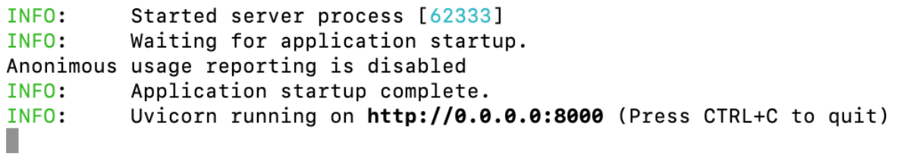

# **What is Telemetry?**

Telemetry refers to the collection of usage data. We collect some data to understand how many users we have and how they interact with Evidently. This helps us improve the tool and prioritize implementing the new features.

Below we describe what is collected, how to opt out and why we'd appreciate if you keep the telemetry on.

# **What data is collected?**

Telemetry is collected in Evidently starting from **version 0.4.0**. 

We only collect telemetry when you use **Evidently Monitoring UI**. We DO NOT collect any telemetry when you use the tool as a library, for instance, run in a Jupyter notebook or in a Python script to generate Evidently Reports or Test Suites.

We only collect **anonymous** usage data. We DO NOT collect personal data. 

We only collect **data about service usage**. Our telemetry is intentionally limited in scope. We DO NOT collect any sensitive information or data about the datasets you process. We DO NOT have access to the dataset schema, parameters, variable names, or anything related to the contents of the data or your code. 

We collect the following types of data:
* **Environment data**. Basic information about the environment in which you run Evidently (Python version, operating system, etc.) 
* **Service usage data**. Actions performed in the service to understand which features are being used.

## Environment data

We collect the following data:
* Timestamp
* User_id
* Os_name
* Os_version
* Python_version
* Tool_name
* Tool_version
* Source_ip

**Note**: `source_ip` is NOT your IP address. We use `jitsu` - an [open-source tool](https://github.com/jitsucom/jitsu) for event collection. We always use a strict `ip_policy` which obscures the exact IP. You can read more in Jitsu [documentation](https://classic.jitsu.com/docs/sending-data/js-sdk/reference/parameters-reference). 

The `user_ID` is anonymized and only allows us to match that certain actions are performed by the same user. 

## Service usage data

We collect the data about the following actions:
* `Startup`
* `Index`
* `List_projects`
* `Get_project_info`
* `Project_dashboard`
* `List_reports`
* `List_test_suites`
* `Get_snapshot_download`
* `Add_project` 
* `Search_projects` (currently action is not supported in the UI)
* `Update_project_info` (currently action is not supported in the UI)
* `Get_snapshot_graph_data` (currently action is not supported in the UI)
* `Get_snapshot_data` (currently action is not supported in the UI)
* `List_project_dashboard_panels` (currently action is not supported in the UI)
* `Add_snapshot`  (currently action is not supported in the UI)

You can check the source code for collecting telemetry [here](https://github.com/evidentlyai/evidently/blob/feature/evidently_service_ui/src/evidently/ui/app.py) and [here](https://github.com/evidentlyai/evidently/blob/feature/evidently_service_ui/src/evidently/telemetry.py).

## How to enable/disable telemetry?

By default, telemetry is enabled.

After starting up the service, you will see the following message in the terminal:
“Anonymous usage reporting is enabled. To disable it, set env variable {DO_NOT_TRACK_ENV} to any value”

To disable telemetry, use the environment variable: `DO_NOT_TRACK`

Set it to any value, for instance:
```
export DO_NOT_TRACK=1
```

After doing that and starting the service, you will see the message: “Anonymous usage reporting is disabled”



To enable telemetry back, unset the environment variable:
```
unset DO_NOT_TRACK
```

## Event log examples

<details>

<summary>Action: startup</summary>

```
{
  "_timestamp": "2023-07-07T14:08:44.332528Z",
  "action": "startup",
  "api_key": "s2s.5xmxpip2ax4ut5rrihfjhb.uqcoh71nviknmzp77ev6rd",
  "error": null,
  "eventn_ctx_event_id": "cfcc182d-5a2d-47d6-89dd-37590ec7b08a",
  "extra": {},
  "group_id": null,
  "interface": "service_backend",
  "os_name": "mac",
  "os_version": "13.0.1",
  "python_version": {
    "major": 3,
    "minor": 9,
    "patch": 16
  },
  "source_ip": "78.163.128.1",
  "src": "api",
  "tool_name": "evidently",
  "tool_version": "0.3.3",
  "user_id": "16d5bb6f-0400-4e2c-90f3-c3b31c95a1d3"
}
```
</details>

<details>

<summary>Action: index</summary>

```
{
  "_timestamp": "2023-07-07T14:10:54.355143Z",
  "action": "index",
  "api_key": "s2s.5xmxpip2ax4ut5rrihfjhb.uqcoh71nviknmzp77ev6rd",
  "error": null,
  "eventn_ctx_event_id": "96029e42-d2fc-4372-a1b5-b15e4d2ec6a0",
  "extra": {},
  "group_id": null,
  "interface": "service_backend",
  "os_name": "mac",
  "os_version": "13.0.1",
  "python_version": {
    "major": 3,
    "minor": 9,
    "patch": 16
  },
  "source_ip": "78.163.128.1",
  "src": "api",
  "tool_name": "evidently",
  "tool_version": "0.3.3",
  "user_id": "16d5bb6f-0400-4e2c-90f3-c3b31c95a1d3"
}
```
</details>

<details>

<summary>Action: list_projects</summary>
```
{
  "_timestamp": "2023-07-07T14:08:44.687956Z",
  "action": "list_projects",
  "api_key": "s2s.5xmxpip2ax4ut5rrihfjhb.uqcoh71nviknmzp77ev6rd",
  "error": null,
  "eventn_ctx_event_id": "12ac8fe3-0396-430b-b035-e984a3ed2663",
  "extra": {
    "project_count": 1
  },
  "group_id": null,
  "interface": "service_backend",
  "os_name": "mac",
  "os_version": "13.0.1",
  "python_version": {
    "major": 3,
    "minor": 9,
    "patch": 16
  },
  "source_ip": "78.163.128.1",
  "src": "api",
  "tool_name": "evidently",
  "tool_version": "0.3.3",
  "user_id": "16d5bb6f-0400-4e2c-90f3-c3b31c95a1d3"
}
```
</details>

<details>

<summary>Action: get_project_info</summary>
```
​​{
  "_timestamp": "2023-07-07T14:10:54.474555Z",
  "action": "get_project_info",
  "api_key": "s2s.5xmxpip2ax4ut5rrihfjhb.uqcoh71nviknmzp77ev6rd",
  "error": null,
  "eventn_ctx_event_id": "52bf5758-4b4c-4379-b2e6-0c1b123f3ce3",
  "extra": {},
  "group_id": null,
  "interface": "service_backend",
  "os_name": "mac",
  "os_version": "13.0.1",
  "python_version": {
    "major": 3,
    "minor": 9,
    "patch": 16
  },
  "source_ip": "78.163.128.1",
  "src": "api",
  "tool_name": "evidently",
  "tool_version": "0.3.3",
  "user_id": "16d5bb6f-0400-4e2c-90f3-c3b31c95a1d3"
}
```
</details>

<details>

<summary>Action: project_dashboard</summary>

```
{
  "_timestamp": "2023-07-07T14:08:46.260846Z",
  "action": "project_dashboard",
  "api_key": "s2s.5xmxpip2ax4ut5rrihfjhb.uqcoh71nviknmzp77ev6rd",
  "error": null,
  "eventn_ctx_event_id": "2dc109d4-f322-42de-8db2-d9ce86787b8b",
  "extra": {},
  "group_id": null,
  "interface": "service_backend",
  "os_name": "mac",
  "os_version": "13.0.1",
  "python_version": {
    "major": 3,
    "minor": 9,
    "patch": 16
  },
  "source_ip": "78.163.128.1",
  "src": "api",
  "tool_name": "evidently",
  "tool_version": "0.3.3",
  "user_id": "16d5bb6f-0400-4e2c-90f3-c3b31c95a1d3"
}
```
</details>

<details>

<summary>Action: add_project</summary>

```
{
  "_timestamp": "2023-07-18T13:15:16.138786Z",
  "action": "add_project",
  "api_key": "s2s.5xmxpip2ax4ut5rrihfjhb.uqcoh71nviknmzp77ev6rd",
  "error": null,
  "eventn_ctx_event_id": "ac3d9bf3-8b26-406e-b781-30936c31da87",
  "extra": {},
  "group_id": null,
  "interface": "service_backend",
  "os_name": "mac",
  "os_version": "13.0.1",
  "python_version": {
    "major": 3,
    "minor": 9,
    "patch": 16
  },
  "source_ip": "88.225.219.1",
  "src": "api",
  "tool_name": "evidently",
  "tool_version": "0.3.3",
  "user_id": "16d5bb6f-0400-4e2c-90f3-c3b31c95a1d3"
}
```
</details>

<details>

<summary>Action: list_reports</summary>

```
{
  "_timestamp": "2023-07-07T14:08:51.369513Z",
  "action": "list_reports",
  "api_key": "s2s.5xmxpip2ax4ut5rrihfjhb.uqcoh71nviknmzp77ev6rd",
  "error": null,
  "eventn_ctx_event_id": "826b5208-aae1-400f-acc6-0fb2ea91c967",
  "extra": {
    "reports_count": 19
  },
  "group_id": null,
  "interface": "service_backend",
  "os_name": "mac",
  "os_version": "13.0.1",
  "python_version": {
    "major": 3,
    "minor": 9,
    "patch": 16
  },
  "source_ip": "78.163.128.1",
  "src": "api",
  "tool_name": "evidently",
  "tool_version": "0.3.3",
  "user_id": "16d5bb6f-0400-4e2c-90f3-c3b31c95a1d3"
}
```
</details>

<details>

<summary>Action: list_test_suites</summary>

```
{
  "_timestamp": "2023-07-07T14:08:46.902323Z",
  "action": "list_test_suites",
  "api_key": "s2s.5xmxpip2ax4ut5rrihfjhb.uqcoh71nviknmzp77ev6rd",
  "error": null,
  "eventn_ctx_event_id": "540b1e8e-06cb-4e76-958d-6d49fed7f86e",
  "extra": {},
  "group_id": null,
  "interface": "service_backend",
  "os_name": "mac",
  "os_version": "13.0.1",
  "python_version": {
    "major": 3,
    "minor": 9,
    "patch": 16
  },
  "source_ip": "78.163.128.1",
  "src": "api",
  "tool_name": "evidently",
  "tool_version": "0.3.3",
  "user_id": "16d5bb6f-0400-4e2c-90f3-c3b31c95a1d3"
}
```
</details>

<details>

<summary>Action: get_snapshot_data</summary>
```
{
  "_timestamp": "2023-07-18T12:53:01.609245Z",
  "action": "get_snapshot_data",
  "api_key": "s2s.5xmxpip2ax4ut5rrihfjhb.uqcoh71nviknmzp77ev6rd",
  "error": null,
  "eventn_ctx_event_id": "0426ef98-b35c-4040-bada-4e4b9380f4d5",
  "extra": {
    "metric_generators": [],
    "metric_presets": [],
    "metrics": [
      "DatasetDriftMetric",
      "DatasetMissingValuesMetric",
      "ColumnDriftMetric",
      "ColumnQuantileMetric",
      "ColumnDriftMetric",
      "ColumnQuantileMetric"
    ],
    "snapshot_type": "report",
    "test_generators": [],
    "test_presets": [],
    "tests": []
  },
  "group_id": null,
  "interface": "service_backend",
  "os_name": "mac",
  "os_version": "13.0.1",
  "python_version": {
    "major": 3,
    "minor": 9,
    "patch": 16
  },
  "source_ip": "88.225.219.1",
  "src": "api",
  "tool_name": "evidently",
  "tool_version": "0.3.3",
  "user_id": "16d5bb6f-0400-4e2c-90f3-c3b31c95a1d3"
}
```
</details>

# **Should I opt out?**

Being open-source, we have no visibility into the tool usage unless someone actively reaches out to us or opens a GitHub issue.

We’d be grateful if you keep the telemetry on since it helps us answer questions like:
* How many people are actively using the tool?
* Which features are being used most?
* What is the environment you run Evidently in?

It helps us prioritize the development of new features and make sure we test the performance in the most popular environments.

**We understand that you might still prefer not to share any telemetry data, and we respect this wish. Follow the steps above to disable the data collection.** 
