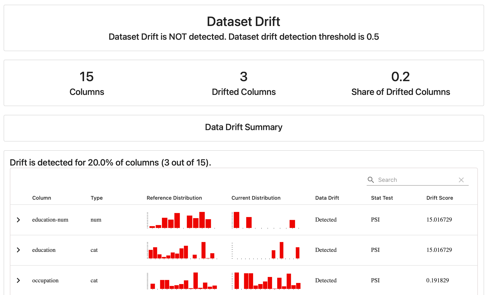
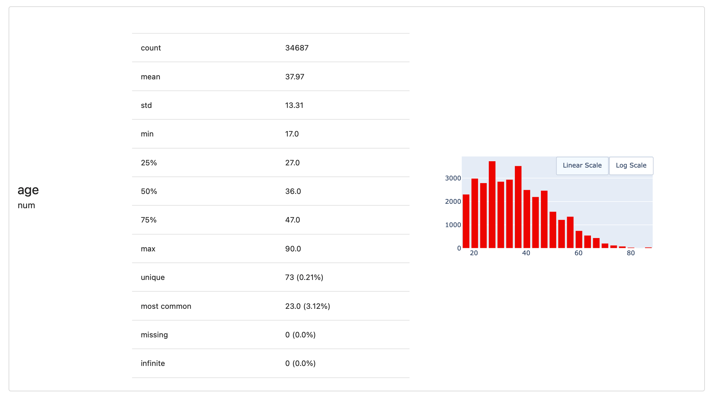
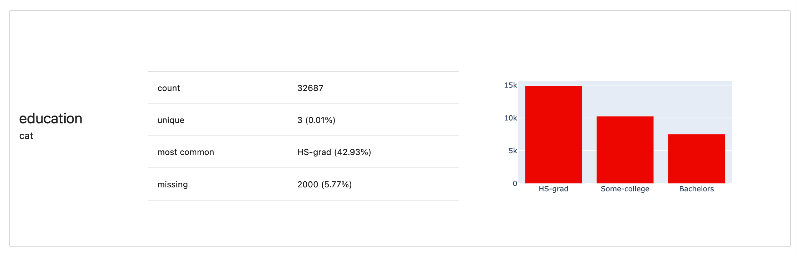
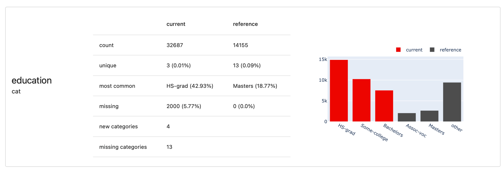
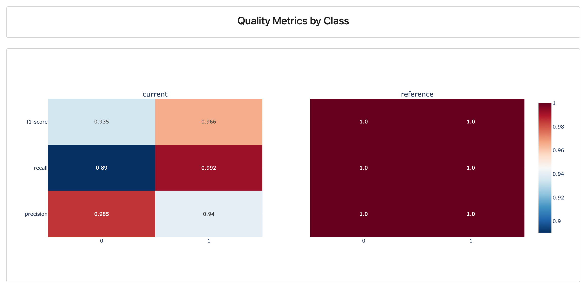
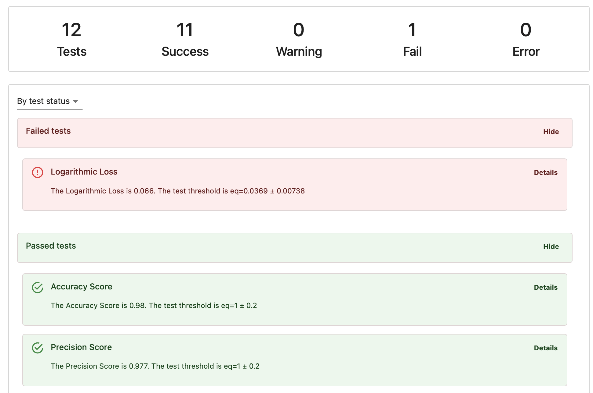
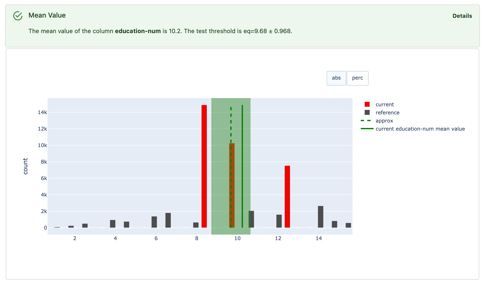
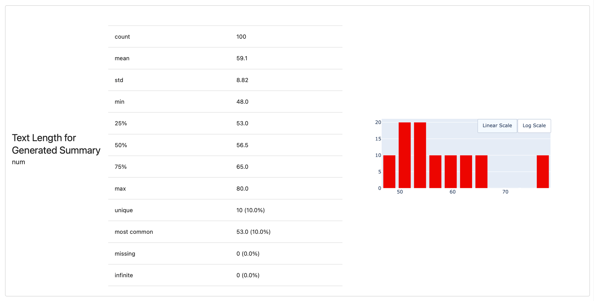
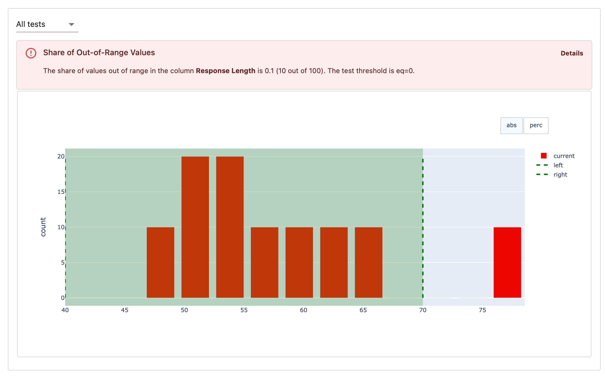

---
description: Introduction to Reports and Test Suites.
---   

You can use the Evidently Python library as a standalone open-source tool or as part of the Evidently Platform to track and store evaluation results over time.

This section of the documentation explains the core evaluation API of the Evidently library. This page, specifically, gives a conceptual overview of the components. For detailed API guides, check the links below:

**Reports**. Run evaluations for your dataset:


[Get Reports](get-reports.md)


**Test Suites**. Run Tests that check defined conditions and return pass/fail results:  


[Run Tests](run-tests.md)


**Descriptors**. Run row-level evaluations for text data:


[Text Descriptors](text-descriptors.md)


 
**Looking for something else?** To check **what** you can evaluate, browse [Presets](../presets/all-presets.md), [Metrics](../reference/all-metrics.md) and [Tests](../reference/all-tests.md). To understand workflows on Evidently Platform, check the [evaluation workflow](../evaluations/evals_overview.md) or section on [live monitoring](../monitoring/monitoring_overview.md).


# Report

A Report computes various Metrics to assess data, ML, or LLM quality. You specify the Metrics you want to include, run the Report on your dataset, and get a summary of the results. 

Metrics can help answer various questions, such as:
* **Gen AI**: Are the texts concise, professional, and true to the source context?
* **Classification**: How many predictions are correct? What is the recall/precision?
* **Data Quality**: Are there missing values or duplicates in the dataset?
* **Recommender Systems**: Are recommendations diverse?
* **Regression**: Are you over- or under-predicting?
* **Data Drift**: Is the data your AI system receives different from before?
  
You can start with **Metric Presets** which are pre-built combinations of Metrics, designed to evaluate specific aspects of a model, dataset, or AI system's performance.

You can think of Preset as Report templates that help you get started quickly. For example, there are presets for checking Data Drift, assessing Data Quality, or evaluating Regression Performance.

Here is an example of a Data Drift Report that checks for shifts in data distribution:

You can also create a custom Report by listing Metrics you’d like to include one by one. Evidently comes with built-in checks, so you can start quickly without building from scratch. You can also add custom evaluations.

See all available Metrics and Presets:


[All metrics](all-metrics.md)


An Evidently Metric isn't just a single value. It's best to think of it as an “evaluation unit” that includes both the computation results (which can include multiple values) and its visual representation.

For example, when you run a `ColumnSummaryMetric`, you'll receive a range of descriptive statistics for the column and a distribution histogram. For monitoring, you can later pull any of these individual values (min, max, mean, etc.) in time.

This Metric contents will vary based on the column type. For a categorical variable, you will receive a different set of statistics:

You can also pass two datasets to the Metric to get a side-by-side comparison.

In addition to column-level Metrics like `ColumnSummaryMetric`, you can compute many checks on the Dataset level. For example, `ClassificationQualityByClass` will summarize the metrics like F-score, precision and recall by class. 

The `DatasetCorrelationsMetric` will summarize the correlations between all columns in the dataset and show a heatmap.

You can get Report results in various formats:
* **Interactive visualizations**. Each Metric has a visual representation like shown above. You can view plots directly in environments like Jupyter Notebook or Colab, or save as an HTML file. 
* **Raw scores**. You can export as a JSON, Python dictionary, or Pandas dataframe. This includes the calculated values and optional details like histogram bins.
* **Evidently Snapshot**. If you send the evaluation results to Evidently Cloud, it will be saved as a JSON `snapshot`. This format allows you to recreate the original visual Report. 

When to use Reports:  
* **Visual analysis, experiments and debugging**. Use Reports as a standalone tool for ad hoc evaluations, data exploration, debugging, and comparing models or prompts.
* **Metric computation layer for monitoring**. Integrate Reports into your pipeline to log and track model and data performance over time by computing consecutive Reports for different data batches or samples.
* **AI quality reporting**. Add text comments and create Model Cards or document data and AI quality to share with the team and stakeholders. 

How to generate Reports:


[Get Reports](get-reports.md)


# Test Suite

A Test Suite is a collection of Tests designed to verify whether specific conditions are met within a given dataset.

Think of a Test Suite as a more structured way to use Metrics you’d find in a Report, but with added rules. Each Test pairs a Metric with a specific condition. It calculates a value, checks it against your rule, and then tells you if it passed or failed. 

For example, you might set up a Test to check that:
* **Gen AI**: The share of responses labeled “incorrect” by the LLM judge is under 5%.
* **Classification**: Precision and recall are within +/-10% from the reference quality. 
* **Data Quality**: The share of missing values in the dataset is under 1%.
* **Recommender Systems**: The hit rate is over 20%.
* **Regression**: The model quality is better than the quality of the dummy model.
* **Data Drift**: The share of drifting features in the dataset is less than 30%.

Here is an example of a Test Suites focused on classification. The same interface works for all types of checks.

There are also **Test Presets** — pre-built Test Suites designed for specific use cases. They act as templates to help you get started quickly by automatically generating multiple Tests, and deriving Test conditions from the provided reference dataset or heuristics.

For example, the `DataQualityTestPreset` automatically checks for issues like missing values or duplicates, while the `RegressionTestPreset` focuses on evaluating regression model performance.

For each Test in a suite, you'll receive one of the following outcomes:
* **Pass**: the condition was met.
* **Fail**: the condition wasn’t met.
* **Warning**: the condition wasn’t met, but the check was labeled as non-critical.
* **Error**: something went wrong with the Test itself, such as a failure in execution.
  
If your Test Suite includes many Tests, you can easily navigate the output by status or specific columns. Clicking an individual Test provides a supporting visual to help debug the outcome.

You can also create a custom Test Suite by combining individual Tests. Just like with Metrics, you can run Tests:
* on specific columns, such as checking if the mean value of a column stays within a stable range (`TestColumnValueMean`) 
* on the dataset as a whole, like checking how many rows are completely empty (`TestNumberOfEmptyRows`).

See all available Tests:


[All tests](all-tests.md)


When you create a Test Suite on your own, you can set custom conditions for each Test, or let Evidently assist by using a reference dataset or heuristics to auto-generate test conditions. 

Similar to Reports, you can view Test results in Python environments like Jupyter notebook and export the results: as HTML, JSON, a Python dictionary, a Pandas DataFrame, or save a JSON snapshot to view on the Evidently platform.

When to use Tests:

* **Automated checks in pipelines**. Tests are ideal for integrating into data and ML pipelines. You can perform data validation or evaluation with Test Suites directly as a pipeline step, such as after you pull fresh data. You can add conditional actions — like triggering an alert or halting the pipeline if a Test fails. Evidently Tests easily integrate with orchestrator tools like Airflow.
* **For continuous testing for production systems**. You can run Tests on your production data to ensure ongoing quality. Structuring your evaluations as Tests can help reduce alert fatigue and simplify configuration when evaluating multiple conditions at once. For example, you can quickly verify that all columns in the input data are within a defined min-max range.
* **Any batch testing scenarios**. Tests are great for any automated scenario where you need to evaluate batches of data. For example, you can use them in CI/CD pipelines to assess model quality after retraining or to perform regression testing on a golden dataset after updating a prompt.

How to run Test Suites:


[Run Tests](run-tests.md)


# Test Suites or Reports?

**Reports** and **Test Suites** are complementary. You can choose one option or use both.

**Reports** are best for debugging, exploratory, and ad hoc analytics. They focus on interactive visualizations and don’t require setting conditions upfront. Use them to run evaluations during experiments and compare datasets, models, or prompts.

**Test Suites** are best for automation, like CI/CD checks. Use them when you can set up conditions upfront (or derive them from the reference dataset). Tests force you to think through what you expect from your data and systems, and you can run them at scale, only reacting to failure alerts.

You can also use both Reports and Test Suites together. For example, run Tests for automated checks and if they fail, use Reports for visual debugging.

# Descriptors 

When evaluating text data, you'll need **Descriptors**. A Descriptor is a row-level score that assesses a specific quality or dimension of the text.

Say, you want to analyze the length, sentiment, or semantic similarity of your LLM-generated answers compared to the reference. Descriptors let you evaluate each text individually:

This differs from many ML or data quality metrics that provide a single value for a column or entire dataset (like accuracy). Descriptors give scores at the per-row level, which is useful for debugging—such as finding the shortest responses.

Evidently computes these extra values for each row and adds them to your evaluated dataset. Descriptors can be:
* **Numerical**. Stats like text length or sentiment score.
* **Categorical**. Labels like “correct” or “incorrect,” or “true” and “false” for pattern matches or specific conditions.
* **Strings of text**. For example, reasoning generated by an LLM to explain a score.
  
You can create Descriptors that use two columns at once, such as measuring the semantic similarity of one text column to another. 

Once you’ve chosen the Descriptors, you can include them in a Report or Test Suite using column-level Metrics or Tests. This works similarly to other Evidently checks. 

Under the hood, instead of computing a Metric or Test directly for an existing numerical or categorical column, Evidently computes a Metric or Test for a Descriptor that’s generated simultaneously for a text column in your dataset.

For instance, you can compute a ColumnSummaryMetric for Text Length descriptor of your text column that contains "Generated summary”. This will give you all an overview of the length distribution across all texts:

You can alternatively run a Test that explicitly checks if all text lengths are within a specific defined range:

You can access these scores by exporting a Pandas DataFrame or via the Evidently Platform. 

How to generate Descriptors:


[Text Descriptors](text-descriptors.md)

