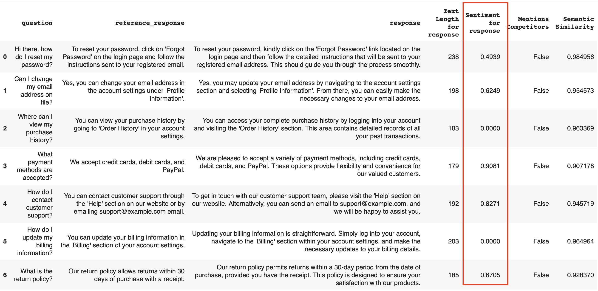

A Descriptor is a row-level score evaluating a specific characteristic of a text data. A simple example is text length. 

Descriptors range from regular expressions and text statistics to ML- and LLM-based checks. For example, you can calculate the semantic similarity between two texts, or ask LLM to label responses as "relevant" or "not relevant". 

You can use Descriptors in two ways:
* **In a Report**. This helps visualize and summarize the scores, like show text length across all texts.
* **In a Test Suite**. This checks if conditions are met, like if all texts are within a certain length (True/False).


[Overview of Reports, Tests and Descriptors](introduction.md)


# Code examples

Using descriptors to evaluate LLM outputs using `TextEvals` Preset:


Using descriptors with tabular Metrics and Tests:


# Imports

After [installing Evidently](../installation/install-evidently.md), import the selected descriptors and the relevant components based on whether you want to generate Reports or run Tests.

```python
from evidently import ColumnMapping
from evidently.report import Report
from evidently.test_suite import TestSuite
from evidently.metric_preset import TextEvals
from evidently.metrics import ColumnSummaryMetric, ColumnDriftMetric 
from evidently.tests import TestColumnValueMin, TestColumnValueMean, TestCategoryShare, TestShareOfOutRangeValues
from evidently.descriptors import Contains, TextLength, Sentiment
```

**Note**. For some Descriptors that use vocabulary-based checks (like `IncludesWords` or `OOV` for out-of-vocabulary words), you may need to download `nltk` dictionaries:

```python
nltk.download('words')
nltk.download('wordnet')
nltk.download('omw-1.4')
nltk.download('vader_lexicon')
```

# How it works

Here is the general flow to run an evaluation:

* **Input data**. Prepare the data as a Pandas DataFrame. Include at least one text column. This will be your `current_data` to run evals on. Optionally, prepare the `reference` dataset.
* **Schema mapping**. Define your data schema using [Column Mapping](../input-data/column-mapping.md). Optional, but highly recommended.
* **Define the Report or Test Suite**. Create a `Report` or a `TestSuite` object with the selected checks.
* **Run the Report**. Run the Report on your `current_data`, passing the `column_mapping`. Optionally, pass the `reference_data`.
* **Get the summary results**. Get a visual Report in Jupyter notebook, export the metrics, or upload it to Evidently Platform.
* **Get the scored datasets**. To see row-level scores, export the Pandas DataFrame with added descriptors. (Or view this on Evidently Platform). 

 
**Available Descriptors**. See Descriptors in the [All Metrics](../reference/all-metrics.md) page. 


 
**Reports and Test Suites**. For basic API, read how to [run Reports](get-reports.md) and [Test Suites](run-tests.md).


## Text Evals

For most cases, we recommend using the `TextEvals` Preset. It provides an easy way to create a Report that summarizes Descriptor values for a specific column.

**Basic example**. To evaluate the Sentiment and Text Length in symbols for the `response` column:

```python
report = Report(metrics=[
    TextEvals(column_name="response", descriptors=[
        Sentiment(),
        TextLength(),
    ]),
])
```

Run the Report on your DataFrame `df`:

```python
report.run(reference_data=None, 
           current_data=df)
```

You can access the Report just like usual, and export the results as HTML, JSON, a Python dictionary, etc. To view the interactive Report directly in Jupyter Notebook or Colab:

```python
report 
```


You can add the Descriptors to your original dataset. To view the DataFrame:

```
report.datasets().current
```



To create a DataFrame:

```
df_with_scores = pd.DataFrame(report.datasets().current)
```

 
**How to get the outputs**. Check the details on all available [Output Formats](output_formats.md).


**Display name**. It’s a good idea to add a `display_name` to each Descriptor. This name shows up in visualizations and column headers. It’s especially handy if you’re using checks like regular expressions with word lists, where the auto-generated title could get very long.

```python
report = Report(metrics=[
    TextEvals(column_name="response", descriptors=[
        Sentiment(display_name="Response sentiment"),
        TextLength(display_name="Response length"),
    ]),
])
```

**Evaluations for multiple columns**. If you want to evaluate several columns, like "response" and "question", just list multiple Presets in the same Report and include the Descriptors you need for each one.

```python
report = Report(metrics=[
    TextEvals(column_name="response", descriptors=[
        Sentiment(),
        TextLength(),
    ]),
    TextEvals(column_name="question", descriptors=[
        Sentiment(),
        TextLength(),
    ])
])
```

**Descriptor parameters**. Some Descriptors have required parameters. For example, if you’re testing for competitor mentions using the `Contains` Descriptor, you must include the names in the `items` list:

```python
report = Report(metrics=[
    TextEvals(column_name="response", descriptors=[
        Contains(display_name="Competitor Mentions", 
                items=["AcmeCorp", "YetAnotherCorp"]),
    ]),
])
```

**Multi-column descriptors**. Some Descriptors like `SemanticSimilarity` require a second column. Pass it as a parameter:

```python
report = Report(metrics=[
    TextEvals(column_name="question", descriptors=[
        SemanticSimilarity(with_column="response")
    ]),
])
```

Some Descriptors, like custom LLM judges, might require a more complex setup, but you can still include them in the Report just like any other Descriptor.

 
**Reference**. To see the Descriptor parameters, check the [All Metrics](../reference/all-metrics.md) page.


 
**LLM-as-a-judge**. For a detailed guide on setting up LLM-based evals, check the guide to [LLM as a jugde](../customization/llm_as_a_judge.md).


 
**Custom descriptors**. You can implement descriptors as Python functions. Check the [guide on custom descriptors](../customization/add-custom-descriptor.md).


## Using Metrics

The `TextEvals` Preset works by generating a `ColumnSummaryMetric` for each Descriptor you calculate. You can achieve the same results by explicitly creating this Metric for each Descriptor:

```python
report = Report(metrics=[
    ColumnSummaryMetric(TextLength().on("response")),
    ColumnSummaryMetric(Sentiment().on("response")),
])
```

For two-column descriptor like `SemanticSimilarity()`, pass both columns as a list:

```python
report = Report(metrics=[
    ColumnSummaryMetric(column_name=SemanticSimilarity(with_column="question").on("response"))
])
```

**Text Descriptor Drift detection**. Sometimes, you might want to use a different Metric, like `ColumnDriftMetric`. Here is how to do this:

```python
report = Report(metrics=[
   ColumnDriftMetric(column_name = TextLength().on("response")),
])
```

In this case, you’ll need to pass both `reference` and `current` datasets. The Metric will compare the distribution of "response" Text Length in the two datasets and return a drift score.

You can use other column-level Metrics this way: 

```python
report = Report(metrics=[
    ColumnSummaryMetric(TextLength().on("response")),
    ColumnDriftMetric(TextLength().on("response")),
    ColumnCorrelationsMetric(TextLength().on("response")),
    ColumnDistributionMetric(TextLength().on("response")),
    ColumnValueRangeMetric(TextLength().on("response"), left=0, right=20)
])
```

However, in most cases, it's better to first generate a DataFrame with the scores through `TextEvals`. You can then run evaluations on the new dataset by referencing the newly added column directly.

## Run Tests 

You can also run Tests with text Descriptors to verify set conditions and return a Pass or Fail result.

**Example 1**. To test that the average response sentiment is greater or equal (`gte`) to 0, and that the maximum text length is less than or equal (`lte`) to 200 characters:

```python
test_suite = TestSuite(tests=[
    TestColumnValueMean(column_name = Sentiment().on("response"), gte=0),
    TestColumnValueMax(column_name = TextLength().on("response"), lte=200),
])
```

**Example 2**. To test that the number of responses mentioning competitors is zero:

```python
test_suite = TestSuite(tests=[
    TestCategoryCount(
        column_name=Contains(
            items=["AcmeCorp", "YetAnotherCorp"],
            display_name="Competitor Mentions").
        on("new_response"),
        category=True,
        eq=0),
])
```

**Example 3**. To test that Semantic similarity between two columns is greater or equal to 0.9:

```python
test_suite = TestSuite(tests=[
    TestColumnValueMin(
        column_name=SemanticSimilarity(
        display_name="Response Similarity",
        with_column="target_response").
        on("new_response"),
        gte=0.9),
])
```


**Available Tests**. You can use any column-level Tests with Descriptors. Here are a few particularly useful:

For numerical Descriptors:

```python
test_suite = TestSuite(tests=[
    TestValueRange(column_name = TextLength().on("response")),
    TestNumberOfOutRangeValues(column_name = TextLength().on("response")),
    TestShareOfOutRangeValues(column_name = TextLength().on("response")),
    TestColumnValueMin(column_name = TextLength().on("response")),
    TestColumnValueMax(column_name = TextLength().on("response")),
    TestColumnValueMean(column_name = TextLength().on("response")), 
    TestColumnValueMedian(column_name = TextLength().on("response")),
])
```

In these examples, the Test conditions come from the `reference` dataset. You can also pass custom ones.

 
**Test conditions.** See the list of [All tests](../reference/all-tests.md) with defaults. Learn how to set [custom Test conditions](../tests-and-reports/run-tests.md).


For categorical Descriptors, use `TestCategoryCount` or `TestCategoryShare` Tests. 

For example, to test if the share of responses that contain travel-related words is less than or equal to 20%:

```python
test_suite = TestSuite(tests=[
    TestCategoryShare(
        column_name=IncludesWords(words_list=['hotel', 'flight'], display_name="Travel Mentions").
        on("new_response"),
        category=True,
        lte=0.2),
])
```
