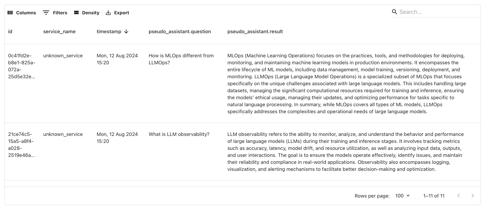

---
description: Introduction to tracing.
---   

This section covers how to instrument your AI application to collect data and send it to Evidently Platform for further evaluation and analysis. 

**Note**: this feature is in active development, expect more detailed documentaton soon.


**Looking for something else?** You can also run evaluations locally on existing datasets using [Reports and Test Suites](../tests-and-reports/introduction.md), and upload tabular [Datasets](../datasets/datasets_overview.md) to the platform using the Python API. 


# What is LLM tracing?

Tracing captures a detailed record of how your LLM application operates. It logs the system's inputs and outputs, along with intermediate steps and events, such as function calls. With this data, you can analyze and monitor your LLM system, including running evaluations on the tracing datasets. 

While traces can have multiple turns, Evidently makes it easy to automatically create tabular datasets from traces for evaluation.

# What is Tracely?

**Tracely** is an open-source Python library based on OpenTelemetry that helps collect traces from LLM-powered applications. 

Evidently Platform natively supports instrumentation collected with this library.

# Do I always need tracing?

No, tracing is optional on the Evidently Platform. You can also upload datasets directly, especially for batch tabular data, or run evaluations on local datasets and send the results to the platform.

However, tracing is particularly useful for tracking complex LLM chains. It allows you to see all execution flows, inputs, outputs, and intermediate steps like function calls. You can use tracing during experimental runs and in production, coupled with online evaluations.
